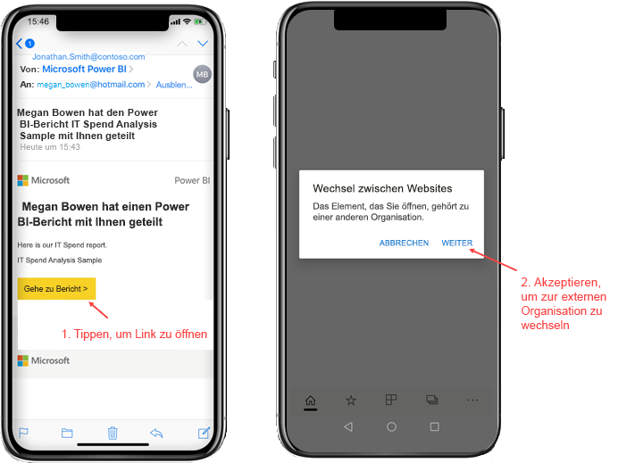
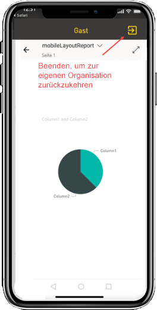
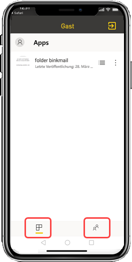

# Anzeigen von Power BI-Inhalten, die von einer externen Organisation für Sie freigegeben wurden

Power BI ist in Azure Active Directory Business-to-Business (Azure AD B2B) integriert, um die sichere Verteilung von Power BI-Inhalten an Gastbenutzer außerhalb Ihrer Organisation zu ermöglichen. Externe Gastbenutzer können außerdem die mobile Power BI-App verwenden, um auf diese Power BI-Inhalte zuzugreifen, die für sie freigegeben wurden. 

Gilt für:

|  |  |  |  |
|:--- |:--- |:--- |:--- |
| iPhones |iPads |Android-Telefone |Android-Tablets |

## Zugreifen auf freigegebene Inhalte

**Zunächst benötigen Sie eine Person aus einer externen Organisation, die ein Element für Sie freigibt.** Wenn jemand [ein Element für Sie freigibt](../../service-share-dashboards.md) (aus derselben Organisation oder aus einer externen Organisation), erhalten Sie eine E-Mail mit einem Link zu diesem freigegebenen Element. Wenn Sie diesen Link auf Ihrem mobilen Gerät folgen, wird der mobile Power BI-App geöffnet. Wenn die APP erkennt, dass das Element von einer externen Organisation freigegeben wurde, stellt die App erneut eine Verbindung mit dieser Organisation mit ihrer Identität her. Anschließend lädt die APP alle Elemente, die für Sie von dieser Organisation freigegeben wurden.

> [!NOTE]
> Wenn dies das erste Element ist, das als externer Gastbenutzer für Sie freigegeben wurde, müssen Sie die Einladung in einem Browser beanspruchen. Die Einladung kann nicht in der Power BI-App beansprucht werden.

Solange Sie mit einer externen Organisation verbunden sind, wird in der APP ein schwarzer Header angezeigt. Dieser Header gibt an, dass Sie nicht mit ihrer eigenen Organisation verbunden sind. Um erneut eine Verbindung mit ihrer eigenen Organisation herzustellen, beenden Sie den Gastmodus.

Obwohl Sie über einen Power BI-Artefaktlink verfügen müssen, um eine Verbindung mit einer externen Organisation herzustellen, können Sie nach dem Umschalten Ihrer App auf alle Elemente zugreifen, die für Sie freigegeben wurden (nicht nur auf das Element, das Sie über die E-Mail-Nachricht geöffnet haben). Um alle Elemente anzuzeigen, auf die Sie in der externen Organisation zugreifen können, navigieren Sie zum App-Menü und wählen **Für mich freigegeben** aus. Unter **Apps** finden Sie auch Apps, die Sie ebenfalls verwenden können.

## Einschränkungen

- Benutzer müssen über ein aktives Power BI-Konto und einen Basismandanten verfügen.
- Benutzer müssen bei Ihrem Power BI-Basismandanten angemeldet sein, bevor Sie auf die Inhalte zugreifen können, die für Sie von einem externen Mandanten freigegeben wurden.
- Bedingter Zugriff und andere Intune-Richtlinien werden in Azure AD B2B und Power BI Mobile nicht unterstützt. Dies bedeutet, dass die App nur die Richtlinien der eigenen Organisation erzwingt, sofern diese vorhanden sind.
- Pushbenachrichtigungen werden nur von der Website der eigenen Organisation empfangen (selbst wenn der Benutzer als Gast mit einer externen Organisation verbunden ist). Durch das Öffnen der Benachrichtigung wird die App erneut mit der Website der eigenen Organisation des Benutzers verbunden.
- Wenn der Benutzer die App herunterfährt, stellt die App beim erneuten Öffnen automatisch eine Verbindung mit der eigenen Organisation des Benutzers her.
- Wenn eine Verbindung mit einer externen Organisation besteht, sind einige Aktionen deaktiviert: Favoriten, Datenwarnungen, Kommentare und Freigabe.
- Offlinedaten sind während der Verbindung mit einer externen Organisation nicht verfügbar.
- Wenn Sie die Unternehmensportal-App auf Ihrem Gerät installiert haben, muss Ihr Gerät registriert sein.
