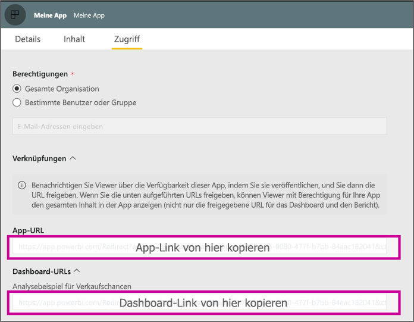

# <a name="create-a-link-to-a-specific-location-in-the-power-bi-mobile-apps"></a>Erstellen eines Links zu einer bestimmten Stelle in den mobilen Power BI-Apps
Mithilfe von Links können Sie direkt auf bestimmte Elemente in Power BI zugreifen. Dabei kann es sich um Berichte, Dashboards oder Kacheln handeln.

Es gibt im Wesentlichen zwei Szenarios für die Verwendung von Links in Power BI Mobile: 

* Zum Öffnen von Power BI von **außerhalb der App**, um zu einem bestimmten Inhalt zu gelangen (einem Bericht/einem Dashboard/einer App). Dabei handelt es sich in der Regel um ein Integrationsszenario, bei dem Power BI Mobile von einer anderen App aus geöffnet werden soll. 
* Zum **Navigieren innerhalb** von Power BI. Dies ist normalerweise der Fall, wenn Sie eine benutzerdefinierte Navigation in Power BI erstellen möchten.


## <a name="use-links-from-outside-of-power-bi"></a>Verwenden von Links außerhalb von Power BI
Wenn Sie einen Link von außerhalb der Power BI-App verwenden, muss sichergestellt sein, dass die App ihn öffnet. Ist die App noch nicht auf dem Gerät installiert, sollte der Benutzer die Möglichkeit erhalten, sie zu installieren. Genau für diesen Zweck haben wir ein spezielles Linkformat erstellt. Damit wird sichergestellt, dass das Gerät zum Öffnen des Links die App verwendet. Sollte die App noch nicht auf dem Gerät installiert sein, wird dem Benutzer angeboten, sie im Store herunterzuladen.

Der Link sollte folgendermaßen beginnen:  
```html
https://app.powerbi.com/Redirect?[**QUERYPARAMS**]
```

> [!IMPORTANT]
> Werden Ihre Inhalte in bestimmten Rechenzentren gehostet, wie z. B. Government, China usw., sollte der Link mit der korrekten Power BI-Adresse beginnen, wie z. B. `app.powerbigov.us` oder `app.powerbi.cn`.   
>


Die Abfrageparameter **QUERY PARAMS** lauten:
* **action** (obligatorisch): OpenApp/OpenDashboard/OpenTile/OpenReport
* **appId**: Beim Öffnen eines Berichts oder eines Dashboards, die Teil einer App sind. 
* **groupObjectId**: Beim Öffnen eines Berichts oder eines Dashboards, die Teil eines Arbeitsbereichs sind (ausgenommen „Mein Arbeitsbereich“).
* **dashboardObjectId**: Objekt-ID eines Dashboards (wenn es sich bei „action“ um „OpenDashboard“ oder „OpenTile“ handelt).
* **reportObjectId**: Objekt-ID eines Berichts (wenn es sich bei „action“ um „OpenReport“ handelt).
* **tileObjectId**: Objekt-ID einer Kachel (wenn es sich bei „action“ um „OpenTile“ handelt).
* **reportPage**: Beim Öffnen eines bestimmten Berichtsabschnitts (wenn es sich bei „action“ um „OpenReport“ handelt).
* **ctid**: ID der Elementorganisation (nur für B2B-Szenarios relevant, kann weggelassen werden, wenn das Element zur Organisation des Benutzers gehört).

**Beispiele:**

* Öffnen eines App-Links 
  ```html
  https://app.powerbi.com/Redirect?action=OpenApp&appId=appidguid&ctid=organizationid
  ```

* Öffnen eines Dashboards, das Teil einer App ist 
  ```html
  https://app.powerbi.com/Redirect?action=OpenDashboard&appId=**appidguid**&dashboardObjectId=**dashboardidguid**&ctid=**organizationid**
  ```

* Öffnen eines Berichts, der Teil eines Arbeitsbereichs ist
  ```html
  https://app.powerbi.com/Redirect?Action=OpenReport&reportObjectId=**reportidguid**&groupObjectId=**groupidguid**&reportPage=**ReportSectionName**
  ```

### <a name="how-to-get-the-right-link-format"></a>Abrufen des korrekten Linkformats

#### <a name="links-of-apps-and-items-in-app"></a>Links von Apps und Elementen innerhalb einer App

Bei **Apps, Berichten und Dashboards, die Teil einer App sind**, können Sie den Link am einfachsten über den Arbeitsbereich und die Option „App aktualisieren“ abrufen. Es wird die Oberfläche „App veröffentlichen“ geöffnet. Wechseln Sie zur Registerkarte „Zugriff“, auf der der Abschnitt **Links** angezeigt wird. Erweitern Sie diesen Abschnitt. Dort wird eine Liste der App und der Links zu allen Inhalten angezeigt, über die Sie direkt auf die Links zugreifen können.



#### <a name="links-of-items-not-in-app"></a>Links von Elementen außerhalb einer App 

Bei Berichten und Dashboards, die nicht Teil einer App sind, müssen Sie die ID aus der URL des Elements extrahieren.

Um z. B. die aus 36 Zeichen bestehende Objekt-ID eines **Dashboards** zu erhalten, navigieren Sie im Power BI-Dienst zum betreffenden Dashboard. 

```html
https://app.powerbi.com/groups/me/dashboards/**dashboard guid comes here**?ctid=**organization id comes here**`
```

Um die aus 36 Zeichen bestehende Objekt-ID eines **Berichts** zu erhalten, navigieren Sie im Power BI-Dienst zum betreffenden Bericht.
In diesem Beispiel befindet sich der Bericht in „Mein Arbeitsbereich“.

```html
https://app.powerbi.com/groups/me/reports/**report guid comes here**/ReportSection3?ctid=**organization id comes here**`
```
Die obige URL enthält auch eine bestimmte Berichtseite **„ReportSection3“** .

In diesem Beispiel befindet sich der Bericht in einem Arbeitsbereich (nicht „Mein Arbeitsbereich“).

```html
https://app.powerbi.com/groups/**groupid comes here**/reports/**reportid comes here**/ReportSection1?ctid=**organizationid comes here**
```

## <a name="use-links-inside-power-bi"></a>Verwenden von Links innerhalb von Power BI

Links innerhalb von Power BI funktionieren in mobilen Apps genauso wie im Power BI-Dienst.

Wenn Sie Ihrem Bericht einen Link zu einem anderen Power BI-Element hinzufügen möchten, kopieren Sie einfach die URL dieses Elements aus der Adressleiste des Browsers. Weitere Informationen zum Hinzufügen eines Links in ein Textfeld eines Berichts finden Sie unter [Filtern eines Berichts mithilfe von Abfragezeichenfolgenparametern in der URL](https://docs.microsoft.com/power-bi/service-add-hyperlink-to-text-box).

## <a name="use-report-url-with-filter"></a>Verwenden von Berichts-URLs mit Filter
Wie der Power BI-Dienst unterstützen auch die mobilen Power BI-Apps Berichts-URLs, die einen Filterabfrageparameter enthalten. Sie können in einer mobilen Power BI-App einen Bericht öffnen und ihn nach einem bestimmten Zustand filtern. Mit dieser URL wird beispielsweise ein Verkaufsbericht geöffnet und nach „Territory“ gefiltert:

```html
https://app.powerbi.com/groups/me/reports/**report guid comes here**/ReportSection3?ctid=**organization id comes here**&filter=Store/Territory eq 'NC'
```

Weitere Informationen zum Erstellen von Abfrageparametern zum Filtern von Berichten finden Sie unter [Filtern eines Berichts mithilfe von Abfragezeichenfolgenparametern in der URL](https://docs.microsoft.com/power-bi/service-url-filters).

## <a name="next-steps"></a>Nächste Schritte
Ihr Feedback hilft uns zu entscheiden, welche Features wir künftig implementieren. Geben Sie deshalb Ihr Votum ab, welche Features Sie sich in den Power BI Mobile-Apps wünschen. 

* [Power BI-Apps für mobile Geräte](mobile-apps-for-mobile-devices.md)
* Folgen Sie @MSPowerBI auf Twitter
* Werden Sie Teil der [Power BI-Community](https://community.powerbi.com/), um sich mit den Mitgliedern auszutauschen
* [Was ist Power BI?](../../fundamentals/power-bi-overview.md)

