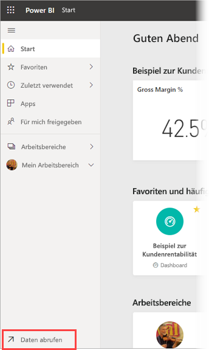
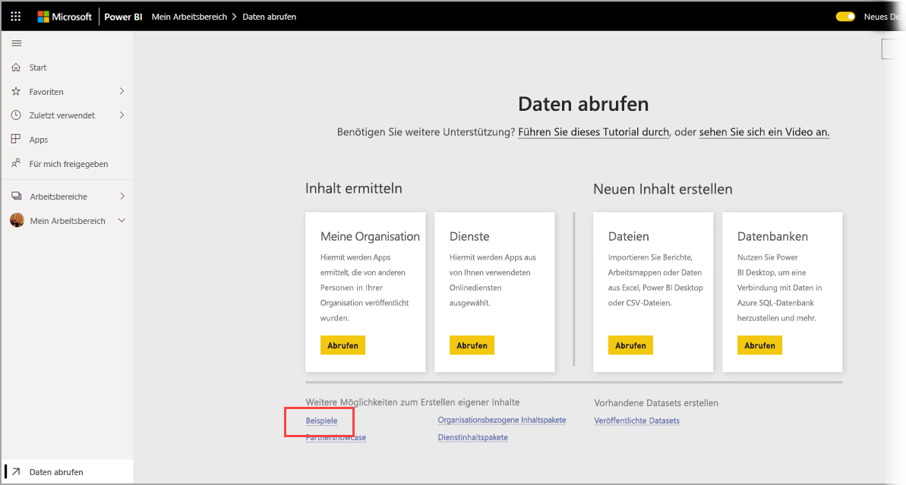
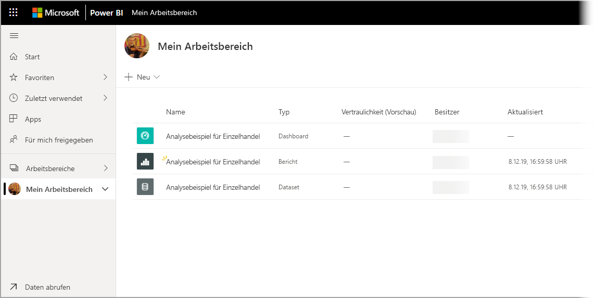

# Herunterladen von Beispieldaten in „Mein Arbeitsbereich“ in Power BI

In dieser Dokumentation zu mobilen Apps werden stellenweise Beispieldaten zu Illustrationszwecken verwendet. Wenn Sie die Erklärungen auf Ihrem Gerät nachvollziehen möchten, können Sie die Beispieldaten in Ihr Power BI-Konto herunterladen. Über die mobile Power BI-App können Sie sich die Daten dann auf Ihrem Gerät ansehen. In diesem Artikel wird beschrieben, wie Sie die Beispieldaten in Ihr Power BI-Konto herunterladen. 

## Voraussetzungen

Sie benötigen ein Power BI-Konto, um die Daten herunterladen zu können. Wenn Sie noch nicht bei Power BI registriert sind, müssen Sie sich zuerst [für eine kostenlose Testversion registrieren](https://app.powerbi.com/signupredirect?pbi_source=web).

## Beispiel herunterladen

1. Öffnen Sie [Power BI](https://app.powerbi.com) in einem Browser, und melden Sie sich an.

2. Klicken Sie unten links im Navigationsbereich auf **Daten abrufen**. Wenn der Navigationsbereich ausgeblendet ist und der Link „Daten abrufen“ nicht angezeigt wird, können Sie den Navigationsbereich einblenden, indem Sie auf das Symbol „Navigationsbereich anzeigen/ausblenden“  klicken.  
   
    

3. Klicken Sie auf der Seite „Daten abrufen“ auf den Link **Beispiele**.
   
   

4. Wählen Sie ein Beispiel aus, das Sie herunterladen möchten. Dabei sollten Sie das Beispiel auswählen, das für das Tutorial, den Schnellstart oder den Artikel, mit dem Sie sich gerade beschäftigen, erforderlich ist. Nachdem Sie das Beispiel ausgewählt haben, klicken Sie auf **Verbinden**.
  
   
   
5. Power BI importiert das Beispiel, wodurch dem Arbeitsbereich ein neues Dashboard, ein neuer Bericht und ein neues Dataset hinzugefügt werden.
   
   
  
Sie können sich die Beispiele jetzt auf Ihrem mobilen Gerät ansehen.

## Nächste Schritte
* [Schnellstart](mobile-apps-quickstart-view-dashboard-report.md)
* Haben Sie Fragen? [Bereich für mobile Apps in der Power BI-Community](https://go.microsoft.com/fwlink/?linkid=839277)
