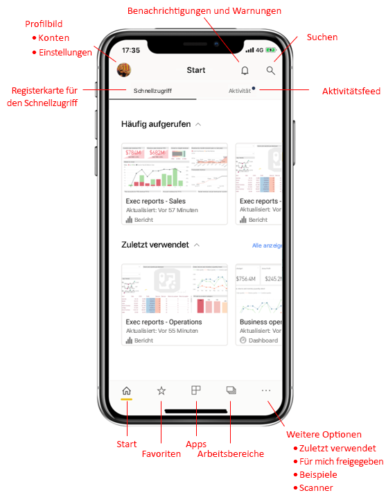
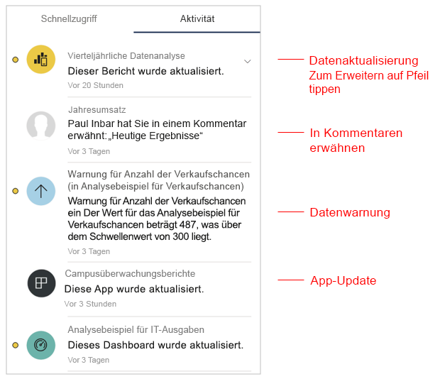
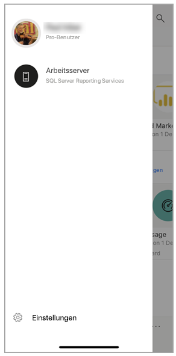
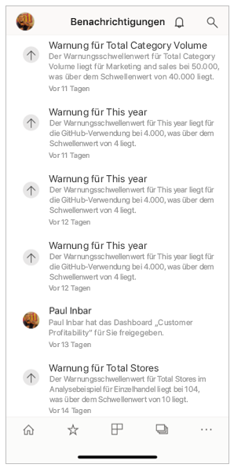
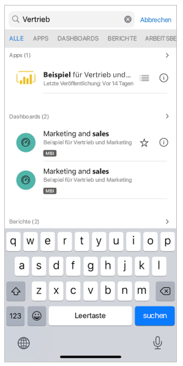

# Eine Schnelleinführung in die Startseite der mobilen App
In dieser Einführung lernen Sie die Startseite der mobilen Power BI-App und die Navigationshilfen kennen, die sie Ihnen bietet, um schnell zum Ziel zu kommen.

Gilt für:

|  |  |  |
|:--- |:--- |:--- |
| iPhone | iPad | Android- | 

Wenn Sie die mobile Power BI-App öffnen, landen Sie auf der Startseite, wo Sie schnellen Zugriff auf Ihre am häufigsten oder zuletzt besuchten Berichte, Dashboards und Apps haben. Darüber hinaus gibt es einen Aktivitätsfeed, der Sie über den aktuellen Stand Ihrer Power BI-Inhalte auf dem Laufenden hält, sowie praktische Navigationshilfen, die Sie schnell zu den benötigten Inhalten führen.

 
## Registerkarte für den Schnellzugriff

Die Registerkarte für den Schnellzugriff zeigt Ihnen Ihre häufig und kürzlich angesehenen Berichte, Dashboards und Apps, gruppiert in zwei reduzierbaren Abschnitten. Tippen Sie rechts von „Zuletzt geöffnet“ auf **Alles anzeigen**, um eine längere Liste der zuletzt angezeigten Elemente zu sehen. 

## Aktivitätsfeed

Mit dem Aktivitätsfeld können Sie nachverfolgen, was mit Ihrem Power BI-Inhalt passiert. Es zeigt Ihnen alle aktuellen Benachrichtigungen, Warnungen, Kommentare und @mentions.

Die Updates im Feed enthalten
* **aktualisierte Daten**, wenn die zugrunde liegenden Daten in einem der Berichte oder Dashboards in Ihren Favoriten oder zuletzt verwendeten Elementen aktualisiert werden.
* **neue Kommentare**, wenn Benutzer in einem Bericht oder Dashboard einen Kommentar erstellen, der in Ihren Favoriten oder zuletzt verwendeten Elementen enthalten ist, oder wenn Sie jemand in einem Kommentar erwähnt.
* **Datenwarnungen**, wenn die Daten einen Schwellenwert erreichen, den Sie zuvor in einer [Datenwarnung](mobile-set-data-alerts-in-the-mobile-apps.md) festgelegt haben.
* **App-Updates**, wenn ein App-Ersteller ein Update für eine von Ihnen verwendete App veröffentlicht.

 Tippen Sie auf ein Aktivitätselement, um zum relevanten Ort zu gelangen und weitere Informationen zu erhalten.

Aktivitätselemente werden aggregiert, sodass alle Datenupdates, die aus derselben App oder demselben Arbeitsbereich stammen, gruppiert werden. Verwenden Sie die Schaltfläche  , um die aggregierten Elemente zu erweitern und zu sehen. Das aktuellste Element steht immer an erster Stelle der Liste.

## Navigationsleiste

Unten auf der Seite finden Sie die Navigationsleiste.

Über die Navigationsleiste haben Sie schnellen Zugriff auf:

*  **Home**: Dieses Symbol führt Sie zurück auf die Startseite.
*  **Favoriten**: Unter diesem Symbol finden Sie die Berichte, Dashboards und Apps, die Sie als [Favoriten](mobile-apps-favorites.md) markiert haben.
*  **Apps**: Unter diesem Symbol finden Sie die Apps, die Sie in Ihrem Konto installiert haben.
*  **Arbeitsbereiche**: Hier finden Sie die Arbeitsordner, in denen die Berichte und Dashboards zusammengeführt sind, die von Erstellern des Inhalts erstellt werden.
*  **Zuletzt geöffnet**: Hier finden Sie die Elemente, die Sie zuletzt geöffnet haben.
*  **Für mich freigegeben**: Hier finden Sie die Elemente, die Sie mit anderen Benutzern geteilt haben.
*  **Beispiele**: Hier finden Sie Power BI-Beispiele, die Sie dazu verwenden können, um mehr über die Power BI-Funktionen zu erfahren.
*  **Scanner**: Hier finden Sie die Gerätekamera, die Sie als einen Scanner verwenden können, um [Barcodes](mobile-apps-scan-barcode-iphone.md) und [QR-Codes](mobile-apps-qr-code.md) zu scannen.

## Header

Oben auf der Seite zeigt der Header den Namen der Power BI-Seite, des -Berichts oder des -Dashboards an, auf der bzw. in dem Sie sich befinden.

Der Header stellt die folgenden Navigationselemente bereit:
* **Profilbild oder Avatar**: Hiermit wird die Seitenleiste geöffnet, in der Sie [zwischen Ihren Power BI-Dienstkonten und Power BI-Berichtsserverkonten wechseln können](mobile-app-ssrs-kpis-mobile-on-premises-reports.md) und Zugriff auf die Einstellungen der mobilen Power BI-App haben.

    

* **Benachrichtigungen**: Hierüber wird die [Benachrichtigungsseite](mobile-apps-notification-center.md) geöffnet, auf der Sie Ihre Benachrichtigungen sehen und auf diese zugreifen können. Ein Punkt auf der Benachrichtigungsglocke bedeutet, dass Sie neue Benachrichtigungen erhalten haben.

    

* **Suchen**: Hierüber suchen Sie nach Power BI-Inhalt in Ihrem Abonnement.

    

## Weitere Schritte
In dieser Einführung haben Sie die Startseite der mobilen Power BI-App kennengelernt. Weitere Informationen zur Verwendung der mobilen Power BI-App finden Sie unter: 
* [Erkunden von Dashboards und Berichten in den mobilen Power BI-Apps](mobile-apps-quickstart-view-dashboard-report.md)
* [Durchsuchen von Berichten in den mobilen Power BI-Apps](mobile-reports-in-the-mobile-apps.md)
