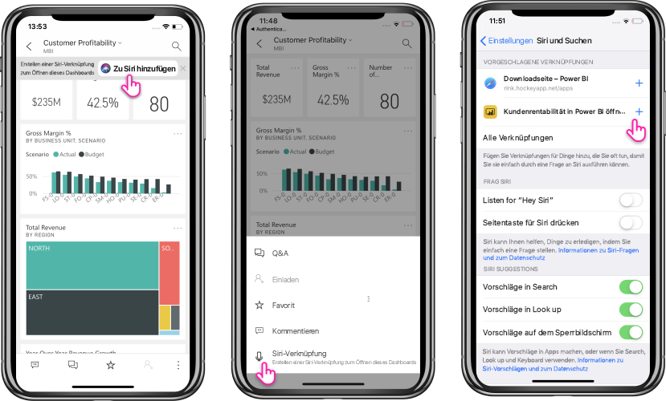
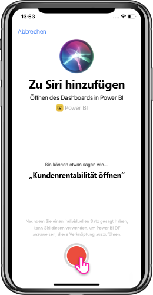

# Verwenden von Siri-Verknüpfungen in der Power BI Mobile-App für iOS (Vorschauphase)

Verwenden Sie Siri-Verknüpfungen, um direkt auf gewünschte Power BI-Inhalte zuzugreifen.

Wenn Sie schnell und mühelos auf häufig verwendete Berichte oder Dashboards zugreifen möchten, können Sie die Integration von Siri-Verknüpfungen verwenden. Erstellen Sie eine Verknüpfung zu einem Element, und fordern Sie Siri dann dazu auf, es zu starten, wann immer Sie sich die Daten ansehen müssen.

## Erstellen einer Siri-Verknüpfung für einen Bericht oder ein Dashboard

Es gibt drei Möglichkeiten, Siri-Verknüpfungen zu Ihren Berichten und Dashboards zu erstellen:

- Ihre häufig verwendeten Berichte und Dashboards werden mit einem Banner mit der Option **Add to Siri** (Zu Siri hinzufügen) versehen. Tippen Sie auf die Aktion, um die Seite **Add to Siri** (Zu Siri hinzufügen) zu öffnen.
    
- Verwenden Sie die Aktion **Siri shortcut** (Siri-Verknüpfung) im Aktionsmenü **Bericht** oder **Dashboard** (…).
    
- Verwenden Sie die **Suggested shortcuts** (Vorgeschlagene Verknüpfungen) in den Geräteeinstellungen (**Geräteeinstellungen** > **Siri und Suche**). Dem Element im Vorschlag können Sie eine Verknüpfung hinzufügen, indem Sie die Schaltfläche mit dem Pluszeichen (+) verwenden.
     
     

Bei Power BI-Berichten führt eine Verknüpfung zu der Seite, die angezeigt wird, wenn Sie die Verknüpfung erstellen. 

All Optionen öffnen die Seite **Add to Siri** (Zu Siri hinzufügen). Auf dieser Seite müssen Sie einen Satz aufnehmen, den Sie später für Siri verwenden, um den Bericht oder das Dashboard zu öffnen. 
   

    

## Verwenden der Siri-Verknüpfungen, um Berichte oder Dashboards anzusehen

Sobald Sie eine Verknüpfung für einen Bericht oder ein Dashboard erstellt haben, müssen Sie nur noch Siri ansprechen, wenn Sie auf ein Dashboard oder Bericht zugreifen möchten.
Aktivieren Sie Siri, und sagen Sie den Satz, den Sie für die Verknüpfung aufgenommen haben. Siri startet Power BI und leitet Sie zum angeforderten Bericht oder Dashboard. 

Bei Power BI-Berichten werden Sie zu der Seite geleitet, die angezeigt wurde, als die Verknüpfung erstellt wurde.

  
  

## Bearbeiten des Satzes für die Siri-Verknüpfung 
Der Satz für die Verknüpfung lässt sich bearbeiten, indem Sie auf die Schaltfläche **Siri shortcut** (Siri-Verknüpfung) im Aktionsmenü **Bericht** oder **Dashboard** tippen (…). Die Seite „Siri shortcut“ (Siri-Verknüpfung) wird mit der Option **Re-Record phrase** (Satz noch mal aufnehmen) angezeigt. 

## Löschen einer Siri-Verknüpfung 
Wenn Sie eine Verknüpfung löschen möchten, navigieren Sie zum Element, und tippen Sie im Aktionsmenü (…) auf die Aktion **Siri shortcut** (Siri-Verknüpfung). Dadurch wird die Seite **Siri shortcut** (Siri-Verknüpfung) geöffnet. Wählen Sie die Option **Delete Shortcut** (Verknüpfung löschen) aus.

> [!NOTE]
> Die Integration von Siri-Verknüpfungen mit Power BI-Apps ist für iPhone und iPad mit iOS12 und höher verfügbar.
> 

## Nächste Schritte
Führen Sie folgende Schritte aus, um mehr über die mobile Power BI-App zu erfahren: 

* Laden Sie die [mobile Power BI-App für iPhone](http://go.microsoft.com/fwlink/?LinkId=522062) herunter.
* Folgen Sie [@MSPowerBI auf Twitter](https://twitter.com/MSPowerBI).
* Werden Sie Teil der [Power BI-Community](http://community.powerbi.com/), um sich mit den Mitgliedern auszutauschen.

