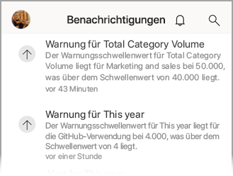
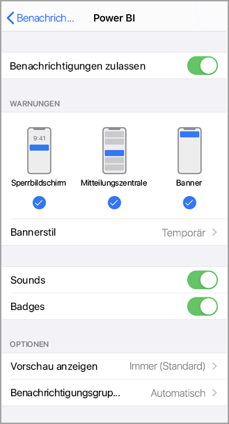
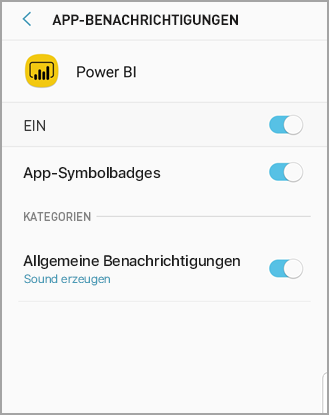

# Abrufen von Benachrichtigungen in den mobilen Power BI-Apps
Gilt für:

|  |  |  |  |  |
|:--- |:--- |:--- |:--- |:--- |
| iPhones |iPads |Android-Telefone |Android-Tablets |Windows 10-Geräte |

>[!NOTE]
>Die Unterstützung für die mobile Power BI-App für **Smartphones mit Windows 10 Mobile** wird am 16. März 2021 eingestellt. [Weitere Informationen](https://go.microsoft.com/fwlink/?linkid=2121400)

Sie erhalten Benachrichtigungen bezüglich Ihrer Power BI-Erfahrung direkt im Power BI-Dienst oder auf Ihrem mobilen Gerät. Wenn Sie „Benachrichtigungen“ öffnen, sehen Sie einen fortlaufenden Benachrichtigungsfeed über [von Ihnen festgelegte Warnungen](mobile-set-data-alerts-in-the-mobile-apps.md), neue Dashboards, die für Sie freigegeben wurden, sowie Änderungen in Ihrem Gruppenarbeitsbereich, Informationen zu Power BI-Veranstaltungen und -Meetings und vieles mehr.

> [!NOTE]
> Wenn Sie sich auf einem iOS-Gerät zum ersten Mal bei der [aktualisierten Version der Power BI-Apps](https://powerbi.microsoft.com/mobile/) angemeldet haben, erhalten Sie eine Meldung, in der Sie gefragt werden, ob Sie Benachrichtigungen von Power BI erhalten möchten. Sie können auch in **Einstellungen** für Ihr Gerät konfigurieren, wie Power BI Sie benachrichtigt. 
> 
> 

## Anzeigen von Benachrichtigungen auf Ihrem mobilen Gerät
1. Wenn Sie Benachrichtigungen auf Ihr mobiles Gerät erhalten, erzeugt Power BI standardmäßig einen Signalton und ein Benachrichtigungsbanner erscheint.
   
   
   

   Sie können [ändern, wie Sie von Power BI benachrichtigt werden](mobile-apps-notification-center.md#change-or-turn-off-notifications-on-your-mobile-device).
2. Wenn Sie Benachrichtigungen erhalten haben, sehen Sie bei der Anmeldung bei Power BI auf Ihrem mobilen Gerät einen gelben Punkt auf der Benachrichtigungsglocke  (iOS und Android) oder auf der globalen Navigationsschaltfläche  (Windows 10-Geräte). 

3. Tippen Sie auf die Benachrichtigungsglocke  (iOS und Android) oder auf das Symbol der Mitteilungszentrale  (Windows 10-Geräte).
   
    Die neuesten Benachrichtigungen werden immer ganz oben angezeigt und die ungelesenen hervorgehoben. Benachrichtigungen werden 90 Tage lang aufbewahrt, es sei denn, Sie löschen sie oder erreichen das zulässige Maximum von 100 Benachrichtigungen.
   
   
4. Tippen Sie auf die Benachrichtigung, bleiben Sie auf dieser, und wischen Sie diese dann zur Seite, um sie auf iOS- und Android-Geräten zu schließen. Klicken Sie bei Windows 10-Geräten mit der rechten Maustaste darauf, und wählen Sie **Schließen** aus.

## Ändern oder Deaktivieren von Benachrichtigungen auf Ihrem mobilen Gerät
Sie können ändern, wie Sie von Power BI benachrichtigt werden.

1. Wechseln Sie auf einem iOS-Gerät zu **Einstellungen** > **Benachrichtigungen**. 
   
    Navigieren Sie auf einem Android-Smartphone zu **Einstellungen** > **Benachrichtigungen**.
   
    Wechseln Sie auf einem Windows-Gerät in **Einstellungen** zu **System** > **Benachrichtigungen**.
2. Wählen Sie in der Liste der Apps **Power BI** aus. 
3. Hier können Sie Benachrichtigungen vollständig deaktivieren oder auswählen, welche Benachrichtigungen Sie erhalten möchten.
   
    **Auf einem iPhone**
   
    
   
    **Auf einem Android-Telefon**
   
    

    **Auf einem Windows 10-Gerät**

    

## Weitere Schritte
* [Datenwarnungen im Power BI-Dienst](../../service-set-data-alerts.md)
* [Festlegen von Datenwarnungen in der iPhone-App (Power BI für iOS)](mobile-set-data-alerts-in-the-mobile-apps.md)
* [Festlegen von Datenwarnungen in der mobilen Power BI-App für Windows 10](mobile-set-data-alerts-in-the-mobile-apps.md)
* [Laden Sie die neueste Version der Power BI-Apps](https://powerbi.microsoft.com/mobile/) für mobile Geräte herunter

