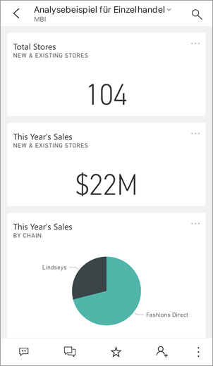
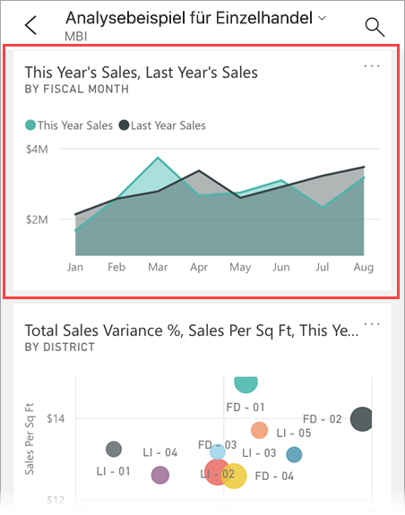
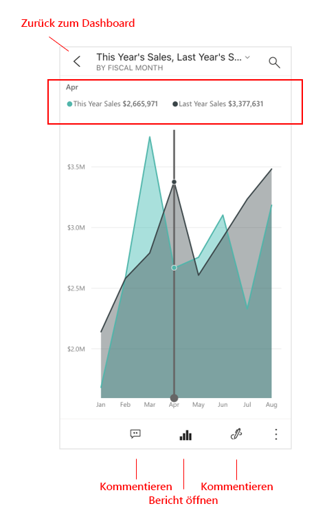
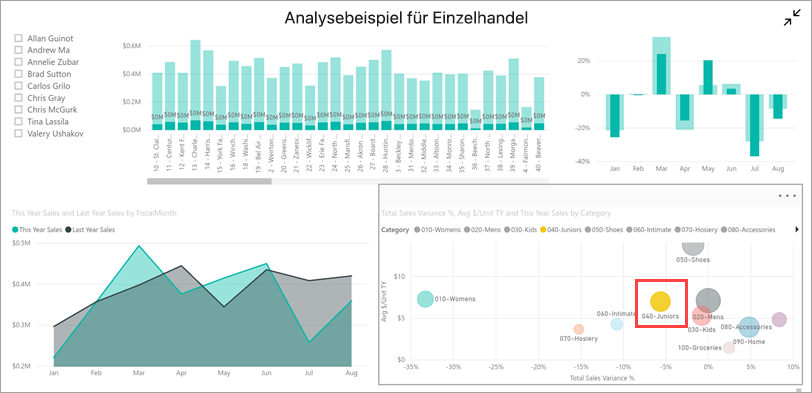
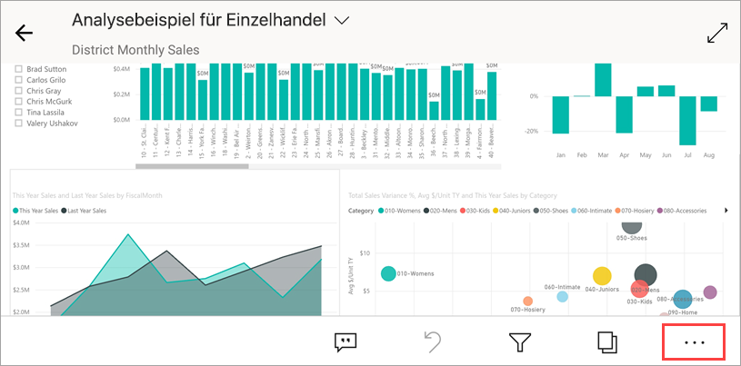
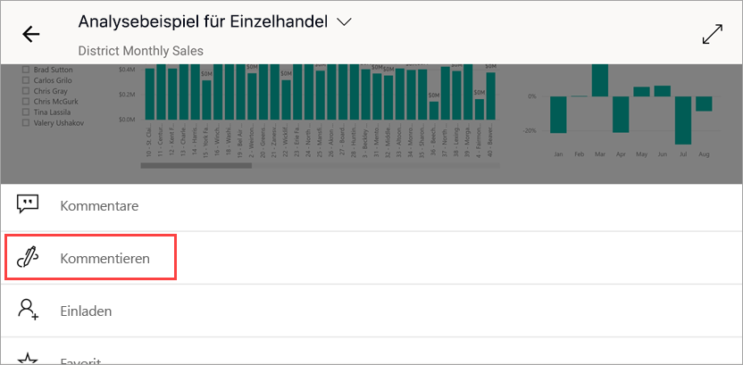
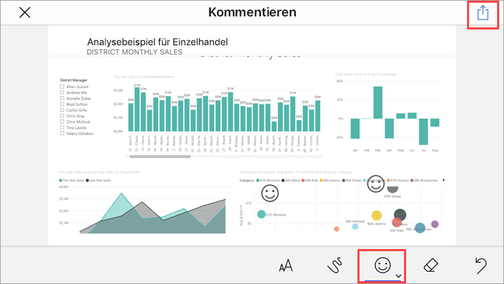
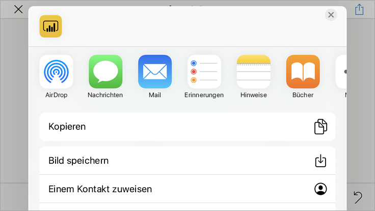
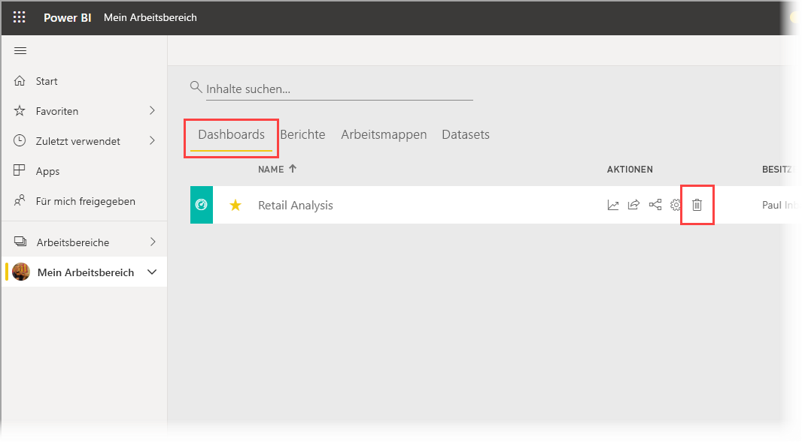

# Schnellstart: Erkunden von Dashboards und Berichten in den mobilen Power BI-Apps
In dieser Schnellstartanleitung erhalten Sie eine kurze Einführung in die mobile Power BI-App und erkunden ein Beispieldashboard und einen Beispielbericht. Die Power BI-App für iOS wird angezeigt, Sie können die Anleitung aber auch auf anderen Geräten ausführen.

Gilt für:

|  |  |  |  |
|:--- |:--- |:--- |:--- |
| iPhone | iPad | Android- | Windows 10 |

>[!NOTE]
>Die Unterstützung für die mobile Power BI-App für **Smartphones mit Windows 10 Mobile** wird am 16. März 2021 eingestellt. [Weitere Informationen](https://go.microsoft.com/fwlink/?linkid=2121400)

Ein Dashboards ist ein Portal für den Lebenszyklus und die Prozesse des Unternehmens. Es stellt eine Übersicht dar, eine zentrale Stelle, um den aktuellen Status des Unternehmens zu überwachen. Berichte sind interaktive Ansichten Ihrer Daten, und mit den darin enthaltenen Visuals werden verschiedene Ergebnisse und Erkenntnisse zu diesen Daten dargestellt. 

## Voraussetzungen

* **Registrieren Sie sich bei Power BI**: Wenn Sie noch nicht bei Power BI registriert sind, müssen Sie sich zuerst für eine [kostenlose Testversion registrieren](https://app.powerbi.com/signupredirect?pbi_source=web).
* **Installieren Sie die Power BI-App für Ihr Gerät**: Laden Sie die mobile Power BI-App aus dem [App Store](https://apps.apple.com/app/microsoft-power-bi/id929738808) (iOS) oder von [Google Play](https://play.google.com/store/apps/details?id=com.microsoft.powerbim&amp;amp;clcid=0x409) (Android) herunter.
* **Laden Sie das Analysebeispiel für den Einzelhandel herunter**: Der erste Schritt in dieser Schnellstartanleitung ist das Herunterladen des Analysebeispiels für den Einzelhandel im Power BI-Dienst. Erfahren Sie, wie Sie im ersten Schritt [eine Beispieldatei in Ihr Power BI-Konto herunterladen](./mobile-apps-download-samples.md). Achten Sie darauf, das Analysebeispiel für den Einzelhandel auszuwählen.

Sobald Sie die Voraussetzungen erfüllt und das Analysebeispiel für den Einzelhandel in Ihr Power BI-Konto heruntergeladen haben, können Sie mit dieser kurzen Einführung beginnen.

## Anzeigen eines Dashboards auf einem mobilen Gerät
1. Öffnen Sie die Power BI-App auf Ihrem Gerät, und melden Sie sich mit den Anmeldeinformationen Ihres Power BI-Kontos an – dies sind die gleichen, die Sie für den Power BI-Dienst im Browser verwendet haben.
 
1. Tippen Sie nun auf das Symbol **Arbeitsbereiche** , wählen Sie **Meine Arbeitsbereiche** aus, und tippen Sie dann auf das Analysebeispiel für den Einzelhandel, um es zu öffnen.

    
   
    Power BI-Dashboards sehen auf Ihrem mobilen Gerät etwas anders aus als im Power BI-Dienst. Alle Kacheln werden in der gleichen Breite angezeigt und sind nacheinander von oben nach unten angeordnet.

5. Tippen Sie auf das Sternsymbol  in der unteren Symbolleiste, um dieses Dashboard als Favoriten festzulegen. Wenn Sie etwas in der mobilen App als Favoriten festlegen, gilt dieser Favorit auch für den Power BI-Dienst und umgekehrt.

6. Scrollen Sie nach unten, und tippen Sie auf das gefüllte Liniendiagramm „This Year's Sales, Last Year's Sales“.

    

    Es wird im Fokusmodus geöffnet.

7. Tippen Sie im Fokusmodus im Diagramm auf **Apr**. Oben im Diagramm werden die Werte für April angezeigt.

    

8. Tippen Sie auf das Berichtssymbol  unten auf dem Bildschirm (auf Android-Geräten befindet sich dieses Symbol möglicherweise am oberen Bildschirmrand). Der zu dieser Kachel gehörige Bericht wird im Querformat geöffnet.

    

9. Tippen Sie im Blasendiagramm auf die gelbe Blase „040 - Juniors“. Beachten Sie, wie die entsprechenden Werte in den anderen Diagrammen hervorgehoben werden. 

    

10. Wischen Sie nach oben, um die Symbolleiste unten anzuzeigen, und tippen Sie auf **Weitere Optionen (...)** .

    

11. Scrollen Sie in der Liste nach unten, und wählen Sie **Kommentieren** aus.

    

12. Tippen Sie in der Symbolleiste „Kommentieren“ auf das Smileysymbol, und tippen Sie dann auf die Berichtsseite, auf der Sie einige Smileys hinzufügen möchten.
 
    

13. Tippen Sie nun in der rechten oberen Ecke auf **Teilen**.

14. Wählen Sie aus, wie der Bericht freigegeben werden soll.  

    

    Sie können diese Momentaufnahme mit jedem Benutzer innerhalb oder außerhalb Ihrer Organisation teilen. Wenn die Benutzer sich innerhalb Ihrer Organisation befinden und ein eigenes Power BI-Konto besitzen, können sie den Analysebeispielbericht für den Einzelhandel ebenfalls öffnen.

## Bereinigen von Ressourcen

Sobald Sie diese Schnellstartanleitung abgeschlossen haben, können Sie das Dashboard, den Bericht und das Dataset zum Analysebeispiel für den Einzelhandel löschen, wenn Sie möchten.

1. Öffnen Sie den Power BI-Dienst ([Power BI-Dienst](https://app.powerbi.com)), und melden Sie sich an.

2. Wählen Sie im Navigationsbereich **Mein Arbeitsbereich** aus.

3. Wählen Sie die Registerkarte „Dashboards“ aus, und klicken Sie dann auf den Papierkorb.

    

    Klicken Sie nun auf die Registerkarte „Berichte“, und klicken Sie noch mal auf den Papierkorb.

4. Wählen Sie nun die Registerkarte „Datasets“ aus, klicken Sie auf **Weitere Optionen** (...), und wählen Sie **Löschen** aus. 

    

## Nächste Schritte

In dieser Schnellstartanleitung haben Sie ein Beispieldashboard und einen Beispielbericht auf Ihrem mobilen Gerät erkundet. Erfahren Sie mehr über die Arbeit mit dem Power BI-Dienst. 

> [!div class="nextstepaction"]
> [Schnellstart: Navigation im Power BI-Dienst](../end-user-experience.md)

