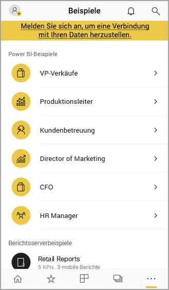

# Erste Schritte mit der mobilen Power BI-App auf iOS-Geräten
Die iOS-App für Microsoft Power BI auf dem iPhone und iPad bietet Ihnen die mobile BI-Umgebung für Power BI, Power BI-Berichtsserver und Reporting Services. Mit dem touchfähigen, mobilen Livezugriff auf lokale Server und die Cloud können Sie Ihre Unternehmensdashboards überall anzeigen und mit ihnen interagieren. Untersuchen Sie die Daten in Dashboards, und geben Sie diese dann über eine E-Mail oder SMS für Kollegen frei. Bleiben Sie auf dem neuesten Stand mit den aktuellsten Daten auf Ihrer [Apple Watch](mobile-apple-watch.md).  

Sie erstellen Power BI-Berichte in Power BI Desktop und veröffentlichen sie:

* [Veröffentlichen Sie sie im Power BI-Dienst](../../fundamentals/service-get-started.md), und erstellen Sie Dashboards.
* [Veröffentlichen Sie sie lokal auf dem Power BI-Berichtsserver](../../report-server/quickstart-create-powerbi-report.md).

In der mobilen Power BI-App für iOS interagieren Sie anschließend mit Ihren Dashboards und Berichten, die sich auf lokalen Servern oder in der Cloud befinden können.

Machen Sie sich [mit den Neuerungen bei mobilen Power BI-Apps](mobile-whats-new-in-the-mobile-apps.md) vertraut.

## Herunterladen der App
[Laden Sie die iOS-App](https://go.microsoft.com/fwlink/?LinkId=522062 "iOS-App herunterladen") aus dem Apple App Store auf Ihr iPhone oder Ihr iPad herunter.

Sie können die mobile Power BI-App für iOS auf jedem iOS 11-Gerät oder höher ausführen. 

## Registrieren beim Power BI-Dienst
Wenn Sie sich noch nicht registriert haben, wechseln Sie zu [powerbi.com](https://powerbi.microsoft.com/get-started/), und klicken Sie unter **Power BI - Cloud collaboration and sharing** (Power BI – Zusammenarbeit und Freigabe in der Cloud) auf **Kostenlos testen**.

## Erste Schritte mit der Power BI-App
1. Öffnen Sie die Power BI-App auf Ihrem iOS-Gerät.
2. Zum Anmelden bei Power BI tippen Sie auf die Registerkarte **Power BI**. Geben Sie dann Ihre Anmeldeinformationen ein.  
   Wenn Sie sich bei Ihren mobilen Berichten und KPIs von Reporting Services anmelden möchten, tippen Sie auf die Registerkarte **Berichtsserver**, und geben Sie Ihre Anmeldeinformationen ein.
   
   
   
   Wenn Sie sich in der App befinden, tippen Sie einfach auf das Kontoprofilbild in der oberen linken Ecke des Bildschirms, um zwischen Power BI und Ihrem Berichtsserver zu wechseln. 

## Testen der Power BI- und Reporting Services-Beispiele
Sie können die Power BI- und Reporting Services-Beispiele auch ohne Registrierung anzeigen und mit ihnen interagieren.

Tippen Sie auf der Navigationsleiste auf **Weitere Optionen** (...), und wählen Sie **Beispiele** aus, um auf die Beispiele zuzugreifen.

Auf eine Reihe von Power BI-Beispielen folgen mehrere Berichtsserverbeispiele.

   
   
   > [!NOTE]
   > In den Beispielen sind nicht alle Features verfügbar. Beispielsweise können Sie die Beispielberichte nicht anzeigen, die den Dashboards zugrunde liegen, Sie können die Beispiele nicht für andere Benutzer freigeben, und Sie können sie nicht als Favoriten festlegen. 
   > 
   >

## Suchen von Inhalten in Dashboards in mobilen Power BI-Apps

Tippen Sie in der Kopfzeile auf das Vergrößerungsglas, um mit der Suche nach Power BI-Inhalt zu beginnen.

## Anzeigen Ihrer als Favoriten gespeicherten Dashboards und Berichte
Tippen Sie auf der Navigationsleiste auf **Favoriten** (), um die Seite mit den Favoriten anzuzeigen. 

Weitere Informationen zu [Favoriten in den mobilen Power BI-Apps](mobile-apps-favorites.md).

## Unterstützung für die mobilen Power BI-Apps in Unternehmen
Unternehmen können Microsoft Intune verwenden, um Geräte und Anwendungen, einschließlich der mobilen Power BI-Apps für Android und iOS, zu verwalten.

Mit Microsoft Intune können Unternehmen Einstellungen steuern, z.B. eine Zugriffs-PIN anfordern, festlegen, wie Daten von der Anwendung verarbeitet werden, und sogar Anwendungsdaten verschlüsseln, wenn die App nicht genutzt wird.

> [!NOTE]
> Wenn Sie die mobile Power BI-App auf einem iOS-Gerät verwenden und Ihr Unternehmen Microsoft Intune MAM konfiguriert hat, ist die Datenaktualisierung im Hintergrund deaktiviert. Power BI aktualisiert die Daten über den Power BI-Dienst im Web, wenn Sie das nächste Mal die App aufrufen.
> 

Erfahren Sie mehr über das [Konfigurieren der mobilen Power BI-Apps mit Microsoft Intune](../../admin/service-admin-mobile-intune.md). 

## Nächste Schritte

* [Was ist Power BI?](../../fundamentals/power-bi-overview.md)
* Haben Sie Fragen? [Stellen Sie Ihre Frage in der Power BI-Community.](https://community.powerbi.com/)
