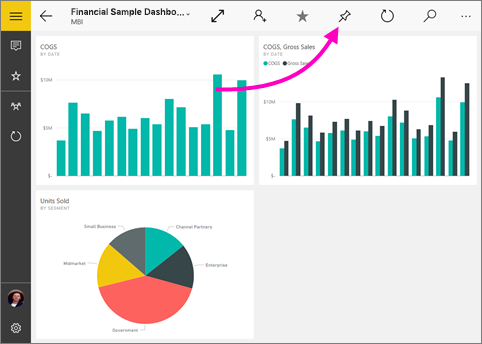
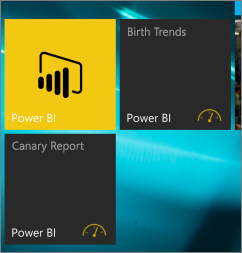

# Anheften eines Dashboards aus der mobilen Power BI-App an den Windows 10-Startbildschirm
Sie können Power BI-Dashboards aus der mobilen Power BI-App für Windows 10 an den Windows-Startbildschirm anheften. Wenn Sie auf dem Startbildschirm auf die Kachel tippen, wird das Dashboard in der mobilen Power BI-App für Windows 10 geöffnet.

>[!NOTE]
>Die Unterstützung für die mobile Power BI-App für **Smartphones mit Windows 10 Mobile** wird am 16. März 2021 eingestellt. [Weitere Informationen](https://go.microsoft.com/fwlink/?linkid=2121400)

## Anheften eines Dashboards als Kachel an Ihren Startbildschirm
1. Öffnen Sie ein Dashboard.
2. Tippen Sie auf **An „Start“ anheften** .
   
   
   
   Wechseln Sie zum Startbildschirm Ihres Geräts, um die Kachel anzuzeigen.
   
   

## Nächste Schritte
* [Herunterladen der mobilen Power BI-App für Windows 10](https://go.microsoft.com/fwlink/?LinkID=526478) aus dem Windows Store  
* [Erste Schritte mit der mobilen Power BI-App für Windows 10](mobile-windows-10-phone-app-get-started.md)  
* [Was ist Power BI?](../../fundamentals/power-bi-overview.md)
* Haben Sie Fragen? [Stellen Sie Ihre Frage in der Power BI-Community.](https://community.powerbi.com/)
