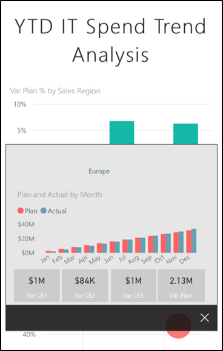
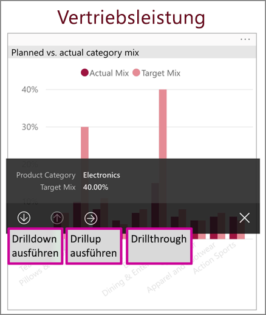
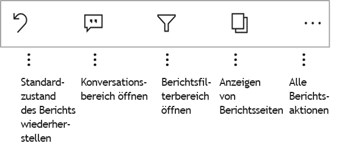

# Durchsuchen von Berichten in den mobilen Power BI-Apps
Gilt für:

|  |  |  |  |  |
|:---: |:---: |:---: |:---: |:---: |
| iPhones |iPads |Android-Telefone |Android-Tablets |Windows 10-Geräte |

Ein Power BI-Bericht ist eine interaktive Ansicht Ihrer Daten, und mit den darin enthaltenen Visuals werden unterschiedliche Ergebnisse und Erkenntnisse zu diesen Daten dargestellt. Das Anzeigen von Berichten in den mobilen Power BI-Apps ist der dritte Schritt in einem dreistufigen Prozess:

1. [Erstellen Sie Berichte in Power BI Desktop](../../desktop-report-view.md). Sie können in Power BI Desktop sogar [einen Bericht für Telefone optimieren](mobile-apps-view-phone-report.md).
2. Veröffentlichen Sie diese Berichte im Power BI-Dienst [(https://powerbi.com)](https://powerbi.com) oder auf dem [Power BI-Berichtsserver](../../report-server/get-started.md).  
3. Anschließend können Sie in den mobilen Power BI-Apps mit den Berichten interagieren.

## Öffnen eines Power BI-Berichts in der mobilen App
Power BI-Berichte werden abhängig von ihrer Herkunft an verschiedenen Stellen in der mobilen App gespeichert. Sie können sich in „Apps“, „Für mich freigegeben“, „Arbeitsbereiche“ (einschließlich „Mein Arbeitsbereich“) oder auf einem Berichtsserver befinden. Manchmal müssen Sie einen Bericht in einem zugehörigen Dashboard suchen, und manchmal sind Berichte aufgelistet.

In Listen und Menüs finden Sie ein Symbol neben einem Berichtsnamen, an dem Sie erkennen können, dass es sich bei dem Element um einen Bericht handelt:

Es gibt zwei Symbole für Berichte in den mobilen Power BI-Apps:

*  Dieses Symbol gibt an, dass der Bericht in der App im Querformat angezeigt wird. Er sieht also wie im Browser aus.

*  Dieses Symbol gibt an, dass der Bericht mindestens eine für Smartphones optimierte Seite enthält, die im Hochformat angezeigt wird.

> [!NOTE]
> Wenn Sie Ihr Smartphone im Querformat halten, wird immer das Querformat angezeigt, auch wenn die Berichtsseite ein Layout für Smartphones aufweist.

Tippen Sie auf die Auslassungspunkte (...) in der rechten oberen Ecke einer Kachel, und wählen Sie dann **Bericht öffnen** aus, um einen Bericht eines Dashboards abzurufen:
  
  
  
  Nicht alle Kacheln können als Berichte geöffnet werden. Beispielsweise werden für Kacheln, die durch Stellen einer Frage im Q&A-Feld erstellt wurden, keine Berichte geöffnet, wenn Sie auf die Kachel tippen.
  
## Interagieren mit Berichten
Nachdem Sie einen Bericht in der App geöffnet haben, können Sie mit diesem arbeiten. Mit Ihrem Bericht und dessen Daten können Sie vieles tun. In der Fußzeile des Berichts finden Sie Aktionen, die Sie für den Bericht ausführen können. Wenn Sie auf die im Bericht angezeigten Daten tippen bzw. lange tippen, können Sie Slice-and-Dice für Daten ausführen.

### Verwenden von Antippen und langem Antippen
Ein Tippen gleicht einem Mausklick. Wenn Sie den Bericht auf Grundlage eines Datenpunkts übergreifend hervorheben möchten, tippen Sie auf den Datenpunkt.
Wenn Sie auf einen Datenschnittwert tippen, wird der Wert ausgewählt und für den Rest des Berichts wird ein Datenschnitt anhand des Werts durchgeführt.
Wenn Sie auf einen Link, eine Schaltfläche oder ein Lesezeichen tippen, wird die vom Berichtsautor definierte Aktion ausgeführt.

Wahrscheinlich haben Sie bemerkt, dass ein Rahmen angezeigt wird, wenn Sie auf ein Visual tippen. In der oberen rechten Ecke des Rahmens werden Auslassungspunkte (...) angezeigt. Wenn Sie auf diese Auslassungspunkte tippen, wird ein Menü mit Aktionen angezeigt, die Sie an diesem Visual vornehmen können:

### QuickInfo und Drillaktionen

Wenn Sie einen Datenpunkt lange antippen (tippen und halten), wird eine QuickInfo mit den Werten angezeigt, die dieser Datenpunkt repräsentiert:

Wenn der Berichtsautor die QuickInfo einer Berichtsseite konfiguriert hat, wird die standardmäßige QuickInfo durch die QuickInfo der Berichtsseite ersetzt:

> [!NOTE]
> QuickInfos für Berichte werden für Geräte mit Viewports mit mindestens 640x320 Pixeln unterstützt. Wenn Ihr Gerät kleiner ist, zeigt die App die standardmäßigen QuickInfos an.

Berichtsautoren können Hierarchien in den Daten und Beziehungen zwischen Berichtsseiten definieren. Die Hierarchie ermöglicht den Drilldown, Drillup und Drillthrough in eine andere Berichtsseite aus einem Visual und einem Wert. Wenn Sie also zusätzlich zur QuickInfo lange auf einen Wert tippen, werden in der Fußzeile die entsprechenden Drilloptionen angezeigt:

Wenn Sie auf einen bestimmten Teil eines Visuals tippen und dann die Option *Drillthrough* auswählen, navigiert Power BI zu einer anderen Seite im Bericht mit dem angetippten Wert als Filter. Der Berichtsautor kann mindestens eine Drillthroughoption festlegen, durch die Sie auf eine andere Seite weitergeleitet werden. In diesem Fall können Sie entscheiden, für welche Option Sie einen Drillthrough durchführen möchten. Mit der Schaltfläche „Zurück“ gelangen Sie zurück zur vorherigen Seite.

Weitere Informationen finden Sie unter [Hinzufügen der Drillthroughfunktion in Power BI Desktop](../../desktop-drillthrough.md).
   
   > [!IMPORTANT]
   > In mobilen Power BI-Apps werden Drillaktionen in Matrizen und Tabellenvisuals nur über Zellenwerte erlaubt, und nicht über Spalten oder Zeilenheader.
   
   
   
### Verwenden der Aktionen in der Fußzeile des Berichts
Über die Fußzeile des Berichts können Sie verschiedene Aktionen für die aktuelle Berichtsseite oder dem gesamten Bericht ausführen. Die Fußzeile bietet schnellen Zugriff auf die am häufigsten verwendeten Aktionen. Sie können auf andere Aktionen zugreifen, indem Sie auf die Auslassungspunkte (...) tippen:

Sie können die folgenden Aktionen über die Fußzeile ausführen:
- Zurücksetzen des Berichtsfilters und der übergreifenden Hervorhebungsauswahl in den ursprünglichen Zustand.
- Öffnen des Konversationsbereichs, um Kommentare anzuzeigen oder zum Bericht hinzuzufügen.
- Öffnen des Filterbereich, um den derzeit auf den Bericht angewendeten Filter anzuzeigen oder zu ändern.
- Auflisten aller Seiten des Berichts. Wenn Sie auf einen Seitennamen tippen, wird diese Seite geladen und angezeigt.
Sie können zwischen Berichtsseiten wechseln, indem Sie vom Rand des Bildschirms in die Mitte wischen.
- Anzeigen aller Berichtsaktionen.

#### Alle Berichtsaktionen
Wenn Sie im Bericht auf die Schaltfläche mit den Auslassungspunkten (...) tippen, werden alle Aktionen angezeigt, die Sie für einen Bericht ausführen können:

Einige der Aktionen können deaktiviert sein, da sie von den spezifischen Berichtsfunktionen abhängig sind.
Beispiel:

**Filter by current location** (Nach aktuellem Standort filtern) ist aktiviert, wenn der Berichtsautor den Bericht mit geografischen Daten kategorisiert hat. Weitere Informationen finden Sie unter [Identifizieren von geografischen Daten in einem Bericht](https://docs.microsoft.com/power-bi/desktop-mobile-geofiltering).

**Scan to filter the report by barcode** (Barcode zum Filtern des Berichts scannen) wird nur aktiviert, wenn das Dataset in Ihrem Bericht als **Barcode** markiert ist. Weitere Informationen finden Sie unter [Markieren von Barcodes in Power BI Desktop](https://docs.microsoft.com/power-bi/desktop-mobile-barcodes).

**Einladen** ist nur aktiviert, wenn Sie über die Berechtigung verfügen, den Bericht für andere Benutzer freizugeben. Sie verfügen nur über Berechtigung, wenn Sie der Besitzer des Berichts sind oder der Besitzer Ihnen die Berechtigung zum Freigeben gewährt hat.

**Anmerkung und Freigabe** kann deaktiviert sein, wenn in Ihrer Organisation eine [Intune-Schutzrichtlinie](https://docs.microsoft.com/intune/app-protection-policies) vorhanden ist, die die Freigabe über mobile Power BI-Apps untersagt.

## Nächste Schritte
* [Anzeigen von und Interagieren mit Power BI-Berichten, die für das Smartphone optimiert sind](mobile-apps-view-phone-report.md)
* [Erstellen einer für Smartphones optimierten Version eines Berichts](../../desktop-create-phone-report.md)
* Haben Sie Fragen? [Stellen Sie Ihre Frage in der Power BI-Community.](http://community.powerbi.com/)

