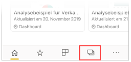
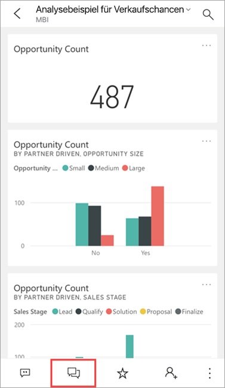
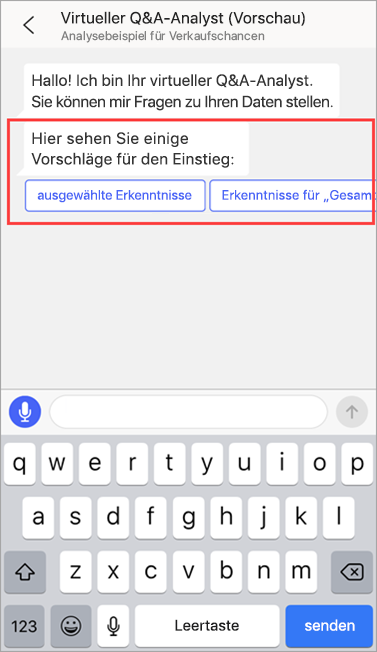
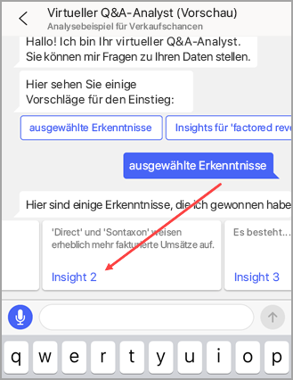
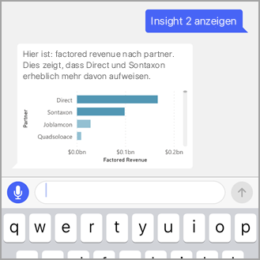
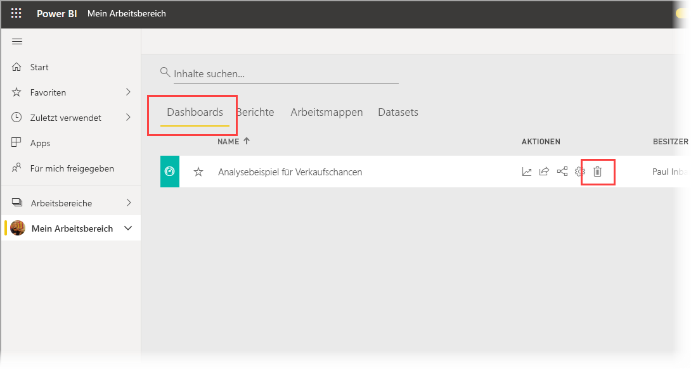
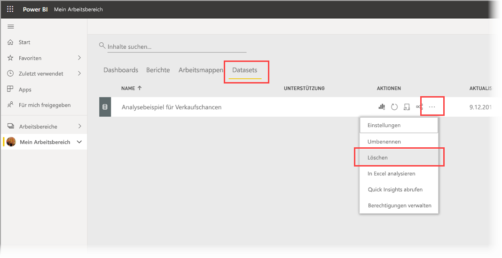

# Tutorial: Stellen von Fragen zu Ihren Daten mit dem virtuellen Q&A-Analysten in iOS-Apps für Power BI

Am schnellsten nähern Sie sich Ihren Daten, wenn Sie Fragen in eigenen Worten stellen können. In diesem Tutorial verwenden Sie den virtuellen Q&A-Analysten in der mobilen Microsoft Power BI-App auf Ihrem iPad oder iPhone, um Fragen zu Ihren Beispieldaten zu stellen und wichtige Einblicke anzuzeigen. 

Gilt für:

|  |  |
|:--- |:--- |
| iPhones |iPads |

Der virtuelle Q&A-Analyst ist eine BI-Benutzeroberfläche für die Kommunikation, der auf zugrunde liegende Q&A-Daten im [Power BI-Dienst](https://powerbi.com) zugreift. Der Analyst schlägt Dateneinblicke vor, und Sie können über die Tastatur oder per Spracheingabe selbst Fragen stellen.

In diesem Tutorial erhalten Sie Informationen zu den folgenden Vorgängen:

> [!div class="checklist"]
> * Installieren der mobilen Power BI-App für iOS
> * Herunterladen eines Power BI-Beispieldashboards und -berichts
> * Anzeigen der von der mobilen App vorgeschlagenen Einblicke

## Voraussetzungen

* **Registrieren Sie sich bei Power BI**: Wenn Sie noch nicht bei Power BI registriert sind, müssen Sie sich zuerst für eine [kostenlose Testversion registrieren](https://app.powerbi.com/signupredirect?pbi_source=web).
* **Installieren der Power BI-App für iOS:** [Laden Sie die App für iOS](https://apps.apple.com/app/microsoft-power-bi/id929738808) aus dem Apple App Store auf Ihr iPad, Ihr iPhone oder Ihren iPod Touch herunter. Folgende Versionen unterstützen die Power BI-App für iOS:
  * iPad mit iOS 11 oder höher
  * iPhone 5 und höher mit iOS 11 oder höher 
  * iPod Touch mit iOS 11 oder höher
* **Herunterladen von Beispieldaten:** Der erste Schritt besteht darin, das **Analysebeispiel für Opportunity** im Power BI-Dienst herunterzuladen. Weitere Informationen hierzu finden Sie unter [Herunterladen von Beispielen in „Mein Arbeitsbereich“ im Power BI-Dienst](./mobile-apps-download-samples.md).

Sobald Sie die Voraussetzungen erfüllt und die Beispieldaten heruntergeladen haben, können Sie die Beispiele auf Ihrem iOS-Gerät anzeigen.

## Ausgewählte Einblicke
1. Öffnen Sie die Power BI-App auf Ihrem iPhone oder iPad, und melden Sie sich mit den Anmeldeinformationen Ihres Power BI-Kontos an – dies sind die gleichen, die Sie für den Power BI-Dienst im Browser verwendet haben.

2. Tippen Sie auf der Navigationsleiste der Startseite auf das Symbol **Arbeitsbereiche**.

    

3. Wenn die Seite „Arbeitsbereiche“ geöffnet wird, tippen Sie auf **Meine Arbeitsbereiche** und dann auf das Dashboard **Analysebeispiel für Opportunity**, um es zu öffnen.

3. Tippen Sie auf dem Dashboard „Analysebeispiel für Opportunity“ auf das Symbol für den virtuellen Q&A-Analysten im Aktionsmenü.

    

    Der virtuelle Q&A-Analyst bietet einige Vorschläge für den Einstieg.

    

3. Tippen Sie auf **featured insights** (Ausgewählte Einblicke).

4. Der virtuelle Q&A-Analyst stellt einige Einblicke vor. Scrollen Sie nach rechts, und tippen Sie auf **Insight 2**.

    

   Der virtuelle Q&A-Analyst zeigt „Insight 2“ an.

    

5. Tippen Sie auf das Diagramm, um es im Fokusmodus zu öffnen.

    

6. Tippen Sie in der linken oberen Ecke auf den Pfeil, um zur Oberfläche des virtuellen Q&A-Analysten zurückzukehren.

## Bereinigen von Ressourcen

Wenn Sie das Tutorial beendet haben, können Sie das Dashboard, den Bericht und das Dataset für das Beispiel für die Opportunityanalyse löschen.

1. Öffnen Sie den Power BI-Dienst ([Power BI-Dienst](https://app.powerbi.com)), und melden Sie sich an.

2. Wählen Sie im Navigationsbereich **Mein Arbeitsbereich** aus.

3. Klicken Sie auf die Registerkarte „Dashboards“ und dann auf den Mülleimer in der Zeile „Analysebeispiel für Opportunity“.

    

    Klicken Sie nun auf die Registerkarte „Berichte“, und klicken Sie noch mal auf den Papierkorb.

4. Wählen Sie nun die Registerkarte „Datasets“ aus, klicken Sie auf **Weitere Optionen** (...), und wählen Sie dann **Löschen** aus.

    

## Nächste Schritte

Sie haben den virtuellen Q&A-Assistenten in den mobilen Power BI-Apps für iOS getestet. Erfahren Sie mehr über Fragen und Antworten im Power BI-Dienst.
> [!div class="nextstepaction"]
> [Q&A im Power BI-Dienst](../end-user-q-and-a.md)