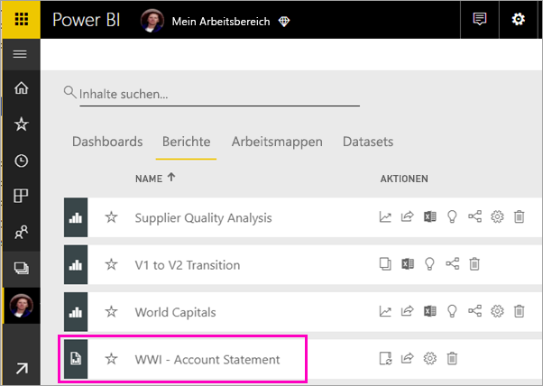
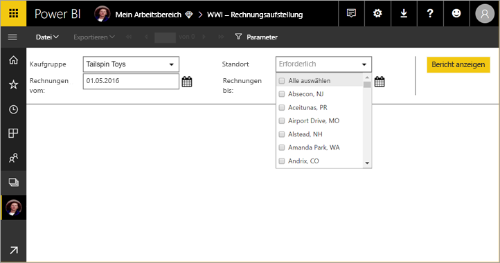
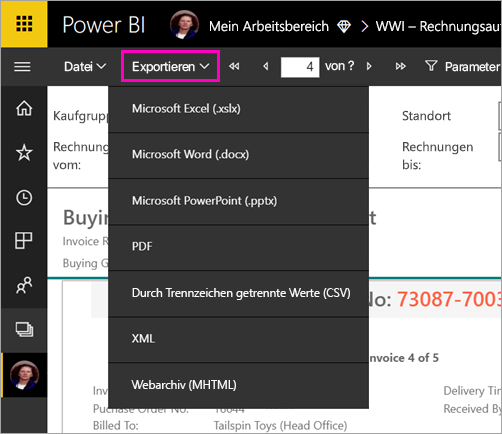

# Anzeigen eines paginierten Berichts im Power BI-Dienst

In diesem Artikel erhalten Sie Informationen zur Anzeige eines paginierten Berichts im Power BI-Dienst. Paginierte Berichte sind Berichte, die im Berichts-Generator erstellt und in einen beliebigen Arbeitsbereich in einer Premium-Kapazität hochgeladen werden. Achten Sie auf das Diamantsymbol  neben dem Namen des Arbeitsbereichs. 

Paginierte Berichte besitzen ein eigenes Symbol. .

Sie können paginierte Berichte auch in eine Reihe von Formaten exportieren: 

- Microsoft Excel
- Microsoft Word
- Microsoft PowerPoint
- PDF
- Durch Trennzeichen getrennte Datei
- XML
- Webarchiv (MHTML)

## Anzeigen eines paginierten Berichts

1. Wählen Sie den paginierten Bericht im Arbeitsbereich aus.

    

2. Wenn der Bericht (wie der oben gezeigte) Parameter enthält, wird er beim ersten Öffnen möglicherweise nicht angezeigt. Wählen Sie Parameter aus, und wählen Sie dann **Bericht anzeigen**. 

     

    Sie können die Parameter jederzeit ändern.

1. Blättern Sie durch den Bericht, indem Sie auf die Pfeile am oberen Rand der Seite klicken oder eine Seitenzahl in das Feld eingeben.
    
   

4. Wählen Sie **Exportieren**, um ein Format zum Exportieren Ihrer paginierten Berichte auszuwählen.

    

## Nächste Schritte

[Paginierte Berichte im Power BI-Dienst](end-user-paginated-report.md)
