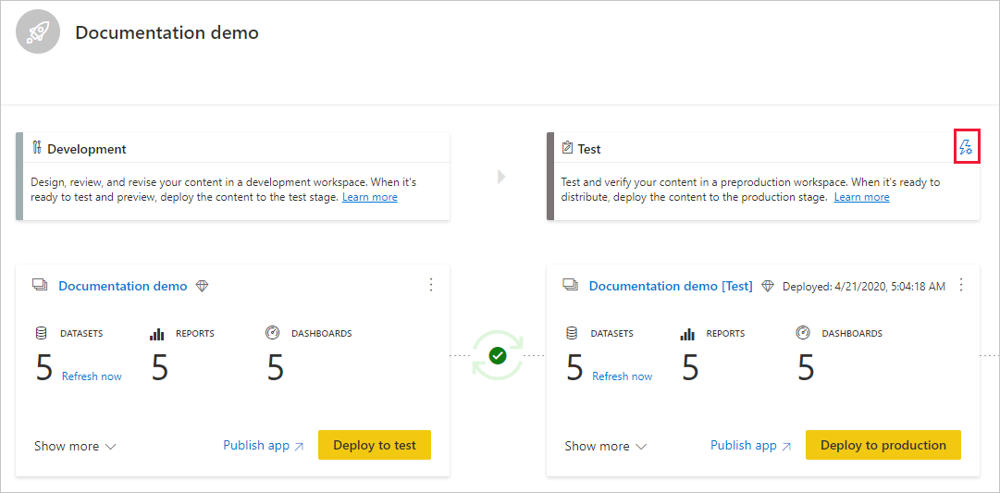

# Erste Schritte mit Bereitstellungspipelines (Vorschau)

Dieser Artikel führt Sie durch die grundlegenden Einstellungen, die für die Verwendung von Bereitstellungspipelines erforderlich sind.

## Zugreifen auf Bereitstellungspipelines

Sie können auf das Feature für Bereitstellungspipelines zugreifen, wenn die folgenden Bedingungen erfüllt sind:

* Sie sind ein Power BI [Pro-Benutzer](../admin/service-admin-purchasing-power-bi-pro.md).

* Sie gehören einer Organisation an, die über eine Premium-Kapazität verfügt.

* Sie fungieren als [Administrator eines neuen Arbeitsbereichs](../collaborate-share/service-create-the-new-workspaces.md).

>[!NOTE]
> Die Schaltfläche „Bereitstellungspipelines“ wird Ihnen ebenfalls angezeigt, wenn Sie zuvor eine Pipeline erstellt haben oder eine Pipeline für Sie freigegeben wurde.

## Schritt 1: Erstellen einer Bereitstellungspipeline

Gehen Sie folgendermaßen vor, um eine Bereitstellungspipeline zu erstellen:

1. Wählen Sie im Navigationsbereich des Power BI-Diensts **Bereitstellungspipelines** aus, und klicken Sie auf **Pipeline erstellen**.

2. Geben Sie im Dialogfeld *Bereitstellungspipeline erstellen* einen Namen und eine Beschreibung für die Pipeline ein, und klicken Sie auf **Erstellen**.

Nachdem die Pipeline erstellt wurde, können Sie sie für andere Benutzer freigeben oder löschen. Wenn Sie eine Pipeline für andere Benutzer freigeben, erhalten diese Benutzer [Zugriff auf die Pipeline](deployment-pipelines-process.md#user-with-pipeline-access). Durch den Pipelinezugriff können Benutzer die Pipeline anzeigen, freigeben, bearbeiten und löschen.

## Schritt 2: Zuweisen eines Arbeitsbereichs zu einer Bereitstellungspipeline

Nachdem Sie eine Pipeline erstellt haben, müssen Sie der Pipeline die zu verwaltenden Inhalte hinzufügen. Sie fügen der Pipeline Inhalte hinzu, indem Sie der Pipelinephase einen Arbeitsbereich zuweisen. Ein Arbeitsbereich kann einer beliebigen Phase zugewiesen werden. 

Sie können einer Bereitstellungspipeline nur einen Arbeitsbereich zuweisen. Bereitstellungspipelines erstellen Klone der Arbeitsbereichsinhalte, die in verschiedenen Phasen der Pipeline verwendet werden.

Führen Sie die folgenden Schritte aus, um einen Arbeitsbereich in einer Bereitstellungspipeline zuzuweisen:

1. Klicken Sie in der neu erstellten Bereitstellungspipeline auf **Arbeitsbereich zuweisen**.

2. Wählen Sie im Dropdownmenü *Arbeitsbereich auswählen* den Arbeitsbereich aus, den Sie der Pipeline zuweisen möchten.

3. Wählen Sie die Phase aus, der Sie den Arbeitsbereich zuweisen möchten.

### Einschränkungen beim Zuweisen von Arbeitsbereichen

* Der Arbeitsbereich muss ein [neuer Arbeitsbereich](../collaborate-share/service-create-the-new-workspaces.md) sein.

* Sie müssen als Administrator des Arbeitsbereichs fungieren.

* Der Arbeitsbereich ist keiner anderen Pipeline zugewiesen.

* Der Arbeitsbereich muss in einer  [Premium-Kapazität](../admin/service-premium-what-is.md) vorliegen.

* Sie können einen Arbeitsbereich mit [Power BI-Beispielen](../create-reports/sample-datasets.md) nicht einer Pipelinephase zuweisen.

>[!NOTE]
>In der Liste zur Arbeitsbereichsauswahl werden nur Arbeitsbereiche angezeigt, die mit Bereitstellungspipelines verwendet werden können.

## Schritt 3: Bereitstellung in einer leeren Phase

Jeder [Pro-Benutzer](../admin/service-admin-purchasing-power-bi-pro.md) mit Mitglieder- oder Administratorberechtigungen im Quellarbeitsbereich kann Inhalte in einer leeren Phase (einer Phase ohne Inhalte) bereitstellen. Der Arbeitsbereich muss in einer Kapazität vorliegen, damit die Bereitstellung abgeschlossen werden kann.

Bei der Bereitstellung in einer leeren Phase werden die Beziehungen zwischen Elementen beibehalten. Beispielsweise wird ein Bericht, der an ein Dataset in der Quellphase gebunden ist, gemeinsam mit dem zugehörigen Dataset geklont, und die Klone werden auf gleiche Weise im Zielarbeitsbereich gebunden.

Aktualisieren Sie nach Abschluss der Bereitstellung das Dataset. Weitere Informationen finden Sie unter [Bereitstellen von Inhalten für eine leere Phase](deployment-pipelines-process.md#deploying-content-to-an-empty-stage).

### Bereitstellen aller Inhalte

Wählen Sie die Phase für die Bereitstellung aus, und klicken Sie auf die Schaltfläche für die Bereitstellung. Der Bereitstellungsprozess erstellt ein Duplikat des Arbeitsbereichs in der Zielphase. Dieser Arbeitsbereich umfasst alle Inhalte, die in der aktuellen Phase vorhanden sind.

### Selektive Bereitstellung

Um nur bestimmte Elemente bereitzustellen, klicken Sie auf den Link **Mehr anzeigen**, und wählen Sie die Elemente aus, die Sie bereitstellen möchten. Beim Klicken auf die Schaltfläche für die Bereitstellung werden nur die ausgewählten Elemente in der nächsten Phase bereitgestellt.

Da Dashboards, Berichte und Datensätze zueinander in Beziehung stehen und Abhängigkeiten aufweisen, können Sie mit der Schaltfläche „Zugehörige auswählen“ alle Elemente überprüfen, von denen diese Elemente abhängig sind. Wenn Sie beispielsweise einen Bericht für die nächste Phase bereitstellen möchten, wird durch Klicken auf die Schaltfläche „Zugehörige auswählen“ das Dataset markiert, mit dem der Bericht verbunden ist, sodass beide Elemente gleichzeitig bereitgestellt werden und der Bericht weiterhin funktioniert.

>[!NOTE]
> * Sie können einen Bericht oder ein Dashboard nicht für die nächste Phase bereitstellen, wenn das Element, von dem es abhängt, nicht in der Phase für die Bereitstellung vorhanden ist.
> * Sie erhalten möglicherweise unerwartete Ergebnisse, wenn Sie sich dafür entscheiden, einen Bericht oder ein Dashboard ohne das zugehörige Dataset bereitzustellen. Dies kann passieren, wenn sich das Dataset in der Zielphase geändert hat und nicht mehr mit dem Dataset in der Phase identisch ist, aus der heraus Sie die Bereitstellung durchführen.

### Rückwärts gerichtete Bereitstellung

Sie können eine Bereitstellung in einer vorherigen Phase durchführen – beispielsweise in einem Szenario, in dem Sie einen vorhandenen Arbeitsbereich einer Produktionsphase zuweisen und dann in umgekehrter Reihenfolge bereitstellen: zunächst in der Testphase und dann in der Entwicklungsphase.

Die Bereitstellung in einer vorherigen Phase funktioniert nur, wenn die vorherige Phase keine Inhalte umfasst. Bei der Bereitstellung in einer vorherigen Phase ist eine selektive Auswahl von Elementen nicht möglich. Es werden alle Inhalte in der Phase bereitgestellt.

## Schritt 4: Erstellen einer Datasetregel

Bei der Arbeit in einer Bereitstellungspipeline weisen die verschiedenen Phasen möglicherweise unterschiedliche Konfigurationen auf. Beispielsweise kann jede Phase eine andere Datenbank oder andere Abfrageparameter verwenden. Die Entwicklungsphase fragt möglicherweise Beispieldaten aus der Datenbank ab, während in den Test- und Produktionsphasen die gesamte Datenbank abgefragt wird.

Wenn Sie Inhalte zwischen Pipelinephasen bereitstellen, können Sie durch Konfigurieren von Datasetregeln Änderungen an Inhalten zulassen, während einige Einstellungen beibehalten werden.

Datasetregeln werden für Datenquellen und Parameter in jedem Dataset definiert. Sie bestimmen die Werte der Datenquellen oder Parameter für ein bestimmtes Dataset. Wenn Sie z. B. möchten, dass ein Dataset in einer Produktionsphase auf eine Produktionsdatenbank verweist, können Sie dafür eine Regel definieren. Die Regel wird in der Produktionsphase unterhalb des zugehörigen Datasets definiert. Sobald die Regel definiert wurde, erben Inhalte, die aus der Test- in die Produktionsphase bereitgestellt werden, den in den Datasetregeln definierten Wert – und dieser wird immer angewendet, solange die Regel nicht geändert wird und gültig ist.

>[!NOTE]
> Datasetregeln funktionieren nur, wenn die Quell- und Zieldatenquelle den gleichen Typ aufweist.

### Erstellen einer Datasetregel

1. Klicken Sie in der Pipelinephase, in der Sie eine Datasetregel erstellen möchten, auf **Bereitstellungseinstellungen**.

    

2. Wählen Sie im Fenster mit den Bereitstellungseinstellungen das Dataset aus, für das Sie eine Regel erstellen möchten.

    

3. Wählen Sie den zu erstellenden Regeltyp aus, erweitern Sie die Liste, und klicken Sie auf **Regel hinzufügen**.

     

### Arten von Datasetregeln

Es gibt zwei Arten von Regeln, die Sie erstellen können:

* **Datenquellenregeln**: Die Liste der Datenquellen wird aus dem Dataset der Quellpipelinephase abgerufen. Wählen Sie in der Liste der Datenquellen eine Datenquelle aus, die ersetzt werden soll. Verwenden Sie eine der folgenden Methoden, um den Wert auszuwählen, der den in der Quellphase verwendeten Wert ersetzen soll:

    1. Wählen Sie einen Wert aus einer Liste aus.

    2. Klicken Sie auf **Andere**, und fügen Sie die neue Datenquelle manuell hinzu. Sie können nur zu einer Datenquelle desselben Typs wechseln.

* **Parameterregeln**: Wählen Sie einen Parameter aus der Parameterliste aus. Der aktuelle Wert wird angezeigt. Ändern Sie den Wert in den Wert, der nach jeder Bereitstellung angewendet werden soll.

### Einschränkungen für Datasetregeln

* Sie müssen der Datasetbesitzer sein, um eine Datasetregel zu erstellen.

* Datasetregeln können nicht in der Entwicklungsphase erstellt werden.

* Wird ein Element verschoben oder gelöscht, werden auch die zugehörigen Regeln gelöscht. Diese Regeln können nicht wiederhergestellt werden.

* Wenn die Datenquelle oder die in einer Regel definierten Parameter geändert oder aus dem Quelldataset entfernt werden, ist die Regel nicht gültig und die Bereitstellung führt zu Fehlern.

* Datenquellenregeln können nur für die folgenden Datenquellen definiert werden:
    * Analysis Services
    * Azure SQL Server
    * Azure Analysis Services
    * OData-Feed
    * Oracle
    * SapHana
    * SharePoint
    * SQL Server
    * SQL Server Analysis Services (SSAS)
    * Teradata

    Für andere Datenquellen wird die [Verwendung von Parametern zum Konfigurieren Ihrer Datenquelle](deployment-pipelines-best-practices.md#use-parameters-in-your-model) empfohlen.

## Schritt 5: Bereitstellen von Inhalten aus einer Phase in einer anderen Phase

Nachdem Sie über Inhalte in einer Pipelinephase verfügen, können Sie diese in der nächsten Phase bereitstellen. Das Bereitstellen von Inhalten in einer anderen Phase erfolgt üblicherweise nach dem Ausführen einiger Aktionen in der Pipeline. Beispielsweise können Sie in der Entwicklungsphase Änderungen an Ihren Inhalten durchführen oder Inhalte in der Testphase testen. Ein typischer Workflow zum Verschieben von Inhalten zwischen Phasen lautet Entwicklung -> Test und Test -> Produktion. Weitere Informationen zu diesem Prozess finden Sie im Abschnitt [Bereitstellen von Inhalten in einem vorhandenen Arbeitsbereich](deployment-pipelines-process.md#deploy-content-to-an-existing-workspace).

Um Inhalte in der nächste Phase der Bereitstellungspipeline bereitzustellen, klicken Sie auf die Schaltfläche zur Bereitstellung unten in der Phase.

Wenn Sie die Karten für die Test- und die Produktionsphase überprüfen, können Sie den Zeitpunkt der letzten Bereitstellung anzeigen. Dieser gibt an, wann zuletzt Inhalte in der Phase bereitgestellt wurden.

Über den Zeitpunkt der Bereitstellung kann ermittelt werden, wann eine Phase das letzte Mal aktualisiert wurde. Er ist auch nützlich, wenn Sie die Zeit zwischen Test- und Produktionsbereitstellungen nachverfolgen möchten.

## Vergleichen von Phasen

Wenn zwei aufeinanderfolgende Phasen Inhalte aufweisen, werden die Inhalte basierend auf den Metadaten der Inhaltselemente verglichen. Dieser Vergleich schließt weder einen Datenvergleich noch einen Vergleich der Aktualisierungszeitpunkte zwischen Phasen ein.

 

Damit Sie die Unterschiede zwischen zwei aufeinanderfolgenden Phasen auf einen Blick erkennen können, wird zwischen den Phasen ein Vergleichssymbol angezeigt. Der Vergleichsindikator kann zwei Zustände annehmen:

* **Grün**: Die Metadaten für alle Inhaltselemente in den beiden Phasen stimmen überein.

* **Orange**: Offenbar ist eine dieser Bedingungen erfüllt:
    * Einige der Inhaltselemente in jeder Phase wurden geändert oder aktualisiert (weisen unterschiedliche Metadaten auf).
    * Es gibt Unterschiede in der Anzahl von Elementen zwischen den Phasen.

Wenn zwei aufeinanderfolgende Phasen nicht identisch sind, wird unterhalb des orangefarbenen Vergleichssymbols ein **Vergleichslink** angezeigt. Wenn Sie auf diesen Link klicken, wird eine Liste der Inhaltselemente in beiden Phasen in der Vergleichsansicht geöffnet. Die Vergleichsansicht hilft Ihnen bei der Verfolgung von Änderungen oder Unterschieden zwischen Elementen in jeder Pipelinephase. Geänderte Elemente erhalten eine der folgenden Beschriftungen:

* **Neu**: Ein neues Element in der Quellphase. Hierbei handelt es sich um ein Element, das in der Zielphase nicht vorhanden ist. Nach der Bereitstellung wird dieses Element in die Zielphase geklont.

* **Unterschiedlich**: Ein Element liegt sowohl in der Quell- als auch in der Zielphase vor, wobei eine der Versionen nach der letzten Bereitstellung geändert wurde. Nach der Bereitstellung überschreibt das Element in der Quellphase das Element in der Zielphase – unabhängig davon, wo die Änderung vorgenommen wurde.

* **Fehlt**: Diese Beschriftung gibt an, dass ein Element in der Zielphase, aber nicht in der Quellphase vorhanden ist.

    >[!NOTE]
    >Die Bereitstellung hat keine Auswirkung auf Elemente mit der Beschriftung *Fehlt*.

 

## Überschreiben von Inhalten

Wenn Sie die Bereitstellung durchführen, nachdem Änderungen an den Inhalten der Quellphase vorgenommen wurden, werden in der Zielphase geänderte Inhalte überschrieben. Nach dem Klicken auf *Bereitstellen* erhalten Sie eine Warnung mit der Anzahl von Elementen, die überschrieben werden.

Weitere Informationen dazu, [welche Elemente in die nächste Phase kopiert werden](deployment-pipelines-process.md#deployed-items) und [welche Elemente nicht kopiert werden](deployment-pipelines-process.md#unsupported-items), finden Sie unter [Grundlegendes zum Bereitstellungsprozess](deployment-pipelines-process.md).

## Nächste Schritte

>[!div class="nextstepaction"]
>[Einführung in Bereitstellungspipelines](deployment-pipelines-overview.md)

>[!div class="nextstepaction"]
>[Grundlegendes zum Prozess für Bereitstellungspipelines](deployment-pipelines-process.md)

>[!div class="nextstepaction"]
>[Behandeln von Problemen mit Bereitstellungspipelines](deployment-pipelines-troubleshooting.md)

>[!div class="nextstepaction"]
>[Bewährte Methoden für Bereitstellungspipelines](deployment-pipelines-best-practices.md)
