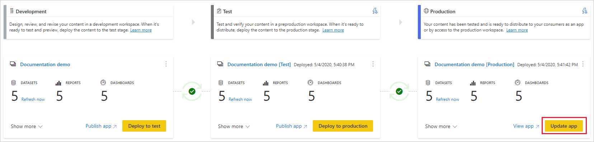

# Grundlegendes zum Bereitstellungsprozess (Vorschau)

Der Bereitstellungsprozess ermöglicht das Klonen von Inhalten von einer Phase in der Pipeline zu einer anderen – typischerweise von der Entwicklung zum Test und vom Test zur Produktion.

Während der Bereitstellung kopiert Power BI die Inhalte von der aktuellen Phase in die Zielphase. Die Verbindungen zwischen den kopierten Elementen werden während des Kopiervorgangs beibehalten. Power BI wendet die konfigurierten Datasetregeln auch auf die aktualisierten Inhalte in der Zielphase an. Das Bereitstellen von Inhalten kann etwas Zeit erfordern – je nachdem, wie viele Elemente bereitgestellt werden. Während dieser Zeit können Sie zu anderen Seiten im Power BI-Portal navigieren, aber Sie können nicht die Inhalte in der Zielphase verwenden.

## Bereitstellen von Inhalten in einer leeren Phase

Wenn Sie Inhalte in einer leeren Phase bereitstellen, werden die Metadaten von Berichten, Dashboards und Datasets im Quellarbeitsbereich für die Bereitstellung in die Zielphase für die Bereitstellung kopiert. In einer Premium-Kapazität wird für die Zielphase der Bereitstellung ein neuer Arbeitsbereich erstellt.

Es gibt zwei Arten, Inhalte von einer Phase in der nächsten Phase bereitzustellen. Sie können die gesamten Inhalte bereitstellen, oder Sie [wählen aus, welche Elemente bereitgestellt werden sollen](deployment-pipelines-get-started.md#selective-deployment).

Sie können Inhalte auch rückwärts bereitstellen – also von einer späteren Phase in der Bereitstellungspipeline in eine frühere Phase.

Nachdem die Bereitstellung abgeschlossen wurde, aktualisieren Sie die Datasets, damit Sie die neu kopierten Inhalte verwenden können. Die Aktualisierung der Datasets ist erforderlich, weil ansonsten keine Daten von einer Phase in eine andere kopiert werden. Informationen dazu, welche Objekteigenschaften während des Bereitstellungsvorgangs kopiert und welche Objekteigenschaften nicht kopiert werden, finden Sie im Abschnitt [Nicht kopierte Elementeigenschaften](#item-properties-copied-during-deployment).

### Hinzufügen eines Arbeitsbereichs für eine Premium-Kapazität

Während der erstmaligen Bereitstellung überprüft die Bereitstellungspipeline, ob Sie über Berechtigungen für eine Premium-Kapazität verfügen.  

Wenn Sie über Berechtigungen für eine Kapazität verfügen, werden die Inhalte des Arbeitsbereichs in die Phase kopiert, in der Sie eine Bereitstellungen durchführen. In der Premium-Kapazität wird außerdem ein neuer Arbeitsbereich für diese Phase erstellt.

Wenn Sie keine Berechtigungen für eine Kapazität besitzen, wird der Arbeitsbereich erstellt, aber die Inhalte werden nicht kopiert. Sie können einen Administrator bitten, Ihren Arbeitsbereich einer Kapazität hinzuzufügen, oder bitten Sie um Zuweisungsberechtigungen für die Kapazität. Später, wenn der Arbeitsbereich einer Kapazität zugewiesen wird, können Sie die Inhalte in diesem Arbeitsbereich bereitstellen.

### Arbeitsbereichs- und Inhaltsbesitz

Der bereitstellende Benutzer wird automatisch zum Besitzer des geklonten Datasets und zum einzigen Administrator des neuen Arbeitsbereichs.

## Bereitstellen von Inhalten in einem vorhandenen Arbeitsbereich

Das Bereitstellen von Inhalten in einer aktiven Produktionspipeline in einer Phase mit vorhandenem Arbeitsbereich umfasst Folgendes:

* Bereitstellen neuer Inhalte als Ergänzung in einer Phase, in der bereits Inhalte vorhanden sind.

* Bereitstellen neuer Inhalte zur Ersetzung alter Inhalte in einer aktuell aktiven Phase.

### Bereitstellungsprozess

Inhalte aus der aktuellen Phase werden in die Zielphase kopiert. Power BI identifiziert vorhandene Inhalte in der Zielphase und überschreibt diese Inhalte. Um zu ermitteln, welche Inhaltselemente überschrieben werden müssen, verwenden Bereitstellungspipelines die Verbindung zwischen dem übergeordneten Element und seinen Klonen. Diese Verbindung wird aufrechterhalten, wenn neue Inhalte erstellt werden. Beim Überschreiben werden nur die Inhalte des Elements überschrieben. ID, URL und Berechtigungen des Elementes bleiben unverändert.

In der Zielphase bleiben [nicht kopierte Elementeigenschaften](deployment-pipelines-process.md#item-properties-that-are-not-copied) unverändert (wie vor der Bereitstellung) erhalten. Neue Inhalte und neue Elemente werden von der aktuellen Phase in die Zielphase kopiert.

### Aktualisieren des Datasets

Daten im Zieldataset werden nach Möglichkeit beibehalten. Wenn keine Änderungen am Dataset vorliegen, werden die Daten wie vor der Bereitstellung beibehalten.

Bei kleinen Änderungen, beispielsweise beim Hinzufügen einer Tabelle oder berechneter Measures, behält Power BI die ursprünglichen Daten bei, und die Aktualisierung wird so optimiert, dass nur die erforderlichen Elemente aktualisiert werden. Bei Breaking Changes in Bezug auf das Schema oder Änderungen an der Datenquellenverbindung ist eine vollständige Aktualisierung erforderlich.

### Anforderungen für die Bereitstellung in einer Phase mit vorhandenem Arbeitsbereich

Solange sich die bereitgestellten Inhalte in einer [Premium-Kapazität](../admin/service-premium-what-is.md) befinden, kann ein Benutzer, der die folgenden Bedingungen erfüllt, diese in einer Phase mit vorhandenem Arbeitsbereich bereitstellen:

* Ein [Pro-Benutzer](../admin/service-admin-purchasing-power-bi-pro.md), der Mitglied beider Arbeitsbereiche in der Quell- und Zielbereitstellungsphase ist.

* Ein Besitzer aller Datasets im Zielarbeitsbereich, der bereitgestellt werden soll.

Weitere Informationen finden Sie im Abschnitt [Berechtigungen](#permissions).

## Bereitgestellte Elemente

Wenn Sie Inhalte von einer Pipelinephase in einer anderen bereitstellen, enthalten die kopierten Inhalte die folgenden Power BI-Elemente:

* Datasets

* Berichte

* Dashboards

### Nicht unterstützte Elemente

Bereitstellungspipelines bieten keine Unterstützung für die folgenden Elemente:

* Datasets, die nicht aus einer PBIX-Datei stammen

* Berichte, die auf nicht unterstützten Datasets basieren

* Der Arbeitsbereich kann keine Vorlagen-App verwenden

* Paginierte Berichte

* Dataflows

* PUSH-Datasets

* Arbeitsmappen

## Während der Bereitstellung kopierte Elementeigenschaften

Während der Bereitstellung werden die folgenden Elementeigenschaften kopiert und überschreiben die Elementeigenschaften in der Zielphase:

* Datenquellen ([Datasetregeln](deployment-pipelines-get-started.md#step-4---create-dataset-rules) werden unterstützt)

* Parameter ([Datasetregeln](deployment-pipelines-get-started.md#step-4---create-dataset-rules) werden unterstützt)

* Berichtsvisuals

* Berichtseiten

* Dashboardkacheln

* Modellmetadaten

* Elementbeziehungen

### Nicht kopierte Elementeigenschaften

Die folgenden Elementeigenschaften werden während der Bereitstellung nicht kopiert:

* Daten – Daten werden nicht kopiert, nur Metadaten

* URL

* ID

* Berechtigungen – für einen Arbeitsbereich oder ein bestimmtes Element

* Arbeitsbereichseinstellungen – Jede Phase umfasst einen eigenen Arbeitsbereich

* App-Inhalte und -Einstellungen – Informationen zum Bereitstellen Ihrer Apps finden Sie hier: [Bereitstellen von Power BI-Apps](#deploying-power-bi-apps)

Die folgenden Elementeigenschaften werden während der Bereitstellung ebenfalls nicht kopiert:

* Rollenzuweisung
    
* Aktualisierungszeitplan
    
* Anmeldeinformationen für die Datenquelle
    
* Einstellungen für die Zwischenspeicherung von Abfragen (kann von der Kapazität geerbt werden)
    
* Endorsement-Einstellungen

## Bereitstellen von Power BI-Apps

[Power BI-Apps](../consumer/end-user-apps.md) sind die empfohlene Methode zum Verteilen von Inhalten an Power BI-Consumer im Free-Tarif. Mithilfe von Bereitstellungspipelines können Sie Power BI-Apps in einer Bereitstellungspipeline verwalten, sodass Sie mehr Kontrolle und Flexibilität im Hinblick auf den Lebenszyklus Ihrer App haben.

Erstellen Sie für jede Phase der Bereitstellungspipeline eine App, sodass Sie jedes App-Update aus der Sicht des Endbenutzers testen können. Mit einer Bereitstellungspipeline können Sie diesen Prozess auf einfache Weise verwalten. Verwenden Sie die Schaltfläche zum Veröffentlichen oder Anzeigen in der Arbeitsbereichskarte, um die App in einer bestimmten Pipelinephase zu veröffentlichen oder anzuzeigen.

In der Produktionsphase öffnet die Schaltfläche für die Hauptaktion in der unteren linken Ecke die Seite zur App-Aktualisierung in Power BI, sodass alle Inhaltsaktualisierungen für App-Benutzer verfügbar werden.

>[!IMPORTANT]
>Der Bereitstellungsprozess umfasst nicht die Aktualisierung der App-Inhalte oder -Einstellungen. Wenn Sie Änderungen an Inhalten oder Einstellungen durchführen möchten, müssen Sie die App in der erforderlichen Pipelinephase manuell aktualisieren.

## Berechtigungen

Pipeline- und Arbeitsbereichsberechtigungen werden separat erteilt und verwaltet. Beispielsweise kann ein Benutzer mit Pipelinezugriff, dem keine Arbeitsbereichsberechtigungen zugewiesen sind, die Pipeline anzeigen und für andere Benutzer freigeben. Dieser Benutzer kann jedoch die Inhalte des Arbeitsbereichs weder in der Pipeline noch auf der Arbeitsbereichsseite anzeigen und kann keine Bereitstellungen durchführen.

### Benutzer mit Pipelinezugriff

Benutzer mit Pipelinezugriff haben die folgenden Berechtigungen:

* Anzeigen der Pipeline
    
* Freigeben der Pipeline für andere Benutzer
    
* Bearbeiten und Löschen der Pipeline

>[!NOTE]
>Der Pipelinezugriff gewährt keine Berechtigungen zum Anzeigen oder Ausführen von Aktionen für die Arbeitsbereichsinhalte.

### Betrachter im Arbeitsbereich

Betrachter im Arbeitsbereich mit *Pipelinezugriff* können außerdem die folgenden Aufgaben ausführen:

* Nutzen von Inhalten

>[!NOTE]
>Betrachter im Arbeitsbereich können nicht auf das Dataset zugreifen oder Arbeitsbereichsinhalte bearbeiten.

### Mitwirkender im Arbeitsbereich

Mitwirkende im Arbeitsbereich mit *Pipelinezugriff* können außerdem die folgenden Aufgaben ausführen:

* Nutzen von Inhalten

* Vergleichen von Phasen

* Anzeigen von Datasets

### Arbeitsbereichsmitglied

Arbeitsbereichsmitglieder mit *Pipelinezugriff* können außerdem die folgenden Aufgaben ausführen:

* Anzeigen von Arbeitsbereichsinhalten
    
* Vergleichen von Phasen
    
* Bereitstellen von Berichten und Dashboards

* Entfernen von Arbeitsbereichen

### Arbeitsbereichsadministrator

Arbeitsbereichsadministrator mit *Pipelinezugriff* können alle Aktionen für *Arbeitsbereichsmitglieder* und außerdem die folgenden Aufgaben ausführen:

* Zuweisen von Arbeitsbereichen

* Entfernen von Arbeitsbereichen

### Datasetbesitzer

Datasetbesitzer, die entweder als Arbeitsbereichsmitglieder oder Administratoren fungieren, können außerdem die folgenden Aufgaben ausführen:

* Aktualisieren von Datasets
    
* Konfigurieren von Regeln

>[!NOTE]
>Dieser Abschnitt beschreibt die Benutzerberechtigungen in Bereitstellungspipelines. Die in diesem Abschnitt aufgeführten Berechtigungen werden in anderen Power BI-Features möglicherweise anders angewendet.

## Einschränkungen

In diesem Abschnitt werden die wichtigsten Einschränkungen in Bereitstellungspipelines aufgeführt.

* Der Arbeitsbereich muss in einer  [Premium-Kapazität](../admin/service-premium-what-is.md) vorliegen.

* Power BI-Elemente wie z. B. Berichte und Dashboards, die Power BI-[Vertraulichkeitsbezeichnungen](../admin/service-security-data-protection-overview.md#sensitivity-labels-in-power-bi) aufweisen, können nicht bereitgestellt werden.

* Datasets, die mit [inkrementellen Aktualisierungen](../admin/service-premium-incremental-refresh.md) konfiguriert sind, können nicht bereitgestellt werden.

* Eine Liste der Einschränkungen für Arbeitsbereiche finden Sie unter [Einschränkungen für die Arbeitsbereichszuweisung](deployment-pipelines-get-started.md#workspace-assignment-limitations).

* Eine Liste der Einschränkungen für Datasetregeln finden Sie unter [Einschränkungen für Datasetregeln](deployment-pipelines-get-started.md#dataset-rule-limitations).

* Eine Liste der nicht unterstützten Elemente finden Sie unter [Nicht unterstützte Elemente](#unsupported-items).

## Nächste Schritte

>[!div class="nextstepaction"]
>[Einführung in Bereitstellungspipelines](deployment-pipelines-overview.md)

>[!div class="nextstepaction"]
>[Bewährte Methoden für Bereitstellungspipelines](deployment-pipelines-best-practices.md)

>[!div class="nextstepaction"]
>[Erste Schritte mit Bereitstellungspipelines](deployment-pipelines-get-started.md)

>[!div class="nextstepaction"]
>[Behandeln von Problemen mit Bereitstellungspipelines](deployment-pipelines-troubleshooting.md)