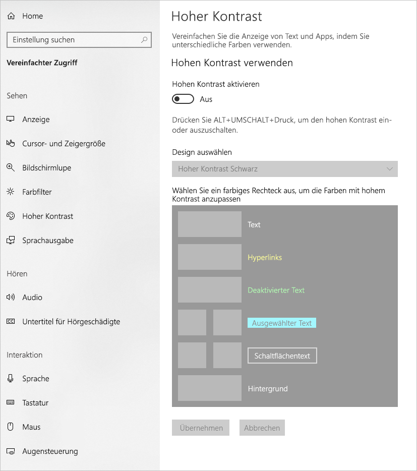
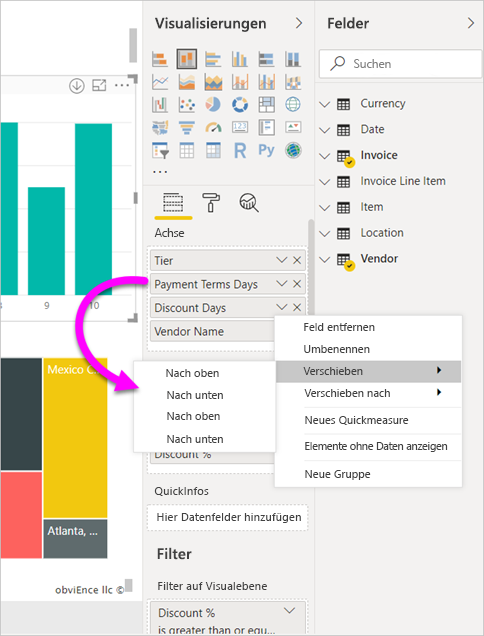
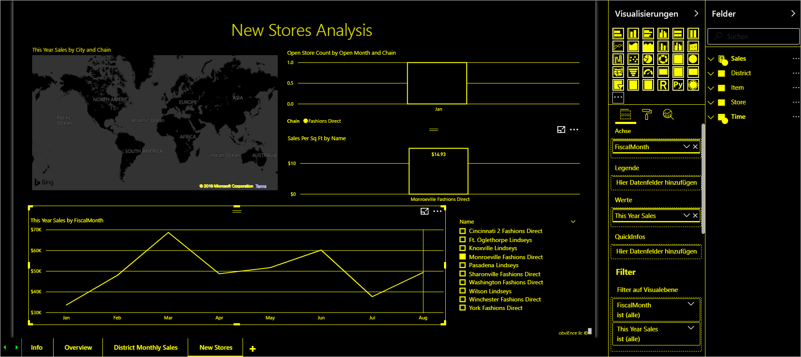
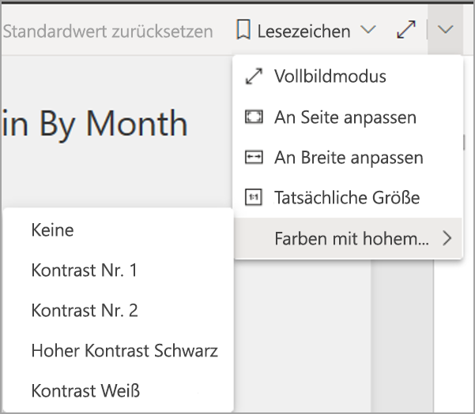
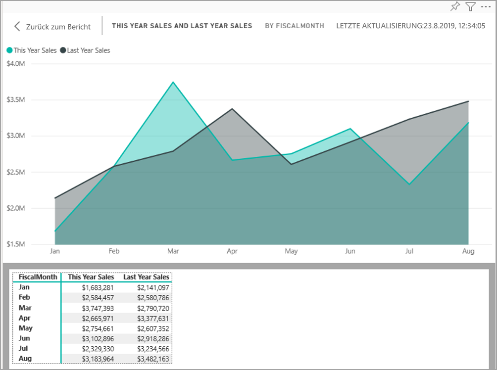
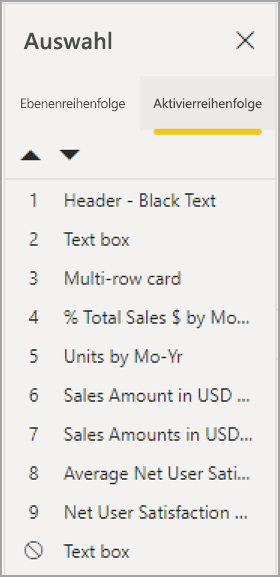
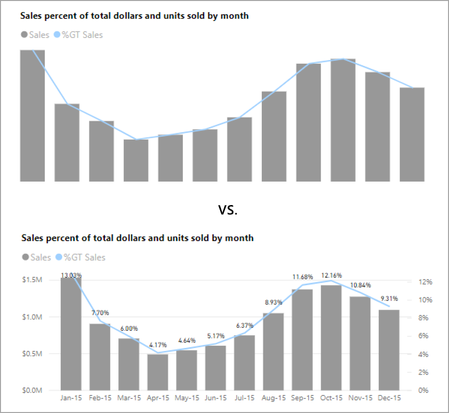
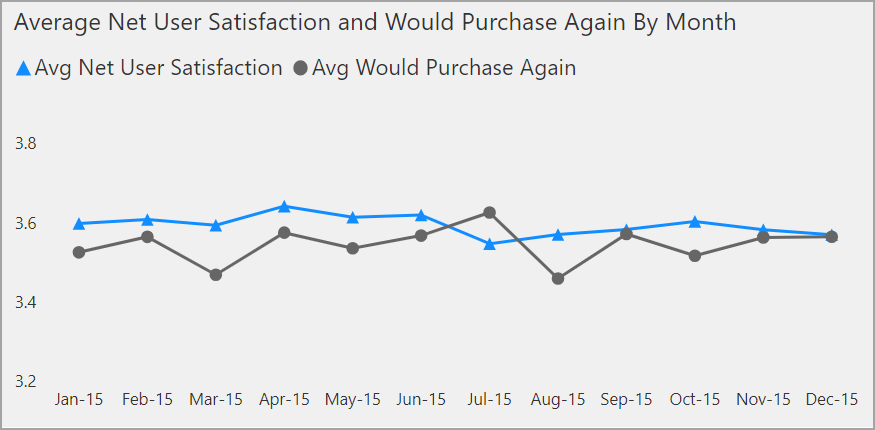
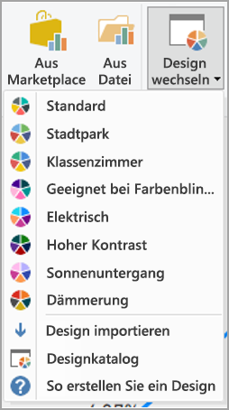

# Entwerfen von Power BI-Berichten für die Barrierefreiheit
Sie können überzeugende Berichte entwerfen und erstellen und gleichzeitig Barrierefreiheit gewährleisten. Immer wenn Sie einen Bericht für eine beliebige Zielgruppe erstellen, sollten Sie den Bericht so erstellen, dass er von so vielen Personen wie möglich genutzt werden kann, ohne dass er für ein besonderes Design angepasst werden muss.

Dieser Artikel beschreibt die Funktionen und Tools für die Erstellung barrierefreier Berichte in Power BI.

Bei Verwendung von Power BI mit einer Sprachausgabe empfiehlt es sich im Allgemeinen, den Überprüfungs- oder Durchsuchungsmodus zu deaktivieren.

Um das Erstellen von Berichten mit Sprachausgabe zu verbessern, ist jetzt ein Kontextmenü verfügbar. Das Menü ermöglicht das Verschieben von Feldern im Bereich in der Liste **Felder**. Das Menü ermöglicht auch das Verschieben des Felds in andere Bereiche, z.B. **Legende** oder **Wert** oder andere.

## Typen von Barrierefreiheitsfunktionen

Power BI bietet die Möglichkeit, barrierefreie Berichte zu erstellen. Als Berichtsautor liegt es jedoch an Ihnen, Barrierefreiheitsfunktionen in Ihre Berichte zu integrieren. Es gibt drei Kategorien von Barrierefreiheitsfunktionen, die in diesem Artikel beschrieben werden:

* Integrierte Barrierefreiheitsfunktionen (ohne erforderliche Konfiguration)
* Integrierte Barrierefreiheitsfunktionen (mit erforderlicher Konfiguration)
* Weitere Tipps und Überlegungen

Diese Kategorien werden in den folgenden Abschnitten erläutert.

## Integrierte Barrierefreiheitsfunktionen

Power BI bietet in das Produkt integrierte Barrierefreiheitsfeatures, die vom Berichtsautor nicht konfiguriert werden müssen. Dabei handelt es sich um die Folgenden:

* Tastaturnavigation
* Kompatibilität mit Sprachausgaben
* Ansicht mit kontrastreichen Farben
* Fokusmodus
* Tabelle „Daten anzeigen“

Es gibt auch Funktionen, die bei der Nutzung von Berichten helfen. Artikel, in denen diese Funktionen beschrieben werden, finden Sie im Abschnitt [Nächste Schritte](#next-steps) am Ende dieses Artikels.

Lassen Sie uns einen Blick auf jede dieser integrierten Barrierefreiheitsfunktionen werfen. 

### Tastaturnavigation

Als Berichtsautor müssen Sie sich keine Gedanken darüber machen, ob Ihre Empfänger mit ihrer Tastatur durch einen Bericht navigieren können. Durch alle Power BI-Visuals kann mit der Tastatur navigiert werden, und die Berichtsnutzer können die Datenpunkte in Visuals durchlaufen, zwischen Seitenregisterkarten umschalten und auf interaktive Funktionen wie Kreuzhervorhebung, Filterung und Datenschnitte zugreifen.

Wenn ein Berichtsnutzer durch einen Bericht navigiert, wird der Fokus gezeigt, um zu signalisieren, wo im Bericht sich der Benutzer befindet. Abhängig vom verwendeten Browser wird der Fokusmodus möglicherweise unterschiedlich angezeigt.

Um auf die am häufigsten verwendeten Tastenkombinationen zuzugreifen, können Sie *?* drücken, woraufhin ein Dialogfeld mit Tastenkombinationen angezeigt wird. Weitere Informationen finden Sie in diesen Artikeln über barrierefreie Nutzungserfahrungen und Tastenkombinationen im Abschnitt [Nächste Schritte](#next-steps) am Ende dieses Artikels.

### Kompatibilität mit Sprachausgaben

Generell ist jedes Objekt in Power BI, für das eine Tastaturnavigation möglich ist, auch mit Sprachausgaben kompatibel. Wenn ein Berichtsnutzer zu einem Visual navigiert, liest die Sprachausgabe den Titel, den Typ des Visuals und einen beliebigen alternativen Text, sofern festgelegt, vor.

### Ansicht mit kontrastreichen Farben

Power BI unterstützt für Berichte hohen Kontrast. Wenn Sie unter Windows einen Modus mit hohem Kontrast verwenden, erkennt Power BI Desktop automatisch, welches Design für hohen Kontrast unter Windows verwendet wird, und wendet diese Einstellungen auf Ihre Berichte an. Der Bericht ist auch nach der Veröffentlichung im Power BI-Dienst oder einem anderen Dienst in diesen kontrastreichen Farben gehalten.

Der Power BI-Dienst versucht auch, die für Windows ausgewählten Kontrasteinstellungen zu erkennen. Wie effektiv und genau diese Erkennung ist, hängt jedoch von dem Browser ab, in dem der Power BI-Dienst verwendet wird. Wenn Sie das Design im Power BI-Dienst manuell festlegen möchten, wählen Sie rechts oben **V > Farben mit hohem Kontrast** und dann das Design aus, das Sie dem Bericht zuweisen möchten.

### Fokusmodus
Wenn ein Berichtsnutzer ein Visual in einem Dashboard betrachtet, kann er es auf seinem Bildschirm vergrößern, indem er zum Kontextmenü des Visuals navigiert und **In Fokusmodus öffnen** auswählt.

### Tabelle „Daten anzeigen“
Berichtsnutzer können die Daten in einem Visual auch in tabellarischer Form anzeigen, indem sie **ALT+UMSCHALT+F11** drücken. Diese Tabelle funktioniert ähnlich wie das Klicken auf **Daten anzeigen** im Kontextmenü des Visuals, zeigt aber eine Tabelle, die für die Sprachausgabe geeignet ist.

## Integrierte Barrierefreiheitsfunktionen mit erforderlicher Konfiguration

Power BI bietet in das Produkt integrierte Barrierefreiheitsfunktionen, die vom Berichtsautor konfiguriert werden müssen.  Dazu gehören:

* Alternativer Text
* Aktivierreihenfolge
* Titel und Beschriftungen
* Marker
* Report themes

## Alternativer Text

Alternativer Text (alternative Textbeschreibungen) wird verwendet, um Aussehen und Funktion von Visuals und Abbildungen auf der Berichtsseite für Benutzer von Sprachausgaben zu beschreiben. Berichtsautoren müssen jedem Objekt, das in einem Bericht aussagekräftige Informationen vermittelt, alternativen Text hinzufügen. Auf diese Weise stellen Sie sicher, dass Personen, die Ihren Bericht verwenden, verstehen, was Sie mit einem Visual kommunizieren möchten, selbst wenn sie das Visual, die Abbildung, die Form oder das Textfeld nicht sehen können. Sie können zu jedem Objekt in einem Power BI Desktop-Bericht alternativen Text angeben, indem Sie das Objekt (wie etwa ein Visual, eine Form usw.) auswählen und im Bereich **Visualisierungen** den Abschnitt **Format** auswählen, **Allgemein** erweitern, dann nach unten scrollen und das Textfeld **Alternativer Text** ausfüllen. Das Textfeld **Alternativer Text** ist auf 250 Zeichen begrenzt.

Der alternative Text muss Informationen über die Erkenntnis enthalten, die der Berichtsnutzer einem Visual entnehmen soll. Da eine Sprachausgabe Titel und Typ eines Visuals vorliest, muss nur eine Beschreibung eingegeben werden. Ein Beispiel von alternativem Text für das folgende Visual kann so lauten: *Nettobenutzerzufriedenheit nach Farbe des verkauften Produkts, weiter aufgegliedert nach Produktklassen.*

Beachten Sie, dass das Vorlesen einer Erkenntnis oder bestimmter Datenpunkte möglicherweise nicht das Beste ist, was in statischen alternativen Text eingefügt werden kann, da solche Daten in Power BI dynamisch sind. Wenn Sie dynamischen alternativen Text verwenden möchten, lesen Sie den nächsten Abschnitt, in dem die bedingte Formatierung von alternativem Text beschrieben wird.

### Bedingte Formatierung von alternativem Text

Ein Merkmal, das Power BI so überzeugend macht, sind seine dynamischen Daten. Sie können DAX-Measures und bedingte Formatierung verwenden, um dynamischen alternativen Text zu erstellen. Sprachausgaben sind dann in der Lage, Werte vorzulesen, die spezifisch für die Daten sind, die ein Berichtsnutzer betrachtet.

### Aktivierreihenfolge
Wenn Sie die Aktivierreihenfolge festlegen, können Tastaturbenutzer durch Ihren Bericht in einer Reihenfolge navigieren, die der Art und Weise entspricht, in der Benutzer die Visuals des Berichts visuell verarbeiten. Wenn Sie dekorative Formen und Abbildungen in Ihren Bericht aufnehmen, sollten Sie diese aus der Aktivierreihenfolge entfernen. 

Zum Festlegen der Aktivierreihenfolge wählen Sie auf dem Menüband die Registerkarte **Ansicht** und die Schaltfläche **Auswahlbereich** aus, um den Bereich „Auswahl“ anzuzeigen.

Wenn Sie im Bereich **Auswahl** die Option **Aktivierreihenfolge** auswählen, wird die aktuelle Aktivierreihenfolge für Ihren Bericht angezeigt. Sie können ein Objekt auswählen und es dann mit der NACH-OBEN-TASTE und NACH-UNTEN-TASTE in der Hierarchie verschieben. Oder Sie können ein Objekt mit der Maus auswählen und es an die gewünschte Position in der Liste ziehen. Wenn Sie auf die Nummer neben einem Objekt klicken, wird das Objekt aus der Aktivierreihenfolge ausgeblendet.

### Titel und Beschriftungen
Titel von Visuals und Berichtsseiten sind wichtige Barrierefreiheitsfunktionen, an denen sich der Berichtsnutzer orientiert. Vermeiden Sie in Ihren Berichtstiteln Akronyme oder Fachbegriffe. Wenn Sie den Bericht an einen neuen Benutzer oder eine Person außerhalb Ihres Unternehmens weitergeben, wissen diese möglicherweise nicht, was Ihre Begriffe oder Akronyme bedeuten. Die folgende Abbildung zeigt (links) ein Visual mit einem Akronym im Titel und (rechts) das Visual mit einem klareren Titel.

Stellen Sie innerhalb eines Visuals sicher, dass alle Titel, Achsenbeschriftungen, Legendenwerte und Datenbeschriftungen leicht lesbar und verständlich sind. Vergleichen Sie die folgenden Abbildungen, bei denen das erste Bild nur wenige Zahlen oder Beschreibungen der Daten enthält, während das zweite viele enthält.

Bei Datenbeschriftungen können Sie sogar die Beschriftungen für jede Serie in Ihrem Visual ein- oder ausschalten oder sie über oder unter einer Serie positionieren. Wenngleich Power BI sein Bestes tut, um Datenbeschriftungen über oder unter einer Linie zu platzieren, kann es manchmal zu Unklarheiten kommen. Im folgenden Visual sind die Datenbeschriftungen unübersichtlich und nicht leicht lesbar.

Die Positionierung Ihrer Datenbeschriftungen über oder unter Ihrer Serie kann hilfreich sein, insbesondere wenn Sie ein Liniendiagramm mit mehreren Linien verwenden. Nach einigen Anpassungen sehen die Datenbeschriftungen nun viel besser aus.

### Marker

Es ist eine bewährte Methode, Farben (einschließlich bedingter Formatierung) als einzige Möglichkeit der Informationsvermittlung zu vermeiden. Stattdessen können Sie Marker verwenden, um unterschiedliche Serien zu vermitteln.

Aktivieren Sie Marker für Visuals des Typs „Liniendiagramm“, „Flächendiagramm“ und „Kombinationsdiagramm“, „Punktdiagramm“ und „Blasendiagramm“, und verwenden Sie für jede Linie eine andere Markerform.

Um Marker zu aktivieren, wählen Sie im Bereich „Visualisierungen“ den Abschnitt „Format“ aus. Erweitern Sie den Abschnitt **Formen**, scrollen Sie dann nach unten bis zum Umschalter für **Marker anzeigen**, und legen Sie ihn auf **Ein** fest (siehe die folgende Abbildung). 

Sie können auch **Serie anpassen** verwenden und im Dropdownfeld im Abschnitt „Formen“ den Namen jeder Linie (oder Fläche bei einem Flächendiagramm) auszuwählen. Unterhalb des Dropdownfelds können Sie anschließend viele Aspekte des für die ausgewählte Linie verwendeten Markers anpassen, einschließlich dessen Form, Farbe und Größe.

Obwohl wir Berichtsautoren empfehlen, Datenbeschriftungen und Marker einzuschalten, kann das Einschalten aller für jedes Visual störend wirken und Ihren Bericht weniger barrierefrei machen. In der folgenden Abbildung können Sie ein Visual, bei dem Datenbeschriftungen und Marker eingeschaltet sind, mit einer besser verständlichen Version dank ausgeblendeter Datenbeschriftungen vergleichen.

Wenn Sie sich nicht sicher sind, ob Ihr Visual oder Ihr Bericht zu überladen ist, testen Sie dies mithilfe eines [Schieltests](https://chrome.google.com/webstore/detail/the-squint-test/gppnipfbappicilfniaimcnagbpfflpg).  Wenn Ihre Augen mehr auf die Datenbeschriftungen als auf die Datenpunkte gerichtet sind, schalten Sie Ihre Datenbeschriftungen aus.

### Designs, Kontrast und für Farbenblinde geeignete Farben

Achten Sie darauf, dass Ihre Berichte einen ausreichenden Kontrast zwischen Text und Hintergrundfarben aufweisen. Im WCAG 2.1-Erfolgskriterium 1.4.3 wird dargelegt, dass Text und Hintergrundfarbe ein Kontrastverhältnis von mindestens 4,5:1 aufweisen sollten. Es gibt verschiedene Tools, die Sie zum Überprüfen der Farben in Ihrem Bericht verwenden können, z. B. [Color Contrast Analyzer](https://developer.paciellogroup.com/resources/contrastanalyser/), [WebAIM](https://webaim.org/resources/contrastchecker/) und [Accessible Colors](https://accessible-colors.com/).

Sie sollten auch bedenken, dass einige Berichtsbetrachter möglicherweise Farbsehstörungen haben. Tools wie [Coblis](https://www.color-blindness.com/coblis-color-blindness-simulator/) und [Vischeck](https://www.vischeck.com/vischeck/vischeckImage.php) simulieren, was Berichtsbetrachter mit unterschiedlichen Farbsehstörungen sehen.  Durch den Einsatz von weniger Farben oder einer monochromen Palette in Ihrem Bericht können Sie verhindern, dass nicht barrierefreie Berichte erstellt werden.

Bestimmte Farbkombinationen sind für Benutzer mit Farbsehstörungen besonders schwer zu unterscheiden. Dazu gehören die folgenden Kombinationen: 

* Grün und rot
* Grün und braun
* Blau und lila
* Grün und blau
* Hellgrün und gelb
* Blau und grau
* Grün und grau
* Grün und schwarz

Vermeiden Sie, diese Farben gemeinsam in einem Diagramm oder auf derselben Berichtsseite zu verwenden. Power BI bietet integrierte Designs, um Ihren Bericht barrierefreier zu gestalten. Es ist jedoch empfehlenswert, Ihren Bericht mit einigen der in diesem Artikel vorgeschlagenen zusätzlichen Tools zu überprüfen.

## Tipps und Überlegungen
Dieser Abschnitt enthält Anleitungen, Tipps und Überlegungen, die Sie bei der Erstellung von Berichten mit Blick auf Barrierefreiheit beachten sollten.

### Verstehen der Wünsche Ihrer Zielgruppe

Das Erstellen eines Berichts ist ein iterativer Prozess. Bevor Sie damit beginnen, Visuals auf der Seite zu platzieren, sprechen Sie mit Berichtsnutzern, um besser zu verstehen, welche Informationen sie von Ihrem Bericht erwarten und wie sie ihn sich vorstellen.  

Die Schaffung von Barrierefreiheit sollte Teil dieses Prozesses sein. Sie werden vielleicht feststellen, dass Ihre Vorstellung nicht der Ihrer Berichtsempfänger entspricht. Sobald Sie einen ersten Entwurf Ihres Berichts erstellt haben, zeigen Sie ihn einem Berichtsempfänger, und holen Sie mehr Feedback ein. Als Berichtsautor kann das Einholen von Feedback dazu beitragen, eine spätere Flut von Änderungswünschen unzufriedener Berichtsnutzer zu vermeiden.

### Bericht einfach und konsistent halten

Halten Sie Ihren Bericht so einfach wie möglich. Häufig wird versucht, zu viel in ein einziges Visual zu packen. Oftmals ist der Inhalt nach Aufteilung auf mehrere Visuals übersichtlicher und verständlicher. Erwägen Sie daher den Einsatz mehrerer Visuals, wenn sie verschiedene Facetten der Daten zeigen. Verwenden Sie Filter oder visuelle Interaktionen, um ein reichhaltiges Erlebnis zu schaffen. Beschränken Sie gleichzeitig die Anzahl der Visuals auf einer Seite auf ein Minimum. Versuchen Sie, unnötige Redundanzen und Unübersichtlichkeit auf Seiten zu vermeiden. Sie benötigen keine zwei Visuals, die das Gleiche zeigen. Berichtsempfänger können sich von all den Informationen in zu vielen Visuals überfordert fühlen oder durch eine begrenzte Aufmerksamkeitsspanne abgelenkt werden. Dies erleichtert nicht nur die Nutzung Ihres Berichts. Zu viele Visuals auf einer Seite können auch die Leistung Ihres Berichts beeinträchtigen.

Halten Sie Ihren Bericht konsistent, indem Sie für die Visuals im gesamten Bericht die gleiche Schriftfarbe und den gleichen Schriftschnitt wählen. Wählen Sie für alle Titel von Visuals sowie für Datenbeschriftungen und Achsentitel die gleiche Schriftgröße. Wenn Sie auf mehreren Berichtsseiten Datenschnitte verwenden, halten Sie diese auf jeder Seite des Berichts an derselben Position.

### Tests für Menschen mit Sehbehinderungen

Ein schneller Weg zum Testen, wie ein Bericht für Benutzer mit Sehbehinderung aussieht, besteht darin, die Helligkeit Ihres Bildschirms oder Ihres Mobilgeräts zu verringern.  Es gibt Browser-Add-Ons, mit deren Hilfe Sie einen Schieltest durchführen können.

## Checkliste für die Barrierefreiheit von Berichten

Zusätzlich zu Tools und Funktionen für Barrierefreiheit bietet Power BI die folgende Checkliste, die Sie bei der Erstellung von Berichten einsetzen können. Diese Checkliste hilft vor der Veröffentlichung sicherzustellen, dass Ihre Berichte barrierefrei und für die größtmögliche Zielgruppe zugänglich sind. 

### Alle Visuals

* Stellen Sie sicher, dass der Farbkontrast zwischen Titel, Achsenbeschriftung sowie Datenbeschriftungstext und Hintergrund mindestens 4,5:1 beträgt.
* Vermeiden Sie es, Farben als einziges Mittel zur Informationsvermittlung einzusetzen. Verwenden Sie Text oder Symbole, um Farben zu ergänzen oder zu ersetzen.
* Vermeiden Sie unnötige Fachbegriffe oder Akronyme.
* Stellen Sie sicher, dass allen nicht dekorativen Visuals auf der Seite **alternativer Text** hinzugefügt wird.
* Überprüfen Sie, ob Ihre Berichtsseite für Benutzer mit Farbsehstörungen funktioniert.

### Datenschnitte
* Wenn es auf Ihren Berichtsseiten eine Sammlung mehrerer Datenschnitte gibt, stellen Sie sicher, dass Ihr Design seitenübergreifend einheitlich ist. Verwenden Sie möglichst die gleiche Schriftart, Farbe und räumliche Position.

### Textfeld
* Stellen Sie sicher, dass der Farbkontrast zwischen Schrift und Hintergrund mindestens 4,5:1 ist.
* Fügen Sie dem Feld **Alternativer Text** Textinhalte hinzu, die von Sprachausgaben vorgelesen werden können.

### Visualinteraktionen
* Sind wichtige Informationen nur über eine Interaktion zugänglich? Falls ja, ordnen Sie Ihre Visuals so an, dass sie vorgefiltert werden, um die wesentliche Schlussfolgerung deutlicher zu machen.
* Verwenden Sie Textmarken für die Navigation? Versuchen Sie, durch Ihren Bericht mit einer Tastatur zu navigieren, um sicherzustellen, dass das Erlebnis für Benutzer, die nur die Tastatur bedienen, akzeptabel ist.

### Sortierreihenfolge
* Haben Sie die Sortierreihenfolge der einzelnen Visuals auf der Seite gezielt festgelegt? Die barrierefreie Tabelle **Daten anzeigen** zeigt die Daten in der Sortierreihenfolge, die Sie für das Visual festgelegt haben.

### QuickInfos
* Verwenden Sie keine QuickInfos, um wichtige Informationen zu vermitteln. Benutzer, die motorische Probleme haben oder keine Maus verwenden, haben Schwierigkeiten beim Zugriff darauf.
* Fügen Sie den Diagrammen QuickInfos als ergänzende Informationen hinzu. Sie werden in der barrierefreien Tabelle **Daten anzeigen** für jedes Visual hinzugefügt.

### Video
* Vermeiden Sie Videos, die automatisch starten, wenn die Seite gerendert wird.
* Fügen Sie Ihrem Video Untertitel für Hörgeschädigte hinzu, oder stellen Sie ein Transkript bereit.

### Audio
* Vermeiden Sie Audio, das automatisch startet, wenn die Seite gerendert wird.
* Stellen Sie für Audioinformationen ein Transkript bereit.

### Formen
* Stellen Sie sicher, dass alle dekorativen Formen in der Registerkartenreihenfolge als ausgeblendet markiert sind, damit sie nicht von einer Sprachausgabe vorgelesen werden.
* Achten Sie darauf, dekorative Formen so zu verwenden, dass Sie nicht störend wirken.
* Wenn Sie Formen zum Hervorheben von Datenpunkten verwenden, geben Sie **alternativen Text** ein, um zu erklären, was hervorgehoben wird.

### Bilder
* Wenn Sie Bilder zum Hervorheben von Datenpunkten verwenden, geben Sie **alternativen Text** ein, um zu erklären, was hervorgehoben wird.
* Stellen Sie sicher, dass alle dekorativen Bilder in der Registerkartenreihenfolge als ausgeblendet markiert sind, damit sie nicht von einer Sprachausgabe vorgelesen werden.
* Achten Sie darauf, dekorative Bilder so zu verwenden, dass Sie nicht störend wirken.

### Power BI-Visuals
* Prüfen Sie, ob in der barrierefreien Tabelle **Daten anzeigen** Power BI-Visuals enthalten sind. Wenn die gezeigten Informationen nicht ausreichen, suchen Sie nach einem anderen Visual.
* Wenn Sie das benutzerdefinierte Visual *Wiedergabeachse* verwenden, stellen Sie sicher, dass es nicht automatisch wiedergegeben wird. Machen Sie deutlich, dass der Benutzer die Wiedergabe-/Pause-Taste drücken muss, um die sich ändernden Werte zu starten/stoppen.

### In allen Visuals auf der Seite
* Legen Sie die Aktivierreihenfolge fest. Deaktivieren Sie die Aktivierreihenfolge für dekorative Elemente (markieren Sie das jeweilige Element als ausgeblendet).

## Überlegungen und Einschränkungen
Es gibt einige bekannte Probleme und Einschränkungen in Bezug auf die Barrierefreiheitsfeatures. Beschreibungen dieser Probleme und Einschränkungen finden Sie in der folgenden Liste:

* Wenn Sie die Sprachausgabe mit **Power BI Desktop** verwenden, erzielen Sie die bestmögliche Leistung, wenn Sie die Sprachausgabe starten, bevor Sie Dateien in **Power BI Desktop** öffnen.

## Nächste Schritte

Die Sammlung von Artikeln zur Barrierefreiheit in Power BI besteht aus den folgenden Artikeln:

* [Übersicht über die Barrierefreiheit in Power BI](desktop-accessibility-overview.md) 
* [Nutzen von Power BI-Berichten mit Barrierefreiheitstools](desktop-accessibility-consuming-tools.md)
* [Erstellen von Power BI-Berichten mit Barrierefreiheitstools](desktop-accessibility-creating-tools.md)
* [Tastenkombinationen für Barrierefreiheit für Power BI-Berichte](desktop-accessibility-keyboard-shortcuts.md)
* [Checkliste für die Barrierefreiheit von Berichten](#report-accessibility-checklist)
