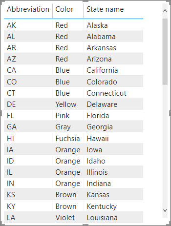
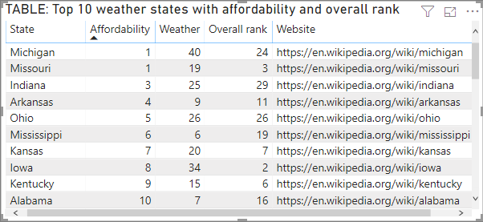

# Verwenden bedingter Formatierungen in Tabellen 

Mit der bedingten Formatierung für Tabellen in Power BI Desktop können Sie benutzerdefinierte Zellfarben, einschließlich Farbverläufen, basierend auf Feldwerten angeben. Sie können Zellwerte auch mit Datenbalken oder KPI-Symbolen oder als aktive Weblinks darstellen. Sie können bedingte Formatierungen auf jeden Text oder jedes Datenfeld anwenden, solange Sie die Formatierung auf ein Feld mit einem numerischen Namen, Farbnamen oder Hexadezimalcode oder mit Web-URL-Werten basieren. 

Wählen Sie zum Anwenden der bedingten Formatierung eine **Tabellen**- oder **Matrixvisualisierung** in Power BI Desktop aus. Klicken Sie im Bereich **Felder** des Fensters **Visualisierungen** mit der rechten Maustaste, oder wählen Sie den Abwärtspfeil neben dem Feld in **Werte**, das Sie formatieren möchten. Wählen Sie **Bedingte Formatierung** und dann den Typ der anzuwendenden Formatierung aus.

> [!NOTE]
> Die bedingte Formatierung setzt jede benutzerdefinierte Hintergrund- oder Schriftfarbe außer Kraft, die Sie auf die bedingt formatierte Zelle anwenden.

Wenn Sie eine bedingte Formatierung aus einer Visualisierung entfernen möchten, wählen Sie **Bedingte Formatierung entfernen** aus dem Dropdownmenü des Felds, und wählen Sie dann den Typ der zu entfernenden Formatierung aus.

Die folgenden Abschnitte beschreiben die einzelnen Optionen für die bedingte Formatierung. Sie können mehr als eine Option in einer einzigen Tabellenspalte kombinieren.

## Formatieren von Hintergrund- oder Schriftfarbe

Wählen Sie zum Formatieren der Hintergrund- oder Schriftfarbe der Zelle die Option **Bedingte Formatierung** für ein Feld aus, und wählen Sie dann entweder **Hintergrundfarbe** oder **Schriftfarbe** aus dem Dropdownmenü aus. 

Das Dialogfeld **Hintergrundfarbe** oder **Schriftfarbe** wird geöffnet, wobei der Name des zu formatierenden Felds im Titel steht. Nach der Auswahl der bedingten Formatierungsoptionen wählen Sie **OK** aus. 

Die Optionen **Hintergrundfarbe** und **Schriftfarbe** sind dieselben, beeinflussen jedoch die Hintergrundfarbe bzw. die Schriftfarbe der Zelle. Sie können dieselbe oder eine andere bedingte Formatierung auf die Schriftfarbe und die Hintergrundfarbe eines Felds anwenden. Wenn Sie für ein Feld eine gleiche Farbe für Schrift und Hintergrund auswählen, wird die Schrift in den Hintergrund eingeblendet, sodass die Tabellenspalte nur die Farben anzeigt.

## Farbe nach Farbskala

Um den Zellhintergrund oder die Schriftfarbe nach einer Farbskala zu formatieren, wählen Sie im Feld **Formatieren nach** des Dialogfelds **Hintergrundfarbe** oder **Schriftfarbe** die Option **Farbskala** aus. Wählen Sie unter **Basierend auf Feld** das Feld aus, auf dem die Formatierung basieren soll. Sie können die Formatierung auf dem aktuellen Feld oder auf einem beliebigen Feld in Ihrem Modell basieren, das numerische oder Farbdaten enthält. 

Geben Sie unter **Zusammenfassung** den Aggregationstyp an, den Sie für das ausgewählte Feld verwenden möchten. Wählen Sie unter **Standardformatierung** eine Formatierung aus, die auf leere Werte angewendet werden soll. 

Wählen Sie unter **Minimum** und **Maximum** aus, ob das Farbschema auf den niedrigsten und höchsten Feldwert oder auf von Ihnen eingegebene benutzerdefinierte Werte angewendet werden soll. Wählen Sie aus der Dropdownliste die Farbmuster aus, die Sie auf die minimalen und maximalen Werte anwenden möchten. Aktivieren Sie das Kontrollkästchen **Abweichend**, um auch einen **Mittenwert** und eine Farbe anzugeben. 

Eine Beispieltabelle mit der Farbskala-Hintergrundformatierung in der Spalte **Affordability** (Erschwinglichkeit) sieht folgendermaßen aus:

Die Beispieltabelle mit der Farbskala-Schriftformatierung in der Spalte **Affordability** (Erschwinglichkeit) sieht folgendermaßen aus:

## Nach Regeln färben

Um den Zellhintergrund oder die Schriftfarbe nach Regeln zu formatieren, wählen Sie im Feld **Formatieren nach** des Dialogfelds **Hintergrundfarbe** oder **Schriftfarbe** die Option **Regeln** aus. Auch hier zeigt **Basierend auf Feld** das Feld an, auf dem die Formatierung basiert, und **Zusammenfassung** zeigt den Aggregationstyp für das Feld an. 

Geben Sie unter **Regeln** einen oder mehrere Wertebereiche ein, und stellen Sie für jeden einzelnen eine Farbe ein. Jeder Wertebereich verfügt über eine *Wenn Wert*-Bedingung, eine *Und*-Wertbedingung und eine Farbe. Zellenhintergründe oder Schriften in den einzelnen Wertebereichen erhalten die angegebene Farbe. Das folgende Beispiel hat drei Regeln:

Eine Beispieltabelle mit der regelbasierten Hintergrundfarbformatierung in der Spalte **Affordability** (Erschwinglichkeit) sieht folgendermaßen aus:

## Farbe nach Farbwerten

Wenn Sie ein Feld oder Measure mit Farbnamen- oder Hexadezimalwertdaten besitzen, können Sie die bedingte Formatierung verwenden, um diese Farben automatisch auf die Hintergrund- oder Schriftfarbe einer Spalte anzuwenden. Sie können auch eine benutzerdefinierte Logik verwenden, um Farben auf die Schrift oder den Hintergrund anzuwenden.

Das Feld kann alle in der CSS-Farbspezifikation unter [https://www.w3.org/TR/css-color-3/](https://www.w3.org/TR/css-color-3/) aufgeführten Farbwerte verwenden. Diese Farbwerte können Folgendes enthalten:
- 3-, 6- oder 8-stellige Hexadezimalcodes, z. B. #3E4AFF. Vergessen Sie nicht, das #-Symbol am Anfang des Codes einzuschließen. 
- RGB- oder RGBA-Werte, z. B. RGBA(234, 234, 234, 0.5).
- HSL- oder HSLA-Werte, z. B. HSLA(123, 75%, 75%, 0.5).
- Farbnamen, z. B. Green, SkyBlue, PeachPuff (Grün, Himmelblau, Pfirsichhauch). 

In der folgenden Tabelle ist jedem Bundesstaat ein Farbname zugeordnet: 

Um die Spalte **Farbe** auf der Grundlage ihrer Feldwerte zu formatieren, wählen Sie **Bedingte Formatierung** für das Feld **Farbe** und dann **Hintergrundfarbe** oder **Schriftfarbe** aus. 

Wählen Sie im Dialogfeld **Hintergrundfarbe** oder **Schriftfarbe** die Option **Feldwert** aus dem Dropdownfeld **Formatieren nach** aus.

Eine Beispieltabelle mit farbfeldwertbasierter Formatierung der **Hintergrundfarbe** auf das Feld **Farbe** sieht folgendermaßen aus:

Wenn Sie auch den **Feldwert** zur Formatierung der Spalte **Schriftfarbe** verwenden, ist das Ergebnis eine Volltonfarbe in der Spalte **Farbe**:

## Farbe basierend auf einer Berechnung

Sie können eine Berechnung erstellen, die verschiedene Werte auf Grundlage der von Ihnen ausgewählten Bedingungen der Geschäftslogik ausgibt. Die Erstellung einer Formel ist in der Regel schneller als die Erstellung mehrerer Regeln im Dialogfeld für bedingte Formatierung. 

Die folgende Formel wendet z. B. hexadezimale Farbwerte auf eine neue Spalte **Affordability rank** (Erschwinglichkeitsrang) an, und zwar basierend auf den vorhandenen Werten in der Spalte **Affordability** (Erschwinglichkeit):

Wählen Sie zum Anwenden der Farben die bedingte Formatierung **Hintergrundfarbe** oder **Schriftfarbe** für die Spalte **Affordability** (Erschwinglichkeit) aus, und basieren Sie die Formatierung auf dem **Feldwert** der Spalte **Affordability rank** (Erschwinglichkeitsrang). 

Die Beispieltabelle mit der Hintergrundfarbe **Affordability** (Erschwinglichkeit) basierend auf dem berechneten **Affordability rank** (Erschwinglichkeitsrang) sieht folgendermaßen aus:

Sie können viele weitere Variationen erstellen, indem Sie einfach Ihre Vorstellungskraft und einige Berechnungen verwenden.

## Hinzufügen von Datenbalken

Um Datenbalken basierend auf Zellwerten anzuzeigen, wählen Sie **Bedingte Formatierung** für das Feld **Affordability** (Erschwinglichkeit) aus, und wählen Sie dann **Datenbalken** aus dem Dropdownmenü aus. 

Im Dialogfeld **Datenbalken** ist die Option **Nur Balken anzeigen** standardmäßig deaktiviert, sodass die Tabellenzellen sowohl die Balken als auch die tatsächlichen Werte anzeigen. Aktivieren Sie das Kontrollkästchen **Nur Balken anzeigen**, um nur die Datenbalken anzuzeigen.

Sie können Werte für **Minimum** und **Maximum**, Farben und Richtung des Datenbalkens und die Farbe der Achse angeben. 

Mit den auf die Spalte **Affordability** (Erschwinglichkeit) angewandten Datenbalken sieht die Beispieltabelle wie folgt aus:

## Hinzufügen von Symbolen

Wählen Sie zum Anzeigen von Symbolen, die auf Zellwerten basieren, **Bedingte Formatierung** für das Feld und dann **Symbole** aus dem Dropdownmenü aus. 

Wählen Sie im Dialogfeld **Symbole** unter **Formatieren nach** entweder **Regeln** oder **Feldwert** aus. 

Wählen Sie zum Formatieren nach Regeln eine **Basierend auf Feld**-Methode, eine **Zusammenfassung**-Methode, ein **Symbollayout**, eine **Symbolausrichtung**, das Symbol **Format** und mindestens eine **Regel**. Geben Sie unter **Regeln** eine oder mehrere Regeln mit einer *Wenn Wert*-Bedingung und einer *Und*-Wertbedingung ein, und wählen Sie ein Symbol aus, das auf jede Regel angewendet werden soll. 

Wählen Sie zum Formatieren nach Feldwerten eine **Basierend auf Feld**-Methode, eine **Zusammenfassung**-Methode, ein **Symbollayout** und eine **Symbolausrichtung** aus.

Das folgende Beispiel fügt Symbole auf der Grundlage von drei Regeln hinzu:

Wählen Sie **OK** aus. Mit den auf die Spalte **Affordability** (Erschwinglichkeit) nach Regeln angewandten Symbolen sieht die Beispieltabelle wie folgt aus:

## Formatieren als Web-URLs

Wenn Sie über eine Spalte oder ein Measure verfügen, das Website-URLs enthält, können Sie diese URLs mithilfe der bedingten Formatierung als aktive Links auf Felder anwenden. Die folgende Tabelle hat z. B. eine Spalte **Website** mit Website-URLs für jeden Bundesstaat:

Wählen Sie zur Anzeige der Namen der einzelnen Bundesstaatsnamen als Live-Link zu ihrer Website die Option **Bedingte Formatierung** für das Feld **State** (Bundesstaat) und anschließend **Web-URL** aus. Wählen Sie im Dialogfeld **Web-URL** unter **Basierend auf Feld** die Option **Website** und anschließend die Option **OK** aus. 

Mit der Formatierung **Web-URL**, die auf das Feld **State** (Bundesstaat) angewendet wird, ist jeder Bundesstaatsname ein aktiver Link zu seiner Website. In der folgenden Beispieltabelle wird die Formatierung **Web-URL** auf die Spalte **State** (Bundesstaat) und die bedingte Formatierung **Datenbalken** und **Hintergrundformatierung** auf die Spalte **Affordability** (Erschwinglichkeit) angewendet. 

## Gesamtsummen und Teilergebnisse

Ab dem April 2020-Release können Sie sowohl in Tabellen- als auch Matrixvisuals Regeln für bedingte Formatierung auf Gesamtsummen und Teilergebnisse anwenden. 

Sie können die Regeln für bedingte Formatierung anwenden, indem Sie die Dropdownliste **Anwenden auf** in der bedingten Formatierung verwenden (siehe die folgende Abbildung).

Sie müssen die Schwellenwerte und Bereiche für die Regeln für bedingte Formatierung manuell festlegen. Für eine Matrix bezieht sich **Werte** auf die niedrigste sichtbare Ebene der Matrixhierarchie.

## Überlegungen und Einschränkungen
Bei der Anwendung von bedingter Formatierung auf Tabellen sollten Sie folgende Überlegungen berücksichtigen:

- Die bedingte Formatierung bezieht sich nur auf die Werte von visuellen Tabellen- oder Matrixelementen und gilt nicht für Zwischensummen, Gesamtsummen oder die Zeile **Summe**. 
- Alle Tabellen, die keine Gruppierung aufweisen, werden als einzelne Zeile angezeigt, die keine bedingte Formatierung unterstützt.
- Sie können keine Farbverlaufsformatierung mit automatischen Maximal-/Minimalwerten oder regelbasierte Formatierung mit Prozentregeln anwenden, wenn Ihre Daten *NaN*-Werte enthalten. NaN bedeutet „Not a Number“, was in der Regel durch einen Fehler aufgrund einer Division durch Null verursacht wird. Mit der [Divide () DAX-Funktion](https://docs.microsoft.com/dax/divide-function-dax) können Sie diese Fehler vermeiden.
- Die bedingte Formatierung erfordert eine Aggregation oder ein Measure, das auf den Wert angewendet wird. Deshalb wird im Beispiel **Farbe nach Wert** „Erster“ oder „Letzter“ angezeigt. Wenn Sie Ihren Bericht für einen mehrdimensionalen Cube des Analysedienstes erstellen, können Sie kein Attribut für die bedingte Formatierung verwenden, es sei denn, der Cubebesitzer hat ein Measure erstellt, das den Wert bereitstellt.

## Nächste Schritte

Weitere Informationen zur Farbformatierung finden Sie unter [Tipps und Tricks zur Farbformatierung in Power BI](../visuals/service-tips-and-tricks-for-color-formatting.md).  
