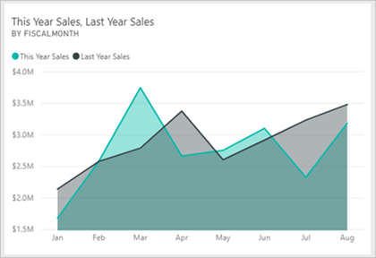
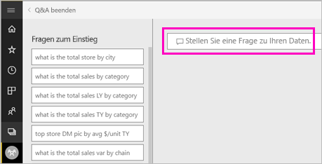
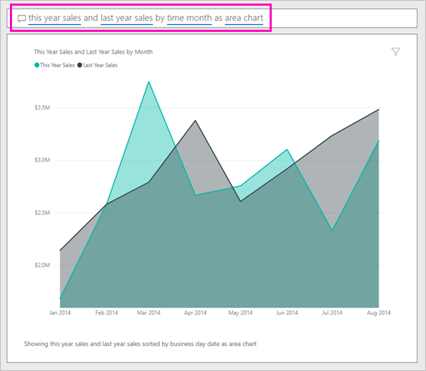

# Erstellen eines Visuals mit Power BI Q&A

Manchmal ist die schnellste Möglichkeit, um eine Antwort auf Basis Ihrer Daten zu erhalten, eine Frage in natürlicher Sprache zu stellen.  In diesem Artikel lernen Sie zwei verschiedenen Methoden zum Erstellen der gleichen Visualisierung kennen: mithilfe einer Frage mit Q&A und in einem Bericht. Wir verwenden den Power BI-Dienst, um das Visual im Bericht zu erstellen, der Vorgang ist jedoch mit Power BI Desktop fast der gleiche.

Zum Durchführen der Schritte müssen Sie einen Bericht verwenden, den Sie bearbeiten können. Deshalb verwenden wir eines der für Power BI verfügbaren Beispiele.

## Erstellen eines Visuals mit Q&A

Wie gehen Sie beim Erstellen des Liniendiagramms mithilfe von Q&A vor?

1. Wählen Sie aus dem Power BI-Arbeitsbereich **Daten abrufen** \> **Beispiele** \> **Retail Analysis Sample** (Analysebeispiel für Einzelhandel) > **Verbinden** aus.

1. Öffnen Sie das Dashboard mit dem Analysebeispiel für den Einzelhandel, und platzieren Sie den Cursor im Q&A-Feld **Stellen Sie eine Frage zu Ihren Daten**.

    

2. Geben Sie in das Q&A-Feld eine Frage wie die folgende ein:
   
    **this year sales and last year sales by month as area chart**
   
    Wenn Sie eine Frage eingeben, wählt Q&A die optimale Visualisierung, um Ihre Antwort anzuzeigen. Wenn Sie die Frage ändern, wird die Visualisierung dynamisch angepasst. Darüber hinaus hilft Ihnen Q&A dabei, Ihre Frage mit Vorschlägen, automatischer Vervollständigung und Rechtschreibkorrekturen zu formatieren. Q&A empfiehlt eine etwas andere Formulierung: „this year sales and last year sales by *time month* as area chart“.  

    

4. Wählen Sie den Satz aus, um den Vorschlag anzunehmen. 
   
   Wenn Sie Ihre Frage eingegeben haben, ist das Ergebnis dasselbe Diagramm, das Sie im Dashboard gesehen haben.
   
   

4. Um das Diagramm an Ihr Dashboard anzuheften, wählen Sie das Anheftsymbol.  in der rechten oberen Ecke.

## Erstellen eines Visuals im Berichts-Editor

1. Navigieren Sie zurück zum Dashboard des Analysebeispiels für den Einzelhandel.
   
2. Das Dashboard enthält eine Kachel mit Flächendiagramm für „Last Year Sales and This Year Sales“.  Wählen Sie die Kachel. Wählen Sie nicht die Kachel aus, die Sie mit Q&A erstellt haben. Wenn Sie sie auswählen, wird Q&A geöffnet. Die ursprüngliche Kachel für das Flächendiagramm wurde in einem Bericht erstellt, sodass der Bericht die Seite öffnet, die die Visualisierung enthält.

    

1. Öffnen Sie den Bericht in der Bearbeitungsansicht, indem Sie **Bericht bearbeiten**auswählen.  Wenn Sie nicht der Besitzer eines Berichts sind, steht Ihnen die Option zum Öffnen des Berichts in der Bearbeitungsansicht nicht zur Verfügung.
   
    
4. Wählen Sie das Flächendiagramm und überprüfen Sie die Einstellungen im Bereich **Felder** .  Der Berichtersteller hat dieses Diagramm durch Auswahl dieser drei Werte (**Last Year Sales** und **This Year Sales > Value** aus der Tabelle **Sales** und **FiscalMonth** aus der Tabelle **Time**) und durch Anordnen dieser Werte in den Bereichen **Achse** und **Werte** erstellt.
   
    

    Wie Sie sehen, ist das Ergebnis dasselbe Visual. Es war nicht sehr kompliziert, es auf diese Weise zu erstellen. Aber die Erstellung mit Q&A war noch einfacher!

## Weitere Schritte

- [Verwenden von Q&A in Dashboards und Berichten](power-bi-tutorial-q-and-a.md)  
- [Q&A für Nutzer](../consumer/end-user-q-and-a.md)
- [Optimieren Ihrer Daten für Q&amp;A in Power BI](service-prepare-data-for-q-and-a.md)

Weitere Fragen? [Wenden Sie sich an die Power BI-Community](https://community.powerbi.com/)
