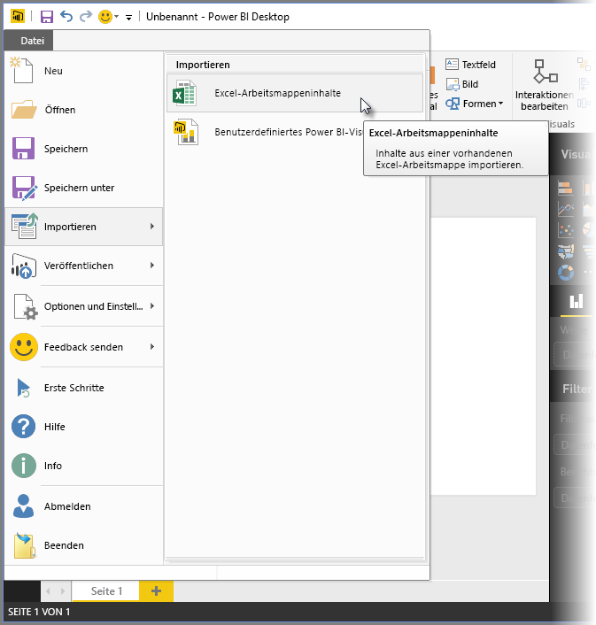
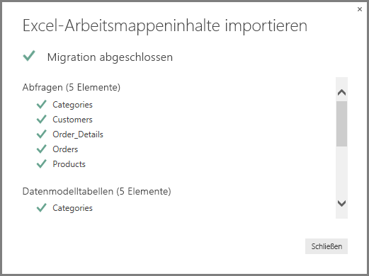
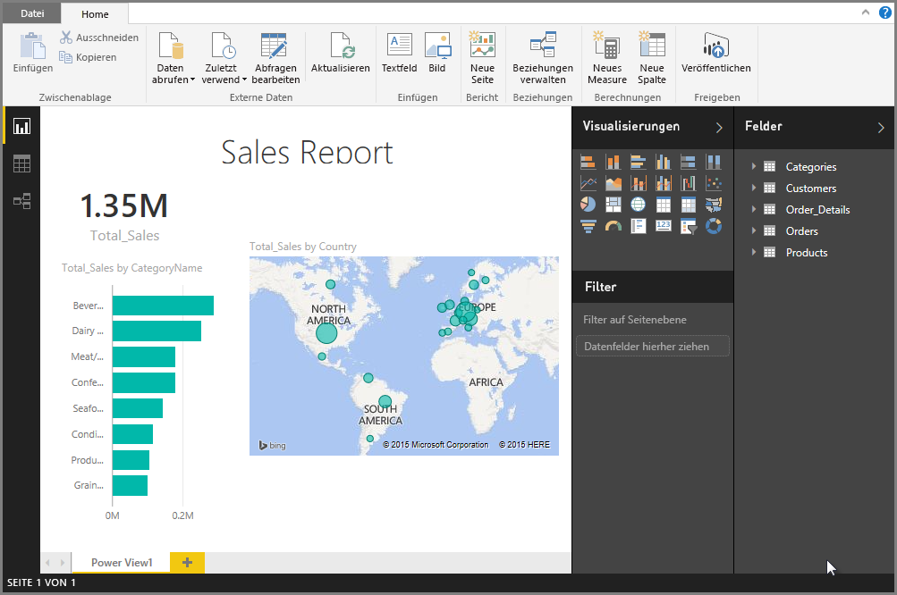

# Importieren von Excel-Arbeitsmappen in Power BI Desktop
Mit Power BI Desktop können Sie Excel-Arbeitsmappen, die Power Query-Abfragen, Power Pivot-Modelle und Power View-Arbeitsblätter enthalten, einfach in Power BI Desktop importieren. In Power BI Desktop werden basierend auf Excel-Arbeitsmappen automatisch Berichte und Visualisierungen erstellt. Nach dem Importieren können Sie diese Berichte mit Power BI Desktop weiter verbessern und verfeinern, indem Sie die vorhandenen Features und die neuen Features verwenden, die im Rahmen jedes monatlichen Power BI Desktop-Updates veröffentlicht werden.

## Wie importiere ich eine Excel-Arbeitsmappe?
1. Klicken Sie auf **Datei**  >  **Importieren**  >  **Power Query, Power Pivot, Power View**.

   

2. Wählen Sie im Fenster **Öffnen** eine Excel-Arbeitsmappe aus, die importiert werden soll. 

   Derzeit gilt keine Beschränkung in Bezug auf die Größe oder Anzahl von Objekten in der Arbeitsmappe, aber zum Analysieren und Importieren großer Arbeitsmappen benötigt Power BI Desktop mehr Zeit.

   > [!NOTE]
   > Verwenden Sie zum Laden oder Importieren von Excel-Dateien aus freigegebenen OneDrive for Business-Ordnern oder für Office 365-Gruppenordner die URL der Excel-Datei und der Webdatenquelle in Power BI Desktop. Zum ordnungsgemäßen Formatieren der URL für OneDrive for Business sind mehrere Schritte zu befolgen. Weitere Informationen zu den erforderlichen Schritten finden Sie unter [Verwenden von OneDrive for Business-Links in Power BI Desktop](desktop-use-onedrive-business-links.md).
   > 
   > 

3. Klicken Sie im Dialogfeld zum Importieren, das angezeigt wird, auf die Option **Starten**.

   

   Power BI Desktop analysiert die Arbeitsmappe und konvertiert sie in eine Power BI Desktop-Datei (.pbix). Bei dieser Aktion handelt es sich um ein einmaliges Ereignis. Nachdem die Power BI Desktop-Datei mit diesen Schritten erstellt wurde, besteht für die Power BI Desktop-Datei keine Abhängigkeit mehr von der ursprünglichen Excel-Arbeitsmappe, und sie kann geändert, gespeichert und freigegeben werden, ohne dass sich dies auf die ursprüngliche Arbeitsmappe auswirkt.

   Nach Abschluss des Importvorgangs wird eine Zusammenfassungsseite angezeigt, auf der die konvertierten Elemente beschrieben und zusätzlich alle Elemente aufgeführt sind, die nicht importiert werden konnten.

   

4. Klicken Sie auf **Schließen**. 

   Power BI Desktop importiert die Excel-Arbeitsmappe und lädt einen auf den Arbeitsmappeninhalten basierenden Bericht.

   

Nachdem die Arbeitsmappe importiert wurde, können Sie weiter am Bericht arbeiten. Sie können neue Visualisierungen erstellen, Daten hinzufügen oder neue Berichtsseiten erstellen, indem Sie die Features und Funktionen von Power BI Desktop verwenden.

## Welche Arbeitsmappenelemente werden importiert?
Mit Power BI Desktop können die folgenden Elemente importiert werden, die in Excel normalerweise als *Objekte*bezeichnet werden.

| Objekt in einer Excel-Arbeitsmappe | Endergebnis in der Power BI Desktop-Datei |
| --- | --- |
| Power Query-Abfragen |Alle Power Query-Abfragen aus Excel werden in Power BI Desktop in Abfragen konvertiert. Falls in der Excel-Arbeitsmappe Abfragegruppen definiert waren, wird in Power BI Desktop die gleiche Organisation repliziert. Alle Abfragen werden geladen, es sei denn, sie sind im Excel-Dialogfeld **Daten importieren** auf **Nur Verbindung erstellen** festgelegt. Sie können das Ladeverhalten in Power BI Desktop über den Power Query-Editor anpassen, indem Sie auf der Registerkarte **Start** auf **Eigenschaften** klicken. |
| Externe Power Pivot-Datenverbindungen |Alle externen Power Pivot-Datenverbindungen werden in Power BI Desktop in Abfragen konvertiert. |
| Verknüpfte Tabellen oder Tabellen der aktuellen Arbeitsmappe |Wenn eine Arbeitsblatttabelle in Excel mit dem Datenmodell oder einer Abfrage verknüpft ist (mithilfe von *Von Tabelle* oder der Funktion *Excel.CurrentWorkbook()* in M), werden die folgenden Optionen bereitgestellt: <ol><li><b>Importieren der Tabelle in die Power BI Desktop-Datei</b>. Diese Tabelle stellt eine einmalige Momentaufnahme der Daten dar, nach der Sie die Daten in der Tabelle in Power BI Desktop nicht bearbeiten können. Es gilt eine Größenbeschränkung von 1 Mio. Zeichen (alle Spaltenüberschriften und Zellen zusammen) für Tabellen, die mit dieser Option erstellt werden.</li><li><b>Beibehalten einer Verbindung mit der ursprünglichen Arbeitsmappe</b>. Alternativ dazu können Sie eine Verbindung mit der ursprünglichen Excel-Arbeitsmappe beibehalten. Power BI Desktop ruft dann bei jeder Aktualisierung die neuesten Inhalte dieser Tabelle ab, wie dies auch für alle anderen Abfragen durchgeführt wird, die für eine Excel-Arbeitsmappe in Power BI Desktop erstellt werden.</li></ul> |
| Berechnete Spalten des Datenmodells, Measures, KPIs, Datenkategorien und Beziehungen |Diese Datenmodellobjekte werden in Power BI Desktop in gleichwertige Objekte konvertiert. Beachten Sie, dass bestimmte Datenkategorien in Power BI Desktop nicht verfügbar sind, z. B. Bild. In diesen Fällen werden die Datenkategorieinformationen für die betreffenden Spalten zurückgesetzt. |
| Power View-Arbeitsblätter |Für jedes Power View-Arbeitsblatt in Excel wird eine neue Berichtsseite erstellt. Der Name und die Reihenfolge dieser Berichtsseiten stimmen mit der ursprünglichen Excel-Arbeitsmappe überein. |

## Gelten für den Import einer Arbeitsmappe Einschränkungen?
Es gelten einige Einschränkungen in Bezug auf den Import einer Arbeitsmappe in Power BI Desktop:

* **Externe Verbindungen zu SQL Server Analysis Services-Tabellenmodellen:** In Excel 2013 ist es möglich, eine Verbindung mit SQL Server Analysis Services-Tabellenmodellen herzustellen und basierend auf diesen Modellen Power View-Berichte zu erstellen, ohne dass die Daten importiert werden müssen. Diese Art von Verbindung wird für das Importieren von Excel-Arbeitsmappen in Power BI Desktop derzeit nicht unterstützt. Als Umgehung müssen Sie diese externen Verbindungen in Power BI Desktop neu herstellen.
* **Hierarchien**: Diese Art von Datenmodellobjekt wird in Power BI Desktop derzeit nicht unterstützt. Hierarchien werden beim Importieren einer Excel-Arbeitsmappe in Power BI Desktop daher übersprungen.
* **Binäre Datenspalten:** Diese Art von Datenmodellspalte wird in Power BI Desktop derzeit nicht unterstützt. Binäre Datenspalten werden in Power BI Desktop aus der sich ergebenden Tabelle entfernt.
* **Nicht unterstützte Power View-Elemente**: Power View verfügt über einige Features, die in Power BI Desktop nicht enthalten sind, z. B. Designs oder bestimmte Arten von Visualisierungen (Punktdiagramm mit Wiedergabeachse, Drilldownverhalten u. a.). Diese nicht unterstützten Visualisierungen führen zur Meldung *Nicht unterstützte Visualisierung* an den entsprechenden Positionen im Power BI Desktop-Bericht, die Sie löschen oder für die Sie eine Neukonfiguration durchführen können.
* **Benannte Bereiche mit Verwendung von** ***Von Tabelle*** in **Power Query oder** ***Excel.CurrentWorkbook*** **in M:** Das Importieren dieser Daten benannter Bereiche in Power BI Desktop wird derzeit nicht unterstützt, ist aber als Update geplant. Momentan werden diese benannten Bereiche in Power BI Desktop als Verbindung mit der externen Excel-Arbeitsmappe geladen.
* **PowerPivot zu SSRS:** Externe Power Pivot-Verbindungen mit SQL Server Reporting Services (SSRS) werden derzeit nicht unterstützt, da diese Datenquelle in Power BI Desktop momentan nicht verfügbar ist.

