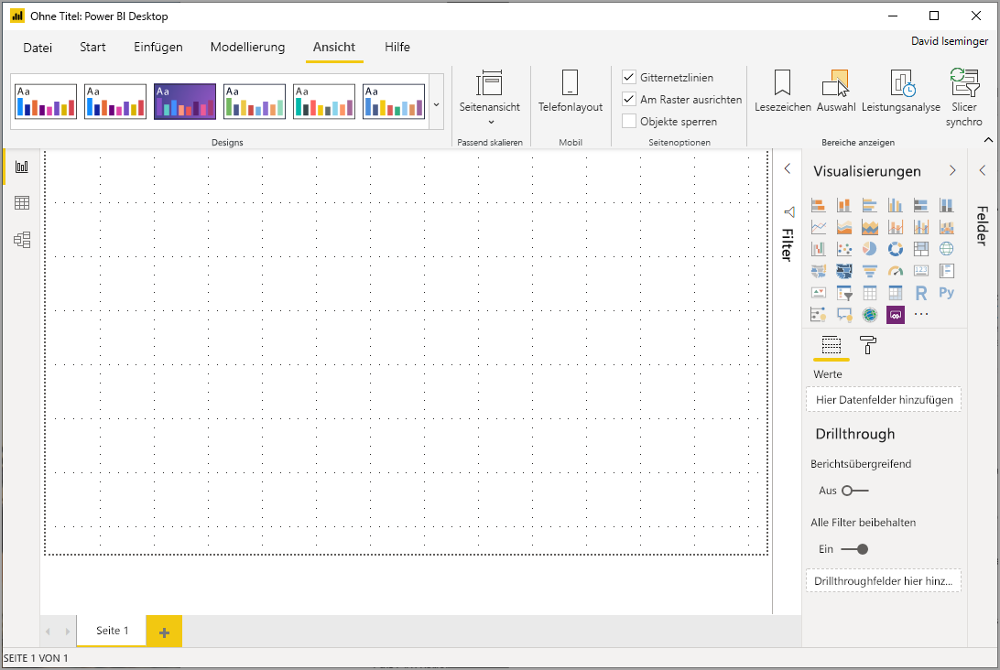
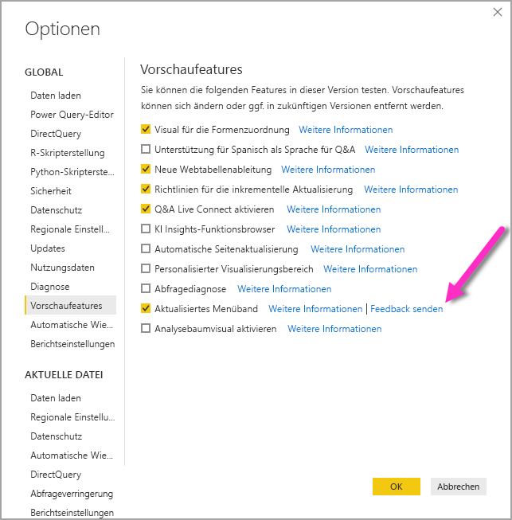
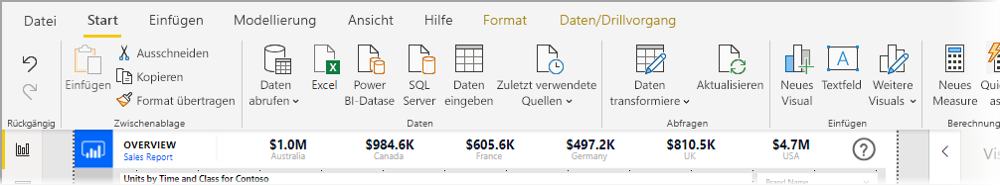
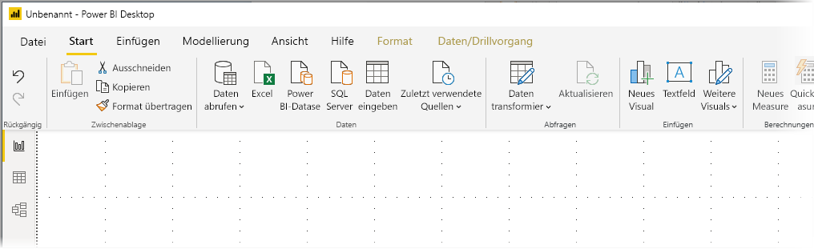
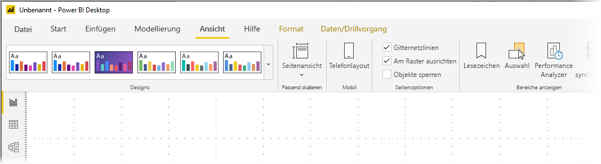
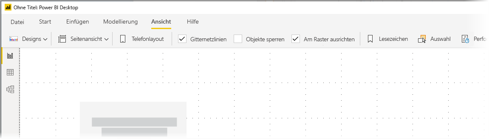

# Verwenden des aktualisierten Menübands in Power BI Desktop

Ab dem Update von März 2020 wird in Power BI Desktop das Menüband überarbeitet, um dessen Darstellung und Funktionen besser an andere Microsoft-Produkte wie z. B. Microsoft Office anzupassen. Das aktualisierte Menüband wird ab November 2019 in Form von monatlichen Updates als Vorschaufeature veröffentlicht. Ab dem Update im März 2020 wird das neue Menüband standardmäßig angezeigt.

## Aktivieren des aktualisierten Menübands

Ab dem Update im März 2020 wird das aktualisierte Menüband standardmäßig angezeigt. In älteren Power BI Desktop-Versionen (ab dem Update im November 2019) war das aktualisierte Menüband in Power BI ein Vorschaufeature, und es muss aktiviert werden. Klicken Sie dazu in einer älteren Version auf **Datei > Optionen und Einstellungen > Optionen**, und klicken Sie dann in der linken Spalte auf **Vorschaufeatures**, um sie zu aktivieren. Im rechten Bereich befindet sich die Auswahloption **Aktualisiertes Menüband**. Aktivieren Sie das Kontrollkästchen neben **Aktualisiertes Menüband**, um die Previewfunktion zu aktivieren. Sie müssen Power BI Desktop neu starten, damit die Änderung für die Previewfunktion wirksam wird.

> [!NOTE]
> In Power BI Desktop-Versionen ab März 2020 muss das aktualisierte Menüband nicht aktiviert werden, da es ab März 2020 standardmäßig angezeigt wird.

## Features des neuen Menübands

Das Menübandupdate soll die Benutzererfahrung für Power BI Desktop und andere Microsoft-Produkte einfach und vertraut machen. 

Diese Vorteile können in folgende Kategorien unterteilt werden:

* **Verbesserte Darstellung, Handhabung und Organisation:** Symbole und Funktionen auf dem aktualisieren Power BI Desktop-Menüband sind an die Darstellung, Handhabung und Organisation der Menübandelemente von Office-Anwendungen ausgerichtet.

    

* **Ein intuitiver Katalog für Designs:** Der Katalog für Designs, der auf dem Menüband **Ansicht** zu finden ist, besitzt die vertraute Darstellung und Handhabung des Designs-Katalogs in PowerPoint. Daher zeigen Ihnen die Bilder auf dem Menüband, wie die Designänderungen aussehen werden, wenn sie auf Ihren Bericht angewendet werden, z. B. Farbkombinationen und Schriftarten. 

    

* **Dynamischer Menübandinhalt basierend auf Ihrer Ansicht:** Auf dem vorhandenen Menüband für Power BI Desktop wurden Symbole oder Befehle, die nicht verfügbar waren, einfach ausgegraut, wodurch die Benutzererfahrung alles andere als optimal war. Auf dem aktualisierten Menüband werden Symbole dynamisch angezeigt und angeordnet, damit Sie immer wissen, welche Optionen Ihnen im Kontext zur Verfügung stehen.

* **Ein Menüband mit einer Zeile, das Platz spart, wenn es reduziert wird:** Ein weiterer Vorteil des aktualisierten Menübands ist, dass es auf nur eine Zeile reduziert werden kann und dann nur die Menübandelemente basierend auf Ihrem Kontext angezeigt werden. 

    

* **KeyTips zum Navigieren und Auswählen von Schaltflächen:** Sie können sich die Navigation auf dem Menüband erleichtern, indem Sie **ALT+WINDOWS-TASTE** drücken, um die KeyTips zu aktivieren. Nach der Aktivierung können Sie die angezeigten Tasten auf der Tastatur drücken, um zu navigieren.

    

* **Benutzerdefinierte Formatzeichenfolgen:** Sie können nicht nur im Bereich *Eigenschaften* benutzerdefinierte Formatzeichenfolgen festlegen, sondern auch auf dem Menüband. Wählen Sie das Measure oder die Spalte aus, die Sie anpassen möchten. Dann wird je nach Auswahl eine der beiden folgenden kontextbezogenen Registerkarten angezeigt: **Messtools** oder **Spaltentools**. Im Formatierungsabschnitt der Registerkarte können Sie die benutzerdefinierte Formatzeichenfolge direkt in das Dropdownfeld eingeben.

    

* **Barrierefreiheit:** Die Titelleiste, das Menüband und das Dateimenü sind barrierefrei. Drücken Sie STRG+F6, um zum Menübandbereich zu navigieren. Anschließend können Sie mithilfe der **TAB-TASTE** zwischen der oberen und unteren Leiste wechseln und mithilfe der Pfeiltasten zwischen den einzelnen Elementen navigieren.

Zusätzlich zu diesen sichtbaren Änderungen können wir mit dem aktualisierten Menüband auch zukünftige Updates an Power BI Desktop und dessen Menüband vornehmen:

* Erstellen flexibler und intuitiver Steuerelemente auf dem Menüband, z. B. den Designs-Katalog
* Hinzufügen der Office-Designs *schwarz* und *grau* für Power BI Desktop
* Verbesserung der Barrierefreiheit

## Nächste Schritte
Sie können mithilfe von Power BI Desktop eine Verbindung mit Daten jeglicher Art herstellen. Weitere Informationen zu Datenquellen finden Sie in folgenden Ressourcen:

* [Was ist Power BI Desktop?](desktop-what-is-desktop.md)
* [Datenquellen in Power BI Desktop](desktop-data-sources.md)
* [Strukturieren und Kombinieren von Daten mit Power BI Desktop](desktop-shape-and-combine-data.md)
* [Verbinden mit Excel in Power BI Desktop](desktop-connect-excel.md)   
* [Eingeben von Daten direkt in Power BI Desktop](desktop-enter-data-directly-into-desktop.md)   

