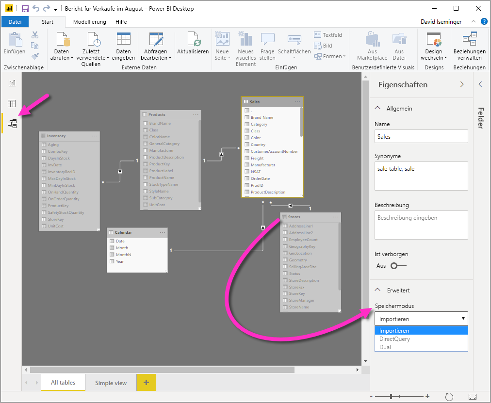
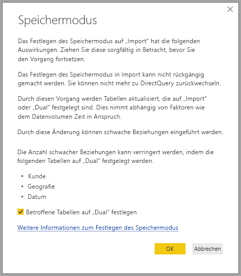

# Verwalten des Speichermodus in Power BI Desktop

In Power BI Desktop können Sie den Speichermodus von Tabellen festlegen. Mit dem Speichermodus können Sie steuern, ob Power BI Desktop Tabellendaten im Arbeitsspeicher für Berichte zwischenspeichert. 

Das Festlegen des Speichermodus bietet viele Vorteile. Sie können den Speichermodus für jede Tabelle in Ihrem Modell einzeln festlegen. Durch diese Aktion entsteht ein einzelnes Dataset, das folgende Vorteile bietet:

* **Abfrageleistung**: Bei der Interaktion der Benutzer mit Visuals in Power BI-Berichten werden DAX-Abfragen (Data Analysis Expressions) an das Dataset gesendet. Durch die Zwischenspeicherung von Daten im Speicher (mit ordnungsgemäßer Angabe des Speichermodus) können die Abfrageleistung und die Interaktivität Ihrer Berichte erhöht werden.

* **Große Datasets**: Tabellen, die nicht zwischengespeichert werden, belegen keinen Speicher für die Zwischenspeicherung. Sie können interaktive Analysen für große Datasets aktivieren, bei denen eine vollständige Zwischenspeicherung im Speicher zu umfangreich oder zu kostspielig wäre. Sie können die Tabellen auswählen, bei denen eine Zwischenspeicherung sinnvoll ist, und solche, bei denen dies nicht der Fall ist.

* **Optimierung der Datenaktualisierung**: Tabellen, die nicht zwischengespeichert werden, müssen nicht aktualisiert werden. Sie können die Aktualisierungszeiten verkürzen, indem Sie nur die Zwischenspeicherung der Daten veranlassen, die erforderlich sind, um Ihre Vereinbarungen zum Servicelevel und Ihre geschäftlichen Anforderungen zu erfüllen.

* **Anforderungen hinsichtlich einer Ausführung nahezu in Echtzeit**: Bei Tabellen, die nahezu in Echtzeit ausführbar sein sollen, ist ein Verzicht auf eine Zwischenspeicherung möglicherweise sinnvoll, um Datenlatenzen zu verringern.

* **Rückschreiben**: Durch das Rückschreiben können Geschäftsbenutzer mögliche Szenarios durch die Änderung von Zellenwerten untersuchen. Benutzerdefinierte Anwendungen können Änderungen an der Datenquelle anwenden. Tabellen, die nicht zwischengespeichert, können Änderungen sofort darstellen, wodurch eine sofortige Analyse der Auswirkungen möglich ist.

Die Einstellung „Speichermodus“ in Power BI Desktop ist eines von drei in Beziehung stehenden Features:

* **Zusammengesetzte Modelle**: Hierbei kann ein Bericht mindestens zwei Datenverbindungen beinhalten, einschließlich DirectQuery- oder Importverbindungen in beliebiger Kombination. Weitere Informationen finden Sie unter [Verwenden zusammengesetzter Modelle in Power BI Desktop](desktop-composite-models.md).

* **m:n-Beziehungen**: Mithilfe zusammengesetzter Modelle können Sie *m:n-Beziehungen* zwischen Tabellen einrichten. Durch m:n-Beziehungen entfallen die Anforderungen für eindeutige Werte in Tabellen. Zudem sind vorherige Problemumgehungen hinfällig, wie z.B. die Einführung neuer Tabellen zum Einrichten von Beziehungen. Weitere Informationen finden Sie unter [Beziehungen mit einer m:n-Kardinalität in Power BI Desktop](desktop-many-to-many-relationships.md).

* **Speichermodus**: Sie können nun angeben, welche Visuals eine Abfrage in Back-End-Datenquellen erfordern. Visuals, für die keine Abfrage nötig ist, werden importiert, auch wenn diese auf DirectQuery basieren. Mit diesem Feature kann die Leistung verbessert und die Auslastung des Back-Ends verringert werden. Zuvor initiierten sogar einfache Visuals wie Slicer Abfragen, die an Back-End-Quellen gesendet wurden. 

## Verwenden der Speichermoduseigenschaft

Die **Speichermoduseigenschaft** ist eine Eigenschaft, die Sie für jede Tabelle in Ihrem Modell festlegen können, und sie steuert, wie Tabellendaten in Power BI zwischengespeichert werden.

So legen Sie die **Speichermoduseigenschaft** fest oder zeigen die aktuelle Einstellung an: 

1. Wählen Sie in der **Modellansicht** die Tabelle aus, deren Eigenschafen Sie anzeigen oder festlegen möchten. 
2. Erweitern Sie im Bereich **Eigenschaften** den Abschnitt **Erweitert**, und klappen Sie dann das Dropdown **Speichermodus** auf.

   

Sie können für die **Speichermoduseigenschaft** einen der folgenden drei Werte festlegen:

* **Import**: Importierte Tabellen mit dieser Einstellung werden zwischengespeichert. Abfragen, die an das Power BI-Dataset gesendet werden, die Daten aus Import-Tabellen zurückgeben, können nur von zwischengespeicherten Daten ausgeführt werden.

* **DirectQuery**: Tabellen mit dieser Einstellung werden nicht zwischengespeichert. Abfragen, die Sie an das Power BI-Dataset senden (z. B. DAX-Abfragen) und die Daten von DirectQuery-Tabellen zurückgeben, können nur durch Ausführung von bedarfsgesteuerten Abfragen an die Datenquelle ausgeführt werden. Abfragen, die Sie an die Datenquelle senden, verwenden die Abfragesprache dieser Datenquelle (z. B. SQL).

* **Dual**: Tabellen mit dieser Einstellung können entweder zwischengespeichert oder nicht zwischengespeichert werden, abhängig vom Kontext der an das Power BI-Dataset gesendeten Abfrage. In einigen Fällen werden Abfragen über zwischengespeicherte Daten ausgeführt. In anderen Fällen werden Abfragen durch das Ausführen einer bedarfsgesteuerten Abfrage an die Datenquelle ausgeführt.

Das Ändern des **Speichermodus** einer Tabelle in **Import** kann *nicht rückgängig gemacht werden*. Sobald die Eigenschaft festgelegt wurde, kann sie später nicht mehr in **DirectQuery** oder **Dual** zurück geändert werden.

> [!NOTE]
> Sie können den Speichermodus **Dual** sowohl in Power BI Desktop als auch im Power BI-Dienst verwenden.

## Einschränkungen für DirectQuery- und Dual-Tabellen

Für Dual-Tabellen gelten dieselben funktionellen Einschränkungen wie für DirectQuery-Tabellen. Zu diesen Einschränkungen zählen beschränkte M-Transformationen und eingeschränkte DAX-Funktionen in berechneten Spalten. Weitere Informationen finden Sie unter [Auswirkungen der Verwendung von DirectQuery](desktop-directquery-about.md#implications-of-using-directquery).

## Weitergabe der Dual-Einstellung
Sehen Sie sich das folgende einfache Modell an, bei dem alle Tabellen von einer einzelnen Quelle stammen, die Import und DirectQuery unterstützt.

Angenommen, alle Tabellen in diesem Modell wurden ursprünglich auf **DirectQuery** festgelegt. Wenn der **Speichermodus** der **SurveyResponse**-Tabelle dann in **Import** geändert wird, wird folgendes Warnungsfenster angezeigt:

Die Dimensionstabellen (**Customer**, **Geography** und **Date**) können auf **Dual** festgelegt werden, um die Anzahl schwacher Beziehungen im Dataset zu verringern und die Leistung zu verbessern. Schwache Beziehungen enthalten normalerweise mindestens eine DirectQuery-Tabelle, bei der die Verknüpfungslogik nicht per Push an die Quellsysteme übertragen werden kann. Da Dual-Tabellen entweder als DirectQuery- oder als Import-Tabellen fungieren können, wird diese Situation vermieden.

Die Weitergabelogik ist dafür konzipiert, Modelle mit vielen Tabellen zu unterstützen. Stellen Sie sich vor, Sie haben ein Modell mit 50 Tabellen, und nur bestimmte (transaktionale) Faktentabellen müssen zwischengespeichert werden. Die Logik in Power BI Desktop berechnet die minimale Gruppe von Dimensionstabellen, die auf **Dual** festgelegt werden müssen. Diese Aufgabe müssen Sie also nicht selbst erledigen.

Die Weitergabelogik durchläuft nur eine Seite der 1:n-Beziehungen.

## Beispiel für die Verwendung des Speichermodus
Lassen Sie uns mit dem Beispiel aus dem vorherigen Abschnitt fortfahren, und stellen Sie sich vor, die folgenden Eigenschafteneinstellungen für den Speichermodus würden angewendet werden:

| Tabelle                   | Speichermodus         |
| ----------------------- |----------------------| 
| Vertrieb                 | DirectQuery          | 
| SurveyResponse        | Importieren               | 
| Datum                  | Dual                 | 
| Kunde              | Dual                 | 
| Geografie             | Dual                 | 

Das Festlegen dieser Eigenschaften für den Speichermodus führt zu folgenden Verhaltensweisen, sofern die Tabelle **Sales** ein erhebliches Datenvolumen aufweist:
* Power BI Desktop speichert Dimensionstabellen (**Date**, **Customer** und **Geography**) zwischen, sodass die anfänglichen Berichte beim Abrufen der anzuzeigenden Slicerwerte schnell geladen werden sollten.
* Die **Sales**-Tabelle wird in Power BI Desktop nicht zwischengespeichert. Indem die Tabelle Sales nicht zwischengespeichert wird, liefert Power BI Desktop folgende Ergebnisse:
    * Die Datenaktualisierungszeiten werden verbessert, und die Speichernutzung wird reduziert.
    * Berichtsabfragen, die auf der Tabelle **Sales** basieren, werden im **DirectQuery**-Modus ausgeführt. Diese Abfragen dauern länger, werden jedoch nahezu in Echtzeit ausgeführt, da keine Latenz durch das Zwischenspeichern entsteht.

* Berichtsabfragen, die auf der Tabelle **SurveyResponse** basieren, werden vom In-Memory-Cache zurückgegeben und sollten daher relativ schnell ausgeführt werden.

## Abfragen, die vom Cache ausgeführt oder nicht vom Cache ausgeführt werden

Indem Sie eine Verbindung zwischen dem SQL Profiler und dem Diagnoseport für Power BI Desktop herstellen, können Sie durch Ausführung einer Ablaufverfolgung anhand der folgenden Ereignisse sehen, welche Abfragen vom In-Memory-Cache ausgeführt werden und welche nicht:

* Queries Events\Query Begin
* Query Processing\Vertipaq SE Query Begin
* Query Processing\DirectQuery Begin

Überprüfen Sie für jedes *Query Begin*-Ereignis die anderen Ereignisse mit der gleichen *ActivityID*. Wenn es beispielsweise kein *DirectQuery – Anfang*-Ereignis, aber ein *Vertipaq SE Query Begin*-Ereignis gibt, wurde die Abfrage vom Cache beantwortet.

Abfragen, die auf Tabellen im Dual-Modus verweisen, geben wenn möglich Daten aus dem Cache zurück. Andernfalls werden sie auf DirectQuery zurückgesetzt.

Im Anschluss an das vorherige Beispiel verweist die folgende Abfrage nur auf eine Spalte aus der Tabelle **Date**, die sich im **Dual**-Modus befindet. Aus diesem Grund sollte die Abfrage vom Cache ausgeführt werden:

Die folgende Abfrage verweist nur auf eine Spalte aus der Tabelle **Sales**, die sich im **DirectQuery**-Modus befindet. Aus diesem Grund sollte diese *nicht* vom Cache ausgeführt werden:

Die folgende Abfrage ist interessant, da sie beide Spalten kombiniert. Diese Abfrage wird nicht vom Cache ausgeführt. Möglicherweise erwarten Sie zunächst, dass **CalendarYear**-Werte vom Cache und **SalesAmount**-Werte von der Quelle abgerufen die Ergebnisse anschließend kombiniert werden, dies wäre jedoch weniger effizient als den SUM/GROUP BY-Vorgang an das Quellsystem zu übermitteln. Wenn der Vorgang an die Quelle weitergegeben wird, fällt die Anzahl der zurückgegebenen Zeilen wahrscheinlich weitaus geringer aus: 

> [!NOTE]
> Dieses Verhalten unterscheidet sich von [m:n-Beziehungen](desktop-many-to-many-relationships.md) in Power BI Desktop, wenn zwischengespeicherte und nicht zwischengespeicherte Tabellen kombiniert werden.

## Bedeutung der Synchronisierung von Caches

Die im vorherigen Abschnitt angezeigten Abfragen verdeutlichen, dass Dual-Tabellen manchmal vom Cache ausgeführt werden und manchmal nicht. Wenn der Cache veraltet ist, können deshalb unterschiedliche Werte zurückgegeben werden. Bei der Abfrageausführung wird nicht versucht, Datenprobleme, zu maskieren, indem z.B. DirectQuery-Ergebnisse entsprechend den zwischengespeicherten Werten gefiltert werden. Sie müssen bestens mit Ihren Datenflüssen vertraut sein und den Entwurf entsprechend darauf ausrichten. Bei Bedarf können Sie auf etablierte Verfahren zum Umgang mit derartigen Fällen an der Quelle zurückgreifen.

Der Speichermodus **Dual** trägt zur Leistungsoptimierung bei. Er sollte nur auf eine Weise verwendet werden, die die Erfüllung geschäftlicher Anforderungen nicht beeinträchtigt. Ziehen Sie bei anderen Verhaltensweisen ggf. die Verwendung der Methoden in Erwägung, die im Artikel [Anwenden von m:n-Beziehungen in Power BI Desktop](desktop-many-to-many-relationships.md) beschrieben werden.

## Datenansicht
Ist für mindestens eine Tabelle im Dataset der Speichermodus auf **Import** oder **Dual** festgelegt, kann die Registerkarte **Datenansicht** angezeigt werden.

Wenn Dual- und Import-Tabellen in der **Datenansicht** ausgewählt sind, zeigen diese zwischengespeicherte Daten an. DirectQuery-Tabellen zeigen keine Daten an, und es wird eine Meldung angezeigt, die besagt, dass DirectQuery-Tabellen nicht angezeigt werden können.

## Einschränkungen und Überlegungen

Es gibt einige Einschränkungen für dieses Release des Speichermodus und dessen Korrelation mit zusammengesetzten Modellen.

Die folgenden mehrdimensionalen Live Connect-Quellen können nicht mit zusammengesetzten Modellen verwendet werden:

* SAP HANA
* SAP Business Warehouse
* SQL Server Analysis Services
* Power BI-Datasets
* Azure Analysis Services

Wenn Sie mithilfe von DirectQuery eine Verbindung mit diesen mehrdimensionalen Quellen herstellen, können Sie keine Verbindung mit einer anderen DirectQuery-Quelle herstellen oder diese mit importierten Daten kombinieren.

Die bestehenden Einschränkungen für die Verwendung von DirectQuery gelten nach wie vor, wenn Sie zusammengesetzte Modelle verwenden. Viele dieser Einschränkungen gelten jetzt abhängig vom Speichermodus der Tabelle für eine einzelne Tabelle. Beispielsweise kann eine berechnete Spalte in einer importierten Tabelle auf andere Tabellen verweisen, wohingegen eine berechnete Spalte in einer DirectQuery-Tabelle nach wie vor nur auf Spalten in derselben Tabelle verweisen kann. Es gelten weitere Einschränkungen für das Modell als Ganzes, wenn eine der Tabellen im Modell DirectQuery enthält. Die Features QuickInsights und Q&A sind nicht für Modelle verfügbar, wenn eine der Tabellen den Speichermodus „DirectQuery“ aufweist. 

## Nächste Schritte

Weitere Informationen zu zusammengesetzten Modellen und DirectQuery finden Sie in den folgenden Artikeln:
* [Verwenden zusammengesetzter Modelle in Power BI Desktop](desktop-composite-models.md)
* [Beziehungen mit einer m:n-Kardinalität in Power BI Desktop](desktop-many-to-many-relationships.md)
* [Verwenden von DirectQuery in Power BI](desktop-directquery-about.md)
* [Von DirectQuery in Power BI unterstützte Datenquellen](desktop-directquery-data-sources.md)
