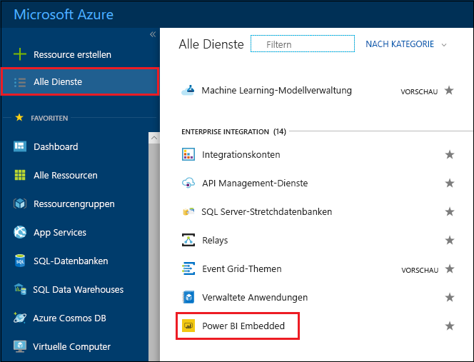
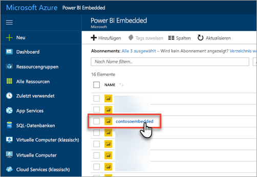
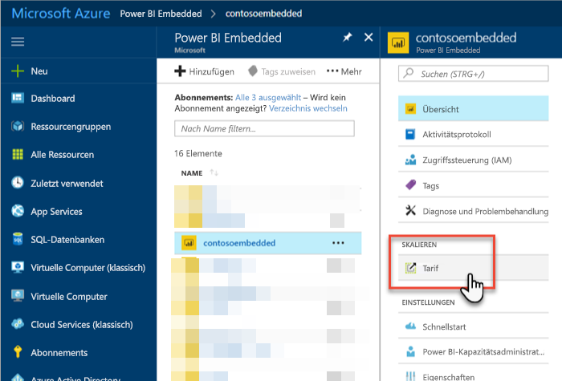
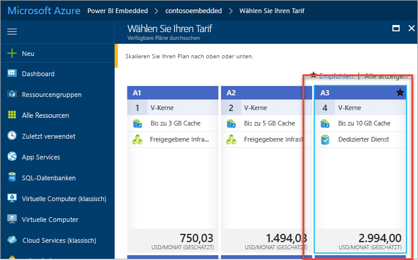
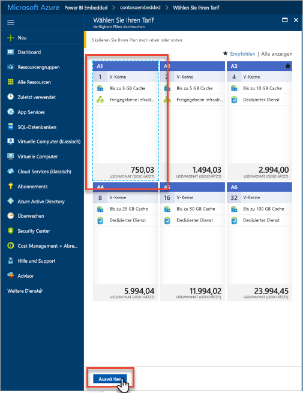
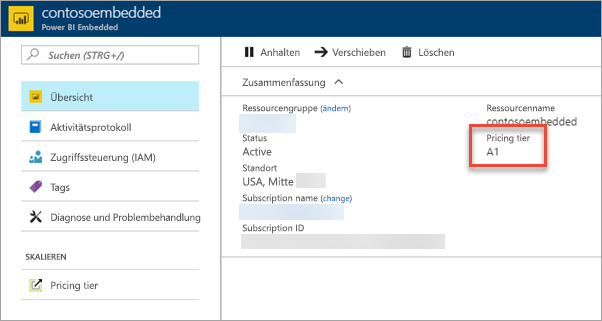

# Skalieren einer Power BI Embedded-Kapazität im Azure-Portal

In diesem Artikel erfahren Sie, wie Sie eine Power BI Embedded-Kapazität in Microsoft Azure skalieren. Durch Skalierung können Sie Ihre Kapazität erweitern oder reduzieren.

Dies setzt voraus, dass Sie eine Power BI Embedded-Kapazität erstellt haben. Wenn das nicht der Fall ist, erfahren Sie mehr darüber unter [Erstellen einer Power BI Embedded-Kapazität im Azure-Portal](azure-pbie-create-capacity.md).

> [!NOTE]
> Ein Skalierungsvorgang dauert ca. eine Minute. Währenddessen ist die Kapazität nicht verfügbar. Eingebettete Inhalte können dann möglicherweise nicht geladen werden.

## Skalieren einer Kapazität

1. Melden Sie sich beim [Azure-Portal](https://portal.azure.com/) an.

2. Wählen Sie **Alle Dienste** > **Power BI Embedded** aus, um Ihre Kapazitäten anzuzeigen.

    

3. Wählen Sie die Kapazität aus, die Sie skalieren möchten.

    

4. Wählen Sie in Ihrer Kapazität unter **Skalieren** **Tarif** aus.

    

    Ihr aktueller Tarif wird blau hervorgehoben.

    

5. Wählen Sie den neuen Tarif aus, zu dem Sie wechseln möchten, um hoch- oder herunterzuskalieren. Wenn Sie einen neuen Tarif auswählen, wird er durch eine gestrichelte blaue Umrandung hervorgehoben. Wählen Sie **Auswählen** aus, um den neuen Tarif zu skalieren.

    

    Das Skalieren Ihrer Kapazität dauert ein bis zwei Minuten.

6. Bestätigen Sie Ihren Tarif in der Registerkarte „Übersicht“. Der aktuelle Tarif wird angezeigt.

    

## Nächste Schritte

Wie Sie Ihre Kapazität anhalten oder starten, erfahren Sie unter [Anhalten und Starten einer Power BI Embedded-Kapazität im Azure-Portal](azure-pbie-pause-start.md).

Weitere Informationen zum Einbetten von Power BI-Inhalten in Ihre Anwendung finden Sie unter [Einbetten von Power BI-Berichten, -Dashboards, oder -Kacheln](https://powerbi.microsoft.com/documentation/powerbi-developer-embedding-content/).

Weitere Fragen? [Stellen Sie Ihre Frage in der Power BI-Community.](https://community.powerbi.com/)
