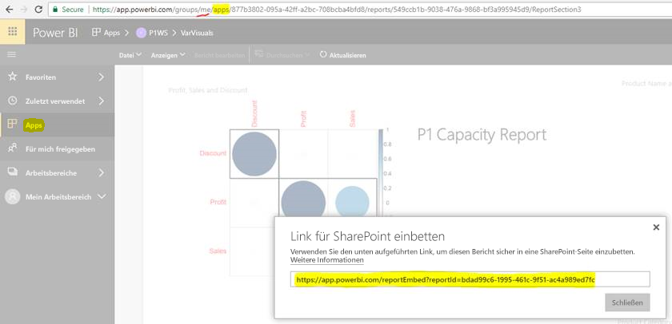

# Einbetten von Berichten oder Dashboards aus Apps

In Power BI können Sie Apps erstellen, um zusammengehörige Dashboards und Berichte an einem Ort zusammenfassen. Anschließend können Sie die Apps für große Personengruppen in Ihrer Organisation veröffentlichen. Die Verwendung der Apps ist dann wichtig, wenn Ihre Benutzer Power BI-Benutzer sind. Sie können dann mithilfe von Power BI-Apps Inhalte für sie freigeben. In diesem Artikel lernen Sie einige Schritte zum schnellen Einbetten von Inhalten aus einer veröffentlichten Power BI-App in eine Drittanbieteranwendung kennen.

## Abrufen einer Berichts-embedURL für die Einbettung

1. Instanziieren Sie die Anwendung in einem Benutzerarbeitsbereich, d.h. **Mein Arbeitsbereich**. Geben Sie ihn für sich selbst frei, oder leiten Sie einen anderen Benutzer an, diesen Flow zu durchlaufen.

2. Öffnen Sie den gewünschten Bericht im Power BI-Dienst.

3. Wechseln Sie zu **Datei** > **In SharePoint Online einbetten**, und rufen Sie die embedURL für den Bericht ab. Im nachstehenden Screenshot wird ein embedURL-Beispiel gezeigt. Alternativ können Sie die GetReports/GetReport-REST-API aufrufen und das entsprechende embedURL-Berichtfeld aus der Antwort extrahieren. Der REST-Aufruf sollte keine Arbeitsbereichs-ID als Teil der URL enthalten, da die App im Arbeitsbereich des Benutzers instanziiert wurde.

    

4. Verwenden Sie die in Schritt 3 abgerufene embedURL mit dem JavaScript SDK.

## Abrufen einer Dashboard-embedURL für die Einbettung

1. Instanziieren Sie die Anwendung in einem Benutzerarbeitsbereich, d.h. **Mein Arbeitsbereich**. Geben Sie ihn für sich selbst frei, oder leiten Sie einen anderen Benutzer an, diesen Flow zu durchlaufen.

2. Alternativ rufen Sie die GetDashboards REST-API auf, und extrahieren Sie das entsprechende Dashboard-embedURL-Feld aus der Antwort. Der REST-Aufruf sollte keine Arbeitsbereichs-ID als Teil der URL enthalten, da die App im Arbeitsbereich des Benutzers instanziiert wurde.

3. Verwenden Sie die in Schritt 2 abgerufene embedURL mit dem JavaScript SDK.

## Nächste Schritte

Erfahren Sie, wie Sie aus Arbeitsbereichen für Drittanbieterkunden und Ihre Organisation einbetten:

> [!div class="nextstepaction"]
>[Embed for third-party customers (Einbetten für Drittanbieterkunden)](embed-sample-for-customers.md)

> [!div class="nextstepaction"]
>[Embed for your organization (Einbetten für Ihre Organisation)](embed-sample-for-your-organization.md)
