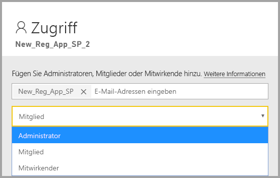

# <a name="embedding-power-bi-content-with-service-principal-and-application-secret"></a>Einbetten von Power BI-Inhalten mit Dienstprinzipal und Anwendungsgeheimnis

[!INCLUDE[service principal overview](../../includes/service-principal-overview.md)]

In diesem Artikel wird die Dienstprinzipalauthentifizierung mit einer *Anwendungs-ID* und einem *Anwendungsgeheimnis* beschrieben.

## <a name="method"></a>Methode

Führen Sie die folgenden Schritte aus, um den Dienstprinzipal und eine Anwendungs-ID mit Embedded Analytics zu verwenden:

1. Erstellen Sie eine [Azure AD-App](https://docs.microsoft.com/azure/active-directory/manage-apps/what-is-application-management).

    1. Erstellen Sie das Geheimnis der Azure AD-App.
    
    2. Rufen Sie die *Anwendungs-ID* und das *Anwendungsgeheimnis* der App ab.

    >[!NOTE]
    >Diese Schritte werden in **Schritt 1** beschrieben. Weitere Informationen zum Erstellen einer Azure AD-App finden Sie im Artikel [Erstellen einer Azure AD-App](https://docs.microsoft.com/azure/active-directory/develop/howto-create-service-principal-portal).

2. Erstellen Sie eine Azure AD-Sicherheitsgruppe.

3. Aktivieren Sie die Administratoreinstellungen für den Power BI-Dienst.

4. Fügen Sie Ihrem Arbeitsbereich den Dienstprinzipal hinzu.

5. Betten Sie Ihre Inhalte ein.

> [!IMPORTANT]
> Sobald Sie angeben, dass ein Dienstprinzipal mit Power BI verwendet werden soll, sind die AD-Berechtigungen der Anwendung nicht länger wirksam. Die Anwendungsberechtigungen werden dann über das Power BI-Verwaltungsportal verwaltet.

## <a name="step-1---create-an-azure-ad-app"></a>Schritt 1: Erstellen einer Azure AD-App

Erstellen Sie eine Azure AD-App mit einer der folgenden Methoden:
* Erstellen Sie die App im [Microsoft Azure-Portal](https://portal.azure.com/#allservices).
* Erstellen Sie die App mit [PowerShell](https://docs.microsoft.com/powershell/azure/create-azure-service-principal-azureps?view=azps-3.6.1).

### <a name="creating-an-azure-ad-app-in-the-microsoft-azure-portal"></a>Erstellen einer Azure AD-App im Microsoft Azure-Portal

1. Melden Sie sich bei [Microsoft Azure](https://portal.azure.com/#allservices) an.

2. Suchen Sie nach **App-Registrierungen**, und klicken Sie auf den Link **App-Registrierungen**.

    

3. Klicken Sie auf **Neue Registrierung**.

    

4. Füllen Sie die erforderlichen Informationen aus:
    * **Name**: Geben Sie einen Namen für Ihre Anwendung ein.
    * **Unterstützte Kontotypen:** Wählen Sie das benötigte Azure AD-Konto aus.
    * (Optional) **Umleitungs-URI**: Geben Sie bei Bedarf einen URI ein.

5. Klicken Sie auf **Registrieren**.

6. Nach der Registrierung ist die *Anwendungs-ID* auf der Registerkarte **Übersicht** verfügbar. Kopieren und speichern Sie die *Anwendungs-ID* zur späteren Verwendung.

    

7. Klicken Sie auf die Registerkarte **Zertifikate & Geheimnisse**.

     

8. Klicken Sie auf **Neuer geheimer Clientschlüssel**.

    

9. Geben Sie im Fenster *Geheimen Clientschlüssel hinzufügen* eine Beschreibung ein, geben Sie an, wann der geheime Clientschlüssel ablaufen soll, und klicken Sie auf **Hinzufügen**.

10. Kopieren und speichern Sie den Wert für *Geheimer Clientschlüssel*.

    

    >[!NOTE]
    >Wenn Sie dieses Fenster schließen, wird der Wert für den geheimen Clientschlüssel ausgeblendet, und Sie können ihn nicht mehr anzeigen oder kopieren.

### <a name="creating-an-azure-ad-app-using-powershell"></a>Erstellen einer Azure AD-App mithilfe von PowerShell

Dieser Abschnitt enthält ein Beispielskript zum Erstellen einer neuen Azure AD-App mithilfe von [PowerShell](https://docs.microsoft.com/powershell/azure/create-azure-service-principal-azureps?view=azps-1.1.0).

```powershell
# The app ID - $app.appid
# The service principal object ID - $sp.objectId
# The app key - $key.value

# Sign in as a user that's allowed to create an app
Connect-AzureAD

# Create a new Azure AD web application
$app = New-AzureADApplication -DisplayName "testApp1" -Homepage "https://localhost:44322" -ReplyUrls "https://localhost:44322"

# Creates a service principal
$sp = New-AzureADServicePrincipal -AppId $app.AppId

# Get the service principal key
$key = New-AzureADServicePrincipalPasswordCredential -ObjectId $sp.ObjectId
```

## <a name="step-2---create-an-azure-ad-security-group"></a>Schritt 2: Erstellen einer Azure AD-Sicherheitsgruppe

Ihr Dienstprinzipal hat keinen Zugriff auf Ihre Inhalte und APIs in Power BI. Erstellen Sie eine Sicherheitsgruppe in Azure AD, und fügen Sie den von Ihnen erstellten Dienstprinzipal dieser Sicherheitsgruppe hinzu, um dem Dienstprinzipal den Zugriff zu ermöglichen.

Eine Azure AD-Sicherheitsgruppe kann auf zwei Arten erstellt werden:
* Manuell (in Azure)
* Verwenden von PowerShell

### <a name="create-a-security-group-manually"></a>Manuelles Erstellen einer Sicherheitsgruppe

Befolgen Sie die Anweisungen im Artikel [Erstellen einer Basisgruppe und Hinzufügen von Mitgliedern mit Azure Active Directory](https://docs.microsoft.com/azure/active-directory/fundamentals/active-directory-groups-create-azure-portal), um eine Azure-Sicherheitsgruppe manuell zu erstellen. 

### <a name="create-a-security-group-using-powershell"></a>Erstellen einer Sicherheitsgruppe mithilfe von PowerShell

Das folgende Beispielskript veranschaulicht, wie eine neue Sicherheitsgruppe erstellt und dieser eine App hinzugefügt wird.

>[!NOTE]
>Wenn Sie den Dienstprinzipalzugriff für die gesamte Organisation aktivieren möchten, überspringen Sie diesen Schritt.

```powershell
# Required to sign in as a tenant admin
Connect-AzureAD

# Create an Azure AD security group
$group = New-AzureADGroup -DisplayName <Group display name> -SecurityEnabled $true -MailEnabled $false -MailNickName notSet

# Add the service principal to the group
Add-AzureADGroupMember -ObjectId $($group.ObjectId) -RefObjectId $($sp.ObjectId)
```

## <a name="step-3---enable-the-power-bi-service-admin-settings"></a>Schritt 3: Aktivieren der Administratoreinstellungen für den Power BI-Dienst

Damit eine Azure AD-App auf die Power BI-Inhalte und -APIs zugreifen kann, muss ein Power BI-Administrator den Dienstprinzipalzugriff im Power BI-Verwaltungsportal aktivieren.

Fügen Sie die Sicherheitsgruppe, die Sie in Azure AD erstellt haben, dem spezifischen Bereich für Sicherheitsgruppen in den **Entwicklereinstellungen** hinzu.

>[!IMPORTANT]
>Dienstprinzipale haben Zugriff auf alle Mandanteneinstellungen, für die sie aktiviert wurden. Abhängig von Ihren Administratoreinstellungen umfasst dies bestimmte Sicherheitsgruppen oder die gesamte Organisation.
>
>Sie können den Dienstprinzipalzugriff auf bestimmte Mandanteneinstellungen einschränken, indem Sie den Zugriff nur für bestimmte Sicherheitsgruppen zulassen. Alternativ können Sie eine dedizierte Sicherheitsgruppe für Dienstprinzipale erstellen und sie von den gewünschten Mandanteneinstellungen ausschließen.


## <a name="step-4---add-the-service-principal-as-an-admin-to-your-workspace"></a>Schritt 4: Hinzufügen des Dienstprinzipals als Administrator zu Ihrem Arbeitsbereich

Fügen Sie dem Arbeitsbereich die Dienstprinzipalentität als Mitglied oder Administrator hinzu, um die Azure AD App-Zugriffsartefakte wie Berichte, Dashboards und Datasets im Power BI-Dienst zu aktivieren.

>[!NOTE]
>Dieser Abschnitt enthält Anweisungen für die Benutzeroberfläche. Sie können einem Arbeitsbereich auch einen Dienstprinzipal hinzufügen, indem Sie die [API „Gruppen – Gruppenbenutzer hinzufügen“](https://docs.microsoft.com/rest/api/power-bi/groups/addgroupuser) verwenden.

1. Scrollen Sie zu dem Arbeitsbereich, für den Sie den Zugriff aktivieren möchten, und wählen Sie im Menü **Mehr** die Option **Arbeitsbereichszugriff** aus.

    

2. Fügen Sie dem Arbeitsbereich den Dienstprinzipal als **Administrator** oder **Mitglied** hinzu.

    

## <a name="step-5---embed-your-content"></a>Schritt 5: Einbetten der Inhalte

Sie können Ihre Inhalte in eine Beispielanwendung oder in Ihre eigene Anwendung einbetten.

* [Einbetten von Inhalt mit der Beispielanwendung](embed-sample-for-customers.md#embed-content-using-the-sample-application)
* [Einbetten von Inhalt in Ihre Anwendung](embed-sample-for-customers.md#embed-content-within-your-application)

Nach dem Einbetten Ihrer Inhalte können Sie in die [Produktionsphase wechseln](embed-sample-for-customers.md#move-to-production).

## <a name="considerations-and-limitations"></a>Überlegungen und Einschränkungen

* Dienstprinzipale sind nur für [neue Arbeitsbereiche](../../service-create-the-new-workspaces.md) geeignet.
* **Mein Arbeitsbereich** wird nicht unterstützt, wenn ein Dienstprinzipal verwendet wird.
* Dedizierte Kapazität ist erforderlich, um in die Produktionsphase wechseln zu können.
* Sie können sich über den Dienstprinzipal nicht im Power BI-Portal anmelden.
* Power BI-Administratorberechtigungen sind erforderlich, um Dienstprinzipale in den Entwicklereinstellungen im Power BI-Verwaltungsportal aktivieren zu können.
* Sie können ein lokales Datengateway über den Dienstprinzipal weder installieren noch verwalten.
* [Für Ihre Organisation eingebettete Anwendungen](embed-sample-for-your-organization.md) können keine Dienstprinzipale verwenden.
* Die Verwaltung von [Datenflüssen](../../service-dataflows-overview.md) wird nicht unterstützt.
* Der Dienstprinzipal unterstützt aktuell überhaupt keine Administrator-APIs.
* Wenn ein Dienstprinzipal mit einer [Azure Analysis Services](https://docs.microsoft.com/azure/analysis-services/analysis-services-overview)-Datenquelle verwendet wird, muss der Dienstprinzipal selbst über eine Azure Analysis Services-Instanzberechtigung verfügen. Zu diesem Zweck eine Sicherheitsgruppe zu verwenden, die den Dienstprinzipal enthält, funktioniert nicht.

## <a name="next-steps"></a>Nächste Schritte

* [Tutorial: Einbetten von Power BI-Berichten, -Dashboards oder -Kacheln in eine Anwendung für Ihre Kunden](embed-sample-for-customers.md)

* [Sicherheit auf Zeilenebene bei Verwendung eines lokalen Datengateways mit Dienstprinzipal](embedded-row-level-security.md#on-premises-data-gateway-with-service-principal)