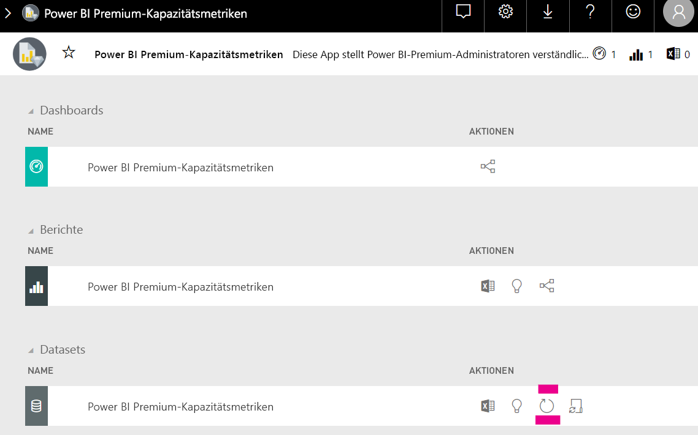

# Planen der Kapazität in Power BI Embedded Analytics

Das Berechnen, welche Art von Kapazität für eine Bereitstellung von Power BI Embedded Analytics benötigt wird, kann kompliziert sein. Dies liegt daran, dass diese Berechnung auf mehreren Parametern basiert, von denen einige schwer vorhersagbar sind.

Berücksichtigen Sie bei der Kapazitätsplanung einige der folgenden Aspekte:

* Die von Ihnen verwendeten Datenmodelle
* Anzahl und Komplexität erforderlicher Abfragen
* Die stündliche Verteilung der Anwendungsnutzung
* Datenaktualisierungsraten
* Zusätzliche Nutzungsmuster, die nur schwer vorhergesagt werden können

Dieser Artikel soll die Kapazitätsplanung für Power BI Embedded Analytics erleichtern. Dazu wird das [Power BI Dedicated Capacity Load Assessment Tool](https://github.com/microsoft/PowerBI-Tools-For-Capacities/tree/master/LoadTestingPowerShellTool/) eingeführt, das für die Automatisierung von Auslastungstests für Power BI Embedded Analytics-Kapazitäten (SKU *A*, *EM* oder *P*) entwickelt wurde.

## Planungstool

 Mithilfe von [Power BI Dedicated Capacity Load Assessment Tool](https://github.com/microsoft/PowerBI-Tools-For-Capacities/tree/master/LoadTestingPowerShellTool/) können Sie besser verstehen, wie viel Benutzerlast Ihre Kapazität bewältigen kann. Es nutzt PowerShell, um automatisierte Auslastungstests mit Ihren Kapazitäten zu erstellen, und lässt Sie wählen, welche Berichte getestet und wie viele gleichzeitige Benutzer simuliert werden sollen.

Das Tool erzeugt Last für eine Kapazität, indem es jeden Bericht kontinuierlich mit neuen Filterwerten rendert (um eine unrealistisch gute Leistung aufgrund der Zwischenspeicherung von Berichten zu verhindern), und zwar bis das Token abläuft, das für die Authentifizierung des Tools beim Dienst erforderlich ist.

### Verwenden des Planungstools

Achten Sie bei der Ausführung des Tools auf die vorhandene Last auf Ihren Kapazitäten, und stellen Sie sicher, dass Sie keine Auslastungstests zu Spitzenzeiten durchführen.

Es folgen einige Beispiele, wie Sie das Planungstool einsetzen können.

* Kapazitätsadministratoren können ein besseres Verständnis erlangen, wie viele Benutzer ihre Kapazität in einem bestimmten Zeitrahmen unterstützen kann.
* Berichtsersteller können die Auswirkung der Benutzerlast, gemessen mit der [Leistungsanalyse](https://docs.microsoft.com/power-bi/desktop-performance-analyzer) von Power BI Desktop, nachvollziehen.
* Sie können die Ausführung von Rendervorgängen in Ihrem Browser in Echtzeit verfolgen.
* Mit SQL Server Profiler können Sie [eine Verbindung mit den XMLA-Endpunkten](https://powerbi.microsoft.com/blog/power-bi-open-platform-connectivity-with-xmla-endpoints-public-preview/) der gemessenen Kapazitäten herstellen, um die ausgeführten Abfragen einzusehen.
* Die Auswirkungen der Lasttests sind auf der Seite „Datasets“ der Premium-Kapazitätsmetrik-App sichtbar. Kapazitätsadministratoren können dieses Tool zur Generierung von Last verwenden und beobachten, wie diese Last dargestellt wird.

### Überprüfen der Testergebnisse

Um die Auswirkungen des Lasttests in der Metrik-App nach den Testläufen zu beobachten, folgen Sie den nachstehenden Anweisungen. Rechnen Sie mit einer Verzögerung von bis zu 15 Minuten ab dem Zeitpunkt, an dem der Test beginnt, Last zu generieren, bis zu dem Zeitpunkt, an dem die Last in den Metriken sichtbar wird.

1. Erweitern Sie die Registerkarte **Datasets** auf der Zielseite Ihrer [Metrik-App](../../admin/service-admin-premium-monitor-capacity.md).
2. Lösen Sie eine bedarfsgesteuerte Aktualisierung aus, indem Sie auf **Jetzt aktualisieren** klicken. Administratoren sollten einen Blick hierauf werfen.

    

## GitHub-Repository für Power BI-Kapazitätstools

Das [GitHub-Repository für Power BI-Kapazitätstools](https://github.com/microsoft/PowerBI-Tools-For-Capacities) wurde erstellt, um das Kapazitätsplanungstool und andere künftige Tools und Hilfsprogramme zu hosten.

Das Repository ist Open Source, und Benutzer sind aufgefordert, mitzuwirken, zusätzliche Tools im Zusammenhang mit Power BI Premium- und Embedded-Kapazitäten hinzuzufügen und die vorhandenen zu verbessern.

## Weitere Schritte

> [!div class="nextstepaction"]
>[Kapazität und SKUs in Power BI Embedded Analytics](embedded-capacity.md)

> [!div class="nextstepaction"]
>[Bewährte Methoden für die Leistung von Power BI Embedded](embedded-performance-best-practices.md)