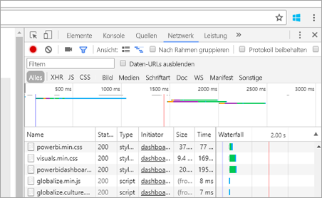
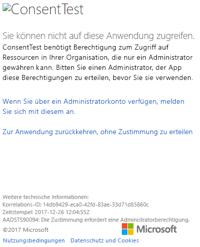
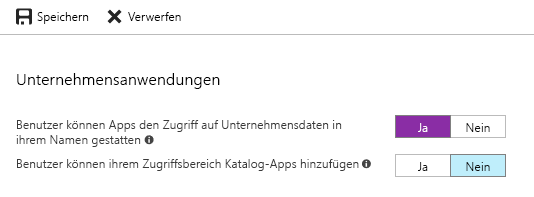

# <a name="troubleshoot-your-embedded-application"></a>Problembehandlung bei Embedded-Anwendungen

In diesem Artikel werden einige häufige Probleme erläutert, die beim Einbetten von Inhalten aus Power BI auftreten können.

## <a name="tools-to-troubleshoot"></a>Tools zur Problembehandlung

### <a name="fiddler-trace"></a>Fiddler-Ablaufverfolgung

[Fiddler](https://www.telerik.com/fiddler) ist ein kostenloses Tool von Telerik, mit dem HTTP-Datenverkehr überwacht wird.  Sie können den Datenverkehr zwischen den Power BI-APIs und dem Clientcomputer verfolgen. So können Sie Fehler und ähnliche Informationen anzeigen.


### <a name="f12-in-browser-for-front-end-debugging"></a>F12 im Browser zum Debuggen des Front-Ends

F12 startet das Entwicklerfenster im Browser. Dies ermöglicht es, den Netzwerkdatenverkehr und andere Informationen zu überprüfen.



### <a name="extract-error-details-from-power-bi-response"></a>Extrahieren von Fehlerdetails aus einer Power BI-Antwort

Dieser Codeausschnitt veranschaulicht, wie Sie die Fehlerdetails aus der HTTP-Ausnahme extrahieren:

```csharp
public static string GetExceptionText(this HttpOperationException exc)
{
    var errorText = string.Format("Request: {0}\r\nStatus: {1} ({2})\r\nResponse: {3}",
    exc.Request.Content, exc.Response.StatusCode, (int)exc.Response.StatusCode, exc.Response.Content);
    if (exc.Response.Headers.ContainsKey("RequestId"))
    {
        var requestId = exc.Response.Headers["RequestId"].FirstOrDefault();
        errorText += string.Format("\r\nRequestId: {0}", requestId);
    }

    return errorText;
}
```

Es wird empfohlen, die Anforderungs-ID (und die Fehlerdetails für die Problembehandlung) zu protokollieren.
Geben Sie die Anforderungs-ID an, wenn Sie sich an den Microsoft-Support wenden.

## <a name="app-registration"></a>App-Registrierung

### <a name="app-registration-failure"></a>Fehler bei der App-Registrierung

In Fehlermeldungen im Azure-Portal oder auf der Registrierungsseite für die Power BI-App wird auf unzureichende Berechtigungen hingewiesen. Um eine Anwendung zu registrieren, müssen Sie als Administrator im Azure AD-Mandanten fungieren, oder die Anwendungsregistrierung muss für Nicht-Administratorbenutzer aktiviert sein.

### <a name="power-bi-service-doesnt-appear-in-the-azure-portal-when-registering-a-new-app"></a>Power BI-Dienst wird beim Registrieren einer neuen App im Azure-Portal nicht aufgeführt

Mindestens ein Benutzer muss bei Power BI registriert sein. Wenn der **Power BI-Dienst** nicht in der API-Liste aufgeführt wird, ist kein Benutzer für Power BI registriert.

## <a name="rest-api"></a>REST-API

### <a name="api-call-returning-401"></a>API-Aufruf gibt 401 zurück

Zur genaueren Prüfung muss möglicherweise eine Fiddler-Überwachung ausgeführt werden. Möglicherweise fehlt der erforderliche Berechtigungsbereich für die registrierte Anwendung in Azure AD. Stellen Sie sicher, dass der erforderliche Bereich innerhalb der App-Registrierung für Azure AD im Azure-Portal vorhanden ist.

### <a name="api-call-returning-403"></a>API-Aufruf gibt 403 zurück

Zur genaueren Prüfung muss möglicherweise eine Fiddler-Überwachung ausgeführt werden. Ein Fehler 403 kann verschiedene Ursachen haben.

* Der Benutzer hat die Anzahl von Einbettungstoken überschritten, die mit einer gemeinsam genutzten Kapazität generiert werden können. Erwerben Sie weitere Azure-Kapazitäten, und weisen Sie den Arbeitsbereich dieser Kapazität zu, um weitere Einbettungstoken generieren zu können. Weitere Informationen finden Sie unter [Einrichten von Power BI Embedded-Kapazität im Azure-Portal](https://docs.microsoft.com/azure/power-bi-embedded/create-capacity).
* Das Azure AD-Auth-Token ist abgelaufen.
* Der authentifizierte Benutzer ist kein Mitglied der Gruppe (Arbeitsbereich).
* Der authentifizierte Benutzer ist kein Administrator der Gruppe (Arbeitsbereich).
* Der authentifizierte Benutzer verfügt über keine Berechtigungen. Berechtigungen können mithilfe der [refreshUserPermissions-API](https://docs.microsoft.com/rest/api/power-bi/users/refreshuserpermissions) aktualisiert werden.
* Der Autorisierungsheader wird möglicherweise nicht ordnungsgemäß aufgeführt. Stellen Sie sicher, dass keine Rechtschreibfehler enthalten sind.

Das Back-End der Anwendung muss das Auth-Token möglicherweise vor dem Aufrufen von GenerateToken aktualisieren.

    ```
    GET https://wabi-us-north-central-redirect.analysis.windows.net/metadata/cluster HTTP/1.1
    Host: wabi-us-north-central-redirect.analysis.windows.net
    ...
    Authorization: Bearer eyJ0eXAiOi...
    ...

    HTTP/1.1 403 Forbidden
    ...

    {"error":{"code":"TokenExpired","message":"Access token has expired, resubmit with a new access token"}}
    ```

## <a name="authentication"></a>Authentifizierung

### <a name="authentication-failed-with-aadsts90002-tenant-authorize-not-found"></a>Authentifizierungsfehler mit der Meldung „AADSTS90002: Tenant 'authorize' not found“ (AADSTS90002: Der Mandant "authorize" konnte nicht gefunden werden.)

 Wenn Sie beim Anmelden Nachrichten wie ***error: invalid_request, error_description: AADSTS90002: Tenant 'authorize' not found*** (error: invalid_request, error_description: AADSTS90002: Der Mandant "authorize" konnte nicht gefunden werden.) erhalten, liegt das daran, dass ADAL 4.x „https://login.microsoftonline.com/{Tenant}/oauth2/authorize/“ nicht als Autoritäts-URL erkennt.
 
Dieses Problem können Sie beheben, indem Sie „oauth2/authorize/“ aus der Autoritäts-URL löschen. Weitere Informationen finden Sie in den [Power BI-Beispielen für Entwickler](https://github.com/Microsoft/PowerBI-Developer-Samples).

 Lesen Sie sich außerdem den Abschnitt [Better Authority validation (Bessere Autoritätsüberprüfung)](https://github.com/AzureAD/azure-activedirectory-library-for-dotnet/wiki/Changes-adalnet-4.0#better-authority-validation) in den Versionshinweise zu ADAL 4.x durch.

### <a name="authentication-failed-with-aadsts70002-or-aadsts50053"></a>Authentifizierung schlägt mit AADSTS70002 oder AADSTS50053 fehl

**_(AADSTS70002: Fehler beim Überprüfen der Anmeldeinformationen. AADSTS50053: Sie haben zu oft versucht, sich mit einem falschen Benutzernamen oder Kennwort anzumelden.)_**

Wenn Sie Power BI Embedded verwenden und die direkte Authentifizierung mit Azure AD einsetzen, erhalten Sie beim Anmelden Meldungen wie die folgende: ***error:unauthorized_client,error_description:AADSTS70002: Fehler beim Überprüfen der Anmeldeinformationen. AADSTS50053: Sie haben zu oft versucht, sich mit einer falschen Benutzer-ID oder einem falschen Kennwort anzumelden***. Dies liegt daran, dass die direkte Authentifizierung seit dem 14 Juni 2018 nicht mehr verwendet wird.

Es gibt die Möglichkeit, dies zu reaktivieren, indem Sie eine [Azure AD-Richtlinie](https://docs.microsoft.com/azure/active-directory/manage-apps/configure-authentication-for-federated-users-portal#enable-direct-authentication-for-legacy-applications) verwenden, die für die Organisation oder einen [Dienstprinzipal](https://docs.microsoft.com/azure/active-directory/develop/active-directory-application-objects#service-principal-object) gilt.

Es empfiehlt sich, die Aktivierung der Richtlinie nur je App vorzunehmen.

Zum Erstellen dieser Richtlinie benötigen Sie einen **globalen Administrator** für das Verzeichnis, in dem Sie die Richtlinie erstellen und zuweisen möchten. Hier sehen Sie ein Beispielskript zum Erstellen der Richtlinie und zum Zuweisen dieser Richtlinie zum SP der Anwendung:

1. Installieren Sie die [Vorschauversion des Azure AD-PowerShell-Moduls](https://docs.microsoft.com/powershell/azure/active-directory/install-adv2?view=azureadps-2.0).

2. Führen Sie die folgenden PowerShell-Befehle Zeile für Zeile aus. (Achten Sie dabei darauf, dass die Variable $sp nicht mehr als eine Anwendung als Ergebnis hat.)

```powershell
Connect-AzureAD
```

```powershell
$sp = Get-AzureADServicePrincipal -SearchString "Name_Of_Application"
```

```powershell
$policy = New-AzureADPolicy -Definition @("{`"HomeRealmDiscoveryPolicy`":{`"AllowCloudPasswordValidation`":true}}") -DisplayName EnableDirectAuth -Type HomeRealmDiscoveryPolicy -IsOrganizationDefault $false
```

```powershell
Add-AzureADServicePrincipalPolicy -Id $sp.ObjectId -RefObjectId $policy.Id 
```

Warten Sie nach der Zuweisung der Richtlinie zwischen 15 und 20 Sekunden, bis die Zuweisung weitergegeben wurde, bevor Sie sie testen.

### <a name="generate-token-fails-when-providing-effective-identity"></a>Fehler beim Generieren des Tokens bei der Bereitstellung der effektiven Identität

Bei GenerateToken kann bei Angabe einer effektiven Identität aus verschiedenen Gründen ein Fehler auftreten.

* Das Dataset unterstützt keine effektive Identität.
* Es wurde kein Benutzername angegeben.
* Es wurde keine Rolle angegeben.
* Die DatasetID wurde nicht angegeben.
* Der Benutzer verfügt nicht über die richtigen Berechtigungen.

Um den Fehler zu ermitteln, führen Sie die Schritte unten aus.

* Führen Sie den Vorgang [get dataset](https://docs.microsoft.com/rest/api/power-bi/datasets) aus. Hat die Eigenschaft IsEffectiveIdentityRequired den Wert „true“?
* Der Benutzername ist für jede EffectiveIdentity obligatorisch.
* Wenn IsEffectiveIdentityRolesRequired „true“ ist, ist die Rolle erforderlich.
* DatasetId ist für jede EffectiveIdentity obligatorisch.
* Bei Analysis Services muss der Masterbenutzer auch Gatewayadministrator sein.

### <a name="aadsts90094-the-grant-requires-admin-permission"></a>AADSTS90094: Die Erteilung erfordert eine Administratorberechtigung.

**_Symptome:_**<br>
Wenn ein Benutzer ohne Administratorrechte versucht, sich zum ersten Mal bei einer Anwendung anzumelden und seine Einwilligung zu erteilen, erhält er einen der folgenden Fehler:

* ConsentTest benötigt Berechtigung zum Zugriff auf Ressourcen in Ihrer Organisation, die nur ein Administrator gewähren kann. Bitten Sie einen Administrator, Berechtigungen für diese App zu erteilen, bevor Sie sie verwenden.
* AADSTS90094: Die Zustimmung erfordert eine Administratorberechtigung.

    

Ein Administrator kann sich anmelden und die Einwilligung gewähren.

**_Grundursache:_**<br>
Das Einwilligen des Benutzers ist für den Mandanten deaktiviert.

**_Es gibt mehrere Lösungen:_**

*Aktivieren Sie die Benutzereinwilligung für den gesamten Mandanten (alle Benutzer, alle Anwendung)*

1. Navigieren Sie im Azure-Portal zu „Azure Active Directory“ > „Benutzer und Gruppen“ > „Benutzereinstellungen“.
2. Aktivieren Sie die Option „Benutzer können Apps den Zugriff auf Unternehmensdaten in ihrem Namen gestatten“, und speichern Sie die Änderungen.

    

*Erteilen Sie Berechtigungen* für die Anwendung durch einen Administrator, entweder für den gesamten Mandanten oder für einen bestimmten Benutzer.

### <a name="cs1061-error"></a>Fehler „CS1061“

Laden Sie [Microsoft.IdentityModel.Clients.ActiveDirectory](https://www.nuget.org/packages/Microsoft.IdentityModel.Clients.ActiveDirectory/2.22.302111727) herunter, wenn die Fehlermeldung "'AuthenticationContext' does not contain a definition for 'AcquireToken' and no accessible 'AcquireToken' accepting a first argument of type 'AuthenticationContext' could be found (are you missing a using directive or an assembly reference?)" (‚AuthenticationContext‘ enthält keine Definition für ‚AcquireToken‘, und es konnte kein zugängliches ‚AcquireToken‘ gefunden werden, das das erste Argument des Typs ‚AuthenticationContext‘ akzeptiert (Fehlt möglicherweise eine using-Direktive oder ein Assemblyverweis?)) angezeigt wird.

## <a name="data-sources"></a>Datenquellen

### <a name="isv-wants-to-have-different-credentials-for-the-same-data-source"></a>ISV möchte unterschiedliche Anmeldeinformationen für die gleiche Datenquelle verwenden

Eine Datenquelle kann für einen Masterbenutzer eine einzelne Kombination von Anmeldeinformation besitzen. Wenn Sie verschiedene Anmeldeinformationen verwenden möchten, erstellen Sie zusätzliche Masterbenutzer. Anschließend weisen Sie die anderen Anmeldeinformationen im Kontext jedes einzelnen Masterbenutzer zu und betten sie mit dem Azure AD-Token des entsprechenden Benutzers ein.

## <a name="troubleshoot-your-embedded-application-with-the-ierror-object"></a>Problembehandlung bei Embedded-Anwendungen mit dem IError-Objekt

Verwenden Sie das [**IError-Objekt**, das vom Ereignis*error* aus dem **JavaScript SDK**](https://github.com/Microsoft/PowerBI-JavaScript/wiki/Troubleshooting-and-debugging-of-embedded-parts) zurückgegeben wird, um Ihre Anwendung zu debuggen und die Ursache der Fehler zu ermitteln.

Nach dem Abruf des IError-Objekts sollten Sie die relevante Tabelle häufiger Fehler überprüfen, die dem verwendeten Einbettungstyp entspricht. Vergleichen Sie die **IError-Eigenschaften** mit denen in der Tabelle, und ermitteln Sie die möglichen Fehlerursachen.

### <a name="typical-errors-when-embedding-for-power-bi-users"></a>Typische Fehler bei der Einbettung für Power BI-Benutzer

| Nachricht | Detaillierte Meldung | Fehlercode | Mögliche Ursachen |
|-------------------------------------------------------|-----------------------------------------------------------------------------------------------------------------------------|-----------|--------------------------------------------------------|
| TokenExpired | Das Zugriffstoken ist abgelaufen. Wiederholen Sie die Übermittlung mit einem neuen Zugriffstoken. | 403 | Abgelaufenes Token  |
| PowerBIEntityNotFound | Fehler beim Abrufen des Berichts. | 404 | <li> Falsche Berichts-ID <li> Bericht nicht vorhanden  |
| Ungültige Parameter | powerbiToken-Parameter nicht angegeben. | N/V | <li> Kein Zugriffstoken angegeben <li> Keine Berichts-ID angegeben |
| LoadReportFailed | Fehler beim Initialisieren: Cluster kann nicht aufgelöst werden. | 403 | * Falsches Zugriffstoken * Einbettungstyp stimmt nicht mit Tokentyp überein |
| PowerBINotAuthorizedException | Fehler beim Abrufen des Berichts. | 401 | <li> Falsche Gruppen-ID <li> Nicht autorisierte Gruppe |
| TokenExpired | Das Zugriffstoken ist abgelaufen. Wiederholen Sie die Übermittlung mit einem neuen Zugriffstoken. Ein Berichtsvisual mit dem folgenden Titel konnte nicht gerendert werden: <visual title> | N/V | Abgelaufenes Token für Abfragedaten |
| OpenConnectionError | Das Visual kann nicht angezeigt werden. Ein Berichtsvisual mit dem folgenden Titel konnte nicht gerendert werden: <visual title> | N/V | Kapazität angehalten oder gelöscht, während ein Bericht mit Bezug zur Kapazität in einer Sitzung geöffnet war |
| ExplorationContainer_FailedToLoadModel_DefaultDetails | Das diesem Bericht zugeordnete Modellschema konnte nicht geladen werden. Stellen Sie sicher, dass eine Verbindung mit dem Server besteht, und versuchen Sie es noch mal. | N/V | <li> Kapazität angehalten <li> Kapazität gelöscht |

### <a name="typical-errors-when-embedding-for-non-power-bi-users-using-an-embed-token"></a>Typische Fehler bei der Einbettung für Nicht-Power BI-Benutzer (mithilfe eines Einbindungstokens)

| Nachricht | Detaillierte Meldung | Fehlercode | Ursachen |
|-------------------------------------------------------|-------------------------------------------------------------------------------------------------------------------------------|------------|-------------------------------------------------|
| TokenExpired | Das Zugriffstoken ist abgelaufen. Wiederholen Sie die Übermittlung mit einem neuen Zugriffstoken. | 403 | Abgelaufenes Token  |
| LoadReportFailed | Fehler beim Abrufen des Berichts. | 404 | <li> Falsche Berichts-ID <li> Bericht nicht vorhanden  |
| LoadReportFailed | Fehler beim Abrufen des Berichts. | 403 | Bericht-ID stimmt nicht mit Token überein |
| LoadReportFailed | Fehler beim Abrufen des Berichts. | 500 | Bericht-ID ist keine GUID |
| Ungültige Parameter | powerbiToken-Parameter nicht angegeben. | N/V | <li> Kein Zugriffstoken angegeben <li> Keine Berichts-ID angegeben |
| LoadReportFailed | Fehler beim Initialisieren: Cluster kann nicht aufgelöst werden. | 403 | Falscher Tokentyp, ungültiges Token |
| PowerBINotAuthorizedException | Fehler beim Abrufen des Berichts. | 401 | Falsche/nicht autorisierte Gruppen-ID |
| TokenExpired | Das Zugriffstoken ist abgelaufen. Wiederholen Sie die Übermittlung mit einem neuen Zugriffstoken. Ein Berichtsvisual mit dem folgenden Titel konnte nicht gerendert werden: <visual title> | N/V | Abgelaufenes Token für Abfragedaten |
| OpenConnectionError | Das Visual kann nicht angezeigt werden. Ein Berichtsvisual mit dem folgenden Titel konnte nicht gerendert werden: <visual title> | N/V | Kapazität angehalten oder gelöscht, während ein Bericht mit Bezug zur Kapazität in einer Sitzung geöffnet war |
| ExplorationContainer_FailedToLoadModel_DefaultDetails | Das diesem Bericht zugeordnete Modellschema konnte nicht geladen werden. Stellen Sie sicher, dass eine Verbindung mit dem Server besteht, und versuchen Sie es noch mal. | N/V | <li> Kapazität angehalten <li> Kapazität gelöscht |

## <a name="content-rendering"></a>Inhaltsrendering

### <a name="performance"></a>Leistung

[Leistung von Power BI Embedded](embedded-performance-best-practices.md)

### <a name="rendering-or-consumption-of-embedded-content-fails-or-times-out"></a>Fehler oder Timeout beim Rendern oder Verarbeiten eingebetteter Inhalte

Stellen Sie sicher, dass das Einbettungs-Token nicht abgelaufen ist. Überprüfen Sie den Ablauf des Einbettungs-Tokens, und aktualisieren Sie dieses. Weitere Informationen finden Sie unter [Aktualisieren von Token mit dem JavaScript-SDK](https://github.com/Microsoft/PowerBI-JavaScript/wiki/Refresh-token-using-JavaScript-SDK-example).

### <a name="report-or-dashboard-doesnt-load"></a>Bericht oder Dashboard wird nicht geladen

Wenn der Benutzer den Bericht oder das Dashboard nicht finden kann, stellen Sie sicher, dass der Bericht oder das Dashboard auf powerbi.com ordnungsgemäß geladen wird. Der Bericht bzw. das Dashboard funktioniert in Ihrer Anwendung nicht, wenn es auf powerbi.com nicht geladen werden kann.

### <a name="report-or-dashboard-is-performing-slowly"></a>Bericht oder Dashboard reagiert langsam

Öffnen Sie die Datei in Power BI Desktop oder auf powerbi.com, und vergewissern Sie sich, dass die Leistung zufriedenstellend ist, um Probleme in Ihrer Anwendung oder mit den Einbettungs-APIs auszuschließen.

## <a name="embed-setup-tool"></a>Einbettungssetuptool

Sie können mit dem [Einbettungssetuptool](https://aka.ms/embedsetup) schnell eine Beispielanwendung herunterladen. Anschließend können Sie Ihre Anwendung mit dem Beispiel vergleichen.

### <a name="prerequisites"></a>Voraussetzungen

Überprüfen Sie, ob Sie alle Voraussetzungen erfüllen, bevor Sie das Einbettungssetuptool verwenden. Sie benötigen ein **Power BI Pro**-Konto und ein **Microsoft Azure**-Abonnement.

* Wenn Sie noch nicht bei **Power BI Pro** registriert sind, [registrieren Sie sich für eine kostenlose Testversion](https://powerbi.microsoft.com/pricing/), bevor Sie beginnen.
* Wenn Sie kein Azure-Abonnement haben, erstellen Sie ein [kostenloses Konto](https://azure.microsoft.com/free/?WT.mc_id=A261C142F), bevor Sie beginnen.
* Sie müssen einen eigenen [Azure Active Directory-Mandanten](create-an-azure-active-directory-tenant.md) eingerichtet haben.
* [Visual Studio](https://www.visualstudio.com/) muss installiert sein (Version 2013 oder höher).

### <a name="common-issues"></a>Häufige Probleme

Es gibt einige gängige Probleme, die auftreten können, wenn Sie das Einbettungssetuptool testen:

#### <a name="using-the-embed-for-your-customers-sample-application"></a>Verwenden der Beispielanwendung „Einbetten für Ihre Kunden“

Wenn Sie mit dem Szenario **Einbetten für Ihre Kunden arbeiten**, speichern und entzippen Sie die Datei *PowerBI-Developer-Samples.zip*. Öffnen Sie anschließend den Ordner *PowerBI-Developer-Samples-master\App Owns Data*, und führen Sie die Datei *PowerBIEmbedded_AppOwnsData.sln* aus.

Wenn Sie **Berechtigungen erteilen** (der Schritt „Berechtigung erteilen“) ausführen, wird folgender Fehler ausgegeben:

    AADSTS70001: Application with identifier <client ID> wasn't found in the directory <directory ID>

Sie beheben das Problem, indem Sie das Popupfenster schließen, ein paar Sekunden warten, und es dann nochmal versuchen. Möglicherweise müssen Sie diese Aktion ein paar Mal durchführen. Der Fehler wird durch das Zeitintervall verursacht, das vom Registrierungsprozess der Anwendung bis zur Verfügbarkeit für externe APIs eingestellt ist.

Die folgende Fehlermeldung wird angezeigt, wenn Sie die Beispiel-App ausführen:

    Password is empty. Please fill password of Power BI username in web.config.

Dieser Fehler wird ausgelöst, da der einzige Wert, der nicht in die Beispielanwendung eingeführt wird, Ihr Benutzerkennwort ist. Öffnen Sie die Web.config-Datei in der Lösung, und geben Sie das Kennwort Ihres Benutzers in das Feld „pbiPassword“ ein.

Wenn Sie den Fehler AADSTS50079 erhalten: Der Benutzer muss mehrstufige Authentifizierung verwenden.

    Need to use an AAD account that doesn't have MFA enabled.

#### <a name="using-the-embed-for-your-organization-sample-application"></a>Verwenden der Beispielanwendung „Einbetten für Ihre Organisation“

Wenn Sie mit dem Szenario **Einbetten für Ihre Organisation arbeiten**, speichern und entzippen Sie die Datei *PowerBI-Developer-Samples.zip*. Öffnen Sie dann den Ordner *PowerBI-Developer-Samples-master\User Owns Data\integrate-report-web-app*, und führen Sie die Datei *pbi-saas-embed-report.sln* aus.

Wenn Sie die Beispiel-App **Einbetten für Ihre Organisation** ausführen, wird folgender Fehler ausgegeben:

    AADSTS50011: The reply URL specified in the request doesn't match the reply URLs configured for the application: <client ID>

Dieser Fehler entsteht, weil die Umleitungs-URL, die für die Webserveranwendung angegeben ist, sich von der URL des Beispiels unterscheidet. Wenn Sie die Beispielanwendung registrieren möchten, verwenden Sie `https://localhost:13526/` als Umleitungs-URL.

Wenn Sie die registrierte Anwendung bearbeiten möchten, lernen Sie, wie Sie die [mit AAD registrierte Anwendung aktualisieren](https://docs.microsoft.com/azure/active-directory/develop/quickstart-v1-update-azure-ad-app), damit die Anwendung Zugriff auf die Web-APIs bereitstellen kann.

Wenn Sie Ihr Power BI-Benutzerprofil oder Ihre Daten bearbeiten möchten, lernen Sie, wie Sie Ihre [Power BI-Daten](https://docs.microsoft.com/power-bi/service-basic-concepts) bearbeiten können.

Wenn Sie den Fehler AADSTS50079 erhalten: Der Benutzer muss mehrstufige Authentifizierung verwenden.

    Need to use an AAD account that doesn't have MFA enabled.

Weitere Informationen finden Sie unter [Häufig gestellte Fragen zu Power BI Embedded](embedded-faq.md).

Weitere Fragen? [Wenden Sie sich an die Power BI-Community](https://community.powerbi.com/)

Wenn Sie weitere Unterstützung benötigen, [wenden Sie sich an den Support](https://powerbi.microsoft.com/support/pro/?Type=documentation&q=power+bi+embedded), oder [erstellen Sie ein Supportticket über das Azure-Portal](https://ms.portal.azure.com/#blade/Microsoft_Azure_Support/HelpAndSupportBlade/newsupportrequest), und geben Sie die Fehlermeldungen an, die Sie erhalten.

## <a name="next-steps"></a>Nächste Schritte

Weitere Informationen finden Sie in den [FAQs](embedded-faq.md).

Weitere Fragen? [Wenden Sie sich an die Power BI-Community](https://community.powerbi.com/)
