# <a name="power-bi-embedded-migration-tool"></a>Power BI Embedded-Migrationstool

Dieses Migrationstool kann verwendet werden, um Ihre Berichte aus dem Power BI Embedded Azure-Dienst (PaaS) in den Power BI-Dienst (SaaS) zu kopieren.

Das Migrieren der Inhalte aus Ihren Arbeitsbereichsammlungen für den Power BI-Dienst kann parallel zur aktuellen Projektmappe ausgeführt werden und erfordert keine Ausfallzeiten.

## <a name="limitations"></a>Einschränkungen

* Push-Datasets können nicht heruntergeladen werden und müssen neu erstellt werden, indem die Power BI-REST-APIs für den Power BI-Dienst verwendet werden.
* PBIX-Dateien, die vor dem 26. November 2016 importiert wurden, können nicht heruntergeladen werden.

## <a name="download"></a>Herunterladen

Sie können das Migrationstool-Beispiel von [GitHub](https://github.com/Microsoft/powerbi-migration-sample) herunterladen. Sie können entweder eine ZIP-Datei des Repositorys herunterladen oder es lokal klonen. Nachdem der Download abgeschlossen ist, können Sie *powerbi-migration-sample.sln* innerhalb von Visual Studio öffnen, um das Migrationstool zu erstellen und auszuführen.

## <a name="migration-plans"></a>Migrationspläne

Der Migrationsplan besteht nur aus Metadaten, die den Inhalt in Power BI Embedded katalogisieren und wie diese im Power BI-Dienst veröffentlicht werden sollen.

### <a name="start-with-a-new-migration-plan"></a>Beginnen Sie mit einem neuen Migrationsplan

Ein Migrationsplan besteht aus den Metadaten der Elemente, die in Power BI Embedded verfügbar sind, die Sie dann in den Power BI-Dienst verschieben möchten. Der Migrationsplan wird als eine XML-Datei gespeichert.

Sie sollten damit anfangen, einen neuen Migrationsplan zu erstellen. Führen Sie folgenden Schritte aus, um einen neuen Migrationsplan zu erstellen.

1. Klicken Sie auf **Datei** > **Neuer Migrationsplan**.

    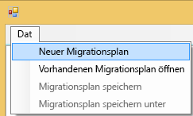

2. Klicken Sie im Dialogfeld **Power BI Embedded Ressourcengruppe auswählen** auf die Dropdownliste „Umgebung“ und wählen Sie „Produkt“ aus.

3. Sie werden aufgefordert, sich anzumelden. Verwenden Sie Ihre Azure-Abonnementanmeldung.

   > [!IMPORTANT]
   > Dies ist **nicht** Ihr Office 365-Organisationskonto, mit dem Sie sich bei Power BI anmelden.

4. Wählen Sie das Azure-Abonnement, in dem Ihre Power BI Embedded Arbeitsbereichsammlungen gespeichert sind.

    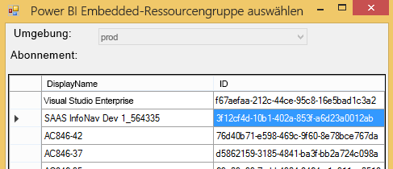
5. Wählen Sie unter der Abonnementliste die **Ressourcengruppe**, die Ihre Arbeitsbereichsammlungen enthält, und klicken Sie auf **Auswählen**.

    

6. Wählen Sie **Analysieren** aus. Dadurch erhalten Sie einen Bestand der Elemente in Ihrem Azure-Abonnement, um mit Ihrem Plan zu beginnen.

    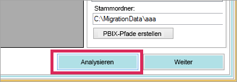

   > [!NOTE]
   > Der Analyseprozess dauert einige Minuten.Dies ist abhängig von der Anzahl der Arbeitsbereichsammlungen und wie viel Inhalt in der Arbeitsbereichsammlung vorhanden ist.

7. Wenn **Analysieren** abgeschlossen ist, werden Sie aufgefordert, den Migrationsplan zu speichern.

Jetzt haben Sie den Migrationsplan mit Ihrem Azure-Abonnement verbunden. Lesen Sie unten, um mehr über Arbeitsfluss mit Ihrem Migrationsplan zu erfahren. Dies schließt „Analysieren und Planen der Migration“, Downloads, „Gruppen erstellen“ und das Hochladen mit ein.

### <a name="save-your-migration-plan"></a>Speichern des Migrationsplans

Sie können den Migrationsplan zur späteren Verwendung speichern. Dadurch wird eine XML-Datei erstellt, die alle Informationen aus Ihrem Migrationsplan enthält.

Führen Sie die folgenden Schritte aus, um den Migrationsplan zu speichern.

1. Klicken Sie auf **Datei** > **Migrationsplan speichern**.

    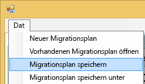

2. Benennen Sie die Datei oder verwenden Sie den Namen der generierten Datei, und klicken Sie auf **Speichern**.

### <a name="open-an-existing-migration-plan"></a>Öffnen Sie einen vorhandenen Migrationsplan

Sie können einen gespeicherten Migrationsplan öffnen, um die Arbeit an Ihrer Migration fortzuführen.

Führen Sie die folgenden Schritte aus, um den vorhandenen Migrationsplan zu öffnen.

1. Klicken Sie auf **Datei** > **Öffnen des vorhandenen Migrationsplans**.

    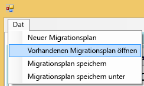

2. Klicken Sie auf Ihre Migrationsdatei und dann auf **Öffnen**.

## <a name="step-1-analyze--plan-migration"></a>Schritt 1: Analysieren und Planen der Migration

Die Registerkarte **Analysieren und Planen der Migration** bietet Ihnen einen Überblick darüber, was sich derzeit in Ihrer Azure-Abonnementressourcengruppe befindet.

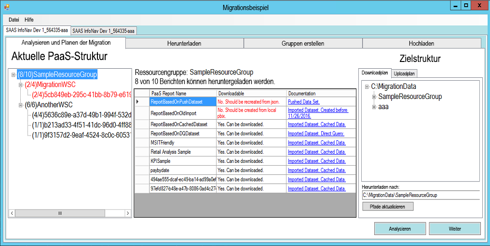

Betrachten wir als Beispiel die *SampleResourceGroup*.

### <a name="paas-topology"></a>PaaS-Topologie

Dies ist eine Auflistung Ihrer *Ressourcengruppe > Arbeitsbereichsammlungen > Arbeitsbereiche*. Die Sammlungen der Ressourcengruppe und des Arbeitsbereichs zeigen einen Anzeigenamen an. Die Arbeitsbereiche zeigen eine GUID an.

Die Elemente in der Liste zeigen außerdem eine Farbe und eine Zahl im Format (#/#) an. Hiermit wird die Anzahl der Berichte, die heruntergeladen werden können, angegeben.
Schwarz bedeutet, dass alle Berichte heruntergeladen werden können.

Rot bedeutet, dass einige Berichte nicht heruntergeladen werden können. Die linke Zahl gibt die Gesamtanzahl der Berichte an, die heruntergeladen werden können. Die rechte Zahl gibt die Gesamtanzahl der Berichte in der Gruppierung an.

Sie können ein Element in der PaaS-Topologie auswählen, um die Berichte im Berichtabschnitt anzuzeigen.

### <a name="reports"></a>Berichte

Im Berichtabschnitt werden die verfügbaren Berichte aufgelistet und es wird angezeigt, ob der Bericht heruntergeladen werden kann oder nicht.


### <a name="target-structure"></a>Zielstruktur

Unter **Zielstruktur** geben Sie an, in welches Verzeichnis und auf welche Weise das Tool Berichte herunterladen soll.

#### <a name="download-plan"></a>Downloadplan

Ein Pfad wird automatisch für Sie erstellt. Sie können diesen Pfad bei Bedarf ändern. Wenn Sie den Pfad ändern, müssen Sie **Pfade aktualisieren** auswählen.

> [!NOTE]
> Dies führt den Download nicht tatsächlich aus. Dadurch wird nur die Struktur angeben, in die die Berichte heruntergeladen werden.

#### <a name="upload-plan"></a>Uploadplan

Hier geben Sie ein Präfix ein, das für die Arbeitsbereiche verwendet werden soll, die im Power BI-Dienst erstellt werden. Hinter dem Präfix steht die GUID für den Arbeitsbereich, der in Azure vorhanden war.

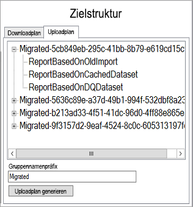

> [!NOTE]
> Dadurch wird die Gruppen nicht tatsächlich im Power BI-Dienst erstellt. Hiermit wird nur die Namensstruktur für die Gruppen definiert.

Wenn Sie das Präfix ändern, müssen Sie **Uploadplan generieren** auswählen.

Sie können mit der rechten Maustaste auf eine Gruppe klicken und die Gruppe innerhalb des Uploadplans direkt umbenennen, falls gewünscht.

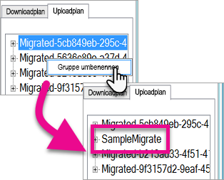

> [!NOTE]
> Der Name der *Gruppe* darf keine Leerzeichen oder ungültige Zeichen enthalten.

## <a name="step-2-download"></a>Schritt 2: Herunterladen

Auf der Registerkarte **Herunterladen** sehen Sie die Liste der Berichte und die zugeordneten Metadaten. Sie können sowohl den Exportstatus, als auch den vorherige Exportstatus sehen.

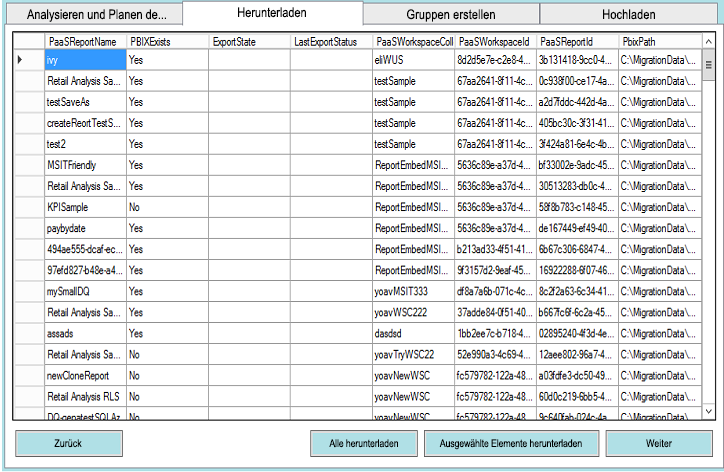

Sie haben zwei Optionen.

* Wählen Sie bestimmte Berichte und klicken Sie auf **Download ausgewählt**
* Wählen Sie **Alle Herunterladen**.


Bei einem erfolgreichen Download sehen Sie den Status *Fertig* und dies spiegelt wider, dass die PBIX-Datei vorhanden ist.

Nachdem der Download abgeschlossen ist, klicken Sie auf die Registerkarte **Gruppen erstellen**.

## <a name="step-3-create-groups"></a>Schritt 3: Gruppen erstellen

Nachdem Sie die verfügbaren Berichte heruntergeladen haben, können Sie zur Registerkarte **Gruppen erstellen** wechseln. Auf dieser Registerkarte werden die Arbeitsbereiche innerhalb des Power BI-Diensts anhand des Migrationsplans erstellt, den Sie erstellt haben. Der Arbeitsbereich wird mit dem Namen erstellt, den Sie auf der Registerkarte **Hochladen** innerhalb von **Analyze & Plan Migration** (Analysieren und Planen Sie die Migration) bereitgestellt haben.


Sie können entweder auf **Create Selected Groups** (Ausgewählte Gruppen erstellen) oder **Create All Missing Groups** (Alle fehlenden Gruppen erstellen) klicken, um die Arbeitsbereiche zu erstellen.

Wenn Sie eine dieser Optionen auswählen, werden Sie aufgefordert, sich anzumelden. *Sie sollten Ihre Anmeldeinformationen für den Power BI-Dienst verwenden, in dem Sie die Arbeitsbereiche erstellen möchten.*

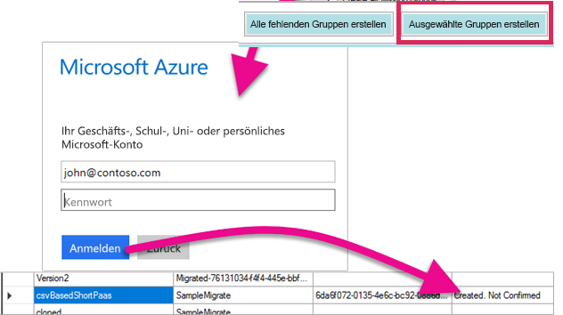

Dadurch wird der Arbeitsbereich im Power BI-Dienst erstellt. Dadurch werden die Berichte nicht in den Arbeitsbereich hochgeladen.

Sie können überprüfen, ob der Arbeitsbereich erstellt wurde, indem Sie sich bei Power BI anmelden und überprüfen, ob der Arbeitsbereich vorhanden ist. Sie werden bemerken, dass nichts im Arbeitsbereich vorhanden ist.

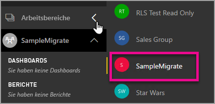

Nachdem der Arbeitsbereich erstellt wurde, können Sie mit der Registerkarte **Hochladen** fortfahren.

## <a name="step-4-upload"></a>Schritt 4: Hochladen

Auf der Registerkarte **Hochladen** werden dann diese Berichte in Power BI-Dienst hochgeladen. Sie sehen eine Liste der Berichte, die wir auf der Registerkarte „Herunterladen“ zusammen mit dem Zielgruppennamen, der auf Ihrem Migrationsplan basiert, heruntergeladen haben.


Sie können die ausgewählten Berichte oder alle Berichte hochladen. Sie können auch den Uploadstatus zurücksetzen, um Elemente erneut hochzuladen.

Sie haben auch die Möglichkeit auszuwählen, was passieren soll, wenn ein Bericht mit dem gleichen Namen vorhanden ist. Sie können zwischen **Abbrechen**, **Ignorieren** und **Überschreiben** wählen.

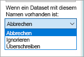

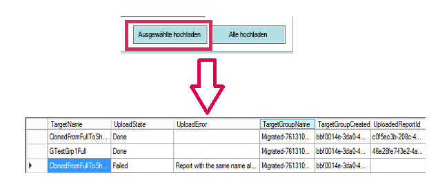

### <a name="duplicate-report-names"></a>Berichtsnamen duplizieren

Wenn Sie einen Bericht mit dem gleichen Namen haben, Sie aber wissen, dass es sich dabei um einen anderen Bericht handelt, müssen Sie den **Zielnamen** des Berichts ändern. Sie können den Namen ändern, indem Sie die Migrationsplan-XML manuell bearbeiten.

Sie müssen das Migrationstool schließen, um die Änderung vorzunehmen und dann das Tool und den Migrationsplan erneut öffnen.

Im obigen Beispiel konnte einer der geklonten Berichte nicht anzeigen, dass ein Bericht mit dem gleichen Namen vorhanden war. Wenn wir uns die Migrationsplan-XML betrachten, sehen wir Folgendes.

```xml
<ReportMigrationData>
    <PaaSWorkspaceCollectionName>SampleWorkspaceCollection</PaaSWorkspaceCollectionName>
    <PaaSWorkspaceId>4c04147b-d8fc-478b-8dcb-bcf687149823</PaaSWorkspaceId>
    <PaaSReportId>525a8328-b8cc-4f0d-b2cb-c3a9b4ba2efe</PaaSReportId>
    <PaaSReportLastImportTime>1/3/2017 2:10:19 PM</PaaSReportLastImportTime>
    <PaaSReportName>cloned</PaaSReportName>
    <IsPushDataset>false</IsPushDataset>
    <IsBoundToOldDataset>false</IsBoundToOldDataset>
    <PbixPath>C:\MigrationData\SampleResourceGroup\SampleWorkspaceCollection\4c04147b-d8fc-478b-8dcb-bcf687149823\cloned-525a8328-b8cc-4f0d-b2cb-c3a9b4ba2efe.pbix</PbixPath>
    <ExportState>Done</ExportState>
    <LastExportStatus>OK</LastExportStatus>
    <SaaSTargetGroupName>SampleMigrate</SaaSTargetGroupName>
    <SaaSTargetGroupId>6da6f072-0135-4e6c-bc92-0886d8aeb79d</SaaSTargetGroupId>
    <SaaSTargetReportName>cloned</SaaSTargetReportName>
    <SaaSImportState>Failed</SaaSImportState>
    <SaaSImportError>Report with the same name already exists</SaaSImportError>
</ReportMigrationData>
```

Für das fehlerhafte Element können wir den Namen des SaaSTargetReportName-Objekts ändern.

```xml
<SaaSTargetReportName>cloned2</SaaSTargetReportName>
```

Wir können dann den Plan im Migrationstool erneut öffnen und den fehlerhaften Bericht hochladen.

Zurück in Power BI sehen wir, dass die Berichte und Datasets im Arbeitsbereich hochgeladen wurden.

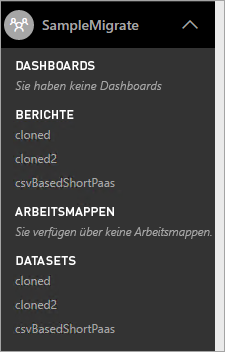

<a name="upload-local-file"></a>

### <a name="upload-a-local-pbix-file"></a>Upload einer lokalen PBIX-Datei

Sie können eine lokale Version von einer Power BI Desktop-Datei hochladen. Schließen Sie das Tool, bearbeiten Sie den XML-Code und fügen Sie den vollständigen Pfad in Ihre lokale PBIX-Datei in die **PbixPath**-Eigenschaft ein.

```xml
<PbixPath>[Full Path to PBIX file]</PbixPath>
```

Nachdem Sie den XML-Code bearbeitet haben, öffnen Sie den Plan innerhalb des Migrationstools erneut und laden den Bericht hoch.

<a name="directquery-reports"></a>

### <a name="directquery-reports"></a>DirectQuery-Berichte

Sie müssen eine Aktualisierung durchführen, um die Verbindungszeichenfolge für DirectQuery-Berichte zu aktualisieren. Dies kann in *powerbi.com* erfolgen, oder Sie können die Verbindungszeichenfolge aus Power BI Embedded (PaaS) programmgesteuert abfragen. Ein Beispiel finden Sie unter [Extrahieren der DirectQuery-Verbindungszeichenfolge aus dem PaaS-Bericht](migrate-code-snippets.md#extract-directquery-connection-string-from-paas-report).

Sie können dann die Verbindungszeichenfolge für das Dataset im Power BI-Dienst (SaaS) aktualisieren und die Anmeldeinformationen für die Datenquelle festlegen. Betrachten Sie die folgenden Beispiele, um zu sehen wie dies funktioniert.

* [Die Verbindungszeichenfolge „DirectQuery aktualisieren“ ist ein SaaS-Arbeitsbereich](migrate-code-snippets.md#update-directquery-connection-string-is-saas-workspace)
* [Festlegen von Anmeldeinformationen im SaaS-Arbeitsbereich](migrate-code-snippets.md#set-directquery-credentials-in-saas-workspace)

## <a name="embedding"></a>Einbetten

Da Ihre Berichte aus dem Power BI Embedded-Azure-Dienst zum Power BI-Dienst migriert wurden, können Sie nun die Anwendung aktualisieren und damit beginnen, die Berichte in diesem Arbeitsbereich einzubetten.

Weitere Informationen dazu finden Sie unter [Migrieren von Inhalten aus Arbeitsbereichssammlungen von Power BI Embedded zu Power BI](migrate-from-powerbi-embedded.md).

## <a name="next-steps"></a>Nächste Schritte

[Einbetten mit Power BI](embedding.md)  
[Migrieren von Inhalten aus Power BI Embedded-Arbeitsbereichsammlungen zu Power BI](migrate-from-powerbi-embedded.md)  
[Power BI Premium – Beschreibung](../../admin/service-premium-what-is.md)  
[JavaScript-API-Git-Repository](https://github.com/Microsoft/PowerBI-JavaScript)  
[Power BI-C#-Git-Repository](https://github.com/Microsoft/PowerBI-CSharp)  
[JavaScript-Einbettungsbeispiel](https://microsoft.github.io/PowerBI-JavaScript/demo/)  
[Power BI Premium-Whitepaper](https://aka.ms/pbipremiumwhitepaper)  

Weitere Fragen? [Stellen Sie Ihre Frage in der Power BI-Community.](https://community.powerbi.com/)