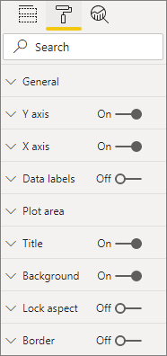
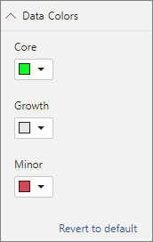

# <a name="build-a-bar-chart"></a>Erstellen eines Balkendiagramms

Dieser Artikel enthält eine Schrittanleitung, um mithilfe von Code ein einfaches Power BI-Balkendiagrammvisual zu erstellen. Das vollständige Codebeispiel finden Sie unter [https://github.com/Microsoft/PowerBI-visuals-sampleBarChart](https://github.com/Microsoft/PowerBI-visuals-sampleBarChart).

## <a name="view-model"></a>Ansichtsmodell
Es ist wichtig, zunächst das Ansichtsmodell für das Balkendiagramm zu definieren und während der Erstellung die für Ihr Visual verfügbar gemachten Elemente zu durchlaufen.

```typescript
/**
 * Interface for BarCharts viewmodel.
 *
 * @interface
 * @property {BarChartDataPoint[]} dataPoints - Set of data points the visual will render.
 * @property {number} dataMax                 - Maximum data value in the set of data points.
 */
interface BarChartViewModel {
    dataPoints: BarChartDataPoint[];
    dataMax: number;
};

/**
 * Interface for BarChart data points.
 *
 * @interface
 * @property {number} value    - Data value for the point.
 * @property {string} category - Corresponding category of the data value.
 */
interface BarChartDataPoint {
    value: number;
    category: string;
};
```

### <a name="use-static-data"></a>Verwenden statischer Daten

Die Verwendung statischer Daten ist eine hervorragende Möglichkeit, Ihr Visual ohne Datenbindung zu testen. Ihr Ansichtsmodell ändert sich nicht, auch wenn Sie in einem späteren Schritt eine Datenbindung hinzufügen.

```typescript
let testData: BarChartDataPoint[] = [
    {
        value: 10,
        category: 'a'
    },
    {
        value: 20,
        category: 'b'
    },
    {
        value: 1,
        category: 'c'
    },
    {
        value: 100,
        category: 'd'
    },
    {
        value: 500,
        category: 'e'
    }];

let viewModel: BarChartViewModel = {
    dataPoints: testData,
    dataMax: d3.max(testData.map((dataPoint) => dataPoint.value))
};
```

## <a name="data-binding"></a>Datenbindung 
Sie fügen eine Datenbindung hinzu, indem Sie Ihre Visualfunktionen in *capabilities.json* definieren. Der Beispielcode enthält bereits ein Schema, das Sie verwenden können.

Die Datenbindung wird in Power BI auf den Ursprung für ein **Feld** angewendet.


### <a name="add-data-roles"></a>Hinzufügen von Datenrollen
Der Beispielcode enthält bereits Datenrollen, aber Sie können diese anpassen.

- `displayName` ist der Name, der im Ursprung für das **Feld** angezeigt wird.
- `name` ist der interne Name, mit dem auf die Datenrolle verwiesen wird.
- `kind` steht für die Art des Felds. Felder für die *Gruppierung* (0) weisen diskrete Werte auf. Felder für ein *Measure* (1) weisen numerische Werte auf.

```json
"dataRoles": [
    {
        "displayName": "Category Data",
        "name": "category",
        "kind": 0
    },
    {
        "displayName": "Measure Data",
        "name": "measure",
        "kind": 1
    }
],
```

Weitere Informationen finden Sie unter [Datenrollen](./capabilities.md#define-the-data-fields-that-your-visual-expects-dataroles).

### <a name="add-conditions-to-dataviewmapping"></a>Hinzufügen von Bedingungen zu „DataViewMapping“
Definieren Sie Bedingungen innerhalb von `dataViewMappings`, um festzulegen, wie viele Felder jeder Feldursprung binden kann. Verwenden Sie den internen `name`-Wert der Datentrolle, um auf jedes Feld zu verweisen.

```json
    "dataViewMappings": [
        {
            "conditions": [
                {
                    "category": {
                        "max": 1
                    },
                    "measure": {
                        "max": 1
                    }
                }
            ],
        }
    ]
```

Weitere Informationen finden Sie unter [Datenansichtszuordnung](./dataview-mappings.md).

### <a name="define-and-use-visualtransform"></a>Definieren und Verwenden von „visualTransform“
`DataView` ist die Struktur, die Power BI für Ihr Visual bereitstellt. Sie enthält die abgefragten Daten für die Visualisierung. `DataView` kann Daten jedoch in unterschiedlicher Form bereitstellen, beispielsweise als Kategorie- oder Tabellendaten. Um ein Visual für Kategoriedaten (wie z. B. ein Balkendiagramm) zu erstellen, müssen Sie lediglich die category-Eigenschaft für die `DataView` verwenden. Durch das Definieren von `visualTransform` können Sie `DataView` in ein Ansichtsmodell konvertieren, das von Ihrem Visual genutzt wird.

Um Farben zuzuweisen und beim Definieren einzelner Datenpunkte auszuwählen, verwenden Sie `IVisualHost`. 

```typescript
/**
 * Function that converts queried data into a view model that will be used by the visual
 *
 * @function
 * @param {VisualUpdateOptions} options - Contains references to the size of the container
 *                                        and the dataView which contains all the data
 *                                        the visual had queried.
 * @param {IVisualHost} host            - Contains references to the host which contains services
 */
function visualTransform(options: VisualUpdateOptions, host: IVisualHost): BarChartViewModel {
    /*Convert dataView to your viewModel*/
}

```

## <a name="color"></a>Farbe 
Die Farbgebung wird als einer der Dienste verfügbar gemacht, die für `IVisualHost` zur Verfügung stehen.

### <a name="add-color-to-data-points"></a>Hinzufügen von Farbe zu Datenpunkten
Jede Datenpunkt wird durch eine andere Farbe dargestellt. Sie fügen „color“ zur `BarChartDataPoint`-Schnittstelle hinzu.

```typescript
/**
 * Interface for BarChart data points.
 *
 * @interface
 * @property {number} value    - Data value for the point.
 * @property {string} category - Corresponding category of the data value.
 * @property {string} color    - Color corresponding to the data point.
 */
interface BarChartDataPoint {
    value: number;
    category: string;
    color: string;
};
```

### <a name="the-colorpalette-service"></a>Der Dienst „colorPalette“
Der Dienst `colorPalette` verwaltet die in Ihrem Visual verwendeten Farben. Die zugehörige Instanz ist in `IVisualHost` verfügbar.

### <a name="assign-color-to-data-points"></a>Zuweisen von Farbe zu Datenpunkten
Sie haben `visualTransform` als Konstrukt zum Konvertieren von `dataView` in ein Ansichtsmodell definiert, das ein Balkendiagramm verwenden kann. Da Sie die Datenpunkte in `visualTransform` durchlaufen, ist dies auch der ideale Ort zum Zuweisen von Farben.

```typescript
let colorPalette: IColorPalette = host.colorPalette; // host: IVisualHost
for (let i = 0, len = Math.max(category.values.length, dataValue.values.length); i < len; i++) {
    barChartDataPoints.push({
        category: category.values[i],
        value: dataValue.values[i],
        color: colorPalette.getColor(category.values[i]).value,
    });
}
```

## <a name="selection-and-interactions"></a>Auswahl und Interaktionen
Durch eine Auswahl kann der Benutzer sowohl mit Ihrem Visual als auch mit anderen Visuals interagieren. 

### <a name="add-selection-to-each-data-point"></a>Hinzufügen einer Auswahl zu jedem Datenpunkt
Da jeder Datenpunkt eindeutig ist, fügen Sie jedem Datenpunkt eine Auswahl hinzu. Sie fügen die selection-Eigenschaft in der `BarChartDataPoint`-Schnittstelle hinzu.

```typescript
/**
 * Interface for BarChart data points.
 *
 * @interface
 * @property {number} value             - Data value for the point.
 * @property {string} category          - Corresponding category of data value.
 * @property {string} color             - Color corresponding to data point.
 * @property {ISelectionId} selectionId - Id assigned to data point for cross filtering
 *                                        and visual interaction.
 */
interface BarChartDataPoint {
    value: number;
    category: string;
    color: string;
    selectionId: ISelectionId;
};
```

### <a name="assign-selection-ids-to-each-data-point"></a>Zuweisen von Auswahl-IDs zu jedem Datenpunkt
Da Sie die Datenpunkte in `visualTransform` durchlaufen, ist dies auch der ideale Ort zum Erstellen von Auswahl-IDs. Die Hostvariable ist ein `IVisualHost` mit Diensten, die das Visual verwenden kann – z. B. für Farben und Auswahlgenerator. 

Verwenden Sie die `createSelectionIdBuilder`-Factorymethode in `IVisualHost`, um eine neue Auswahl-ID zu erstellen. Erstellen Sie einen neuen Auswahlgenerator für jeden Datenpunkt.

Da Sie eine Auswahl ausschließlich basierend auf der Kategorie treffen, müssen Sie nur eine Auswahl mit `withCategory` definieren.

```typescript
for (let i = 0, len = Math.max(category.values.length, dataValue.values.length); i < len; i++) {
    barChartDataPoints.push({
        category: category.values[i],
        value: dataValue.values[i],
        color: colorPalette.getColor(category.values[i]).value,
        selectionId: host.createSelectionIdBuilder()
            .withCategory(category, i)
            .createSelectionId()
    });
}
```

Weitere Informationen finden Sie unter [Erstellen einer Instanz des Auswahlgenerators](./selection-api.md#create-an-instance-of-the-selection-builder).

### <a name="interact-with-data-points"></a>Interaktion mit Datenpunkten
Sie können mit jedem Balken des Balkendiagramms interagieren, sobald dem Datenpunkt eine Auswahl-ID zugewiesen wurde. Das Balkendiagramm lauscht auf `click`-Ereignisse.

Verwenden Sie die `selectionManager`-Factorymethode in `IVisualHost`, um einen Auswahl-Manager zur Kreuzfilterung und zum Löschen einer Auswahl zu erstellen.

```typescript
let selectionManager = this.selectionManager;

//This must be an anonymous function instead of a lambda because
//d3 uses 'this' as the reference to the element that was clicked.
bars.on('click', function(d) {
    selectionManager.select(d.selectionId).then((ids: ISelectionId[]) => {
        bars.attr({
            'fill-opacity': ids.length > 0 ? BarChart.Config.transparentOpacity : BarChart.Config.solidOpacity
        });

        d3.select(this).attr({
            'fill-opacity': BarChart.Config.solidOpacity
        });
    });

    (<Event>d3.event).stopPropagation();
});
```

Weitere Informationen finden Sie unter [Verwenden von „SelectionManager“](./selection-api.md#how-to-use-selectionmanager-to-select-data-points).

## <a name="static-objects"></a>Statische Objekte

Sie können dem Bereich **Eigenschaften** Objekte hinzufügen, um das Visual weiter anzupassen. Bei diesen Anpassungen kann es sich um Änderungen an der Benutzeroberfläche oder Änderungen in Bezug auf die abgefragten Daten handeln. Das Beispiel verwendet statische Objekte zum Rendern der X-Achse für das Balkendiagramm.

Sie können Objekt im Bereich **Eigenschaften** ein- oder ausschalten.



### <a name="define-objects-in-capabilities"></a>Definieren von Objekten in „capabilities.json“
Definieren Sie für Objekte, die Sie im Bereich **Eigenschaften** anzeigen möchten, eine `objects`-Eigenschaft in Ihrer Datei *capabilities.json*.
- `enableAxis` ist der interne Name, auf den `dataView` verweist. 
- `displayName` ist der Name, der im Bereich **Eigenschaften** angezeigt wird.
- `bool` ist ein primitiver Wert, der üblicherweise mit statischen Objekten wie etwa Textfeldern oder Schaltern verwendet wird.
- `show` ist eine spezielle Eigenschaft für `properties`, die den Schalter `show` für das Objekt aktiviert. Da `show` ein Schalter ist, lautet sein Typ `bool`.


```typescript
"objects": {
    "enableAxis": {
        "displayName": "Enable Axis",
        "properties": {
            "show": {
                "displayName": "Enable Axis",
                "type": { "bool": true }
            }
        }
    }
}
```

Weitere Informationen finden Sie unter [Objekte](./objects-properties.md).

### <a name="define-property-settings"></a>Definieren von Eigenschaftseinstellungen

In den folgenden Abschnitten werden die wichtigsten Prinzipien bei der Definition von Eigenschaftseinstellungen beschrieben. Sie können auch die im `powerbi-visuals-utils-dataviewutils`-Paket definierten Hilfsklassen zur Definition von Eigenschaftseinstellungen verwenden. Weitere Informationen finden Sie in der Dokumentation und in den Beispielen zur [DataViewObjectsParser](https://github.com/Microsoft/powerbi-visuals-utils-dataviewutils/blob/master/docs/api/data-view-objects-parser.md)-Klasse.


Wenngleich optional, ist es sinnvoll, die meisten Einstellungen in einem einzelnen Objekt zusammenzufassen, um den Verweis zu vereinfachen.

```typescript
/**
 * Interface for BarCharts viewmodel.
 *
 * @interface
 * @property {BarChartDataPoint[]} dataPoints - Set of data points the visual will render.
 * @property {number} dataMax                 - Maximum data value in the set of data points.
 * @property {BarChartSettings} settings      - Object property settings
 */
interface BarChartViewModel {
    dataPoints: BarChartDataPoint[];
    dataMax: number;
    settings: BarChartSettings;
};

/**
 * Interface for BarChart settings.
 *
 * @interface
 * @property "show" enableAxis - Object property that allows axis to be enabled.
 */
interface BarChartSettings {
    enableAxis: {
        show: boolean;
    };
}
```

### <a name="define-and-use-objectenumerationutility"></a>Definieren und Verwenden von „ObjectEnumerationUtility“
Eigenschaftenwerte von Objekten stehen als Metadaten für `dataView` zur Verfügung, aber es ist kein Dienst vorhanden, um diese Eigenschaften abzurufen. `ObjectEnumerationUtility` ist ein Satz statischer Funktionen, die Sie zum Abrufen von Objektwerten aus `dataView` und für andere Visualprojekte verwenden können. `ObjectEnumerationUtility` ist optional, aber hervorragend zum Durchlaufen von `dataView` zum Abrufen von Objekteigenschaften geeignet.

```typescript
/**
 * Gets property value for a particular object.
 *
 * @function
 * @param {DataViewObjects} objects - Map of defined objects.
 * @param {string} objectName       - Name of desired object.
 * @param {string} propertyName     - Name of desired property.
 * @param {T} defaultValue          - Default value of desired property.
 */
export function getValue<T>(objects: DataViewObjects, objectName: string, propertyName: string, defaultValue: T ): T {
    if(objects) {
        let object = objects[objectName];
        if(object) {
            let property: T = object[propertyName];
            if(property !== undefined) {
                return property;
            }
        }
    }
    return defaultValue;
}
```

Den Quellcode finden Sie unter [objectEnumerationUtility.ts](https://github.com/Microsoft/PowerBI-visuals-sampleBarChart/blob/master/src/objectEnumerationUtility.ts).

### <a name="retrieve-property-values-from-dataview"></a>Abrufen von Eigenschaftswerten aus „dataView“
`visualTransform` ist der ideale Ort zum Bearbeiten des Ansichtsmodells für das Visual. Um dieses Muster beizubehalten, rufen Sie die Objekteigenschaften aus `dataView` ab.

Definieren Sie den Standardzustand der Eigenschaft, und verwenden Sie `getValue` zum Abrufen der Eigenschaft aus `dataView`.

```typescript
let defaultSettings: BarChartSettings = {
    enableAxis: {
        show: false,
    }
};

let barChartSettings: BarChartSettings = {
    enableAxis: {
        show: getValue<boolean>(objects, 'enableAxis', 'show', defaultSettings.enableAxis.show),
    }
}
```

### <a name="populate-property-pane-with-enumerateobjectinstances"></a>Auffüllen des Eigenschaftenbereichs mit „enumerateObjectInstances“
Die optionale Methode `enumerateObjectInstances` in `IVisual` listet alle Objekte auf und platziert sie im Bereich **Eigenschaften**. Jedes Objekt wird mit `enumerateObjectInstances` aufgerufen. Der Objektname ist in `EnumerateVisualObjectInstancesOptions` verfügbar.

Definieren Sie für jedes Objekt die Eigenschaft mit dem aktuellen Zustand.

```typescript
/**
 * Enumerates through the objects defined in the capabilities and adds the properties to the format pane
 *
 * @function
 * @param {EnumerateVisualObjectInstancesOptions} options - Map of defined objects
 */
public enumerateObjectInstances(options: EnumerateVisualObjectInstancesOptions): VisualObjectInstanceEnumeration {
    let objectName = options.objectName;
    let objectEnumeration: VisualObjectInstance[] = [];

    switch(objectName) {
        case 'enableAxis':
            objectEnumeration.push({
                objectName: objectName,
                properties: {
                    show: this.barChartSettings.enableAxis.show,
                },
                selector: null
            });
    };

    return objectEnumeration;
}
```

### <a name="control-property-update-logic"></a>Steuern der Logik für die Eigenschaftsaktualisierung
Sobald ein Objekt dem Bereich **Eigenschaften** hinzugefügt wurde, löst jedes Umschalten eine Aktualisierung aus. Fügen Sie eine spezifische Objektlogik in `if`-Blöcken hinzu:

```typescript
if(settings.enableAxis.show) {
    let margins = BarChart.Config.margins;
    height -= margins.bottom;
}
```

## <a name="databound-objects"></a>Datengebundene Objekte
Datengebundene Objekte ähneln statischen Objekten, werden aber üblicherweise zur Datenauswahl verwendet. Beispielsweise können Sie die einem Datenpunkt zugeordnete Farbe ändern.



### <a name="define-object-in-capabilities"></a>Definieren eines Objekts in „capabilities.json“
Definieren Sie ähnlich wie bei statischen Objekten ein weiteres Objekt in der Datei *capabilities.json*. 
- `colorSelector` ist der interne Name, auf den `dataView` verweist.
- `displayName` ist der Name, der im Bereich **Eigenschaften** angezeigt wird.
- `fill` ist ein struktureller Objektwert, der keinem primitiven Typ zugeordnet ist.

```typescript
"colorSelector": {
    "displayName": "Data Colors",
    "properties": {
        "fill": {
            "displayName": "Color",
            "type": {
                "fill": {
                    "solid": {
                        "color": true
                    }
                }
            }
        }
    }
}
```

Weitere Informationen finden Sie unter [Objekte](./objects-properties.md).

### <a name="use-objectenumerationutility"></a>Verwenden von „ObjectEnumerationUtility“
Wie bei statischen Objekten müssen Sie Objektdetails aus `dataView` abrufen. Die Objektwerte sind jedoch nicht in den Metadaten enthalten, sondern werden mit jeder Kategorie verknüpft.

```typescript
/**
 * Gets property value for a particular object in a category.
 *
 * @function
 * @param {DataViewCategoryColumn} category - List of category objects.
 * @param {number} index                    - Index of category object.
 * @param {string} objectName               - Name of desired object.
 * @param {string} propertyName             - Name of desired property.
 * @param {T} defaultValue                  - Default value of desired property.
 */
export function getCategoricalObjectValue<T>(category: DataViewCategoryColumn, index: number, objectName: string, propertyName: string, defaultValue: T): T {
    let categoryObjects = category.objects;

    if(categoryObjects) {
        let categoryObject: DataViewObject = categoryObjects[index];
        if(categoryObject) {
            let object = categoryObject[objectName];
            if(object) {
                let property: T = object[propertyName];
                if(property !== undefined) {
                    return property;
                }
            }
        }
    }
    return defaultValue;
}
```

Den Quellcode finden Sie unter [objectEnumerationUtility.ts](https://github.com/Microsoft/PowerBI-visuals-sampleBarChart/blob/master/src/objectEnumerationUtility.ts).

### <a name="define-default-color-and-retrieve-categorical-object-from-dataview"></a>Definieren einer Standardfarbe und Abrufen eines Kategorieobjekts aus „dataView“
Jede Farbe ist jetzt einer Kategorie in `dataView` zugeordnet. Sie können jeden Datenpunkt auf die entsprechende Farbe festlegen.

```typescript
for (let i = 0, len = Math.max(category.values.length, dataValue.values.length); i < len; i++) {
    let defaultColor: Fill = {
        solid: {
            color: colorPalette.getColor(category.values[i]).value
        }
    }

    barChartDataPoints.push({
        category: category.values[i],
        value: dataValue.values[i],
        color: getCategoricalObjectValue<Fill>(category, i, 'colorSelector', 'fill', defaultColor).solid.color,
        selectionId: host.createSelectionIdBuilder()
            .withCategory(category, i)
            .createSelectionId()
    });
}
```

### <a name="populate-property-pane-with-enumerateobjectinstances"></a>Auffüllen des Eigenschaftenbereichs mit „enumerateObjectInstances“
Verwenden Sie `enumerateObjectInstances`, um den Bereich **Eigenschaften** mit Objekten aufzufüllen. 

Für diese Instanz fügen Sie eine Farbauswahl hinzu, um jede Kategorie im Bereich **Eigenschaften** zu rendern. Fügen Sie hierzu der `switch`-Anweisung für `colorSelector` einen weiteren Fall hinzu, und durchlaufen Sie jeden Datenpunkt mit der zugeordneten Farbe. 

Die Auswahl ist erforderlich, um die Farbe dem Datenpunkt zuzuordnen.

```typescript
/**
 * Enumerates through the objects defined in the capabilities and adds the properties to the format pane
 *
 * @function
 * @param {EnumerateVisualObjectInstancesOptions} options - Map of defined objects
 */
public enumerateObjectInstances(options: EnumerateVisualObjectInstancesOptions): VisualObjectInstanceEnumeration {
    let objectName = options.objectName;
    let objectEnumeration: VisualObjectInstance[] = [];

    switch(objectName) {
        case 'enableAxis':
            objectEnumeration.push({
                objectName: objectName,
                properties: {
                    show: this.barChartSettings.enableAxis.show,
                },
                selector: null
            });
            break;
        case 'colorSelector':
            for(let barDataPoint of this.barDataPoints) {
                objectEnumeration.push({
                    objectName: objectName,
                    displayName: barDataPoint.category,
                    properties: {
                        fill: {
                            solid: {
                                color: barDataPoint.color
                            }
                        }
                    },
                    selector: barDataPoint.selectionId.getSelector()
                });
            }
            break;
    };

    return objectEnumeration;
}
```

Nachdem ein Selektor für jede Eigenschaft angegeben wurde, erhalten Sie das folgende `dataView`-Objektarray:


Jedes Element im Array `dataViews[0].categorical.categories[0].objects` entspricht der konkreten Kategorie des Datasets.

Die Funktion `getCategoricalObjectValue` stellt lediglich eine bequeme Möglichkeit für den Zugriff auf Eigenschaften über ihren Kategorieindex dar. Sie müssen einen `objectName`- und einen `propertyName`-Wert angeben, der dem Objekt und der Eigenschaft in *capabilities.json* entspricht.

## <a name="other-features"></a>Weitere Features 
Sie können dem Balkendiagramm ein Schiebereglersteuerelement oder QuickInfos hinzufügen. Den hinzuzufügenden Code finden Sie in den Commits unter [Add a property pane slider to control opacity](https://github.com/Microsoft/PowerBI-visuals-sampleBarChart/commit/e2e0bc5888d9a3ca305a7a7af5046068645c8b30) (Hinzufügen eines Schiebereglers zum Steuern der Deckkraft im Eigenschaftenbereich) und [Add support for tooltips](https://github.com/Microsoft/PowerBI-visuals-sampleBarChart/commit/981b021612d7b333adffe9f723ab27783c76fb14) (Hinzufügen von Unterstützung für QuickInfos). Weitere Informationen finden Sie unter [QuickInfos in Power BI-Visuals](./add-tooltips.md).

## <a name="packaging"></a>Paketerstellung

Damit Sie Ihr Visual in [Power BI Desktop](https://powerbi.microsoft.com/desktop/) laden oder über den [Power BI-Visualkatalog](https://visuals.powerbi.com/) mit anderen Benutzern teilen können, müssen Sie ein Paket erstellen. Navigieren Sie zum Stammordner Ihres Visualprojekts, der die Datei *pbiviz.json* enthält, und verwenden Sie den folgenden Befehl, um eine *PBIVIZ*-Datei zu generieren:

```bash
pbiviz package
```
Mit diesem Befehl wird eine *PBIVIZ*-Datei im Verzeichnis *dist/* Ihres Visualprojekts erstellt. *PBIVIZ*-Dateien aus vorherigen Paketvorgängen werden überschrieben.

## <a name="next-steps"></a>Nächste Schritte
Sie können Ihrem Visual die folgenden Elemente/Funktionen hinzufügen:
* [Hinzufügen eines Kontextmenüs zu einem Visual](./context-menu.md)
* [Landing Page](./landing-page.md)
* [Start-URL](./launch-url.md)
* [Unterstützung für ein Gebietsschema](./localization.md)