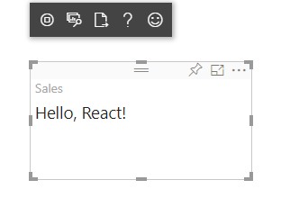
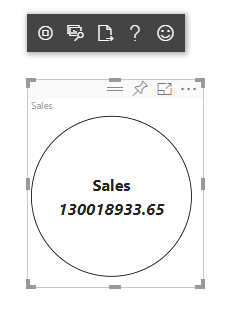

# <a name="tutorial-create-a-react-based-visual"></a>Tutorial: Erstellen eines auf React basierenden Visuals

In diesem Tutorial wird erläutert, wie Sie mithilfe von [React](https://reactjs.org/) ein Power BI-Visual erstellen, das einen Wert in einem Kreis zeigt. Das Visual bietet eine adaptive Größe und Einstellungen, um es anzupassen. Anhand der Informationen in diesem Artikel können Sie mit React Ihre eigenen Power BI-Visuals erstellen.


In diesem Tutorial erhalten Sie Informationen zu den folgenden Vorgängen:

> [!div class="checklist"]
>
> * Einrichten der Entwicklungsumgebung
> * Erstellen eines React-Visuals
> * Konfigurieren von Funktionen für das Visual
> * Rendern von Daten aus Power BI
> * Ändern der Größe des Visuals
> * Festlegen, dass das Visual anpassbar ist

## <a name="prerequisites"></a>Voraussetzungen

* Ein **Power BI Pro**-Konto. [Registrieren Sie sich für eine kostenlose Testversion](https://powerbi.microsoft.com/pricing/), bevor Sie beginnen.
* [Visual Studio Code](https://www.visualstudio.com/).
* Mindestens [Windows PowerShell](https://docs.microsoft.com/powershell/scripting/install/installing-windows-powershell?view=powershell-6)-Version 4 für Windows-Benutzer ODER das [Terminal](https://macpaw.com/how-to/use-terminal-on-mac) für OSX-Benutzer.
* Eine der Beschreibung unter [Einrichten der Entwicklerumgebung](custom-visual-develop-tutorial.md#setting-up-the-developer-environment) entsprechende Umgebung.

## <a name="getting-started"></a>Erste Schritte

Erstellen Sie zunächst mithilfe von `pbiviz` ein minimales Power BI-Visual. Weitere Informationen zu Projekten und zur Projektstruktur finden Sie unter [Struktur von Visualprojekten in Power BI](visual-project-structure.md). Den vollständigen Quellcode dieses Visuals finden Sie auf GitHub unter [Circle Card React Custom Visual](https://github.com/Microsoft/powerbi-visuals-circlecard-react).

Sie können den vollständigen Quellcode des Visuals von [GitHub](https://github.com/Microsoft/powerbi-visuals-circlecard-react) klonen oder herunterladen.

1. Öffnen Sie PowerShell, und führen Sie den folgenden Befehl aus:

   ```powershell
   pbiviz new ReactCircleCard
   ```

   Der Befehl erstellt einen Ordner namens *ReactCircleCard*.

1. Wechseln Sie zu diesem Ordner, und öffnen Sie Visual Studio Code.

   ```powershell
   cd ./ReactCircleCard
   code .
   ```

1. Starten Sie den Entwicklerserver für Ihre Visual.

   ```powershell
   pbiviz start
   ```

   

Dieses einfache Visual stellt die Anzahl von Aktualisierungen dar. Lassen Sie es uns im nächsten Schritt in eine kreisförmige Karte umwandeln.

## <a name="change-the-visual-to-a-circle-card"></a>Ändern des Visuals in eine kreisförmige Karte

Dieses einfache Visual stellt die Anzahl von Aktualisierungen dar. Wandeln Sie es in eine kreisförmige Karte um, die eine Kennzahl und ihren Titel darstellt.

1. Führen Sie den folgenden Befehl aus, um die erforderlichen Abhängigkeiten zu installieren:

   ```powershell
   npm i react react-dom
   ```

1. Führen Sie den folgenden Befehl aus, um React 16 und die entsprechenden Versionen von `react-dom` und Typisierungen zu installieren:

   ```powershell
   npm i @types/react @types/react-dom
   ```

1. Erstellen Sie eine React-Komponentenklasse. Wählen Sie in Visual Studio Code **Datei** > **Neue Datei** aus. Kopieren Sie den folgenden Code in die Datei.

    ```typescript
    import * as React from "react";

    export class ReactCircleCard extends React.Component<{}>{
        render(){
            return (
                <div className="circleCard">
                    Hello, React!
                </div>
            )
        }
    }

    export default ReactCircleCard;
    ```

1. Wählen Sie **Speichern unter** aus. Navigieren Sie zum Verzeichnis *src*. Geben Sie den Namen *component* ein. Wählen Sie für **Dateityp** die Option **TypeScript React** aus.

1. Öffnen Sie *src/visual.ts*. Ersetzen Sie den aktuellen Code durch den folgenden:

    ```typescript
    "use strict";
    import powerbi from "powerbi-visuals-api";

    import DataView = powerbi.DataView;
    import VisualConstructorOptions = powerbi.extensibility.visual.VisualConstructorOptions;
    import VisualUpdateOptions = powerbi.extensibility.visual.VisualUpdateOptions;
    import IVisual = powerbi.extensibility.visual.IVisual;

    import "./../style/visual.less";

    export class Visual implements IVisual {

        constructor(options: VisualConstructorOptions) {

        }

        public update(options: VisualUpdateOptions) {

        }
    }
    ```

1. Importieren Sie React-Abhängigkeiten und die zuvor hinzugefügte Komponente.

    ```typescript
    import * as React from "react";
    import * as ReactDOM from "react-dom";
    ...
    import ReactCircleCard from "./component";
    ```

   Die Power BI-Standardeinstellungen für TypeScript unterstützen keine React-Dateien des Typs *.tsx*. In Visual Studio Code wird `component` als Fehler markiert.

1. Öffnen Sie die Datei *tsconfig.json*, und fügen Sie am Anfang des Elements `compilerOptions` zwei Zeilen hinzu.

    ```json
    {
      "compilerOptions": {
        "jsx": "react",
        "types": ["react", "react-dom"],
        //...
      }
    }
    ```

   Der Fehler für `component` sollte behoben sein.

   Um die Komponente zu rendern, fügen Sie das HTML-Zielelement hinzu. Dieses Element ist `HTMLElement` in `VisualConstructorOptions`, das an den Konstruktor übergeben wird.

1. Ändern Sie die `Visual`-Klasse gemäß dem folgenden Code:

    ```typescript
      private target: HTMLElement;
      private reactRoot: React.ComponentElement<any, any>;

      constructor(options: VisualConstructorOptions) {
          this.reactRoot = React.createElement(ReactCircleCard, {});
          this.target = options.element;

          ReactDOM.render(this.reactRoot, this.target);
      }
    ```

1. Speichern Sie die Änderungen, und führen Sie den vorhandenen Code mit diesem Befehl aus:

    ```bash
    pbiviz start
    ```

   > [!NOTE]
   > Wenn Sie zuvor `pbiviz` ausgeführt haben, müssen Sie einen Neustart durchführen, um Änderungen an *tsconfig.json* zu übernehmen.

  

## <a name="configure-capabilities"></a>Konfigurieren von Funktionen

Sie können die Funktionen des Visuals konfigurieren.

1. Öffnen Sie `capabilities.json`. Entfernen Sie das `Category Data`-Objekt aus `dataRoles`. `ReactCircleCard` zeigt einen einzelnen Wert. Daher benötigen wir nur `Measure Data`. Der Schlüssel `dataRoles` sieht nun wie folgt aus:

    ```json
    "dataRoles": [
        {
            "displayName": "Measure Data",
            "name": "measure",
            "kind": "Measure"
        }
    ],
    ```

1. Entfernen Sie den gesamten Inhalt des Schlüssels `objects`. Sie füllen ihn später aus.

    ```json
        "objects": {},
    ```

1. Kopieren Sie den folgenden Code der `dataViewMappings`-Eigenschaft. Der Wert `max: 1` bedeutet, dass nur eine Kennzahlspalte übermittelt werden kann.

    ```json
        "dataViewMappings": [
            {
                "conditions": [
                    {
                        "measure": {
                            "max": 1
                        }
                    }
                ],
                "single": {
                    "role": "measure"
                }
            }
        ]
    ```

Sie können nun Daten aus dem Bereich `Fields` in die Einstellungen des Visuals einfügen.


## <a name="receive-properties-from-power-bi"></a>Empfangen von Eigenschaften aus Power BI

Sie können Daten mithilfe von React rendern. Die Komponente kann Daten zu Ihrem eigenen Zustand anzeigen.

1. Ändern Sie *src/component.tsx*.

    ```javascript
    export interface State {
        textLabel: string,
        textValue: string
    }

    export const initialState: State = {
        textLabel: "",
        textValue: ""
    }

    export class ReactCircleCard extends React.Component<{}, State>{
        constructor(props: any){
            super(props);
            this.state = initialState;
        }

        render(){
            const { textLabel, textValue } = this.state;

            return (
                <div className="circleCard">
                    <p>
                        {textLabel}
                        <br/>
                        <em>{textValue}</em>
                    </p>
                </div>
            )
        }
    }
    ```

1. Fügen Sie Stile für neues Markup hinzu, indem Sie *styles/visual.less* bearbeiten.

    ```css
    .circleCard {
        position: relative;
        box-sizing: border-box;
        border: 1px solid #000;
        border-radius: 50%;
        width: 200px;
        height: 200px;
    }

    p {
        text-align: center;
        line-height: 30px;
        font-size: 20px;
        font-weight: bold;

        position: relative;
        top: -30px;
        margin: 50% 0 0 0;
    }
    ```

1. Visuals empfangen aktuelle Daten als Argument der `update`-Methode. Öffnen Sie *src/visual.ts*, und fügen Sie Code zu `ReactCircleCard.update` hinzu.

    ```typescript
    //...
    import { ReactCircleCard, initialState } from "./component";
    //...

    export class Visual implements IVisual {
        //...
        public update(options: VisualUpdateOptions) {

            if(options.dataViews && options.dataViews[0]){
                const dataView: DataView = options.dataViews[0];

                ReactCircleCard.update({
                    textLabel: dataView.metadata.columns[0].displayName,
                    textValue: dataView.single.value.toString()
                });
            }
            } else {
                this.clear();
            }
        }

        private clear() {
            ReactCircleCard.update(initialState);
        }
    }
    ```

    Der Code wählt `textLabel` und `textValue` aus `DataView` aus und aktualisiert, falls die Daten vorhanden sind, den Zustand der Komponente.

1. Um Aktualisierungen an die Komponenteninstanz zu senden, fügen Sie den folgenden Code in die `ReactCircleCard`-Klasse ein:

    ```typescript
        private static updateCallback: (data: object) => void = null;

        public static update(newState: State) {
            if(typeof ReactCircleCard.updateCallback === 'function'){
                ReactCircleCard.updateCallback(newState);
            }
        }

        public state: State = initialState;

        public componentWillMount() {
            ReactCircleCard.updateCallback = (newState: State): void => { this.setState(newState); };
        }

        public componentWillUnmount() {
            ReactCircleCard.updateCallback = null;
        }
    ```

1. Testen Sie das Visual. Stellen Sie sicher, dass `pbiviz start` ausgeführt wurde, und speichern Sie alle Dateien. Aktualisieren Sie das Visual.

   

## <a name="make-component-resizable"></a>Ermöglichen des Änderns der Komponentengröße

In diesem Abschnitt ermöglichen Sie das Ändern der Größe der Komponente. Derzeit hat die Komponente eine feste Breite und Höhe.

Rufen Sie die aktuelle Größe des Viewports des Visuals aus dem `options`-Objekt ab.

1. Öffnen Sie *src/visual.ts*. Importieren Sie die `IViewport`-Schnittstelle, und fügen Sie der `visual`-Klasse die Eigenschaft `viewport` hinzu.

    ```typescript
    import IViewport = powerbi.IViewport;

    //...

    export class Visual implements IVisual {
        private viewport: IViewport;
        //...
    }
    ```

1. Fügen Sie der `update`-Methode von `visual` den folgenden Code hinzu.

    ```typescript
      if (options.dataViews && options.dataViews[0]) {
          const dataView: DataView = options.dataViews[0];

          this.viewport = options.viewport;
          const { width, height } = this.viewport;
          const size = Math.min(width, height);

          ReactCircleCard.update({
              size,
              //...
          });
      }
    ```

1. Fügen Sie Eigenschaften zur `State`-Schnittstelle in *src/component.tsx* hinzu.

    ```typescript
    export interface State {
        //...
        size: number
    }

    const initialState: State = {
        //...
        size: 200
    }
    ```

1. Nehmen Sie die folgenden Änderungen an der Methode `render` in *src/component.tsx* vor:

    ```typescript
        render() {
            const { textLabel, textValue, size } = this.state;

            const style: React.CSSProperties = { width: size, height: size };

            return (
                <div className="circleCard" style={style}>
                    {/* ... */}
                </div>
            )
        }
    ```

1. Ersetzen Sie die Regeln `width` und `height` in *style/visual.less* durch `min-width` und `min-height`.

    ```css
        min-width: 200px;
        min-height: 200px;
    ```

Nun können Sie die Größe des Viewports ändern. Der Durchmesser des Kreises entspricht der minimalen Größe als Breite oder Höhe.

## <a name="make-your-power-bi-visual-customizable"></a>Gestalten Ihres Power BI-Visuals als anpassbar

In diesem Abschnitt gestalten Sie das Visual als anpassbar.

1. Öffnen Sie *capabilities.json*. Fügen Sie der Eigenschaft `objects` die folgenden Einstellungen hinzu.

    ```json
    //...
        "objects": {
            "circle": {
                "displayName": "Circle",
                "properties": {
                    "circleColor": {
                        "displayName": "Color",
                        "description": "The fill color of the circle.",
                        "type": {
                            "fill": {
                                "solid": {
                                    "color": true
                                }
                            }
                        }
                    },
                    "circleThickness": {
                        "displayName": "Thickness",
                        "description": "The circle thickness.",
                        "type": {
                            "numeric": true
                        }
                    }
                }
            }
        },
    //...
    ```

1. Ersetzen Sie vorhandenen Code in *src/settings.ts* durch diesen Code:

    ```typescript
    "use strict";

    import { dataViewObjectsParser } from "powerbi-visuals-utils-dataviewutils";
    import DataViewObjectsParser = dataViewObjectsParser.DataViewObjectsParser;

    export class CircleSettings {
        public circleColor: string = "white";
        public circleThickness: number = 2;
    }

    export class VisualSettings extends DataViewObjectsParser {
        public circle: CircleSettings = new CircleSettings();
    }
    ```

1. Fügen Sie diese `import`-Anweisungen am Anfang von *src/visual.ts* ein:

    ```typescript
    import VisualObjectInstance = powerbi.VisualObjectInstance;
    import EnumerateVisualObjectInstancesOptions = powerbi.EnumerateVisualObjectInstancesOptions;
    import VisualObjectInstanceEnumerationObject = powerbi.VisualObjectInstanceEnumerationObject;

    import { VisualSettings } from "./settings";

    ```

1. Fügen Sie *src/visual.ts* die `enumerateObjectInstances`-Methode hinzu. Diese Methode wird verwendet, um Einstellungen auf das Visual anzuwenden.

    ```typescript
    export class Visual implements IVisual {
        private settings: VisualSettings;

        //...

        public enumerateObjectInstances(
            options: EnumerateVisualObjectInstancesOptions
        ): VisualObjectInstance[] | VisualObjectInstanceEnumerationObject {

            return VisualSettings.enumerateObjectInstances(this.settings || VisualSettings.getDefault(), options);
        }
    }
    ```

1. Fügen Sie Code hinzu, damit das `dataView`-Objekt Einstellungen empfangen kann.

    ```typescript
        public update(options: VisualUpdateOptions) {

            if(options.dataViews && options.dataViews[0]){
                //...
                this.settings = VisualSettings.parse(dataView) as VisualSettings;
                const object = this.settings.circle;

                ReactCircleCard.update({
                    borderWidth: object && object.circleThickness ? object.circleThickness : undefined,
                    background: object && object.circleColor ? object.circleColor : undefined,
                    //...
                });
            }
        }
    }
    ```

1. Wenden Sie die entsprechenden Änderungen auf *src/component.tsx* an, indem Sie zunächst diese Werte zu `State` hinzufügen:

    ```typescript
    export interface State {
        //...
        background?: string,
        borderWidth?: number
    }
    ```

1. Fügen Sie dann den folgenden Code zur `render`-Methode hinzu:

    ```typescript
        const { /*...*/ background, borderWidth } = this.state;

        const style: React.CSSProperties = { /*...*/ background, borderWidth };
    ```

    

## <a name="next-steps"></a>Nächste Schritte

Weitere Informationen zur Power BI-Entwicklung finden Sie unter [Richtlinien für Power BI-Visuals](guidelines-powerbi-visuals.md) und [Visuals in Power BI](power-bi-visuals-concept.md).