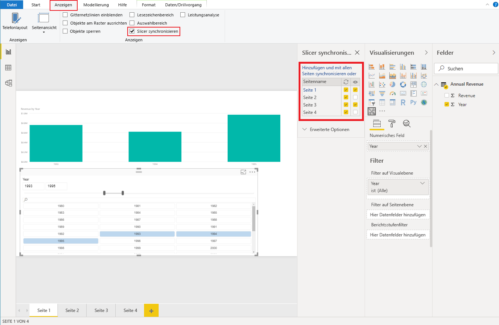

# <a name="sync-slicers-in-power-bi-visuals"></a>Synchronisieren von Slicern in Power BI-Visuals

Zur Unterstützung der Funktion [Slicer synchronisieren](https://docs.microsoft.com/power-bi/desktop-slicers) muss die benutzerdefinierte Slicer-Visual API-Version 1.13 oder höher verwenden werden.

Außerdem müssen Sie wie im folgenden Code veranschaulicht die Option in der Datei *capabilities.json* aktivieren:

```json
{
    ...
    "supportsHighlight": true,
    "suppressDefaultTitle": true,
    "supportsSynchronizingFilterState": true,
    "sorting": {
        "default": {}
    }
}
```

Nachdem Sie die Datei *capabilities.json* aktualisiert haben, können Sie den Optionsbereich **Slicers synchronisieren** anzeigen, wenn Sie Ihr benutzerdefiniertes Slicer-Visual auswählen.

> [!NOTE]
> Die Funktion „Slicer synchronisieren“ unterstützt nicht mehr als ein Feld. Wenn Ihr Slicer mehr als ein Feld (**Kategorie** oder **Measure**) aufweist, ist die Funktion deaktiviert.



Im Bereich **Slicer synchronisieren** sehen Sie, dass die Sichtbarkeit und Filterung des Slicers auf mehrere Berichtsseiten angewendet werden können.
