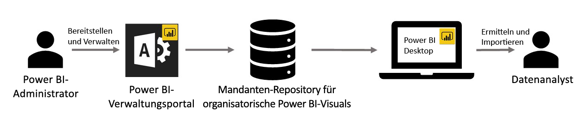

# Visuals für Organisationen in Power BI

Sie können Power BI-Visuals in Power BI verwenden, um einen einzigartigen Typ von Visual zu erstellen, der auf Ihre Zwecke zugeschnitten ist. Power BI-Visuals werden von Entwicklern erstellt. Der Grund dafür ist oft, dass die Visuals, die in Power BI enthalten sind, deren Anforderungen nicht ganz erfüllen.

In einigen Organisationen sind Power BI-Visuals sogar noch wichtiger, da sie notwendig sein können, um bestimmte Daten oder Einsichten zu übermitteln, die für die Organisation einzigartig sind. Sie können ebenfalls spezielle Anforderungen für Daten enthalten oder private Geschäftsmethoden hervorheben. Solche Organisationen müssen Power BI-Visuals entwickeln, diese innerhalb der Organisation freigeben und sicherstellen, dass sie ordnungsgemäß verwaltet werden. Durch Power BI-Visuals können Organisationen dies erreichen.

Die folgende Abbildung stellt den Prozess dar, den Power BI-Visuals für Organisationen in Power BI durchlaufen. Dieser beginnt beim Administrator, wird in der Entwicklung und Verwaltung fortgesetzt und endet beim Datenanalysten.

Visuals für Organisationen werden vom Power BI-Administrator über das Verwaltungsportal bereitgestellt und verwaltet. Nach der Bereitstellung im Repository der Organisation können die Benutzer in der Organisation diese Power BI-Visuals für Organisationen einfach ermitteln und direkt über Power BI Desktop in ihre Berichte importieren.

Weitere Informationen zur Verwendung von Power BI-Visuals für Organisationen in den von Ihnen erstellten Berichten finden Sie im folgenden Artikel: [Weitere Informationen zum Importieren von Visuals für Organisationen in Berichten](power-bi-custom-visuals.md).

## Verwalten von Power BI-Visuals für Organisationen

Weitere Informationen über die Verwaltung und Bereitstellung von Power BI-Visuals für Organisationen finden Sie im folgenden Artikel: [Weitere Informationen zu Bereitstellung und Verwaltung von Power BI-Visuals für Organisationen](https://go.microsoft.com/fwlink/?linkid=866790).

> [!WARNING]
> Ein Power BI-Visual, das aus einer Datei installiert wurde, kann Code mit Sicherheits- oder Datenschutzrisiken enthalten. Vergewissern Sie sich, dass Sie dem Autor und der Quelle der Power BI-Visualdatei vertrauen können, bevor Sie diese im Repository der Organisation bereitstellen.

## Überlegungen und Einschränkungen

Es gibt einige Überlegungen und Einschränkungen, die Sie berücksichtigen müssen.

Administrator:

* Wenn ein Power BI-Visual aus ApSource oder einer Datei aus dem Repository gelöscht wird, wird das Rendern aller vorhandenen Berichte beendet, die das gelöschte Visual verwenden. Das Löschen aus dem Repository kann nicht rückgängig gemacht werden. Verwenden Sie die Funktion „Deaktivieren“, um ein Power BI-Visual aus ApSource oder einer Datei vorübergehend zu deaktivieren.

* Power BI-Organisationsvisuals werden im Power BI-Berichtsserver nicht unterstützt.

Benutzer:

* Power BI-Visuals für Organisationen sind private Visuals, die aus dem Repository der Organisation importiert wurden. Wie jedes andere private Visual können Sie [nicht zu PowerPoint exportiert](https://docs.microsoft.com/power-bi/consumer/end-user-powerpoint) oder in empfangenen E-Mails angezeigt werden, wenn ein Benutzer [Berichtsseiten abonniert](https://docs.microsoft.com/power-bi/consumer/end-user-subscribe). Nur direkt aus dem Marketplace importierte [zertifizierte Power BI-Visuals](power-bi-custom-visuals-certified.md) unterstützen diese Features.

* Visio-Visuals, PowerApps-Visuals, Map Box-Visuals und GlobeMap-Visuals aus dem AppSource-Marketplace werden nicht gerendert, wenn diese über das Repository der Organisation bereitgestellt wurden.

## Problembehandlung

Informationen zur Problembehandlung finden Sie auf der Seite [Problembehandlung bei Power BI-Visuals](power-bi-custom-visuals-troubleshoot.md).

## Häufig gestellte Fragen

Weitere Informationen und Antworten auf Fragen finden Sie in den [häufig gestellten Fragen zu Power BI-Visuals](power-bi-custom-visuals-faq.md#organizational-power-bi-visuals).

Weitere Fragen? [Wenden Sie sich an die Power BI-Community](https://community.powerbi.com/).
