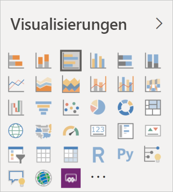

# Visuals in Power BI

Power BI wird mit vielen vorkonfigurierten visuellen Power BI-Elementen ausgeliefert. Diese visuellen Elemente sind im Visualisierungsbereich sowohl von [Power BI Desktop](https://powerbi.microsoft.com/desktop/) als auch im [Power BI-Dienst](https://app.powerbi.com) verfügbar und können zum Erstellen und Bearbeiten von Power BI-Inhalten verwendet werden.

Viele weitere visuelle Power BI-Elemente sind über Microsoft [AppSource](https://nam06.safelinks.protection.outlook.com/?url=https%3A%2F%2Fappsource.microsoft.com%2Fen-us%2Fmarketplace%2Fapps%3Fpage%3D1%26product%3Dpower-bi-visuals&data=02%7C01%7CKesem.Sharabi%40microsoft.com%7C6d9286afacb3468d4cde08d740b76694%7C72f988bf86f141af91ab2d7cd011db47%7C1%7C0%7C637049028749147718&sdata=igWm0e1vXdgGcbyvngQBrHQVAkahPnxPC1ZhUPntGI8%3D&reserved=0) oder über Power BI verfügbar. Diese visuellen Elemente werden von Microsoft und Microsoft-Partnern erstellt und vom AppSource-Überprüfungsteam getestet und überprüft.

Sie können auch Ihr eigenes visuelles Power BI-Element entwickeln, das von Ihnen, Ihrem Unternehmen oder der gesamten Power BI-Community verwendet werden kann.

## Standardmäßige visuelle Power BI-Elemente

Dies sind die direkt einsatzbereiten visuellen Power BI-Elemente, die über den Visualisierungsbereich in *Power BI Desktop* und im *Power BI-Dienst* verfügbar sind.

Um ein visuelles Power BI-Element aus dem Visualisierungsbereich zu lösen, klicken Sie mit der rechten Maustaste darauf, und wählen Sie **Lösen** aus.

Wenn Sie die standardmäßigen visuellen Power BI-Elemente im Visualisierungsbereich wiederherstellen möchten, klicken Sie auf **Benutzerdefiniertes visuelles Element importieren**, und wählen Sie **Visuelle Standardelemente wiederherstellen** aus. 

## AppSource – Visuelle Power BI-Elemente

Microsoft und Communitymitglieder stellen visuelle Power BI-Elemente für das öffentliche Interesse zur Verfügung und veröffentlichen diese in der [AppSource](https://appsource.microsoft.com/marketplace/apps?product=power-bi-visuals). Sie können diese visuellen Elemente herunterladen und sie Ihren Power BI-Berichten hinzufügen. Microsoft hat diese Power BI-Visuals auf Funktionalität und Qualität getestet und genehmigt.

### Was ist AppSource?

[AppSource](https://appsource.microsoft.com/marketplace/apps?product=power-bi-visuals) ist der Ort für Apps, Add-Ins und Erweiterungen für Ihre Microsoft-Software. In AppSource finden Millionen von Benutzern Produkte, z. B. Microsoft 365, Azure, Dynamics 365, Cortana und Power BI, mit denen sie effizienter und besser informiert als zuvor arbeiten können.

### Zertifizierte Power BI-Visuals

Zertifizierte visuelle Power BI-Elemente sind visuelle Elemente in der [AppSource](https://nam06.safelinks.protection.outlook.com/?url=https%3A%2F%2Fappsource.microsoft.com%2Fen-us%2Fmarketplace%2Fapps%3Fpage%3D1%26product%3Dpower-bi-visuals&data=02%7C01%7CKesem.Sharabi%40microsoft.com%7C6d9286afacb3468d4cde08d740b76694%7C72f988bf86f141af91ab2d7cd011db47%7C1%7C0%7C637049028749147718&sdata=igWm0e1vXdgGcbyvngQBrHQVAkahPnxPC1ZhUPntGI8%3D&reserved=0), die bestimmte festgelegte Codeanforderungen erfüllen, die vom Microsoft Power BI-Team getestet und genehmigt wurden. Mit den Tests wird sichergestellt, dass ein Visual nicht auf externe Dienste oder Ressourcen zugreift.

Die Liste der zertifizierten visuellen Power BI-Elemente sowie eine Anleitung zum Einreichen eigener visueller Power BI-Elemente finden Sie unter [Zertifizierte visuelle Power BI-Elemente](power-bi-custom-visuals-certified.md).

### Beispiele für visuelle Power BI-Elemente

Jedes visuelle Power BI-Element in der AppSource verfügt über ein Datenbeispiel, das die Funktionsweise des visuellen Elements veranschaulicht. Zum Herunterladen des Beispiels wählen Sie unter [AppSource](https://nam06.safelinks.protection.outlook.com/?url=https%3A%2F%2Fappsource.microsoft.com%2Fen-us%2Fmarketplace%2Fapps%3Fpage%3D1%26product%3Dpower-bi-visuals&data=02%7C01%7CKesem.Sharabi%40microsoft.com%7C6d9286afacb3468d4cde08d740b76694%7C72f988bf86f141af91ab2d7cd011db47%7C1%7C0%7C637049028749147718&sdata=igWm0e1vXdgGcbyvngQBrHQVAkahPnxPC1ZhUPntGI8%3D&reserved=0) ein visuelles Power BI-Element aus, und klicken Sie im Abschnitt *Testen Sie ein Beispiel* auf den Link **Beispielbericht**.

## Organisationsspeicher

Power BI-Administratoren genehmigen und implementieren visuelle Power BI-Elemente in ihrem Unternehmen. Dadurch können Berichtsautoren diese visuellen Power BI-Elemente leicht entdecken, aktualisieren und verwenden. Administratoren können diese visuellen Elemente einfach mit Aktionen wie dem Aktualisieren von Versionen, dem Deaktivieren und Aktivieren von visuellen Power BI-Elementen verwalten.

Um auf den Organisationsspeicher zuzugreifen, klicken Sie im Bereich *Visualisierung* auf **Benutzerdefiniertes visuelles Element importieren**, wählen Sie **Aus Marketplace importieren** und dann oben im Fenster *Visuelle Power BI-Elemente* die Registerkarte **Meine Organisation** aus.

[Weitere Informationen zu Visuals für Organisationen](power-bi-custom-visuals-organization.md).

## Visuelle Elementdateien

Bei Power BI-Visuals handelt es sich um Pakete, die Code zum Rendern der Daten enthalten, die für diese bereitgestellt werden. Jeder Benutzer kann ein benutzerdefiniertes Visual erstellen und dieses in eine einzelne `.pbiviz`-Datei packen, die in einen Power BI-Bericht importiert werden kann.

Um ein visuelles Power BI-Element zu importieren, klicken Sie im Bereich *Visualisierung* auf **Benutzerdefiniertes visuelles Element importieren**, und wählen Sie **Aus Datei importieren** aus.

Wenn Sie ein Webentwickler sind und Interesse daran haben, Ihr eigenes visuelles Element zu erstellen und es zu AppSource hinzuzufügen, können Sie erfahren, wie Sie [ein visuelles Power BI-Element entwickeln](custom-visual-develop-tutorial.md) und [ein visuelles Power BI-Element in AppSource veröffentlichen](office-store.md) können.

> [!WARNING]
> Ein visuelles Power BI-Element könnte dann Code mit Sicherheits- oder Datenschutzrisiken enthalten. Vergewissern Sie sich, dass Sie dem Autor und der Quelle des visuellen Power BI-Elements vertrauen, bevor Sie es in Ihren Bericht importieren.

## Nächste Schritte

* Wenn Sie ein Entwickler sind, beginnen Sie mit dem Tutorial [Entwickeln eines visuellen Power BI-Elements](custom-visual-develop-tutorial.md).

* Erfahren Sie, wie ein [Projekt für ein visuelles Power BI-Element strukturiert ist](visual-project-structure.md).

* Untersuchen Sie die [Richtlinien für visuelle Power BI-Elemente](guidelines-powerbi-visuals.md).

Weitere Fragen? Besuchen Sie die Seite mit [häufig gestellten Fragen zu Power BI-Visuals](power-bi-custom-visuals-faq.md) oder die [Power BI-Community](https://community.powerbi.com/).