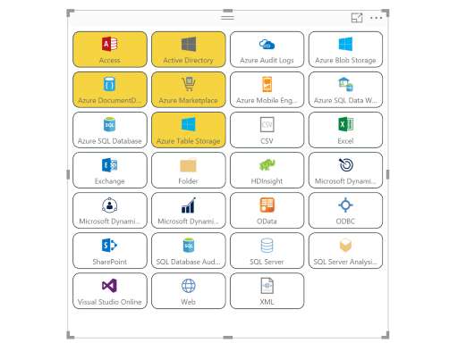
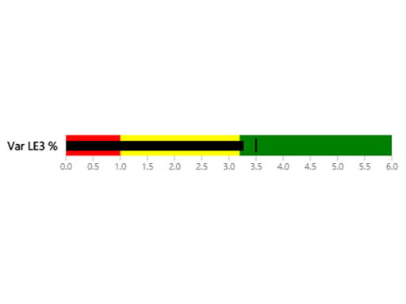
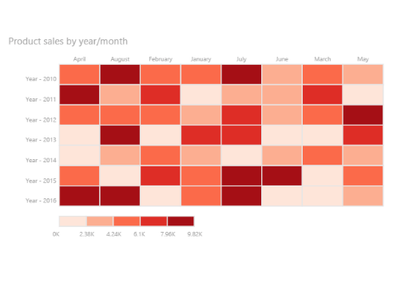
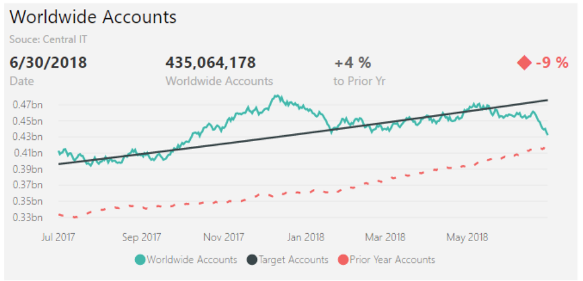
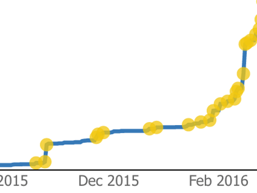
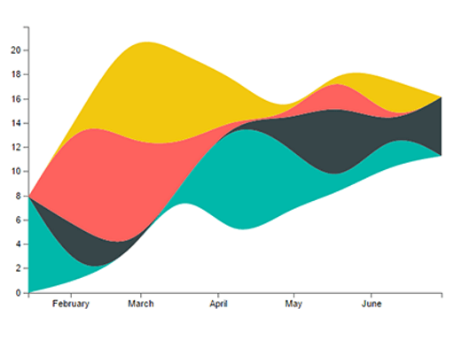
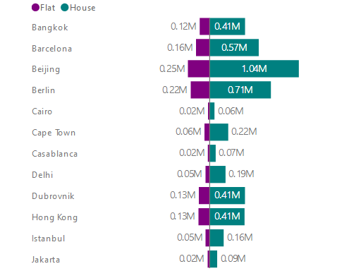

# Beispiele für Power BI-Visuals

Sie können diese Power BI-Visuals von GitHub herunterladen, einsetzen und bearbeiten. Diese Beispiele veranschaulichen den Umgang mit typischen Situationen bei der Entwicklung mit Power BI.

## Slicer

Ein Slicer grenzt den Teil der Daten ein, die in anderen Visualisierungen in einem Bericht gezeigt werden. Slicer sind eine von mehreren Möglichkeiten in Power BI zum Filtern von Daten.

|   |  | |
| ------------- | ------------- | -------------|
| [Chiclet-Slicer](https://github.com/Microsoft/powerbi-visuals-chicletslicer/)   Zeigt Bild- oder Textschaltflächen an, die in der Canvas als Filter für andere Visuals fungieren | [Timeline-Slicer](https://github.com/Microsoft/powerbi-visuals-timeline/)  Grafische Auswahl des Datumsbereichs zum Filtern nach Datum | [Slicerbeispiel](https://github.com/Microsoft/powerbi-visuals-sampleslicer/)  Veranschaulicht die Verwendung der API für erweiterte Filterung

## Diagramme

Lassen Sie sich von unserem Katalog inspirieren, der Balkendiagramme, Kreisdiagramme, eine Wortwolke u. a. enthält.

|   |  | |
| ------------- | ------------- | -------------|
| [Aster-Plot](https://github.com/Microsoft/powerbi-visuals-asterplot/)   Eine Variante eines standardmäßigen Ringdiagramms, bei der ein zweiter Wert dazu dient, einen Pfeilwinkel zu steuern. | [Bullet Chart ](https://github.com/Microsoft/powerbi-visuals-bulletchart/)  Ein Balkendiagramm mit zusätzlichen visuellen Elementen, um Kontext zum Nachverfolgen von Zielen bereitzustellen | [Chord](https://github.com/Microsoft/powerbi-visuals-chord/)  Eine grafische Methode zum Anzeigen der Beziehungen zwischen Daten in einer Matrix
|  | |  
| [Dot plot](https://github.com/Microsoft/powerbi-visuals-dotplot/)  Stellt Sie die Verteilung von Häufigkeiten auf übersichtliche Weise dar | [Dual KPI](https://github.com/Microsoft/powerbi-visuals-dualkpi/)  Visualisiert zwei Measures effizient über einen Zeitraum hinweg und bildet Trends auf einer gemeinsamen Zeitachse ab | [Enhanced Scatter](https://github.com/Microsoft/powerbi-visuals-enhancedscatter/)  Bietet Verbesserungen des vorhandenen Punktdiagramms
| | | 
| [Force Graph](https://github.com/Microsoft/powerbi-visuals-forcegraph/)  Erzwingt ein Layoutdiagramm mit gekrümmten Pfad, das sich zum Anzeigen von Verbindungen zwischen Entitäten eignet | [Gantt](https://github.com/Microsoft/powerbi-visuals-gantt/)  Ein Balkendiagramm, das die Zeitachse oder den Zeitplan eines Projekts mit Ressourcen veranschaulicht | [Tabellenheatmap](https://github.com/Microsoft/powerbi-visuals-heatmap/)  Hiermit vergleichen Sie Daten mithilfe von Farben in einer Tabelle problemlos und intuitiv miteinander.
|  |  |  
| [Histogram-Diagramm](https://github.com/Microsoft/powerbi-visuals-histogram/)  Visualisiert die Verteilung von Daten über einen Zeitraum hinweg oder in einem bestimmten Zeitrahmen | [LineDot-Diagramm](https://github.com/Microsoft/powerbi-visuals-linedotchart/)  Animiertes Liniendiagramm mit sich bewegenden Punkten, um eine Zielgruppe für die Daten zu interessieren | [Mekko-Diagramm](https://github.com/Microsoft/powerbi-visuals-mekkochart/)  Eine Mischung aus einem zu 100% gestapelten Säulendiagramm und einem zu 100% gestapelten Balkendiagramm, die in einer Ansicht kombiniert werden.
|  |  |  
| [Multi-KPI](https://github.com/microsoft/PowerBI-visuals-MultiKPI/)   Eine leistungsstarke Visualisierung mehrerer KPIs mit einem Schlüssel-KPI zusammen mit mehreren Sparklines für unterstützende Daten | [Power KPI](https://github.com/microsoft/PowerBI-visuals-PowerKPI/)  Ein leistungsstarker KPI-Indikator mit mehrzeiligem Diagramm und Beschriftungen für aktuelles Datum, Wert und Abweichungen | [Power-KPI-Matrix](https://github.com/microsoft/PowerBI-visuals-PowerKPIMatrix/)  Ermöglicht das Überwachen von Balanced Scorecards und einer unbegrenzten Anzahl von Metriken und KPIs in einer kompakten, leicht lesbaren Liste
| |  |  
| [Pulsdiagramm](https://github.com/Microsoft/powerbi-visuals-pulsechart/)  Liniendiagramm mit Anmerkungen zu den wichtigsten Ereignissen, das sich ideal zur Untermauerung von Aussagen mit Daten eignet| [Netzdiagramm](https://github.com/Microsoft/powerbi-visuals-radarchart/)  Zeigt mehrere auf einer Kategorieachse gezeichnete Messwerte zum Vergleichen von Attributen | [Sankey-Diagramm](https://github.com/Microsoft/powerbi-visuals-sankey/)  Flussdiagramm, bei dem die Breite der Datenreihe proportional zum Umfang des Datenflusses ist
|  | | 
| [Stream Graph](https://github.com/Microsoft/powerbi-visuals-streamgraph/)  Gestapeltes Flächendiagramm mit geglätteter Interpolation zur Darstellung von Werten in einem bestimmten Zeitraum | [Sunburst-Diagramm](https://github.com/Microsoft/powerbi-visuals-sunburst/)  Ringdiagramm mit mehreren Ebenen zur Visualisierung hierarchischer Daten| [Tornado-Diagramm](https://github.com/Microsoft/powerbi-visuals-tornado/)  Dient zum Vergleichen der relativen Wichtigkeit von Variablen zwischen zwei Gruppen
 | 
 | [Word Cloud](https://github.com/Microsoft/powerbi-visuals-wordcloud/)  Dient zum Erstellen eines interessanten Visuals mit häufig in Ihren Daten verwendetem Text

## WebGL

WebGL ermöglicht die Verwendung einer auf OpenGL ES 2.0 basierenden API für das 2D- und 3D-Rendering von Webinhalten in einer HTML-Canvas.

| |
| ------------- |
| [Globe Map](https://github.com/Microsoft/powerbi-visuals-globemap/)  Abbilden von Standorten auf einer interaktiven 3D-Karte

## R-Visuals

Diese Beispiele veranschaulichen, wie die analytischen und visuellen Möglichkeiten von R-Visuals und R-Skripts genutzt werden können.

| | | |
|------------- |------------- |------------- |------------- |
| [Zuordnungsregeln](https://github.com/Microsoft/powerbi-visuals-assorules/)  Ermitteln Sie Beziehung zwischen scheinbar nicht in Beziehung stehenden Daten mithilfe von if-then-Anweisungen. | [Clustering](https://github.com/Microsoft/powerbi-visuals-clustering-kmeans/)  Dient zum Finden von Ähnlichkeitsgruppen in Ihren Daten mithilfe des k-Means-Algorithmus | [Clustering mit Ausreißern](https://github.com/microsoft/PowerBI-visuals-dbscan/)  Dient zum Finden von Ähnlichkeitsgruppen und Ausreißern in Ihren Daten
|  |  |  
| [Korrelationsplot](https://github.com/Microsoft/powerbi-visuals-corrplot/)  Dient zum Markieren der am häufigsten korrelierten Variablen in einer Datentabelle | [Entscheidungsstrukturdiagramm](https://github.com/Microsoft/powerbi-visuals-decision-tree/)  Schematisches baumförmiges Diagramm zur Bestimmung der statistischen Wahrscheinlichkeit mittels rekursiver Partitionierung | [Forecasting TBATS](https://github.com/Microsoft/powerbi-visuals-forcasting-tbats/)  Zeitreihenvorhersage für Reihen mit mehreren Saisonabhängigkeiten unter Verwendung des TBATS-Modells
|  |  |  
| [Vorhersagen mit ARIMA](https://github.com/Microsoft/powerbi-visuals-forcastingarima/)  Vorhersagen künftiger Werte auf Grundlage historischer Daten mithilfe von ARIMA (Autoregressive Integrated Moving Average) | [Trichterdiagramm](https://github.com/Microsoft/powerbi-visuals-funnel/)  Dient zum Finden von Ausreißern in Ihren Daten mithilfe eines Trichterdiagramms | [Erkennung von Ausreißern](https://github.com/Microsoft/powerbi-visuals-outliers-det/)  Dient zum Finden von Ausreißern in Ihren Daten mithilfe der geeignetsten Methode und Zeichnung
|  |  | 
| [Spline-Diagramm](https://github.com/Microsoft/powerbi-visuals-spline/)  Dient zum Verstehen und Visualisieren überflüssiger Daten | [Diagramm für die Zeitreihenaufgliederung](https://github.com/Microsoft/powerbi-visuals-timeseriesdecomposition/)  Dient zum Verstehen von Zeitreihenkomponenten mithilfe von STL (Seasonal and Trend decomposition using Loess) | [Diagramm für die Zeitreihenprognose](https://github.com/Microsoft/powerbi-visuals-forcasting-exp/)  Verwenden exponentieller Glättungsmodelle zum Vorhersagen zukünftiger Werte auf Grundlage der zuvor beobachteten Werte

## Nächste Schritte

Weitere Informationen zum Erstellen von Power BI-Visuals finden Sie unter [Tutorial: Entwickeln eines Power BI-Visuals](custom-visual-develop-tutorial.md).
