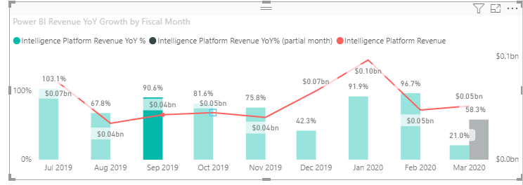

# <a name="use-the-supportskeyboardfocus-feature"></a>Verwenden des Features supportsKeyboardFocus

In diesem Artikel wird beschrieben, wie Sie das Feature `supportsKeyboardFocus` in Power BI-Visuals verwenden.
Das Feature `supportsKeyboardFocus` ermöglicht Ihnen, mit nur der Tastatur zu den Datenpunkten des Visuals zu navigieren.

Weitere Informationen zur Tastaturnavigation für Visuals finden Sie unter [Tastaturnavigation](../../create-reports/desktop-accessibility-consuming-tools.md#keyboard-navigation).

## <a name="example"></a>Beispiel

Öffnen Sie ein Visual, das das Feature `supportsKeyboardFocus` verwendet. Wählen Sie einen beliebigen Datenpunkt innerhalb des Visuals und dann die TAB-TASTE aus. Jedes Mal, wenn Sie die TAB-TASTE auswählen, wechselt der Fokus zum nächsten Datenpunkt. Wählen Sie die EINGABETASTE aus, um den markierten Datenpunkt auszuwählen.



## <a name="requirements"></a>Anforderungen

Diese Feature erfordert mindestens die API-Version 2.1.0.

Es kann auf alle Visuals mit Ausnahme von Bildvisuals angewendet werden.

## <a name="usage"></a>Verwendung

Um das Feature `supportsKeyboardFocus` zu verwenden, fügen Sie den folgenden Code in die Datei *capabilities.json* Ihres Visuals ein.
Diese Fähigkeit ermöglicht es dem Visual, den Fokus per Tastaturnavigation zu erhalten.

```json
    {   
            ...
        "supportsKeyboardFocus": true
            ...
    }

```

## <a name="next-steps"></a>Nächste Schritte

Weitere Informationen zu Features für Barrierefreiheit finden Sie unter [Entwerfen von Power BI-Berichten für die Barrierefreiheit](../../create-reports/desktop-accessibility-creating-reports.md).

Informationen zum Ausprobieren der Power BI-Entwicklung finden Sie unter [Entwickeln eines Power BI-Visuals](custom-visual-develop-tutorial.md).
