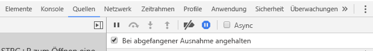

# <a name="how-to-debug-power-bi-visuals"></a>Debuggen von Power BI-Visuals

Diese Seite bietet einige Tipps für das Debuggen beim Erstellen von Visuals. Sie enthält grundlegende Schritte und zeigt die Unterschiede zwischen dem Debuggen von standardmäßigen Front-End-Anwendungen und Power BI-Visuals auf.
Wenn Sie diesen Artikel gelesen haben, können Sie Power BI-Visuals mithilfe von Breakpoints debuggen, Ausnahmen protokollieren und Ausnahmen in Chrome und Microsoft Edge abfangen.

## <a name="using-breakpoints"></a>Verwenden von Breakpoints

Da der JavaScript-Code eines Visuals bei jeder Aktualisierung des Visuals vollständig neu geladen wird, gehen alle von Ihnen hinzugefügten Breakpoints verloren, wenn das Visual, das Sie debuggen möchten, aktualisiert wird. Verwenden Sie `debugger`-Anweisungen in Ihrem Code, um dieses Problem zu umgehen. Es empfiehlt sich, das automatische Neuladen zu deaktivieren, während Sie `debugger` in Ihrem Code verwenden.

```typescript
public update(options: VisualUpdateOptions) {
    console.log('Visual update', options);
    debugger;
    this.target.innerHTML = `<p>Update count: <em>${(this.updateCount</em></p>`;
}
```


## <a name="showing-exceptions"></a>Anzeigen von Ausnahmen

Bei der Arbeit an Ihrem Visual werden Sie feststellen, dass alle Fehler vom Power BI-Dienst kompensiert werden. Dies ist ein gewünschtes Verhalten in Power BI, um zu verhindern, dass fehlerhafte Visuals dazu führen, dass die gesamte App instabil wird.

Um dieses Problem zu umgehen, fügen Sie Code hinzu, um Ausnahmen abzufangen und zu protokollieren, oder richten Sie Ihren Debugger so ein, dass er bei abgefangenen Ausnahmen anhält.


## <a name="log-exceptions"></a>Protokollieren von Ausnahmen

Zum Protokollieren von Ausnahmen in Ihrem Power BI-Visual fügen Sie den folgenden Code zum Visual hinzu, um ein Decorator-Element für die Ausnahmeprotokollierung zu definieren.

```typescript
export function logExceptions(): MethodDecorator {
    return function (target: Object, propertyKey: string, descriptor: TypedPropertyDescriptor<any>): TypedPropertyDescriptor<any> {
        return {
            value: function () {
                try {
                    return descriptor.value.apply(this, arguments);
                } catch (e) {
                    console.error(e);
                    throw e;
                }
            }
        }
    }
}
```
Danach können Sie dieses Decorator-Element in jeder Funktion verwenden, um die Fehlerprotokollierung anzuzeigen.

```typescript
@logExceptions()
public update(options: VisualUpdateOptions) {
```

## <a name="break-on-exceptions"></a>Unterbrechen bei Ausnahmen

Sie können den Browser auch so einrichten, dass bei abgefangenen Ausnahmen die Ausführung unterbrochen wird. Damit wird die Codeausführung angehalten, sobald ein Fehler auftritt, und Sie können das Debuggen ab diesem Punkt fortsetzen.

### <a name="edge"></a>Edge

1. Öffnen Sie die Entwicklertools (F12).
2. Wechseln Sie zur Registerkarte **Debugger**.
3. Klicken Sie auf das Symbol zum **Unterbrechen bei Ausnahmen** (Sechseck mit Pausesymbol).
4. Wählen Sie **Bei allen Ausnahmen unterbrechen** aus.


## <a name="chrome"></a>Chrome

1. Öffnen Sie die Entwicklertools (F12).
2. Wechseln Sie zur Registerkarte **Sources** (Quellen).
3. Klicken Sie auf das Symbol **Pause on exceptions** (Anhalten bei Ausnahmen, Stoppschild mit Pausesymbol).
4. Aktivieren Sie das Kontrollkästchen **Pause on caught exceptions** (Bei abgefangenen Ausnahmen anhalten).



## <a name="next-steps"></a>Weitere Schritte
* [Problembehandlung bei Power BI-Visuals](power-bi-custom-visuals-troubleshoot.md)
* Weitere Informationen und Antworten auf Fragen finden Sie in den [häufig gestellten Fragen zu Power BI-Visuals](power-bi-custom-visuals-faq.md#organizational-power-bi-visuals).
