# Tutorial: Erste Schritte mit dem Power BI-Dienst
Dieses Tutorial bietet eine Einführung in einige Features des *Power BI-Diensts*. Darin können Sie eine Verbindung mit Daten herstellen, einen Bericht und ein Dashboard erstellen und Fragen zu Ihren Daten stellen. Der Power BI-Dienst bietet Ihnen noch viele weitere Möglichkeiten. Mit diesem Tutorial wollen wir Sie nur schon einmal auf den Geschmack bringen. Damit Sie die Funktion des Power BI-Diensts im Hinblick auf die anderen Power BI-Angebote einordnen können, sollten Sie zunächst den Artikel [Was ist Power BI?](power-bi-overview.md) lesen.

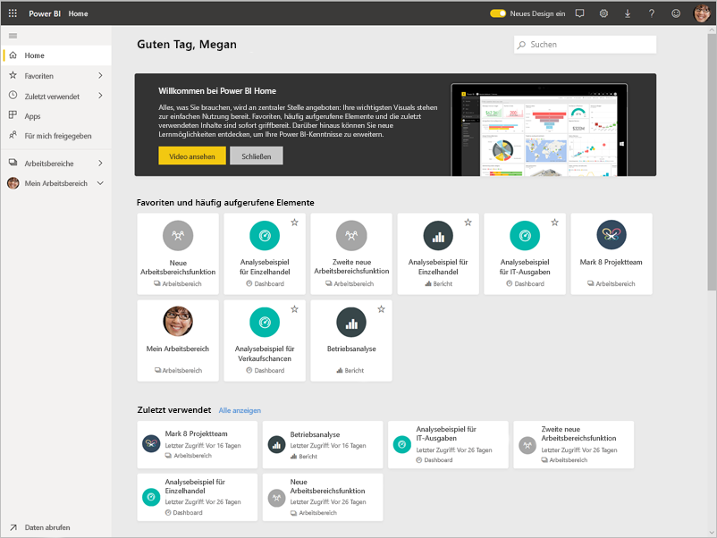

In diesem Tutorial führen Sie die folgenden Schritte aus:

> [!div class="checklist"]
> * Anmelden bei Ihrem Power BI-Onlinekonto oder Registrieren eines Kontos, wenn noch kein Konto vorhanden ist.
> * Öffnen des Power BI-Diensts.
> * Abrufen einiger Daten und Öffnen der Daten in der Berichtsansicht.
> * Verwenden dieser Daten, um Visualisierungen zu erstellen und als Bericht zu speichern.
> * Erstellen eines Dashboards, indem Kacheln aus dem Bericht angeheftet werden.
> * Hinzufügen weiterer Visualisierungen zu Ihrem Dashboard mithilfe des Q&A-Tools für natürliche Sprache.
> * Ändern der Kachelgröße, Neuanordnung und Interaktion mit den Kacheln auf dem Dashboard.
> * Bereinigen von Ressourcen durch Löschen des Datasets, des Berichts und des Dashboards.

> [!TIP]
> Sie möchten Ihre Trainingsgeschwindigkeit lieber selbst bestimmen? [Registrieren Sie sich auf EdX für unseren Kurs zur Datenanalyse und -visualisierung.](https://aka.ms/edxpbi)

## Registrieren beim Power BI-Dienst
Wenn Sie noch kein Power BI-Konto besitzen, [registrieren Sie sich für eine kostenlose Power BI-Testversion](https://app.powerbi.com/signupredirect?pbi_source=web), bevor Sie beginnen.

Nachdem Sie ein Konto angelegt haben, geben Sie *app.powerbi.com* in Ihrem Browser ein, um den Power BI-Dienst zu öffnen. 

## Schritt 1: Daten abrufen

Wenn Sie einen Power BI-Bericht erstellen, beginnen Sie häufig in Power BI Desktop. Dieses Mal beginnen wir mit dem Erstellen eines Berichts im Power BI-Dienst.

In diesem Tutorial werden Daten aus einer CSV-Datei abgerufen. Führen Sie hierzu die folgenden Schritte aus: [Herunterladen der CSV-Datei mit dem Finanzbeispiel](https://go.microsoft.com/fwlink/?LinkID=521962).

1. [Melden Sie sich bei Power BI an](https://www.powerbi.com/). Verfügen Sie über ein Konto? Keine Sorge: Sie können sich für eine kostenlose Testversion registrieren.
2. Power BI wird in Ihrem Browser geöffnet. Wählen Sie unten im Navigationsbereich **Daten abrufen**aus.

    Die Seite **Daten abrufen** wird geöffnet.   

3. Wählen Sie im Abschnitt **Neuen Inhalt erstellen** die Option **Dateien** aus. 
   
   
4.  Wählen Sie **Lokale Datei** aus.
   
    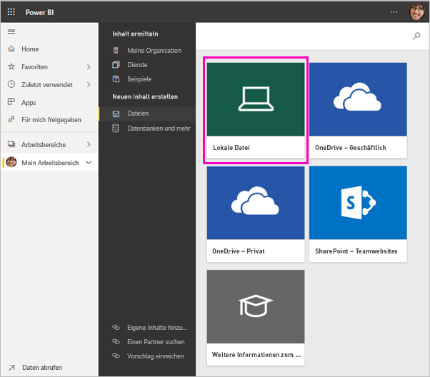

5. Navigieren Sie zu der Datei auf Ihrem Computer, und wählen Sie dann **Öffnen** aus.

5. Für dieses Tutorial wählen Sie **Importieren** aus, um die Excel-Datei als Dataset hinzuzufügen, mit dem dann Berichte und Dashboards erstellt werden können. Wenn Sie **Hochladen** auswählen, wird die gesamte Excel-Arbeitsmappe in Power BI hochgeladen, sodass Sie sie öffnen und online in Excel bearbeiten können.
   
   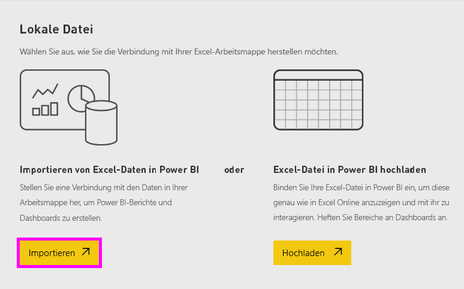
6. Wenn Ihr Dataset bereit ist, wählen Sie **Datasets** aus, und klicken Sie dann auf **Bericht erstellen** neben dem Dataset **Financial sample** (Finanzbeispiel), um den Berichts-Editor zu öffnen. 

    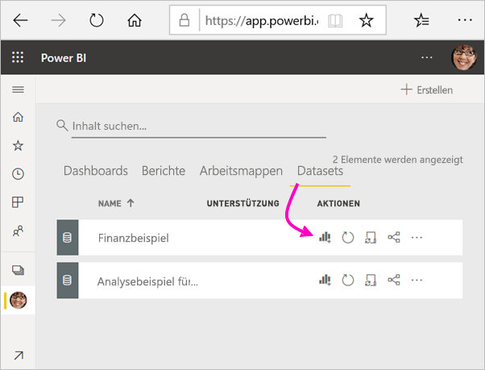

    Der Berichtszeichenbereich ist leer. Die Bereiche **Filter**, **Visualisierungen**, und **Felder** werden auf der rechten Seite angezeigt.

    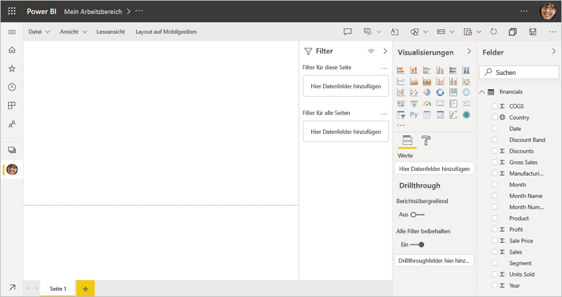

7. Beachten Sie, dass es eine Option für die **Leseansicht** im oberen Navigationsbereich gibt. Da diese Option verfügbar ist, bedeutet dies, dass Sie sich zurzeit in der Bearbeitungsansicht befinden. Ein [Überblick](../create-reports/service-the-report-editor-take-a-tour.md) stellt eine hervorragende Möglichkeit dar, sich mit dem Berichts-Editor vertraut zu machen.

    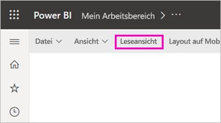

    In der Bearbeitungsansicht können Sie eigene Berichte erstellen und ändern, da Sie der *Besitzer* des Berichts sind. Das heißt, Sie sind ein *Ersteller*. Wenn Sie den Bericht für Kollegen freigeben, können diese mit dem Bericht nur in der Leseansicht interagieren. Dies bedeutet, dass sie *Anwender* sind. Weitere Informationen über [Leseansicht und Bearbeitungsansicht](../consumer/end-user-reading-view.md).

## Schritt 2: Erstellen eines Diagramms in einem Bericht
Nachdem die Verbindung mit den Daten hergestellt wurde, können Sie die Daten untersuchen.  Wenn Sie etwas gefunden haben, das für Sie von Interesse ist, können Sie ein Dashboard erstellen, um die Daten zu überwachen und Änderungen zu verfolgen. Sehen wir uns das einmal an.
    
1. Im Berichts-Editor beginnen Sie im Bereich **Felder** rechts auf der Seite, um eine Visualisierung zu erstellen. Aktivieren Sie die Kontrollkästchen **Gross Sales** (Bruttoumsatz) und **Date** (Datum).
   
   

    Power BI analysiert die Daten und erstellt eine Visualisierung. Wenn Sie zuerst **Date** ausgewählt haben, wird eine Tabelle angezeigt. Wenn Sie zuerst **Gross Sales** (Bruttoumsatz) ausgewählt haben, wird ein Säulendiagramm angezeigt. 

2. Wechseln Sie für Ihre Daten zu einer anderen Anzeigeart. Im Folgenden werden diese Daten als Liniendiagramm dargestellt. Wählen Sie im Bereich **Visualisierungen** das Symbol für das Liniendiagramm aus.
   
   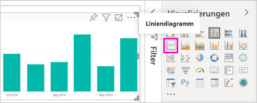

3. Dieses Diagramm sieht vielversprechend aus. *Heften wir es also an ein Dashboard an*. Zeigen Sie auf die Visualisierung, und wählen Sie das Stecknadelsymbol aus. Wenn Sie diese Visualisierung anheften, wird sie auf dem Dashboard gespeichert und fortlaufend aktualisiert, sodass Sie den aktuellen Wert auf einen Blick nachverfolgen können.
   
   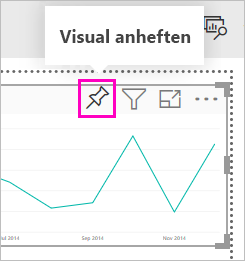

4. Da dieser Bericht neu ist, werden Sie aufgefordert, ihn zu speichern, bevor Sie eine Visualisierung an ein Dashboard anheften können. Weisen Sie dem Bericht einen Namen zu (z. B. *Umsatz im zeitlichen Verlauf*), und wählen Sie **Speichern** aus. 

5. Wählen Sie **Neues Dashboard** aus, und nennen Sie es *Financial sample for tutorial* (Finanzbeispiel für Tutorial). 
   
   
   
6. Wählen Sie **Anheften**aus.
   
    Eine Meldung (in der Nähe der oberen rechten Ecke) weist Sie darauf hin, dass die Visualisierung Ihrem Dashboard erfolgreich als Kachel hinzugefügt wurde.
   
    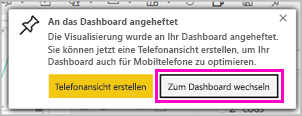

7. Wählen Sie **Zum Dashboard wechseln** aus, um Ihr neues Dashboard mit dem Liniendiagramm, das Sie als Kachel daran angeheftet haben, anzuzeigen. 
   
   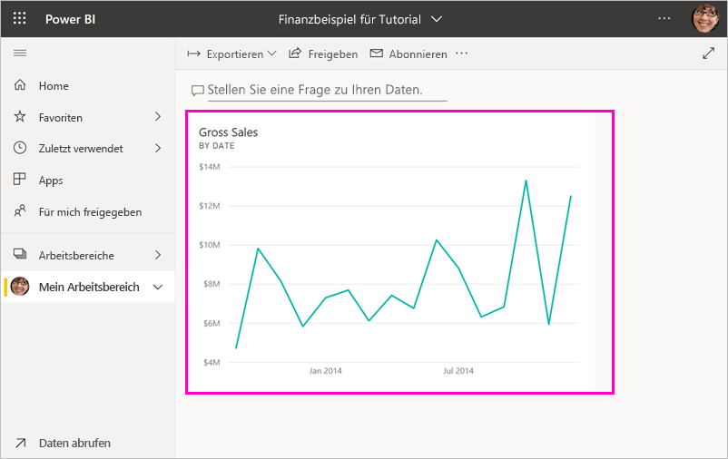
   
8. Wählen Sie die neue Kachel auf dem Dashboard aus, um zum Bericht zurückzukehren. Power BI ruft den Bericht wieder in der Leseansicht auf. 

1. Um zur Bearbeitungsansicht zurück zu wechseln, wählen Sie **Weitere Optionen** (...) im oberen Navigationsbereich > **Bearbeiten** aus. Wenn Sie sich wieder in der Bearbeitungsansicht befinden, können Sie weiterhin das Durchsuchen und Anheften von Kacheln fortsetzen.

    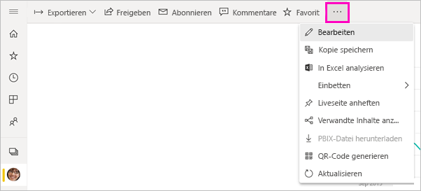

## Schritt 3: Durchsuchen mit Q&A

Versuchen Sie, im Q&A-Fragefeld eine Frage zu stellen, um eine schnelle Untersuchung Ihrer Daten durchzuführen. Q&A erstellt zu Ihren Daten Abfragen in natürlicher Sprache. In einem Dashboard befindet sich das Q&A-Feld oben (**Stellen Sie eine Frage zu Ihren Daten**). In einem Bericht befindet es sich im oberen Navigationsbereich (**Stellen Sie eine Frage**).

1. Wählen Sie **Mein Arbeitsbereich** im schwarzen **Power BI**-Balken aus, um zum Dashboard zurückzukehren.

    

1. Wählen Sie auf der Registerkarte **Dashboards** Ihr Dashboard aus.

    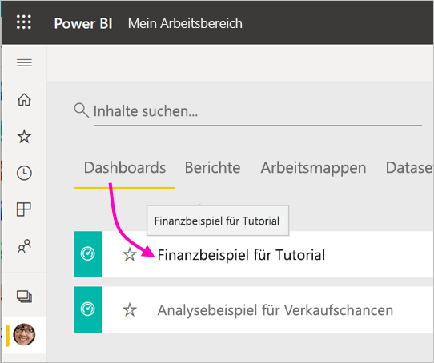

1. Wählen Sie **Stellen Sie eine Frage zu Ihren Daten** aus. Q&A bietet automatisch eine Reihe von Vorschlägen.

    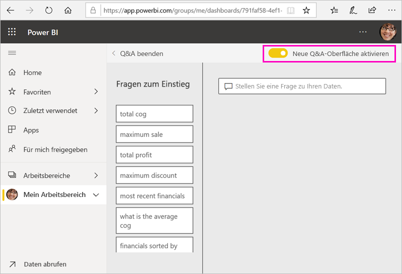

    > [!NOTE]
    > Wenn die Vorschläge nicht angezeigt werden, aktivieren Sie **Neue Q&A-Oberfläche**.

2. Einige der Vorschläge geben einen einzelnen Wert zurück. Wählen Sie beispielsweise **maximum sale** (Maximaler Umsatz) aus.

    Q&A sucht nach einer Antwort und präsentiert diese in Form einer *Kartenvisualisierung*.

    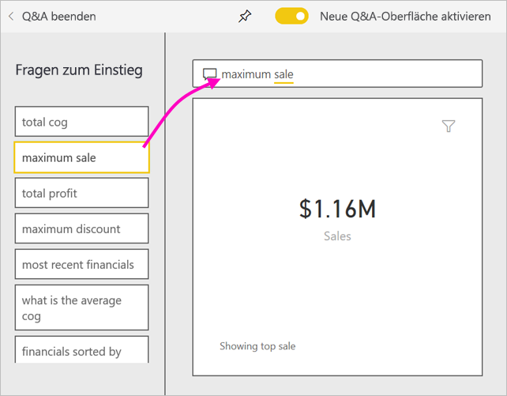

3. Wählen Sie das Anheftsymbol aus  , um diese Visualisierung an das Dashboard „Financial Sample for tutorial“ (Finanzbeispiel für das Tutorial) anzuheften.

1. Scrollen Sie in der Liste **Fragen zum Einstieg** nach unten, und wählen Sie **average cog for each month** (Durchschnittlicher Wareneinsatz im Monat) aus. 

    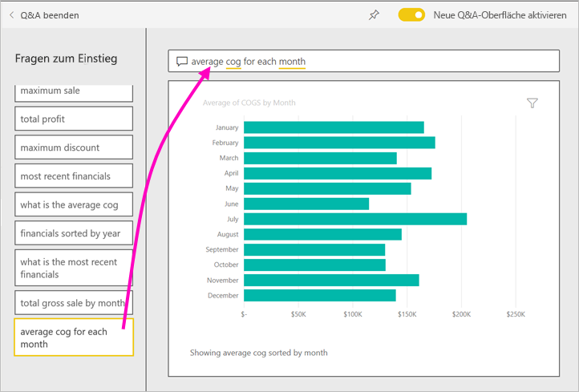

1. Heften Sie das Balkendiagramm ebenfalls an das Dashboard **Financial Sample for tutorial** (Finanzbeispiel für das Tutorial) an.

1. Platzieren Sie den Cursor nach *by month* (nach Monat) im Q&A-Feld, und geben Sie *as line* (als Linie) ein. Wählen Sie **line (Visualization Type)** (Linie (Visualisierungstyp)). 

    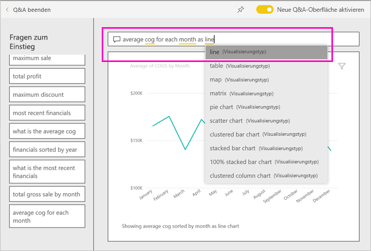

4. Wählen Sie **Q&A verlassen** aus, um zum Dashboard zurückzukehren, auf dem die neuen Kacheln angezeigt werden, die Sie erstellt haben. 

   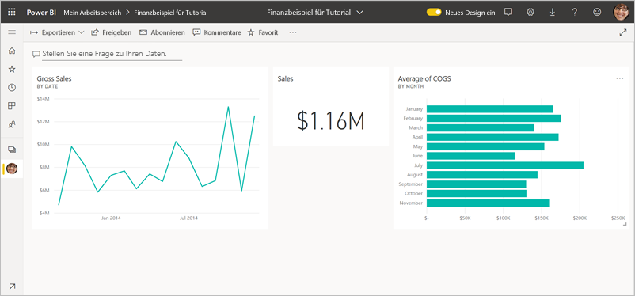

   Sie sehen, dass die Kachel ein Balkendiagramm geblieben ist, obwohl Sie das Diagramm in ein Liniendiagramm geändert haben. Das liegt daran, dass es in dem Moment, als Sie es angeheftet haben, ein Balkendiagramm war. 

## Schritt 4: Neupositionieren von Kacheln

Das Dashboard ist breit. Wir können die Kacheln neu anordnen, um den Dashboardbereich besser zu nutzen.

1. Ziehen Sie die untere rechte Ecke der Liniendiagrammkachel *Gross Sales* (Bruttoumsatz) nach oben, bis sie auf derselben Höhe wie die Kachel "Sales" angezeigt wird, und lassen Sie sie dann los.

    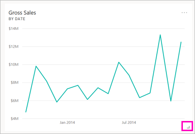

    Die beiden Kacheln befinden sich nun auf derselben Höhe.

    

1. Ziehen Sie an der Kachel des Balkendiagramms *Average of COGS* (Durchschnittlicher Wareneinsatz), bis diese unter das Liniendiagramm *Gross Sales* (Bruttoumsatz) passt.

    Das sieht besser aus.

    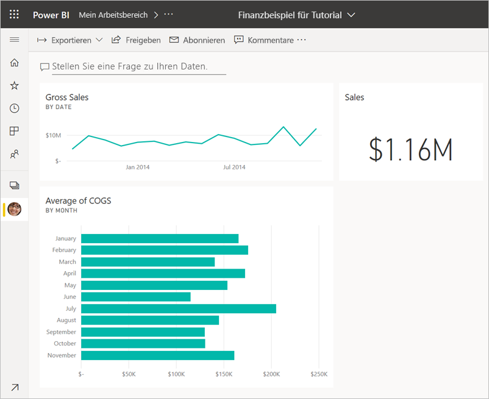

## Schritt 5: Interagieren mit den Kacheln

Im Folgenden finden Sie eine letzte Interaktion, die Sie beachten sollten, bevor Sie mit dem Erstellen eigener Dashboards und Berichte beginnen. Das Auswählen der verschiedenen Kacheln führt zu unterschiedlichen Ergebnissen. 

1. Wählen Sie zuerst die Kachel des Liniendiagramms *Gross Sales* (Bruttoumsatz) aus, die Sie aus dem Bericht angeheftet haben. 

    Power BI öffnet den Bericht in der Leseansicht. 

2. Klicken Sie auf die Browserschaltfläche „Zurück“. 

1. Wählen Sie nun die Kachel des Balkendiagramms *Average of COGS* (Durchschnittlicher Wareneinsatz) aus, die Sie in Q&A erstellt haben. 

    Power BI öffnet den Bericht nicht. Stattdessen wird Q&A geöffnet, da Sie dieses Diagramm dort erstellt haben.

## Bereinigen von Ressourcen
Nachdem Sie das Tutorial abgeschlossen haben, können Sie das Dataset, den Bericht und das Dashboard löschen. 

1. Stellen Sie im Navigationsbereich sicher, dass Sie sich in **Mein Arbeitsbereich** befinden.
2. Klicken Sie auf die Registerkarte **Dataset**, und suchen Sie nach dem Dataset, das Sie für dieses Tutorial importiert haben.  
3. Wählen Sie **Weitere Optionen** (...) > **Löschen** aus.

    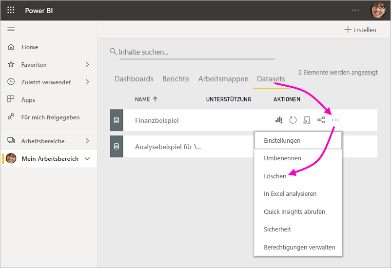

    Wenn Sie das Dataset löschen, wird eine Warnung mit dem Hinweis **Alle Berichte und Dashboardkacheln, die Daten aus diesem Dataset enthalten, werden ebenfalls gelöscht**.

4. Wählen Sie **Löschen**.

## Nächste Schritte

Perfektionieren Sie die Dashboards, indem Sie weitere Visualisierungskacheln hinzufügen und [diese umbenennen, verknüpfen, neu positionieren und in der Größe ändern](../create-reports/service-dashboard-edit-tile.md).
