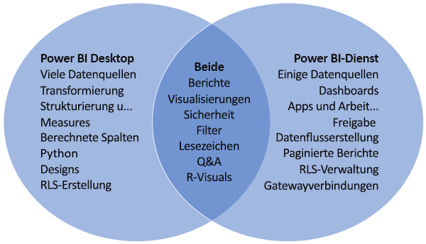

# Vergleich zwischen Power BI Desktop und dem Power BI-Dienst

Im folgenden Venn-Diagramm werden im mittleren Bereich die Gemeinsamkeiten dargestellt, die sich aus einem Vergleich zwischen Power BI Desktop und dem Power BI-Dienst ergeben. Es gibt einige Aufgaben, die Sie sowohl in Power BI Desktop als auch im Power BI-Dienst ausführen können. In den beiden Bereichen, die sich nicht überschneiden, werden Features aufgeführt, die nur Teil dieser Anwendung bzw. dieses Diensts sind.  

**Power BI Desktop** ist ein umfassendes Tool zur Datenanalyse und Berichterstellung, das Sie kostenlos auf Ihrem lokalen Computer installieren können. Es enthält den Abfrage-Editor, in dem Sie eine Verbindung mit vielen unterschiedlichen Datenquellen herstellen und diese in einem Datenmodell kombinieren können. Der letztgenannte Vorgang wird oft auch als Modellierung bezeichnet. Anschließend können Sie einen Bericht entwerfen, der auf diesem Datenmodell basiert. Im Leitfaden [Erste Schritte mit Power BI Desktop](desktop-getting-started.md) wird der Prozess ausführlich beschrieben.

Der **Power BI-Dienst** ist cloudbasiert. Er unterstützt die Bearbeitung einfacher Berichte und die Zusammenarbeit in Teams und Organisationen. Sie können im Power BI-Dienst auch eine Verbindung mit Datenquellen herstellen, Modellierungen sind jedoch nur eingeschränkt möglich. 

Die meisten Berichts-Designer, die an Business-Intelligence-Projekten arbeiten, verwenden **Power BI Desktop** zum Erstellen von Berichten und nutzen anschließend den **Power BI-Dienst**, um ihre Berichte für andere Personen freizugeben.

## Bearbeitung von Berichten

Sie können sowohl in der Anwendung als auch im Dienst *Berichte* erstellen und bearbeiten. Ein Bericht kann eine Seite oder mehrere Seiten umfassen und Visuals und Sammlungen von Visuals enthalten. Sie können Lesezeichen, Schaltflächen und Filter hinzufügen sowie einen Drillthrough verwenden, um die Navigation in Ihren Berichten zu verbessern.

Die Berichts-Editoren in Power BI Desktop und im Power BI-Dienst ähneln sich. Sie bestehen aus drei Abschnitten:  

1. Den oberen Navigationsbereichen, die in Power BI Desktop und dem Power BI-Dienst Unterschiede aufweisen    
2. Der Zeichenbereich des Berichts     
3. Den Bereichen **Felder**, **Visualisierungen** und **Filter**

Im folgenden Video wird der Berichts-Editor in Power BI Desktop gezeigt. 

<iframe width="560" height="315" src="https://www.youtube.com/embed/IkJda4O7oGs" frameborder="0" allowfullscreen></iframe>

## Arbeiten mit dem Power BI-Dienst

### Zusammenarbeiten

Nachdem Sie Ihre Berichte erstellt haben, können Sie diese in einem *Arbeitsbereich* im **Power BI-Dienst** speichern, in dem Sie und Ihre Kollegen zusammenarbeiten. Zusätzlich zu diesen Berichten erstellen Sie *Dashboards*. Anschließend geben Sie die Dashboards und Berichte für Berichtsbenutzer innerhalb und außerhalb Ihrer Organisation frei. Die Berichtbenutzer lassen sich diese im Power BI-Dienst in der *Leseansicht* und nicht in der Bearbeitungsansicht anzeigen. Diese Personen können nicht auf alle Features zugreifen, die für Berichtersteller verfügbar sind.  Sie können Ihre Datasets auch freigeben, damit andere Benutzer mit diesen eigene Berichte erstellen können. Weitere Informationen finden Sie unter [Zusammenarbeiten im Power BI-Dienst](../collaborate-share/service-new-workspaces.md).

### Self-Service-Datenvorbereitung mit Dataflows

Dataflows unterstützen Organisationen dabei, Daten aus unterschiedlichen Quellen zusammenzuführen und zur Modellierung vorzubereiten. Analysten können mit vertrauten Self-Service-Tools ganz einfach Dataflows erstellen. Sie werden zum Erfassen, Transformieren, Integrieren und Anreichern von Big Data verwendet, indem unter anderem Datenquellenverbindungen, ETL-Logik und Aktualisierungspläne definiert werden. Weitere Informationen finden Sie unter [Self-Service-Datenvorbereitung mit Dataflows](../transform-model/service-dataflows-overview.md).

## Weitere Schritte

[Was ist Power BI Desktop?](desktop-what-is-desktop.md)

[Erstellen eines Berichts](../create-reports/service-report-create-new.md) im Power BI-Dienst

[Grundlegende Konzepte für Berichts-Designer](service-basic-concepts.md)

Weitere Fragen? [Wenden Sie sich an die Power BI-Community](https://community.powerbi.com/)
