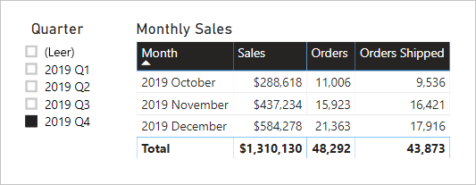

# <a name="active-vs-inactive-relationship-guidance"></a>Aktive und inaktive Beziehungen im Vergleich – Leitfaden

Dieser Artikel ist an Modellierer von Daten gerichtet, die mit Power BI Desktop arbeiten. Er bietet Empfehlungen dazu, wann aktive oder inaktive Modellbeziehungen erstellt werden sollten. Standardmäßig werden durch aktive Beziehungen Filter an andere Tabellen weitergegeben. Inaktive Beziehungen dagegen geben Filter nur dann weiter, wenn die Beziehung über einen DAX-Ausdruck aktiviert (verwendet) wird.

[!INCLUDE [relationships-prerequisite-reading](includes/relationships-prerequisite-reading.md)]

## <a name="active-relationships"></a>Aktive Beziehungen

Im Allgemeinen wird empfohlen, nach Möglichkeit aktive Beziehungen zu definieren. Aktive Beziehungen erweitern den Umfang und das Potenzial der Nutzung Ihres Modells durch Berichtsautoren und durch Benutzer, die mit Q&A arbeiten.

Betrachten wir ein Beispiel eines Importmodells zum Analysieren der Pünktlichkeit von Flügen. Das Modell umfasst eine Tabelle **Flight**. Hierbei handelt es sich um eine Faktentabelle, in der ein Flug pro Zeile gespeichert wird. Jede Zeile enthält das Flugdatum, die Flugnummer, den Abflug- und den Ankunftsflughafen sowie die eventuelle Verspätung (in Minuten). Darüber hinaus gibt es eine **Airport**-Tabelle. Hierbei handelt es sich um eine Dimensionstabelle, in der pro Zeile ein Flughafen gespeichert ist. Jede Zeile beschreibt den Flughafencode und -namen und das Land.

Nachfolgend wird ein partielles Modelldiagramm der beiden Tabellen gezeigt.


Es gibt zwei Modellbeziehungen zwischen den Tabellen **Flight** und **Airport**. In der Tabelle **Flight** beziehen sich die Spalten **DepartureAirport** und **ArrivalAirport** auf die Spalte **Airport** der Tabelle **Airport**. In einem Design mit Sternschema wird die Tabelle **Airport** als [Dimension mit unterschiedlichen Rollen](star-schema.md#role-playing-dimensions) beschrieben. In diesem Modell sind dies die zwei Rollen _Abflughafen_ und _Ankunftsflughafen_.

Während dieser Entwurf für Designs mit relationalem Sternschema gut funktioniert, ist dies bei einem Power BI-Modell nicht der Fall. Das liegt daran, dass Modellbeziehungen Pfade für die Filterweitergabe sind, und diese Pfade müssen deterministisch sein. Aus diesem Grund kann ein Modell nicht über mehrere aktive Beziehungen zwischen zwei Tabellen verfügen. Daher ist – wie in diesem Beispiel beschrieben – eine Beziehung aktiv, während die andere inaktiv ist (dargestellt durch die gestrichelte Linie). Im Beispiel ist die Beziehung zur Spalte **ArrivalAirport** aktiv. Dies bedeutet, dass auf die Tabelle **Airport** angewendete Filter automatisch auf die Spalte **ArrivalAirport** der Tabelle **Flight** übertragen werden.

Mit diesem Modellentwurf gehen einige schwer wiegende Einschränkungen hinsichtlich der Berichtserstellung für die Daten einher. Insbesondere ist es nicht möglich, die Tabelle **Airport** so zu filtern, dass automatisch Flugdetails für einen Abflughafen isoliert werden. Da für die Berichtserstellung eine _gleichzeitige_ Filterung (oder Gruppierung) nach Abflug- und Ankunftsflughafen erforderlich ist, werden zwei aktive Beziehungen benötigt. Die Übersetzung dieser Anforderung in einem Power BI-Modellentwurf bedeutet, dass das Modell zwei Flughafentabellen umfassen muss.

Nachfolgend wird der verbesserte Modellentwurf gezeigt.


Das Modell enthält jetzt zwei Flughafentabellen: **Departure Airport** und **Arrival Airport**. Die Modellbeziehungen zwischen diesen Tabellen und der Tabelle **Flight** sind aktiv. Beachten Sie außerdem, dass die Spaltennamen in den Tabellen **Departure Airport** und **Arrival Airport** das Präfix _Departure_ oder _Arrival_ enthalten.

Der verbesserte Modellentwurf unterstützt das Generieren des folgenden Berichtsdesigns.


Die Berichtsseite filtert „Melbourne“ als Abflughafen heraus, und das Tabellenvisual führt eine Gruppierung nach Ankunftsflughäfen durch.

> [!NOTE]
> Für Importmodelle vergrößert die zusätzliche Tabelle das Modell und führt zu längeren Aktualisierungszeiten. Dies widerspricht den im Artikel [Verfahren zur Datenreduktion für die Importmodellierung](import-modeling-data-reduction.md) beschriebenen Empfehlungen. In diesem Beispiel hat jedoch die Anforderung, nur aktive Beziehungen zu verwenden, Vorrang vor diesen Empfehlungen.
>
> Außerdem ist es üblich, dass Dimensionstabellen im Vergleich zu Faktentabellen eine geringere Zeilenanzahl aufweisen. Das Modell ist deshalb wahrscheinlich nicht übermäßig größer, und die Aktualisierungszeiten sind nicht übermäßig länger.

### <a name="refactoring-methodology"></a>Methodik der Umgestaltung

Nachfolgend wird eine Methodik zum Umgestalten eines Modells von einer einzelnen Dimensionstabelle mit unterschiedlichen Rollen zu einem Entwurf mit _einer Tabelle pro Rolle_ vorgestellt.

1. Entfernen Sie alle inaktiven Beziehungen.
2. Erwägen Sie eine Umbenennung der Dimensionstabelle mit unterschiedlichen Rollen, um ihre Rolle besser zu beschreiben. Im Beispiel bezieht sich die Tabelle **Airport** auf die Spalte **ArrivalAirport** der Tabelle **Flight**, sodass sie in **Arrival Airport** umbenannt wurde.
3. Erstellen Sie eine Kopie der Tabelle mit unterschiedlichen Rollen, und geben Sie ihr einen Namen, der ihre Rolle widerspiegelt. Wenn es sich um eine wichtige Tabelle handelt, wird die Definition einer berechneten Tabelle empfohlen. Bei einer DirectQuery-Tabelle können Sie die Power Query-Abfrage duplizieren.

    Im Beispiel wurde die Tabelle **Departure Airport** durch Verwendung der folgenden Definition einer berechneten Tabelle erstellt.

    ```dax
    Departure Airport = 'Arrival Airport'
    ```

4. Erstellen Sie eine aktive Beziehung, um die neue Tabelle in Beziehung zu setzen.
5. Erwägen Sie das Umbenennen der Spalten in den Tabellen, um ihre Rolle exakt widerzuspiegeln. Im Beispiel erhielten alle Spalten das Präfix _Departure_ oder _Arrival_. Diese Namen stellen sicher, dass die Berichtsvisuals standardmäßig selbstbeschreibend sind und eindeutige Bezeichnungen aufweisen. Außerdem wird die Q&A-Nutzung verbessert, da Benutzer auf einfache Weise Fragen stellen können.
6. Erwägen Sie das Hinzufügen von Beschreibungen zu Tabellen mit mehreren Rollen. (Im Bereich **Fields** wird eine Beschreibung in einer QuickInfo angezeigt, wenn ein Berichtsautor mit dem Cursor auf die Tabelle zeigt.) Auf diese Weise können Sie zusätzliche Details zur Filterweitergabe für Ihre Berichtsautoren bereitstellen.

## <a name="inactive-relationships"></a>Inaktive Beziehungen

Unter bestimmten Umständen können inaktive Beziehungen besondere Anforderungen an die Berichterstattung erfüllen.

Betrachten wir unterschiedliche Modell- und Berichterstellungsanforderungen:

- Ein Vertriebsmodell enthält eine Tabelle **Sales** mit zwei Datenspalten: **OrderDate** und **ShipDate**
- Jede Zeile in der Tabelle **Sales** erfasst einen einzelnen Auftrag.
- Datumsfilter werden fast immer auf die Spalte **OrderDate** angewendet, in der stets ein gültiges Datum gespeichert wird.
- Nur ein Measure erfordert die Weitergabe des Datumsfilters in der Spalte **ShipDate**, die (bis zum Versand der Bestellung) LEERE Werte enthalten kann.
- Es ist nicht erforderlich, eine gleichzeitige Filterung (oder Gruppierung) nach Zeiträumen für Auftrags- _und_ Versanddaten durchzuführen.

Nachfolgend wird ein partielles Modelldiagramm der beiden Tabellen gezeigt.


Es gibt zwei Modellbeziehungen zwischen den Tabellen **Sales** und **Date**. In der Tabelle **Sales** beziehen sich die Spalten **OrderDate** und **ShipDate** auf die Spalte **Date** der Tabelle **Date**. In diesem Modell lauten die zwei Rollen für die Tabelle **Date**: _order date_ und _ship date_. Die Beziehung zur Spalte **OrderDate** ist die aktive Beziehung.

Alle sechs Measures – mit Ausnahme von einem – müssen nach der Spalte **OrderDate** gefiltert werden. Das Measure **Orders Shipped** dagegen muss nach der Spalte **ShipDate** gefiltert werden.

Nachfolgend wird die Definition für das Measure **Orders** gezeigt. Es werden einfach die Zeilen der Tabelle **Sales** innerhalb des Filterkontextes gezählt. Alle Filter, die auf die Tabelle **Date** angewendet werden, werden auf die Spalte **OrderDate** übertragen.

```dax
Orders = COUNTROWS(Sales)
```

Nachfolgend wird die Definition für das Measure **Orders Shipped** gezeigt. Sie verwendet die DAX-Funktion [USERELATIONSHIP](/dax/userelationship-function-dax), die die Filterweitergabe für eine bestimmte Beziehung nur während der Auswertung des Ausdrucks aktiviert. In diesem Beispiel wird die Beziehung zur Spalte **ShipDate** verwendet.

```dax
Orders Shipped =
CALCULATE(
    COUNTROWS(Sales)
    ,USERELATIONSHIP('Date'[Date], Sales[ShipDate])
)
```

Dieser Modellentwurf unterstützt das Generieren des folgenden Berichtsdesigns.



Die Berichtsseite führt eine Filterung nach dem 4. Quartal 2019 durch. Das Tabellenvisual führt eine Gruppierung nach Monat durch und zeigt verschiedene Vertriebsstatistiken an. Die Measures **Orders** und **Orders Shipped** führen zu unterschiedlichen Ergebnissen. Sie verwenden jeweils die gleiche Zusammenfassungslogik (Zählen der Zeilen der Tabelle **Sales**), aber eine unterschiedliche Weitergabe der **Date**-Tabellenfilter.

Beachten Sie, dass der Slicer „Quarter“ ein LEERES Element enthält. Dieser Slicer wird als Ergebnis einer [Tabellenerweiterung](../desktop-relationships-understand.md#strong-relationships) angezeigt. Während jede **Sales**-Tabellenzeile ein Auftragsdatum enthält, ist das Versanddatum in einigen Zeilen LEER – diese Bestellungen wurden noch nicht versendet. Bei der Tabellenerweiterung werden auch inaktive Beziehungen berücksichtigt, sodass LEERE Werte aufgrund von LEEREN Werten auf der n-Seite der Beziehung oder aufgrund von Datenintegritätsproblemen auftreten können.

## <a name="recommendations"></a>Empfehlungen

Zusammenfassend wird empfohlen, nach Möglichkeit aktive Beziehungen zu definieren. Aktive Beziehungen erweitern den Umfang und das Potenzial der Nutzung Ihres Modells durch Berichtsautoren und durch Benutzer, die mit Q&A arbeiten. Dies bedeutet, dass Dimensionstabellen mit unterschiedlichen Rollen in Ihrem Modell dupliziert werden sollten.

Unter bestimmten Umständen können Sie jedoch eine oder mehrere inaktive Beziehungen für eine Dimensionstabelle mit unterschiedlichen Rollen definieren. Erwägen Sie diesen Entwurf in folgenden Fällen:

- Es ist nicht erforderlich, Berichtsvisuals gleichzeitig nach unterschiedlichen Rollen zu filtern.
- Sie verwenden die DAX-Funktion USERELATIONSHIP, um eine bestimmte Beziehung für relevante Modellberechnungen zu aktivieren.

## <a name="next-steps"></a>Nächste Schritte

Weitere Informationen zu diesem Artikel finden Sie in den folgenden Ressourcen:

- [Modellieren von Beziehungen in Power BI Desktop](../desktop-relationships-understand.md)
- [Informationen zum Sternschema und dessen Wichtigkeit für Power BI](star-schema.md)
- [Leitfaden zur Problembehandlung bei Beziehungen](relationships-troubleshoot.md)
- Haben Sie Fragen? [Stellen Sie Ihre Frage in der Power BI-Community.](https://community.powerbi.com/)
- Vorschläge? [Einbringen von Ideen zur Verbesserung von Power BI](https://ideas.powerbi.com/)
