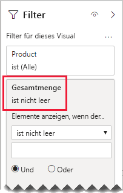

# <a name="bi-directional-relationship-guidance"></a>Leitfaden zu bidirektionalen Beziehungen

Dieser Artikel ist an Modellierer von Daten gerichtet, die mit Power BI Desktop arbeiten. Er bietet Empfehlungen dazu, wann bidirektionale Modellbeziehungen erstellt werden sollten. Eine bidirektionale Beziehung ist eine Beziehung, in der in _beide Richtungen_ gefiltert wird.

[!INCLUDE [relationships-prerequisite-reading](includes/relationships-prerequisite-reading.md)]

Im Allgemeinen empfiehlt es sich, die Verwendung von bidirektionalen Beziehungen zu minimieren. Diese können sich negativ auf die Abfrageleistung von Modellen auswirken und möglicherweise verwirrende Ergebnisse für Ihre Berichtsbenutzer erzeugen.

Es gibt drei Szenarien, in denen eine bidirektionale Filterung bestimmte Anforderungen erfüllen kann:

- [Besondere Modellbeziehungen](#special-model-relationships)
- [Slicerelemente „mit Daten“](#slicer-items-with-data)
- [Analysen zwischen Dimensionen](#dimension-to-dimension-analysis)

## <a name="special-model-relationships"></a>Besondere Modellbeziehungen

Bidirektionale Beziehungen spielen beim Erstellen der folgenden beiden besonderen Modellbeziehungen eine wichtige Rolle:

- **1:1-Beziehung**: Alle 1:1-Beziehungen müssen bidirektional sein, eine anderweitige Konfiguration ist nicht möglich. Im Allgemeinen empfiehlt es sich nicht, diese Arten von Beziehungen zu erstellen. Eine vollständige Erläuterung und alternative Entwürfe finden Sie im [Leitfaden zu 1:1-Beziehungen](relationships-one-to-one.md).
- **m:n-Beziehung**: Wenn zwei Dimensionstabellen miteinander in Beziehung gesetzt werden sollen, ist eine Überbrückungstabelle erforderlich. Um sicherzustellen, dass Filter über diese Überbrückungstabelle hinweg weitergegeben werden, ist ein bidirektionaler Filter erforderlich. Weitere Informationen finden Sie im [Leitfaden zu m:n-Beziehungen (Herstellen von m:n-Beziehungen zwischen Dimensionen)](relationships-many-to-many.md#relate-many-to-many-dimensions).

## <a name="slicer-items-with-data"></a>Slicerelemente „mit Daten“

Bidirektionale Beziehungen können Slicer bereitstellen, die Elemente auf das Vorhandensein von Daten beschränken. (Wenn Sie mit PivotTables in Excel und Slicern vertraut sind: Es handelt sich um das Standardverhalten beim Abrufen von Daten aus einem Power BI-Dataset oder einem Analysis Services-Modell.) Um dieses Konzept zu verstehen, sehen Sie sich zunächst das folgende Modellschaubild an.


Die erste Tabelle heißt **Customer** und enthält drei Spalten: **Country-Region**, **Customer** und **CustomerCode**. Die zweite Tabelle heißt **Product** und enthält drei Spalten: **Color**, **Product** und **SKU**. Die dritte Tabelle heißt **Sales** und enthält vier Spalten: **CustomerCode**, **OrderDate**, **Quantity** und **SKU**. Bei den Tabellen **Customer** und **Product** handelt es sich um Dimensionstabellen, und jede Tabelle verfügt über eine 1:n-Beziehung mit der Tabelle **Sales**. Jede Beziehung filtert nur in eine Richtung.

Um die Funktionsweise der bidirektionalen Filterung besser zu beschreiben, wurde das Modellschaubild so angepasst, dass die Tabellenzeilen angezeigt werden. Alle Beispiele in diesem Artikel basieren auf diesen Daten.

> [!NOTE]
> Im Modellschaubild in Power BI Desktop können Tabellenzeilen nicht angezeigt werden. In diesem Artikel wurde das nur getan, um die die Beispiele besser verständlich zu machen.


In der folgenden Aufzählung werden die Details zu den Zeilen der drei Tabellen erläutert:

- Die Tabelle **Customer** hat zwei Zeilen:
  - **CustomerCode**: CUST-01, **Customer**: Customer-1, **Country-Region**: United States
  - **CustomerCode**: CUST-02, **Customer**: Customer-2, **Country-Region**: Australia
- Die Tabelle **Product** enthält drei Zeilen:
  - **SKU**: CL-01, **Product**: T-shirt, **Color**: Green
  - **SKU**: CL-02, **Product**: Jeans, **Color**: Blue
  - **SKU**: AC-01, **Product**: Hat, **Color**: Blue
- Die Tabelle **Sales** enthält drei Zeilen:
  - **OrderDate**: January 1 2019, **CustomerCode**: CUST-01, **SKU**: CL-01, **Quantity**: 10
  - **OrderDate**: February 2 2019, **CustomerCode**: CUST-01, **SKU**: CL-02, **Quantity**: 20
  - **OrderDate**: March 3 2019, **CustomerCode**: CUST-02, **SKU**: CL-01, **Quantity**: 30

Betrachten Sie nun die folgende Berichtsseite.


Die Seite besteht aus zwei Slicern und einem Kartenvisual. Der erste Slicer gilt für **Country-Region** und enthält zwei Elemente: Australia und United States. Zurzeit wird nach „Australia“ segmentiert. Der zweite Slicer gilt für **Product** und enthält drei Elemente: Hat, Jeans und T-shirt. Es sind keine Elemente ausgewählt (was bedeutet, dass _keine Produkte_ gefiltert werden). Das Kartenvisual zeigt eine Menge von 30 an.

Wenn Berichtsbenutzer nach „Australia“ segmentieren, sollten Sie den Slicer **Product** so begrenzen, dass Elemente angezeigt werden, die sich auf Verkäufe in Australien _beziehen_. Das ist gemeint, wenn von der Anzeige von Slicerelementen „mit Daten“ die Rede ist. Sie können dieses Verhalten erreichen, indem Sie die Beziehung zwischen den Tabellen **Product** und **Sales** so konfigurieren, dass eine Filterung in beide Richtungen erfolgt.


Der Slicer **Product** listet jetzt ein einziges Element auf: T-shirt. Dieses Element repräsentiert das einzige Produkt, das an australische Kunden verkauft wurde.


Zunächst sollten Sie gründlich darüber nachdenken, ob dieser Entwurf für Ihre Berichtsbenutzer funktioniert. Für einige Berichtsbenutzer kann dieses Verhalten verwirrend sein. Sie verstehen nicht, warum Slicerelemente dynamisch ein- oder ausgeblendet werden, wenn sie mit anderen Slicern interagieren.

Wenn Sie sich dafür entscheiden, Slicerelemente „mit Daten“ anzuzeigen, empfiehlt sich die Konfiguration von bidirektionalen Beziehungen nicht. Bidirektionale Beziehungen erfordern mehr Verarbeitung und können daher die Abfrageleistung beeinträchtigen – insbesondere dann, wenn die Anzahl von bidirektionalen Beziehungen in Ihrem Modell steigt.

Es gibt eine bessere Möglichkeit, dasselbe Ergebnis zu erzielen: Anstatt bidirektionale Filter zu verwenden, können Sie auf den Slicer **Product** selbst einen Filter auf Visualebene anwenden.

Nehmen wir nun an, dass die Beziehung zwischen den Tabellen **Product** und **Sales** nicht mehr in beide Richtungen filtert. Darüber hinaus wurde der Tabelle **Sales** die folgende Measuredefinition hinzugefügt.

```dax
Total Quantity = SUM(Sales[Quantity])
```

Um die Slicerelemente für **Product** „mit Daten“ anzuzeigen, muss die Tabelle einfach mit dem Measure **Total Quantity** und der Bedingung „is not blank“ gefiltert werden.



## <a name="dimension-to-dimension-analysis"></a>Analysen zwischen Dimensionen

Ein anderes Szenario, an dem bidirektionale Beziehungen beteiligt sind, behandelt eine Faktentabelle wie eine Überbrückungstabelle. Auf diese Weise wird die Analyse von Daten aus einer Dimensionstabelle im Filterkontext einer anderen Dimensionstabelle unterstützt.

Überlegen Sie, wie sich anhand des Beispielmodells in diesem Artikel die folgenden Fragen beantworten lassen:

- Wie viele Farben wurden an australische Kunden verkauft?
- In wie vielen Ländern wurden Jeans gekauft?

Beide Fragen können beantwortet werden, _ohne_ dass die Daten in der Faktentabelle zur Überbrückung zusammengefasst werden müssen. Allerdings muss eine Weitergabe der Filter von einer Dimensionstabelle in die andere erfolgen. Sobald die Filter Daten über die Faktentabelle weitergeben, lässt sich eine Zusammenfassung der Spalten einer Dimensionstabelle mithilfe der DAX-Funktion [DISTINCTCOUNT](/dax/distinctcount-function-dax) – sowie eventuell der DAX-Funktionen [MIN](/dax/min-function-dax) und [MAX](/dax/max-function-dax) – erreichen.

Da sich die Faktentabelle wie eine Überbrückungstabelle verhält, können Sie den Leitfaden zu m:n-Beziehungen befolgen, um zwei Dimensionstabellen in Beziehung zu setzen. Hierfür muss mindestens eine Beziehung für eine Filterung in beide Richtungen konfiguriert sein. Weitere Informationen finden Sie im [Leitfaden zu m:n-Beziehungen (Herstellen von m:n-Beziehungen zwischen Dimensionen)](relationships-many-to-many.md#relate-many-to-many-dimensions).

Wie in diesem Artikel bereits erläutert, wirkt sich dieser Entwurf wahrscheinlich negativ auf die Leistung aus, und die Benutzer sind möglicherweise durch [Slicerelemente „mit Daten“](#slicer-items-with-data) verwirrt. Daher empfehlen wir stattdessen die Aktivierung der bidirektionalen Filterung _in einer Measuredefinition_ mithilfe der DAX-Funktion [CROSSFILTER](/dax/crossfilter-function). Die CROSSFILTER-Funktion kann verwendet werden, um während der Auswertung eines Ausdrucks die Filterrichtung zu ändern oder sogar die Beziehung zu deaktivieren.

Sehen Sie sich die folgende Measuredefinition an, die der Tabelle **Sales** hinzugefügt wurde. In diesem Beispiel wurde die Modellbeziehung zwischen den Tabellen **Customer** und **Sales** zur Filterung _in nur einer Richtung_ konfiguriert.

```dax
Different Countries Sold =
CALCULATE(
    DISTINCTCOUNT(Customer[Country-Region]),
    CROSSFILTER(
        Customer[CustomerCode],
        Sales[CustomerCode],
        BOTH
    )
)
```

Während der Auswertung des Measureausdrucks **Different Countries Sold** erfolgt für die Beziehung zwischen den Tabellen **Customer** und **Sales** eine Filterung in beide Richtungen.

Das folgende Tabellenvisual zeigt Statistiken zu jedem verkauften Produkt an. Die Spalte **Quantity** enthält einfach die Summe aller Mengenwerte. Die Spalte **Different Countries Sold** repräsentiert die eindeutige Anzahl von country-region-Werten aller Kunden, die das Produkt gekauft haben.


## <a name="next-steps"></a>Nächste Schritte

Weitere Informationen zu diesem Artikel finden Sie in den folgenden Ressourcen:

- [Modellieren von Beziehungen in Power BI Desktop](../desktop-relationships-understand.md)
- [Informationen zum Sternschema und dessen Wichtigkeit für Power BI](star-schema.md)
- [Leitfaden zu 1:1-Beziehungen](relationships-one-to-one.md)
- [Leitfaden zu m:n-Beziehungen](relationships-many-to-many.md)
- [Leitfaden zur Problembehandlung bei Beziehungen](relationships-troubleshoot.md)
- Haben Sie Fragen? [Stellen Sie Ihre Frage in der Power BI-Community.](https://community.powerbi.com/)
- Vorschläge? [Einbringen von Ideen zur Verbesserung von Power BI](https://ideas.powerbi.com/)
