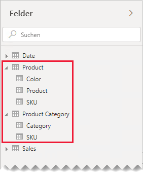
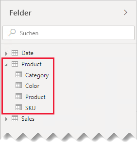
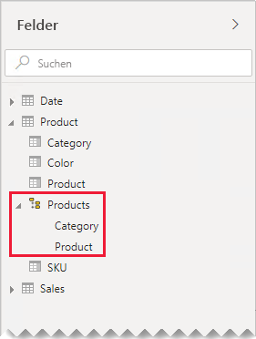
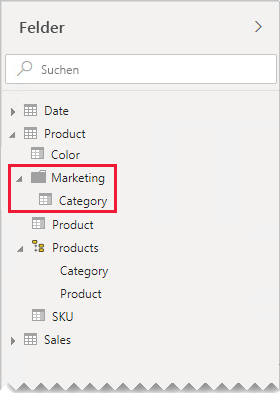

# Leitfaden zu 1:1-Beziehungen

Dieser Artikel ist an Modellierer von Daten gerichtet, die mit Power BI Desktop arbeiten. Er bietet einen Leitfaden für die Arbeit mit 1:1-Modellbeziehungen. Eine 1:1-Beziehung kann erstellt werden, wenn beide Tabellen jeweils eine Spalte mit gemeinsamen und eindeutigen Werten enthalten.

[!INCLUDE [relationships-prerequisite-reading](includes/relationships-prerequisite-reading.md)]

Es gibt zwei Szenarien, die 1:1-Beziehungen umfassen:

- [Degenerierte Dimensionen](#degenerate-dimensions): Sie können eine [degenerierte Dimension](star-schema.md#degenerate-dimensions) aus einer Faktentabelle ableiten.
- [Tabellenübergreifende Zeilendaten](#row-data-spans-across-tables): Eine einzelne Geschäftsentität oder ein einzelnes Objekt wird in Form von zwei (oder mehr) Modelltabellen geladen, möglicherweise weil die zugehörigen Daten aus verschiedenen Datenspeichern stammen. Dieses Szenario kann bei Dimensionstabellen häufig vorkommen. Beispielsweise können die Details zum Hauptprodukt in einem operativen Vertriebssystem gespeichert werden, während ergänzende Produktdetails in einer anderen Quelle abgelegt sind.

    Es ist jedoch unüblich, zwei Faktentabellen mit einer 1:1-Beziehung zu verknüpfen. Das liegt daran, dass beide Faktentabellen dieselbe Dimensionalität und Granularität aufweisen müssten. Außerdem würde jede Faktentabelle eindeutige Spalten benötigen, damit die Modellbeziehung erstellt werden kann.

## Degenerierte Dimensionen

Wenn Spalten aus einer Faktentabelle zum Filtern oder Gruppieren verwendet werden, können Sie erwägen, sie in einer separaten Tabelle zur Verfügung zu stellen. Auf diese Weise trennen Sie die zum Filtern oder Gruppieren verwendeten Spalten von denjenigen, die zum Zusammenfassen von Faktenzeilen verwendet werden. Durch diese Trennung wird Folgendes erreicht:

- Verringern des Speicherplatzes
- Vereinfachen der Modellberechnungen
- Verbessern der Abfrageleistung
- Höhere Benutzerfreundlichkeit im Bereich **Felder** für Ihre Berichtsautoren

Betrachten wir eine Quelltabelle, in der Details zu Verkaufsaufträgen in zwei Spalten gespeichert werden.

In der Spalte **OrderNumber** wird die Auftragsnummer gespeichert, die Spalte **OrderLineNumber** enthält eine Reihe von Auftragspositionen.

Beachten Sie im folgenden Modelldiagramm, dass die Spalten für Auftragsnummern und Auftragspositionsnummern nicht in die Tabelle **Sales** geladen wurden. Stattdessen wurden ihre Werte verwendet, um eine [Ersatzschlüssel](star-schema.md#surrogate-keys)-Spalte namens **SalesOrderLineID** zu erstellen. (Der Schlüsselwert wird berechnet, indem die Auftragsnummer mit 1000 multipliziert und anschließend die Auftragspositionsnummer addiert wird.)

Die Tabelle **Sales Order** bietet Berichtsautoren in drei Spalten zahlreiche Möglichkeiten: **Sales Order**, **Sales Order Line** und **Line Number**. Dies schließt auch eine Hierarchie ein. Diese Tabellenressourcen unterstützen Berichtdesigns, die eine Filterung, Gruppierung oder die Möglichkeit zum Drilldown für Aufträge und Auftragspositionen bereitstellen müssen.

Da die Tabelle **Sales Order** aus den Verkaufsdaten abgeleitet wird, sollte in jeder Tabelle dieselbe Anzahl von Zeilen vorhanden sein. Außerdem sollte es übereinstimmende Werte zwischen jeder **SalesOrderLineID**-Spalte geben.

## Tabellenübergreifende Zeilendaten

Betrachten wir ein Beispiel mit zwei Dimensionstabellen, die über eine 1:1-Beziehung verknüpft sind: **Product** und **Product Category**. Jede Tabelle repräsentiert importierte Daten und umfasst eine Spalte **SKU** (Stock-Keeping Unit, Lagermengeneinheit), die eindeutige Werte enthält.

Nachfolgend wird ein partielles Modelldiagramm der beiden Tabellen gezeigt.

Die erste Tabelle heißt **Product** und enthält drei Spalten: **Color**, **Product** und **SKU**. Die zweite Tabelle heißt **Product Category** und enthält zwei Spalten: **Category** und **SKU**. Die zwei **SKU**-Spalten sind über eine 1:1-Beziehung verknüpft. Die Beziehung wird in beide Richtungen gefiltert – dies ist bei 1:1-Beziehungen immer der Fall.

Damit die Funktionsweise der Weitergabe der Beziehungsfilter besser beschrieben werden kann, wurde das Modellschaubild so angepasst, dass die Tabellenzeilen angezeigt werden. Alle Beispiele in diesem Artikel basieren auf diesen Daten.

> [!NOTE]
> Im Modellschaubild in Power BI Desktop können Tabellenzeilen nicht angezeigt werden. In diesem Artikel wurde das nur getan, um die die Beispiele besser verständlich zu machen.

In der folgenden Aufzählung werden die Details zu den Zeilen der zwei Tabellen erläutert:

- Die Tabelle **Product** enthält drei Zeilen:
  - **SKU**: CL-01, **Product**: T-shirt, **Color**: Green
  - **SKU**: CL-02, **Product**: Jeans, **Color**: Blue
  - **SKU**: AC-01, **Product**: Hat, **Color**: Blue
- Die Tabelle **Product Category** umfasst zwei Zeilen:
  - **SKU**: CL-01, **Category**: Clothing
  - **SKU**: AC-01, **Category**: Accessories

Beachten Sie, dass die Tabelle **Product Category** keine Zeile für die Produkt-SKU CL-02 enthält. Wir werden die Konsequenzen dieser fehlenden Zeile später in diesem Artikel diskutieren.

Im Bereich **Fields** finden Berichtsautoren produktbezogene Felder in zwei Tabellen: **Product** und **Product Category**.

Schauen wir uns an, was passiert, wenn Felder aus beiden Tabellen zu einem Tabellenvisual hinzugefügt werden. In diesem Beispiel ist die Tabelle **Product** die Quelle für die **SKU**-Spalte.

Beachten Sie, dass der **Category**-Wert für die Produkt-SKU CL-02 LEER ist. Dies liegt daran, dass für dieses Produkt in der Tabelle **Product Category** keine Zeile vorhanden ist.

### Empfehlungen

Es wird empfohlen, das Erstellen von 1:1-Modellbeziehungen nach Möglichkeit zu vermeiden, wenn sich Zeilendaten über Modelltabellen erstrecken. Die Gründe für diese Empfehlung sind folgende:

- Dieses Design kann den Bereich **Fields** unübersichtlich machen, weil mehr Tabellen als nötig aufgeführt werden.
- Für die Berichtsautoren ist es bei diesem Design schwieriger, nach verwandten Feldern zu suchen, da diese über mehrere Tabellen verteilt sind.
- Das Design schränkt die Möglichkeit zum Erstellen von Hierarchien ein, weil die Ebenen auf Spalten aus _derselben Tabelle_ basieren müssen.
- Dieses Design kann zu unerwarteten Ergebnissen führen, wenn die Zeilen zwischen den Tabellen nicht vollständig übereinstimmen.

Die spezifischen Empfehlungen weichen ab – je nachdem, ob es sich um eine _inselinterne_ oder um eine _inselübergreifende_ 1:1-Beziehung handelt. Weitere Informationen zur Beziehungsauswertung finden Sie unter [Modellbeziehungen in Power BI Desktop (Beziehungsauswertung)](../desktop-relationships-understand.md#relationship-evaluation).

### Inselinterne 1:1-Beziehung

Wenn zwischen Tabellen eine _inselinterne_ 1:1-Beziehung vorliegt, wird eine Konsolidierung der Daten in einer einzigen Modelltabelle empfohlen. Dies wird durch das Zusammenführen der Power Query-Abfragen erreicht.

Die folgenden Schritte zeigen eine Methodik zum Konsolidieren und Modellieren der Daten in einer 1:1-Beziehung:

1. **Zusammenführen der Abfragen**: Achten Sie beim [Kombinieren der beiden Abfragen](../desktop-shape-and-combine-data.md#combine-queries) auf die Vollständigkeit der Daten in jeder Abfrage. Wenn eine Abfrage einen vollständigen Satz von Zeilen enthält (beispielsweise eine Masterliste), führen Sie die andere Abfrage mit ihr zusammen. Konfigurieren Sie die Zusammenführungstransformation so, dass sie eine _linke äußere Verknüpfung_ verwendet (die standardmäßig Verknüpfung). Dieser Verknüpfungstyp stellt sicher, dass alle Zeilen der ersten Abfrage beibehalten und mit allen übereinstimmenden Zeilen der zweiten Abfrage ergänzt werden. Erweitern Sie alle erforderlichen Spalten der zweiten Abfrage in die erste Abfrage.
2. **Deaktivieren des Ladevorgangs für Abfragen**: Stellen Sie sicher, dass Sie für die zweite Abfrage den [Ladevorgang für Abfragen deaktivieren](import-modeling-data-reduction.md#disable-power-query-query-load). Auf diese Weise werden die Ergebnisse nicht als Modelltabelle geladen. Diese Konfiguration verringert die Speichergröße des Datenmodells und trägt zur Übersichtlichkeit des Bereichs **Fields** bei.

    In unserem Beispiel wird den Berichtsautoren im Bereich **Fields** jetzt eine einzelne Tabelle namens **Product** angezeigt. Diese enthält alle produktbezogenen Felder.

    
3. **Ersetzen fehlender Werte**: Wenn die zweite Abfrage nicht übereinstimmende Zeilen aufweist, werden in den neu eingeführten Spalten NULL-Werte angezeigt. Erwägen Sie gegebenenfalls, die NULL-Werte durch einen symbolischen Wert zu ersetzen. Das Ersetzen fehlender Werte ist besonders wichtig, wenn Berichtsautoren nach den Spaltenwerten filtern oder diese gruppieren, weil dies zu LEEREN Werten in Berichtsvisuals führen könnte.

    Beachten Sie, dass die Kategorie für die Produkt-SKU CL-02 im folgenden Tabellenvisual jetzt _[Undefined]_ lautet. In der Abfrage wurden NULL-Kategorien durch diesen symbolischen Textwert ersetzt.

    

4. **Erstellen von Hierarchien**: Wenn Beziehungen _zwischen den Spalten_ der neu konsolidierten Tabelle vorliegen, erwägen Sie das Erstellen von Hierarchien. Auf diese Weise können Berichtsautoren Möglichkeiten für Drilldowns in Berichtsvisuals schnell erkennen.

    In unserem Beispiel können Autoren jetzt eine Hierarchie mit zwei Ebenen nutzen: **Category** und **Product**.

    

Auch wenn Ihnen die Verwendung getrennter Tabellen zum Organisieren Ihrer Felder gefällt, empfehlen wir dennoch die Konsolidierung in einer einzigen Tabelle. Sie können Ihre Felder weiterhin organisieren, verwenden stattdessen aber _Anzeigeordner_.

In unserem Beispiel steht für Berichtsautoren das Feld **Category** innerhalb des Anzeigeordners **Marketing** zur Verfügung.

Sollten Sie sich dennoch entscheiden, in Ihrem Modell inselinterne 1:1-Beziehungen zu definieren, stellen Sie nach Möglichkeit sicher, dass übereinstimmende Zeilen in den Bezugstabellen vorhanden sind. Da eine inselinterne 1:1-Beziehung als [starke Beziehung](../desktop-relationships-understand.md#strong-relationships) ausgewertet wird, könnten Datenintegritätsprobleme in Ihren Berichtsvisuals zu LEEREN Werten führen. (Ein Beispiel für eine LEERE Gruppierung finden Sie im ersten gezeigten Berichtsvisual in diesem Artikel.)

### Inselübergreifende 1:1-Beziehung

Wenn zwischen zwei Tabellen eine _inselübergreifende_ 1:1-Beziehung vorliegt, gibt es kein alternatives Modelldesign – es sei denn, Sie führen vorab eine Konsolidierung der Daten in Ihren Datenquellen durch. Power BI wertet die 1:1-Modellbeziehung als [schwache Beziehung](../desktop-relationships-understand.md#weak-relationships) aus. Achten Sie deshalb darauf, dass es übereinstimmende Zeilen in den Bezugstabellen gibt, da nicht übereinstimmende Zeilen aus den Abfrageergebnissen entfernt werden.

Betrachten wir, was passiert, wenn Felder aus beiden Tabellen zu einem Tabellenvisual hinzugefügt werden und eine schwache Beziehung zwischen den Tabellen besteht.

Die Tabelle zeigt nur zwei Zeilen an. Die Produkt-SKU CL-02 fehlt, weil keine übereinstimmende Zeile in der Tabelle **Product Category** vorhanden ist.

## Nächste Schritte

Weitere Informationen zu diesem Artikel finden Sie in den folgenden Ressourcen:

- [Modellieren von Beziehungen in Power BI Desktop](../desktop-relationships-understand.md)
- [Informationen zum Sternschema und dessen Wichtigkeit für Power BI](star-schema.md)
- [Leitfaden zur Problembehandlung bei Beziehungen](relationships-troubleshoot.md)
- Haben Sie Fragen? [Stellen Sie Ihre Frage in der Power BI-Community.](https://community.powerbi.com/)
- Vorschläge? [Einbringen von Ideen zur Verbesserung von Power BI](https://ideas.powerbi.com/)
