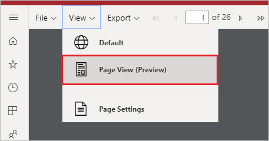

# Festlegen von Berichtsansichten für paginierte Berichte im Power BI-Dienst

Wenn Sie einen paginierten Bericht im Power BI-Dienst rendern, ist die Standardansicht HTML-basiert und interaktiv. Eine weitere Option für die Berichtsansicht für feste Seitenformate wie PDF ist die neue „Seitenansicht“.

**Interaktive Standardansicht**

**Seitenansicht**

In der Seitenansicht sieht der gerenderte Bericht im Vergleich zur Standardansicht anders aus. Einige Eigenschaften und Konzepte in paginierten Berichten gelten nur für feste Seitenformate. Die Ansicht ähnelt jener beim Drucken oder Exportieren des Berichts. Sie können zwar einige Elemente wie Parameterwerte ändern, aber es sind keine weiteren interaktiven Features wie Spaltensortierungen und Umschalter verfügbar.

Die Seitenansicht unterstützt alle Features, die der PDF-Viewer des Browsers unterstützt. Beispiele hierfür sind das „Vergrößern“, „Verkleinern“ und „An Seite anpassen“.

## Wechseln zur Seitenansicht

Wenn Sie einen paginierten Bericht öffnen, wird dieser standardmäßig in der interaktiven Ansicht gerendert. Wenn der Bericht Parameter enthält, wählen Sie die Parameter aus, und zeigen Sie dann den Bericht an.

1. Klicken Sie auf der Symbolleiste auf **Ansicht** > **Seitenansicht**.

    

2. Sie können die Einstellungen der Seitenansicht ändern, indem Sie auf der Symbolleiste im Menü **Ansicht** auf **Page Settings** (Seiteneinstellungen) klicken. 

    
    
    Im Dialogfeld **Page Settings** (Seiteneinstellungen) sind Optionen zum Festlegen der **Seitengröße** und **Ausrichtung** der Seitenansicht verfügbar. Nachdem Sie die Seiteneinstellungen angewendet haben, gelten die gleichen Optionen auch dann, wenn Sie die Seite später drucken.
   
    

3. Klicken Sie im Dropdownfeld **Ansicht** auf **Standard**, um zurück zur interaktiven Ansicht zu wechseln.

## Browserunterstützung

Die Seitenansicht wird von den Google Chrome- und Microsoft Edge-Browsern unterstützt. Stellen Sie sicher, dass das Anzeigen von PDFs im Browser aktiviert ist. Dies ist die Standardeinstellung für diese Browser.

Die Seitenansicht wird von Internet Explorer und Safari nicht unterstützt, daher ist die Option deaktiviert. Sie wird auch nicht von den Browsern auf mobilen Geräten oder den nativen mobilen Power BI-Apps unterstützt.  

## Nächste Schritte

- [Anzeigen eines paginierten Berichts im Power BI-Dienst](../consumer/paginated-reports-view-power-bi-service.md)
- [Was sind paginierte Berichte in Power BI Premium? (Vorschau)](paginated-reports-report-builder-power-bi.md)
