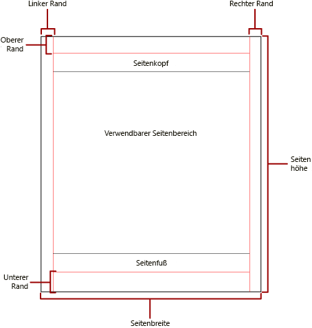
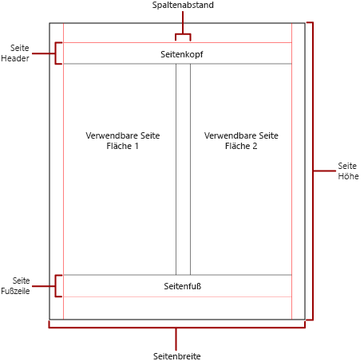

# Paginierung in paginierten Power BI-Berichten

 *Paginierung* bezieht sich auf die Anzahl der Seiten in einem Bericht und die Anordnung der Berichtselemente auf diesen Seiten. Die Paginierung in paginierten Power BI-Berichten variiert in Abhängigkeit von der Renderingerweiterung, die Sie zum Anzeigen und Übermitteln des Berichts verwenden. Wenn Sie einen Bericht auf dem Berichtsserver ausführen, verwendet der Bericht den HTML-Renderer. HTML folgt einem bestimmten Satz von Paginierungsregeln. Wenn Sie denselben Bericht beispielsweise als PDF exportieren, verwenden Sie den PDF-Renderer, der ein anderes Regelwerk verwendet. Daher ist der Bericht anders paginiert. Sie müssen die Regeln verstehen, die zum Steuern der Paginierung in paginierten Power BI-Berichten verwendet werden. Anschließend können Sie erfolgreich einen leicht lesbaren Bericht entwerfen, den Sie für den Renderer optimieren, den Sie für die Bereitstellung Ihres Berichts verwenden möchten.  
  
 In diesem Thema wird der Einfluss der physischen Seitengröße und des Berichtslayouts auf die Weise erörtert, wie Renderer für harten Seitenumbruch den Bericht rendern. Im Bereich **Berichtseigenschaften**, im Bereich **Eigenschaften** oder im Dialogfeld **Seite einrichten** können Sie Eigenschaften festlegen, um die physische Seitengröße und die Seitenränder zu ändern und den Bericht in Spalten aufzuteilen. Rufen Sie den Bereich **Berichtseigenschaften** auf, indem Sie auf den blauen Bereich außerhalb des Berichtshauptteils klicken. Navigieren Sie zum Dialogfeld **Seite einrichten**, indem Sie auf der Registerkarte „Start“ auf **Ausführen** und dann auf der Registerkarte „Ausführen“ auf **Seite einrichten** klicken.  
  
> [!NOTE]  
>  Wenn Sie einen Bericht für die Breite einer Seite ausgelegt haben, er aber auf mehreren Seiten gerendert wird, überprüfen Sie, ob die Breite des Textkörpers des Berichts, einschließlich der Ränder, möglicherweise größer als die Breite der physischen Seite ist. Um zu verhindern, dass dem Bericht leere Seiten hinzugefügt werden, können Sie die Containergröße verringern, indem Sie die Ecke des Containers nach links ziehen.  

## Der Textkörper des Berichts  
 Der Textkörper des Berichts ist ein rechteckiger Container, der als Leerraum auf der Entwurfsoberfläche angezeigt wird. Er kann wachsen oder schrumpfen, um die in ihm enthaltenen Berichtselemente aufzunehmen. Der Textkörper des Berichts spiegelt nicht die physische Seitengröße wider und kann über die Grenzen der physischen Seitengröße hinaus anwachsen, um mehrere Berichtsseiten zu überspannen. Einige Renderer, wie etwa Microsoft Excel, Word, HTML und MHTML, rendern Berichte, die abhängig von den Inhalten auf der Seite wachsen oder schrumpfen. Berichte, die in diesen Formaten gerendert werden, sind für die bildschirmbasierte Anzeige optimiert, beispielsweise in einem Webbrowser. Diese Renderer fügen ggf. vertikale Seitenumbrüche hinzu.  
  
 Sie können den Textkörper des Berichts mit einer Rahmenfarbe, einer Rahmenart und einer Rahmenbreite formatieren. Außerdem können Sie eine Hintergrundfarbe und ein Hintergrundbild hinzufügen.  
  
## Die physische Seite  
 Die physische Seitengröße entspricht dem Papierformat. Das Papierformat, das Sie für den Bericht angeben, steuert, in welcher Weise der Bericht gerendert wird. In Berichten, die in Formate mit hartem Seitenumbruch gerendert wurden, werden Seitenumbrüche horizontal und vertikal basierend auf der physischen Seitengröße eingefügt. Diese Seitenumbrüche ermöglichen ein optimiertes Lesen, wenn sie gedruckt oder in einem Dateiformat mit hartem Seitenumbruch angezeigt werden. In Berichten, die in Formate mit bedingtem Seitenumbruch gerendert wurden, werden Seitenumbrüche horizontal basierend auf der physischen Seitengröße eingefügt. Auch hier ermöglichen die Seitenumbrüche ein optimiertes Lesen, wenn sie in einem Webbrowser angezeigt werden.  
  
 Standardmäßig beträgt das Papierformat 21,6 x 27,9 cm, jedoch können Sie dieses Format im Bereich **Berichtseigenschaften** oder im Dialogfeld **Seite einrichten** ändern, oder indem Sie die Eigenschaften PageHeight und PageWidth im Bereich **Eigenschaften** ändern. Die Seitengröße wächst oder schrumpft nicht, um die Inhalte des Berichttextkörpers aufzunehmen. Wenn der Bericht auf einer einzelnen Seite dargestellt werden soll, müssen alle Inhalte im Textkörper des Berichts auf die physische Seite passen. Wenn sie nicht passen und Sie das Format mit hartem Seitenumbruch verwenden, sind für den Bericht zusätzliche Seiten erforderlich. Wenn der Textkörper des Berichts über die rechte Kante der physischen Seite hinaus wächst, wird horizontal ein Seitenumbruch eingefügt. Wenn der Textkörper des Berichts über die Unterkante der physischen Seite hinaus wächst, wird vertikal ein Seitenumbruch eingefügt.  
  
 Wenn Sie die im Bericht definierte physische Seitengröße außer Kraft setzen möchten, können Sie die physische Seitengröße mithilfe der Geräteinformationseinstellungen für den spezifischen Renderer angeben, den Sie zum Exportieren des Berichts verwenden. Eine vollständige Liste finden Sie unter [Geräteinformationseinstellungen für Renderingerweiterungen](https://docs.microsoft.com/sql/reporting-services/device-information-settings-for-rendering-extensions-reporting-services?view=sql-server-2017) in der SQL Server Reporting Services-Dokumentation.  
  
### Ränder

 Ränder werden von der Kante der physischen Seitenabmessungen einwärts bis zur angegebenen Randeinstellung gezeichnet. Wenn sich ein Berichtselement bis in den Randbereich erstreckt, wird es beschnitten, sodass der überlappende Bereich nicht gerendert wird. Wenn Sie Randbreiten angeben, die zu einer effektiven Höhe oder Breite der Seite von null führen, werden die Randeinstellungen standardmäßig auf null gesetzt. Ränder werden im Bereich **Berichtseigenschaften** oder im Dialogfeld **Seite einrichten** angegeben, oder indem im Bereich **Eigenschaften** die Eigenschaften TopMargin, BottomMargin, LeftMargin und RightMargin geändert werden. Wenn Sie die im Bericht definierte Randgröße außer Kraft setzen möchten, können Sie die Randgröße mithilfe der Geräteinformationseinstellungen für den spezifischen Renderer angeben, den Sie zum Exportieren des Berichts verwenden.  
  
 Der Bereich der physischen Seite, der verbleibt, nachdem Platz für Ränder, Spaltenabstand und Kopf- und Fußzeile der Seite zugewiesen wurde, wird als *nutzbarer Seitenbereich* bezeichnet. Ränder werden nur angewendet, wenn Sie Berichte in Formaten der Renderer für harten Seitenumbruch rendern und drucken. Die folgende Abbildung stellt den Rand und den nutzbaren Seitenbereich einer physischen Seite dar.  
  
 
  
### Spalten nach Zeitungsart  

 Ihr Bericht kann in Spalten aufgeteilt werden, wie die Spalten in einer Zeitung. Spalten werden als *logische* Seiten behandelt, die auf der gleichen *physischen* Seite dargestellt werden. Sie sind von links nach rechts und oben nach unten angeordnet und durch Leerraum zwischen den einzelnen Spalten getrennt. Wenn der Bericht in mehrere Spalten aufgeteilt wird, wird jede physische Seite vertikal in Spalten geteilt, und jede Spalte wird als logische Seite betrachtet. Nehmen Sie beispielsweise an, Sie verfügen über zwei Spalten auf einer physischen Seite. Der Inhalt Ihres Berichts füllt die erste Spalte und anschließend die zweite Spalte. Wenn der Bericht nicht vollständig in die ersten zwei Spalten passt, füllt der Bericht anschließend die erste und zweite Spalte auf der nächsten Seite. Spalten werden fortlaufend von links nach rechts und von oben nach unten gefüllt, bis sämtliche Berichtselemente gerendert wurden. Wenn Sie Spaltengrößen angeben, die bewirken, dass Breite oder Höhe gleich 0 (null) ist, wird der Spaltenabstand standardmäßig auf null festgelegt.  
  
 Spalten werden im Bereich **Berichtseigenschaften** oder im Dialogfeld **Seite einrichten** angegeben, oder indem im Bereich **Eigenschaften** die Eigenschaften TopMargin, BottomMargin, LeftMargin und RightMargin geändert werden. Wenn Sie eine Randgröße verwenden möchten, die nicht definiert wurde, können Sie die Randgröße mithilfe der Geräteinformationseinstellungen für den spezifischen Renderer angeben, zu dem Sie den Bericht exportieren. Spalten werden nur angewendet, wenn Sie Berichte in PDF- oder Bildformaten rendern und drucken. Die folgende Abbildung stellt den nutzbaren Seitenbereich einer Seite dar, die Spalten enthält.  
  

  
## Seitenumbrüche und Seitennamen

 Möglicherweise ist ein Bericht besser lesbar und seine Daten sind leichter zu überwachen und zu exportieren, wenn der Bericht Seitennamen aufweist. Reporting Services bietet Eigenschaften für Berichte, Tabellen, Matrix- und Listendatenbereiche, Gruppen und Rechtecke im Bericht zum Steuern der Paginierung, Zurücksetzen der Seitennummern und Angeben neuer Berichtsseitennamen bei Seitenumbrüchen. Mithilfe dieser Features lassen sich Berichte unabhängig von dem Format verbessern, in dem sie gerendert werden, aber besonders nützlich sind sie beim Exportieren von Berichten in Excel-Arbeitsmappen.

> [!NOTE]
> Tabellen-, Matrix- und Listendatenbereiche stellen hinter den Kulissen die gleiche Art Datenbereich dar: eine *Tablix*. Dieser Name kommt Ihnen also möglicherweise unter. 

 Die Eigenschaft InitialPageName gibt den ursprünglichen Seitennamen des Berichts an. Wenn Ihr Bericht keine Seitennamen für Seitenumbrüche enthält, wird der ursprüngliche Seitenname für alle neuen Seiten verwendet, die durch Seitenumbrüche entstehen. Sie brauchen aber keinen ursprünglichen Seitennamen zu verwenden.  
  
 Ein gerenderter Bericht kann einen neuen Seitennamen für die neue Seite angeben, die durch einen Seitenumbruch erstellt wird. Um den Seitennamen anzugeben, legen Sie die PageName-Eigenschaft einer Tabelle, Matrix, Liste, Gruppe oder eines Rechtecks fest. Sie brauchen keine Seitennamen an den Umbrüchen anzugeben. Wenn Sie darauf verzichten, wird stattdessen der Wert von InitialPageName verwendet. Wenn InitialPageName ebenfalls leer ist, weist die neue Seite keinen Namen auf.  
  
 Tabellen-, Matrix- und Listendatenbereiche, Gruppen und Rechtecke unterstützen Seitenumbrüche.  
  
 Der Seitenumbruch beinhaltet die folgenden Eigenschaften:  
  
- **BreakLocation** gibt die Position des Umbruchs für das seitenumbruchfähige Berichtselement an: am Anfang, am Ende oder am Anfang und Ende. In Gruppen kann sich BreakLocation zwischen Gruppen befinden.  
  
- **Deaktiviert** gibt an, ob ein Seitenumbruch auf das Berichtselement angewendet wird. Wenn diese Eigenschaft als True ausgewertet wird, wird der Seitenumbruch ignoriert. Diese Eigenschaft wird verwendet, um Seitenumbrüche beim Ausführen des Berichts dynamisch basierend auf Ausdrücken zu deaktivieren.  
  
- **ResetPageNumber** gibt an, ob die Seitenzahl beim Auftreten eines Seitenumbruchs auf 1 zurückgesetzt werden soll. Wenn diese Eigenschaft als True ausgewertet wird, wird die Seitenzahl zurückgesetzt.  
  
 Sie können die BreakLocation-Eigenschaft in den Dialogfeldern **Tablix-Eigenschaften**, **Rechteckeigenschaften** oder **Gruppeneigenschaften** festlegen, aber Sie müssen die Eigenschaften „Disabled“, „ResetPageNumber“ und „PageName“ im Bereich „Eigenschaften von Berichts-Generator“ festlegen. Wenn die Eigenschaften im Bereich „Eigenschaften“ nach Kategorie angeordnet sind, finden Sie die Eigenschaften in der Kategorie **PageBreak**. Bei Gruppen befindet sich die Kategorie **PageBreak** innerhalb der Kategorie **Gruppe**.  
  
 Sie können Konstanten und einfache oder komplexe Ausdrücke verwenden, um den Wert der Eigenschaften „Disabled“ und „ResetPageNumber“ festzulegen. Jedoch können Sie keine Ausdrücke für die BreakLocation-Eigenschaft verwenden. Weitere Informationen zum Schreiben und Verwenden von Ausdrücken finden Sie unter [Ausdrücke im Power BI-Berichts-Generator](report-builder-expressions.md).  
  
 In Ihrem Bericht können Sie mithilfe der Sammlung **Globals** Ausdrücke schreiben, die auf die aktuellen Seitennamen oder Seitenzahlen verweisen. Weitere Informationen finden Sie unter [Integrierte globale Variablen und Benutzerverweise](https://docs.microsoft.com/sql/reporting-services/report-design/built-in-collections-built-in-globals-and-users-references-report-builder?view=sql-server-2017) in der Dokumentation zum Berichts-Generator und den Reporting Services.
  
### Benennen von Excel-Arbeitsblatt-Registerkarten

 Diese Eigenschaften sind nützlich, wenn Sie Berichte in Excel-Arbeitsmappen exportieren. Verwenden Sie die InitialPage-Eigenschaft, um beim Exportieren des Berichts einen Standardnamen für die Arbeitsblatt-Registerkarte anzugeben, und verwenden Sie Seitenumbrüche und die PageName-Eigenschaft, um verschiedene Namen für die einzelnen Arbeitsblätter anzugeben. Jede neue Berichtsseite, die durch einen Seitenumbruch definiert wird, wird auf ein anderes Arbeitsblatt exportiert, das anhand des Werts der PageName-Eigenschaft benannt wird. Wenn PageName leer ist, der Bericht aber einen ursprünglichen Seitennamen aufweist, verwenden alle Arbeitsblätter in der Excel-Arbeitsmappe den gleichen Namen, den ursprünglichen Seitennamen.  
  
 Weitere Informationen dazu, wie diese Eigenschaften beim Exportieren von Berichten nach Excel funktionieren, finden Sie unter [Exportieren nach Microsoft Excel](https://docs.microsoft.com/sql/reporting-services/report-builder/exporting-to-microsoft-excel-report-builder-and-ssrs) in der Dokumentation zum Berichts-Generator und den Reporting Services.  
  
## Nächste Schritte

- [Anzeigen eines paginierten Berichts im Power BI-Dienst](../consumer/paginated-reports-view-power-bi-service.md)
- [Vermeiden von leeren Seiten beim Drucken paginierter Berichte](../guidance/report-paginated-blank-page.md)
- Weitere Fragen? [Wenden Sie sich an die Power BI-Community](https://community.powerbi.com/)
