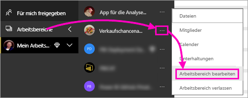
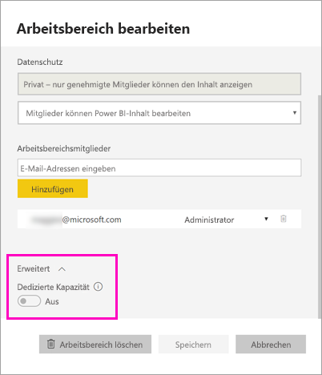
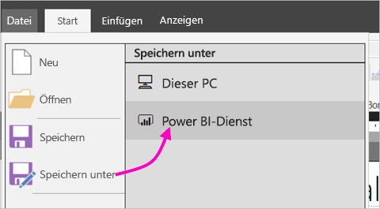
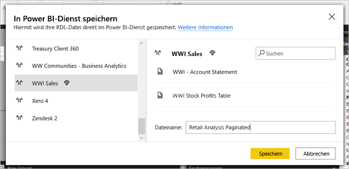
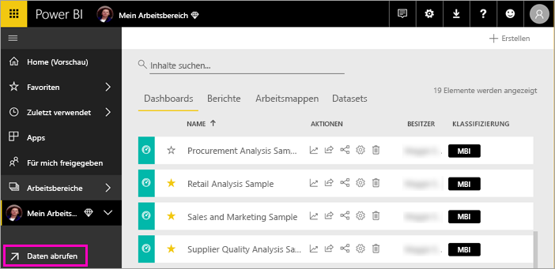
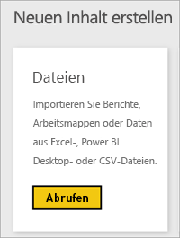
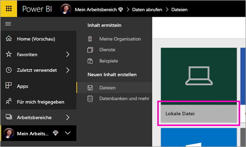
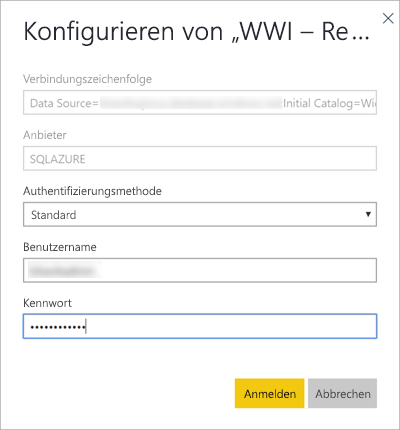

# Veröffentlichen eines paginierten Berichts im Power BI-Dienst

In diesem Artikel erfahren Sie, wie Sie einen paginierten Bericht durch Hochgeladen von Ihrem lokalen Computer im Power BI-Dienst veröffentlichen. Sie können paginierte Berichte in Ihren Arbeitsbereich oder einen anderen Arbeitsbereich hochladen, sofern sich der Arbeitsbereich in einer Premium-Kapazität befindet. Suchen Sie nach dem Diamantsymbol  neben dem Namen des Arbeitsbereichs. 

Wenn Sie eine lokale Berichtsdatenquelle verwenden, müssen Sie nach dem Hochladen des Berichts ein Gateway erstellen. Weitere Informationen hierzu finden Sie im Abschnitt [Erstellen eines Gateways](#create-a-gateway) im Verlauf dieses Artikels.

## Hinzufügen eines Arbeitsbereichs zu einer Premium-Kapazität

Wenn im Arbeitsbereich das Diamantsymbol  neben dem Namen nicht angezeigt wird, müssen Sie den Arbeitsbereich einer Premium-Kapazität hinzufügen. 

1. Wählen Sie **Arbeitsbereiche**, die Auslassungspunkte ( **...** ) neben dem Arbeitsbereichsnamen und dann **Arbeitsbereich bearbeiten** aus.

    

1. Erweitern Sie im Dialogfeld **Arbeitsbereich bearbeiten** **Erweitert**, und ziehen Sie **Dedizierte Kapazität** dann auf **Ein**.

    

   Möglicherweise können Sie diese Einstellung nicht ändern. Wenn das der Fall ist, wenden Sie sich an Ihren Power BI Premium-Kapazitätsadministrator, damit er Ihnen die Berechtigung erteilt, Ihren Arbeitsbereich einer Premium-Kapazität hinzuzufügen.

## Veröffentlichen eines paginierten Berichts über den Berichts-Generator

1. Erstellen Sie Ihren paginierten Bericht im Berichts-Generator, und speichern Sie ihn auf Ihrem lokalen Computer.

1. Klicken Sie im Menü **Datei** des Berichts-Generators auf **Speichern unter**.

    

    Wenn Sie noch nicht bei Power BI angemeldet sind, müssen Sie sich jetzt anmelden oder ein Konto erstellen. Klicken Sie in der oberen rechten Ecke des Berichts-Generators auf **Anmelden**, und führen Sie die Schritte durch.

2. Wählen Sie aus der Liste der Arbeitsbereiche einen Arbeitsbereich aus, neben dessen Namen sich ein Diamantsymbol  befindet. Füllen Sie das Feld **Dateiname** aus, und klicken Sie auf **Speichern**. 

    

4. Öffnen Sie den Power BI-Dienst in einem Browser, und navigieren Sie zu dem Premium-Arbeitsbereich, in dem Sie den paginierten Bericht veröffentlicht haben. Auf der Registerkarte **Berichte** wird der Bericht angezeigt.

    

5. Wählen Sie den paginierten Bericht aus, um diesen im Power BI-Dienst zu öffnen. Wenn er über Parameter verfügt, müssen Sie diese auswählen, bevor der Bericht angezeigt werden kann.

    

6. Wenn Sie eine lokale Berichtsdatenquelle verwenden, finden Sie im Abschnitt [Erstellen eines Gateways](#create-a-gateway) weitere Informationen zum Zugriff auf Datenquellen.

## Hochladen eines paginierten Berichts über den Power BI-Dienst

Sie können auch im Power BI-Dienst beginnen und dort einen paginierten Bericht hochladen.

1. Erstellen Sie Ihren paginierten Bericht im Berichts-Generator, und speichern Sie ihn auf Ihrem lokalen Computer.

1. Öffnen Sie den Power BI-Dienst in einem Browser, und navigieren Sie zu dem Premium-Arbeitsbereich, in dem Sie den Bericht veröffentlichen möchten. Achten Sie auf das Diamantsymbol  neben dem Namen des Arbeitsbereichs. 

1. Wählen Sie **Daten abrufen** aus.

    

1. Wählen Sie im Feld **Dateien** die Option **Abrufen**aus.

    

1. Wählen Sie **Lokale Datei** aus, navigieren Sie zum paginierten Bericht, und wählen Sie **Öffnen** aus.

    

1. Wählen Sie **Weiter** > **Anmeldeinformationen bearbeiten** aus.

    

1. Konfigurieren Sie Ihre Anmeldeinformationen, und wählen Sie **Anmelden** aus.

    

   Auf der Registerkarte **Berichte** wird der Bericht angezeigt.

    

1. Wählen sie den Bericht aus, um ihn im Power BI-Dienst zu öffnen. Wenn er über Parameter verfügt, müssen Sie diese auswählen, bevor der Bericht angezeigt werden kann.
 
    

6. Wenn Sie eine lokale Berichtsdatenquelle verwenden, finden Sie im Abschnitt [Erstellen eines Gateways](#create-a-gateway) weitere Informationen zum Zugriff auf Datenquellen.

## Erstellen eines Gateways

Wie bei allen Power BI-Berichten müssen Sie im Falle einer lokalen Berichtsdatenquelle ein Gateway erstellen oder eine Verbindung mit diesem herstellen, um auf Daten zuzugreifen.

1. Wählen Sie neben dem Berichtsnamen **Verwalten** aus.

   

1. Im Power BI-Artikel [Was ist ein lokales Datengateway](../connect-data/service-gateway-onprem.md) finden Sie weitere Informationen und Anleitungen.

## Nächste Schritte

- [Anzeigen eines paginierten Berichts im Power BI-Dienst](../consumer/paginated-reports-view-power-bi-service.md)
- [Was sind paginierte Berichte in Power BI Premium? (Vorschau)](paginated-reports-report-builder-power-bi.md)
- [Tutorial: Einbetten paginierter Power BI-Berichte in eine Anwendung für Kunden](../developer/embed-paginated-reports-customers.md)

