# <a name="work-with-filters-in-power-bi-reports"></a>Verwenden von Filtern in Power BI-Berichten

Filter in Power BI haben eine neue Funktionalität und ein neues Design. Wenn Sie sich für das neue Filterdesign entscheiden, können Sie den Filterbereich so formatieren, dass er wie der Rest des Berichts aussieht. Sie können Filter sperren und sogar ausblenden. Wenn Sie den Bericht entwerfen, sehen Sie nicht mehr den alten Filterbereich im Bereich „Visualisierungen“. Ihre gesamte Filterbearbeitung und -formatierung führen Sie in einem einzelnen Filterbereich durch. 

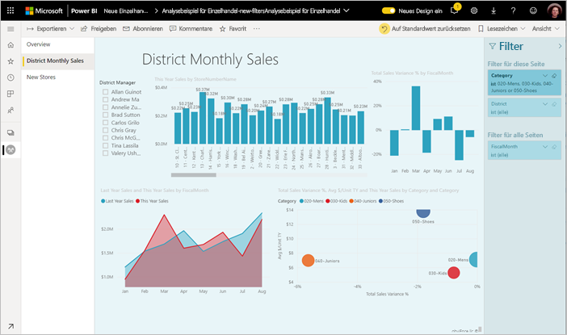

Als Berichts-Designer können Sie z. B. folgende Aufgaben im neuen Filterbereich ausführen:

- Hinzufügen und Entfernen zu filternder Felder. 
- Ändern des Filterstatus.
- Formatieren und Anpassen des Filterbereichs, damit er zu Ihrem Bericht passt.
- Sie können festlegen, ob der Filterbereich beim Öffnen des Berichts durch den Nutzer standardmäßig geöffnet oder ausgeblendet werden soll.
- Sie können den gesamten Filterbereich oder bestimmte Filter ausblenden, die den Berichtnutzern nicht angezeigt werden sollen.
- Sie können die Sichtbarkeit und den Zustand (geöffnet/ausgeblendet) des neuen Filterbereichs steuern und sogar als Lesezeichen festlegen.
- Sie können Filter sperren, die die Nutzer nicht bearbeiten sollen.

Mit der neuen Filterbenutzeroberfläche können Berichtnutzer auch mit der Maus auf ein beliebiges Visual zeigen, um eine schreibgeschützte Liste aller Filter oder Datenschnitte zu sehen, die dieses Visual beeinflussen.

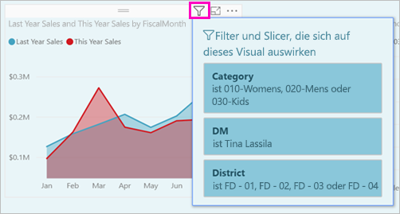

## <a name="turn-on-the-new-filter-experience"></a>Aktivieren der neuen Filteroberfläche 

Die neue Filteroberfläche ist für neue Berichte standardmäßig aktiviert. Sie können die neue Filteroberfläche für vorhandene Berichte in Power BI Desktop oder dem Power BI-Dienst aktivieren.

### <a name="turn-on-new-filters-for-an-existing-report-in-power-bi-desktop"></a>Aktivieren von neuen Filtern für einen vorhandenen Bericht in Power BI Desktop

1. Wählen Sie in Power BI Desktop in einem vorhandenen Bericht **Datei** > **Optionen und Einstellungen** > **Optionen** aus.
2. Wählen Sie im Navigationsbereich unter **Aktuelle Datei** den Eintrag **Berichtseinstellungen** aus.
3. Klicken Sie unter **Benutzeroberfläche zur Filterung** auf **Aktualisierten Filterbereich aktivieren und Filter im Visualheader für diesen Bericht anzeigen**.

### <a name="turn-on-new-filters-for-an-existing-report-in-the-service"></a>Aktivieren von neuen Filtern für einen vorhandenen Bericht im Power BI-Dienst

Wenn Sie das **neue Design** im Power BI-Dienst aktiviert haben 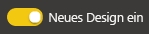, wird die neue Filteroberfläche automatisch aktiviert. Erfahren Sie mehr über das [neue Design im Power BI-Dienst](service-new-look.md).

Wenn Sie das neue Design nicht aktiviert haben, können Sie die neue Filteroberfläche mithilfe der folgenden Schritte dennoch anzeigen:

1. Öffnen Sie die Inhaltsliste für einen Arbeitsbereich im Power BI-Dienst.
2. Suchen Sie nach dem Bericht, für den Sie die neue Filteroberfläche aktivieren wollen, und klicken Sie auf **Weitere Optionen (...)** und dann auf die **Einstellungen** für diesen Bericht.

    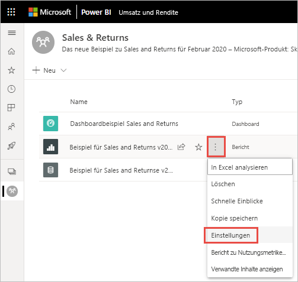

3. Klicken Sie unter **Benutzeroberfläche zur Filterung** auf **Aktualisierten Filterbereich aktivieren und Filter im Visualheader für diesen Bericht anzeigen**.

    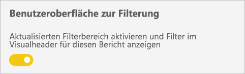

## <a name="view-filters-for-a-visual-in-reading-mode"></a>Anzeigen von Filtern für ein Visual im Lesemodus

Bewegen Sie im Lesemodus den Mauszeiger über das Filtersymbol, um für ein Visual eine Popupfilterliste mit allen Filtern, Slicern usw. anzuzeigen, die sich auf das Visual auswirken. Die Formatierung der Popupfilterliste entspricht der des Filterbereichs. 

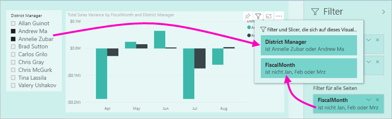

Diese Filtertypen werden in der Ansicht angezeigt: 
- Basisfilter
- Datenschnitte
- Übergreifende Hervorhebung 
- Kreuzfilterung
- Erweiterte Filter
- Top N-Filter
- Relative Datenfilter
- Synchronisierungsslicer
- Einschluss-/Ausschlussfilter
- Per URL übergebene Filter

## <a name="build-the-new-filters-pane"></a>Erstellen des neuen Filterbereichs

Nachdem Sie den neuen Filterbereich aktiviert haben, wird dieser rechts neben der Berichtseite angezeigt und ist standardmäßig basierend auf Ihren aktuellen Berichteinstellungen formatiert. Sie verwenden den neuen Filterbereich, um die einzuschließenden Filter zu konfigurieren und vorhandene Filter im neuen Bereich zu aktualisieren. Der neue Filterbereich zeigt an, wie der Bericht nach dem Veröffentlichen für Ihre Berichtnutzer angezeigt wird. 

1. Standardmäßig können Ihre Berichtnutzer den Filterbereich sehen. Wenn der Filterbereich nicht sichtbar sein soll, klicken Sie auf das Augensymbol neben **Filter**.

    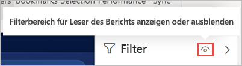

2. Um mit der Erstellung Ihres neuen Filterbereichs zu beginnen, ziehen Sie für Sie relevante Felder als Filter auf Visual-, Seiten- oder Berichtsebene in den neuen Bereich „Filter“.

Wenn Sie dem Zeichenbereich für einen Bericht ein Visual hinzufügen, fügt Power BI automatisch für jedes Feld im Visual dem Bereich „Filter“ einen Filter hinzu. 

## <a name="hide-the-filters-pane-while-editing"></a>Ausblenden des Bereichs „Filter“ beim Bearbeiten

Power BI Desktop verfügt über ein neues Menüband in der Vorschauversion. Mit der Umschaltfläche **Filter** auf der Registerkarte **Ansicht** können Sie den Bereich „Filter“ ein- oder ausblenden. Dieses Feature ist nützlich, wenn Sie den Bereich „Filter“ nicht verwenden und mehr Platz auf dem Bildschirm benötigen. Durch diese Ergänzung wird der Bereich „Filter“ an die anderen Bereiche angeglichen, die Sie öffnen und schließen können, z. B. die Bereiche „Lesezeichen“ und „Auswahl“. 

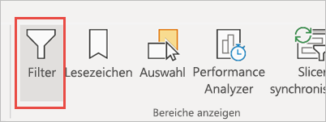

Durch diese Einstellung wird der Bereich „Filter“ nur in Power BI Desktop ausgeblendet. Wenn Sie den Bereich „Filter“ für Ihre Endbenutzer ausblenden wollen, müssen Sie stattdessen auf das **Augensymbol** neben **Filter** klicken.

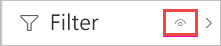 

## <a name="lock-or-hide-filters"></a>Sperren oder Ausblenden von Filtern

Sie können einzelne Filterkarten sperren oder ausblenden. Wenn Sie einen Filter sperren, können Ihre Berichtnutzer den Filter sehen, aber nicht ändern. Wenn Sie einen Filter ausblenden, können die Berichtnutzer den Filter nicht einmal sehen. Das Ausblenden von Filterkarten kann insbesondere dann nützlich sein, wenn Sie Datenbereinigungsfilter ausblenden möchten, die NULL-Werte oder unerwartete Werte ausschließen. 

- Aktivieren oder deaktivieren Sie im neuen Bereich „Filter“ die Symbole **Filter sperren** oder **Filter ausblenden** auf einer Filterkarte.

   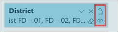

Wenn Sie diese Einstellungen im neuen Bereich „Filter“ aktivieren oder deaktivieren, werden die Änderungen im Bericht reflektiert. Ausgeblendete Filter werden in der Popupfilterliste für ein Visual nicht angezeigt.

Sie können den neuen Bereich „Filter“ auch so konfigurieren, dass er ihren Berichtslesezeichen folgt. Der Zustand (geöffnet/geschlossen) und der Sichtbarkeitsstatus können als Lesezeichen festgelegt werden.
 
## <a name="format-the-new-filters-pane"></a>Formatieren des neuen Filterbereichs

Ein wichtiger Aspekt der neuen Benutzeroberfläche ist, dass Sie den Bereich „Filter“ so formatieren können, dass er dem Erscheinungsbild Ihres Berichts entspricht. Sie können den Filterbereich für jede Seite im Bericht anders formatieren. Diese Elemente können formatiert werden: 

- Hintergrundfarbe
- Hintergrundtransparenz
- Rahmen ein oder aus
- Rahmenfarbe
- Schriftart, Farbe und Textgröße für Titel und Header

Für Filterkarten können Sie außerdem diese Elemente formatieren – je nachdem, ob sie angewendet wurden (auf einen Wert festgelegt) oder verfügbar (deaktiviert) sind: 

- Hintergrundfarbe
- Hintergrundtransparenz
- Rahmen: ein/aus
- Rahmenfarbe
- Schriftart, Farbe und Textgröße
- Farbe für Eingabefeld

### <a name="format-the-filters-pane-and-cards"></a>Formatieren von Filterbereich und -karten

1. Klicken Sie im Bericht auf den Bericht selbst oder den Hintergrund (*Hintergrundbild*), und wählen Sie dann im Bereich **Visualisierungen** die Einstellung **Format** aus. 
    Es werden Optionen zum Formatieren der Berichtseite, des Hintergrundbilds sowie Filterbereichs und der Filterkarten angezeigt.

1. Erweitern Sie den **Bereich „Filter“** , um die Farbe für den Hintergrund, das Symbol und den linken Rahmen festzulegen, um diese an die Berichtseite anzupassen.

    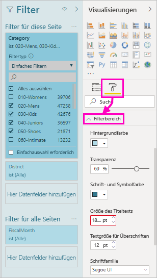

1. Erweitern Sie **Filterkarten**, um Farbe und Rahmen für **Verfügbar** und **Angewendet** festzulegen. Wenn Sie unterschiedliche Farben für verfügbare und angewendete Karten festlegen, ist offensichtlich, welche Filter angewendet wurden. 
  
    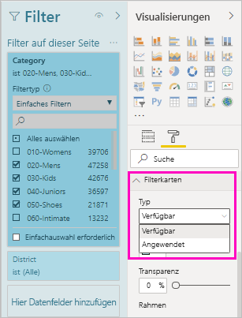

## <a name="theming-for-filters-pane"></a>Design für den Bereich „Filter“
Sie können jetzt mit der Designdatei die Standardeinstellungen des Bereichs „Filter“ ändern. Hier ist ein Codeausschnitt eines Beispieldesigns für Ihre ersten Schritte:

 
```
"outspacePane": [{ 

"backgroundColor": {"solid": {"color": "#0000ff"}}, 

"foregroundColor": {"solid": {"color": "#00ff00"}}, 

"transparency": 50, 

"titleSize": 35, 

"headerSize": 8, 

"fontFamily": "Georgia", 

"border": true, 

"borderColor": {"solid": {"color": "#ff0000"}} 

}], 

"filterCard": [ 

{ 

"$id": "Applied", 

"transparency": 0, 

"backgroundColor": {"solid": {"color": "#ff0000"}}, 

"foregroundColor": {"solid": {"color": "#45f442"}}, 

"textSize": 30, 

"fontFamily": "Arial", 

"border": true, 

"borderColor": {"solid": {"color": "#ffffff"}}, 

"inputBoxColor": {"solid": {"color": "#C8C8C8"}} 

}, 

{ 

"$id": "Available", 

"transparency": 40, 

"backgroundColor": {"solid": {"color": "#00ff00"}}, 

"foregroundColor": {"solid": {"color": "#ffffff"}}, 

"textSize": 10, 

"fontFamily": "Times New Roman", 

"border": true, 

"borderColor": {"solid": {"color": "#123456"}}, 

"inputBoxColor": {"solid": {"color": "#777777"}} 

}] 
```

## <a name="sort-the-filters-pane"></a>Sortieren des Bereichs „Filter“

Die benutzerdefinierte Sortierfunktion ist Teil der neuen Benutzeroberfläche des Bereichs „Filter“. Berichtersteller können Filter mit Drag & Drop in beliebiger Reihenfolge neu anordnen.


Die Standardsortierreihenfolge für Filter ist alphabetisch. Um mit dem benutzerdefinierten Sortiermodus zu beginnen, ziehen Sie einfach einen beliebigen Filter an eine neue Position. Sie können Filter nur innerhalb der Ebene sortieren, auf die sie angewandt werden – z.B. Visual-, Seiten- oder Berichtsebene.

## <a name="improved-filters-pane-accessibility"></a>Verbesserte Barrierefreiheit des Bereichs „Filter“

Wir haben die Navigation per Tastatur für den neuen Bereich „Filter“ verbessert. Sie können mit der TAB-Taste in jeden Teil des Bereichs „Filter“ gelangen und mit der Kontexttaste oder UMSCHALT+F10 das Kontextmenü öffnen.

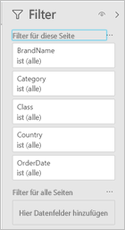

## <a name="rename-filters"></a>Umbenennen von Filtern
Wenn Sie den Bereich „Filter“ bearbeiten, können Sie auf den Titel doppelklicken, um ihn zu bearbeiten. Das Umbenennen ist nützlich, wenn Sie die Filterkarte aktualisieren möchten, um die Verständlichkeit für Endbenutzer zu verbessern. Denken Sie daran, dass mit dem Umbenennen der Filterkarte *keine* Umbenennung des Anzeigenamens des Felds in der Felderliste verbunden ist. Es wird nur der in der Filterkarte verwendete Anzeigename geändert.

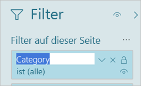

## <a name="filters-pane-search"></a>Suche im Bereich „Filter“

Mit dem Suchfeature im Bereich „Filter“ können Sie die Titel Ihrer Filterkarten durchsuchen. Dieses Feature ist nützlich, wenn Sie in Ihrem Bereich „Filter“ über verschiedene Filterkarten verfügen und Hilfe dabei benötigen, die relevanten zu finden.

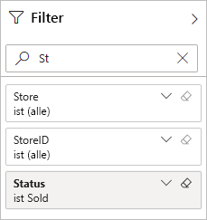

Genau wie die anderen Elemente des Bereichs „Filter“, können Sie auch das Suchfeld formatieren.

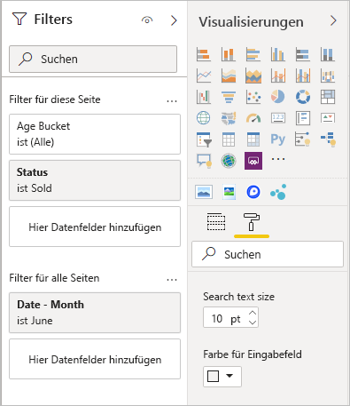

Das Suchfeature des Bereichs „Filter“ ist zwar standardmäßig aktiviert, allerdings können Sie es ein- oder ausschalten, indem Sie in den Berichtseinstellungen im Dialogfenster „Optionen“ auf **Enable search for Filters pane** (Suche für Bereich „Filter“ aktivieren) klicken.

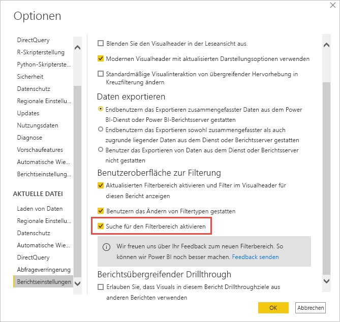

## <a name="restrict-changes-to-filter-type"></a>Einschränken von Änderungen des Filtertyps

Im Abschnitt „Benutzeroberfläche zur Filterung“ der Berichtseinstellungen finden Sie eine Option, mit der Sie steuern können, ob Benutzer den Filtertyp ändern können.

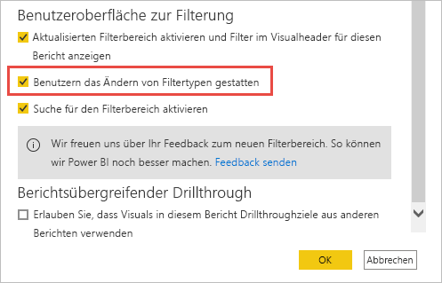

## <a name="next-steps"></a>Nächste Schritte

Probieren Sie die neue Filteroberfläche aus! Senden Sie uns auf der [Power BI Ideas-Website](https://ideas.powerbi.com/forums/265200-power-bi) Feedback zu diesem Feature, und lassen Sie uns wissen, wie wir es weiter verbessern können. 

- [Verwenden von Berichtsfiltern](consumer/end-user-report-filter.md)
- [Filter und Hervorhebungen in Berichten](power-bi-reports-filters-and-highlighting.md)
- [Verschiedene Filtertypen in Power BI-Berichten](power-bi-report-filter-types.md)

Weitere Fragen? [Wenden Sie sich an die Power BI-Community](https://community.powerbi.com/)

