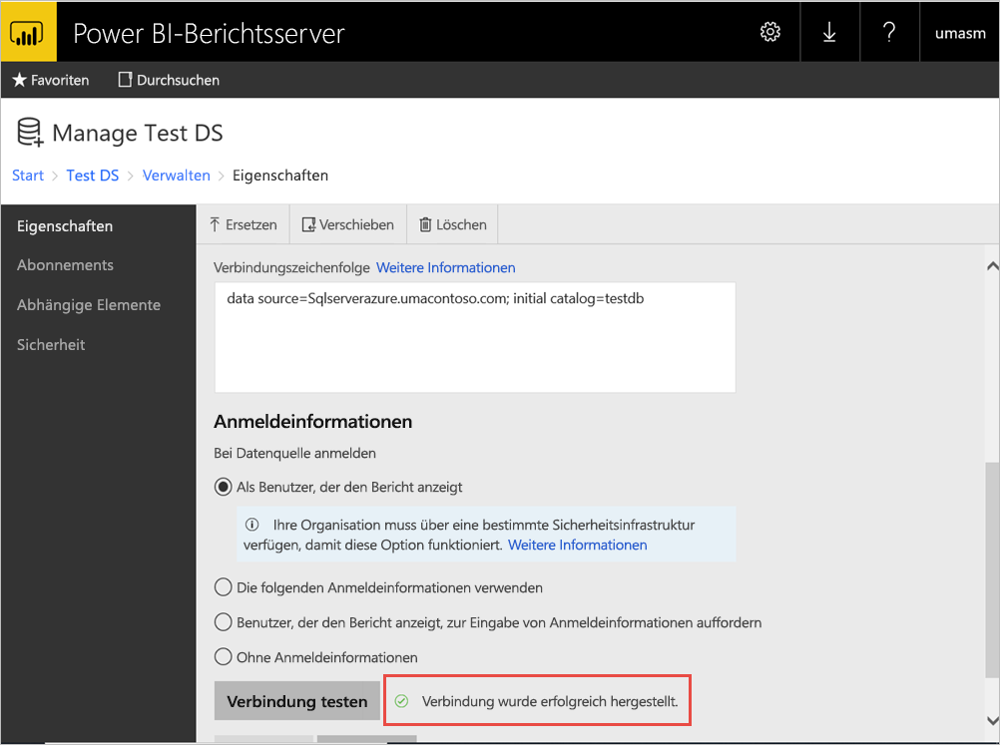

# <a name="configure-power-bi-report-server-with-azure-application-proxy"></a>Konfigurieren von Power BI-Berichtsserver mit Azure Active Directory-Anwendungsproxy

Dieser Artikel erläutert, wie Sie den Azure Active Directory-Anwendungsproxy verwenden, um eine Verbindung mit Power BI-Berichtsserver sowie SQL Server Reporting Services (SSRS) 2016 und höher herzustellen. Durch diese Integration können Benutzer von außerhalb des Unternehmensnetzwerks über ihre Clientbrowser auf ihre Power BI-Berichtsserver- und Reporting Services-Berichte zugreifen und sind dabei durch Azure Active Directory (AD) geschützt. Erfahren Sie mehr zum Remotezugriff auf lokale Anwendungen über den [Azure Active Directory-Anwendungsproxy](https://docs.microsoft.com/azure/active-directory/manage-apps/application-proxy).

## <a name="environment-details"></a>Umgebungsdetails

Wir haben diese Werte in dem Beispiel verwendet, das wir erstellt haben. 

- Domäne: umacontoso.com
- Power BI-Berichtsserver: PBIRSAZUREAPP.umacontoso.com
- SQL Server-Datenquelle: SQLSERVERAZURE.umacontoso.com

## <a name="configure-power-bi-report-server"></a>Konfigurieren von Power BI-Berichtsserver

Konfigurieren Sie nach der Installation von Power BI-Berichtsserver (sofern auf einer Azure-VM) die URLs für den Webdienst und das Webportal von Power BI-Berichtsserver mit den folgenden Schritten:

1. Erstellen Sie Ein- und Ausgangsregeln Regeln für die VM-Firewall für Port 80 (Port 443, wenn HTTPS-URLs konfiguriert sind). Erstellen Sie außerdem Ein- und Ausgangsregeln für die Azure-VM im Azure-Portal für das TCP-Protokoll (Port 80).
2. Der für die VM in unserer Umgebung konfigurierte DNS-Name ist `pbirsazureapp.eastus.cloudapp.azure.com`.
3. Konfigurieren Sie die URL des externen Webdiensts und des Webportals von Power BI-Berichtsserver, indem Sie die Registerkarte **Erweitert** und dann die Schaltfläche **Hinzufügen** auswählen. Wählen Sie den **Hostheadernamen** aus, und fügen Sie den Hostnamen (DNS-Namen) wie hier gezeigt hinzu.

    

1. Wir haben den vorherigen Schritt für die Abschnitte „Webdienst“ und „Webportal“ durchgeführt und die URLs erhalten, die im Konfigurations-Manager des Berichtsservers registriert sind:

    - `https://pbirsazureapp.eastus.cloudapp.azure.com/ReportServer`
    - `https://pbirsazureapp.eastus.cloudapp.azure.com/Reports`

2. Im Azure-Portal sehen wir im Abschnitt „Netzwerk“ zwei IP-Adressen für die VM: 

    - **Öffentliche IP-Adresse**. 
    - **Private IP-Adresse**. 
    
    Die öffentliche IP-Adresse wird für den Zugriff von außerhalb des virtuellen Computers verwendet.

3. Daher haben wir den Hostdateieintrag der VM (Power BI-Berichtsserver) hinzugefügt, der die öffentliche IP-Adresse und den Hostnamen `pbirsazureapp.eastus.cloudapp.azure.com` enthält.
4. Beachten Sie, dass sich die dynamische IP-Adresse beim Neustart der VM ändern kann und Sie der Hostdatei möglicherweise die richtige IP-Adresse erneut hinzufügen müssen. Um dies zu vermeiden, können Sie die öffentliche IP-Adresse im Azure-Portal als statisch festlegen.
5. Auf die URLs des Webdiensts und Webportals sollte nach Durchführung der oben genannten Änderungen erfolgreich zugegriffen werden können.
6. Beim Zugriff auf die URL `https://pbirsazureapp.eastus.cloudapp.azure.com/ReportServer` auf dem Server werden wir dreimal zur Eingabe von Anmeldeinformationen aufgefordert, woraufhin ein leerer Bildschirm angezeigt wird.
7. Fügen Sie den folgenden Registrierungseintrag hinzu:

    Registrierungsschlüssel `HKEY\_LOCAL\_MACHINE \SYSTEM\CurrentControlset\Control \Lsa\ MSV1\_0`

1. Fügen Sie den neuen mehrzeiligen Wert `BackConnectionHostNames` und den Hostnamen `pbirsazureapp.eastus.cloudapp.azure.com` hinzu.

Danach können wir auch auf die URLs auf dem Server zugreifen.

## <a name="configure-power-bi-report-server-to-work-with-kerberos"></a>Konfigurieren von Power BI-Berichtsserver für die Zusammenarbeit mit Kerberos

### <a name="1-configure-the-authentication-type"></a>1. Konfigurieren des Authentifizierungstyps

Wir müssen den Authentifizierungstyp für den Berichtsserver konfigurieren, um die eingeschränkte Kerberos-Delegierung zuzulassen. Diese Konfiguration erfolgt in der Datei **rsreportserver.config**.

Wechseln Sie in der Datei „rsreportserver.config“ zum Abschnitt **Authentication/AuthenticationTypes**.

Wir möchten sicherstellen, dass RSWindowsNegotiate in der Liste der Authentifizierungstypen zuerst aufgeführt ist. Die Ansicht sollte ungefähr wie folgt aussehen.

```
<AuthenticationTypes>

    <RSWindowsNegotiate/>

</AuthenticationTypes>
```

Wenn Sie die Konfigurationsdatei ändern mussten, müssen Sie im Berichtsserver-Konfigurations-Manager den **Berichtsserverdienst beenden und neu starten**, damit die Änderungen wirksam werden.

### <a name="2-register-service-principal-names-spns"></a>2. Registrieren von Dienstprinzipalnamen (Service Principal Names, SPNs)

Öffnen Sie die Eingabeaufforderung als Administrator, und führen Sie die folgenden Schritte aus.

Registrieren Sie mit den folgenden Befehlen die folgenden SPNs unter dem **Dienstkonto für Power BI-Berichtsserver**:

```
setspn -s http/ Netbios name\_of\_Power BI Report Server\_server<space> Power BI Report Server\_ServiceAccount

setspn -s http/ FQDN\_of Power BI Report Server\_server<space> Power BI Report Server\_ServiceAccount
```

Registrieren Sie mit den folgenden Befehlen (für eine Standardinstanz von SQL Server) die folgenden SPNs unter dem SQL Server-Dienstkonto:

```
setspn -s MSSQLSVC/FQDN\_of\_SQL\_Server: 1433 (PortNumber) <SQL service service account>

setspn -s MSSQLSVC/FQDN\_of\_SQL\_Server<SQL service service account>
```

### <a name="3-configure-delegation-settings"></a>3. Konfigurieren von Delegierungseinstellungen

Wir müssen die Delegierungseinstellungen für das Dienstkonto des Berichtsservers konfigurieren.

1. Öffnen Sie „Active Directory-Benutzer und -Computer“.
2. Öffnen Sie in „Active Directory-Benutzer und -Computer“ die Eigenschaften des Dienstkontos des Berichtsservers.
3. Wir möchten die eingeschränkte Delegierung mit Protokollübertragung konfigurieren. Bei der eingeschränkten Delegierung müssen wir explizit angeben, an welche Dienste die Delegierung erfolgen soll.
4. Klicken Sie mit der rechten Maustaste auf das **Dienstkonto des Berichtsservers**, und wählen Sie **Eigenschaften** aus.
5. Wählen Sie die Registerkarte **Delegierung** aus.
6. Wählen Sie **Computer nur bei Delegierungen angegebener Dienste vertrauen** aus.
7. Wählen Sie dann **Beliebiges Authentifizierungsprotokoll verwenden** aus.
8. Klicken Sie unter **Dienste, für die dieses Konto delegierte Anmeldeinformationen verwenden kann** auf **Hinzufügen**.
9. Wählen Sie im Dialogfeld „Neu“ **Benutzer oder Computer** aus.
10. Geben Sie das **Dienstkonto für den SQL Server-Dienst** ein, und klicken Sie auf **OK**.

    Es beginnt mit MSSQLSvc.

1. Fügen Sie die SPNs hinzu.
2. Wählen Sie **OK** aus. Der SPN sollte jetzt in der Liste angezeigt werden.

Diese Schritte helfen dabei, Power BI-Berichtsserver so zu konfigurieren, dass der Kerberos-Authentifizierungsmechanismus verwendet wird und die Testverbindung mit der Datenquelle auf Ihrem lokalen Computer funktioniert.

## <a name="configure-azure-application-proxy-connector"></a>Konfigurieren des Azure AD-Anwendungsproxyconnectors

Lesen Sie den Artikel zur [Konfiguration des Anwendungsproxyconnectors](https://docs.microsoft.com/azure/active-directory/manage-apps/application-proxy-add-on-premises-application#add-an-on-premises-app-to-azure-ad).

Der Anwendungsproxyconnector wurde für Power BI-Berichtsserver installiert. Sie können ihn jedoch auf einem separaten Server konfigurieren und sicherstellen, dass die Delegierung ordnungsgemäß eingerichtet ist.

### <a name="ensure-the-connector-is-trusted-for-delegation"></a>Sicherstellen, dass dem Connector für Delegierungszwecke vertraut wird

Stellen Sie sicher, dass dem Connector bei Delegierungen des dem Anwendungspoolkonto des Berichtsservers hinzugefügten SPN vertraut wird.

Konfigurieren Sie KCD (Kerberos Constrained Delegation, eingeschränkte Kerberos-Delegierung) so, dass der Azure AD-Anwendungsproxydienst Benutzeridentitäten an das Anwendungspoolkonto des Berichtsservers delegieren kann. Sie konfigurieren KCD, indem Sie den Anwendungsproxyconnector so einrichten, dass er Kerberos-Tickets für Benutzer abruft, die in Azure AD authentifiziert wurden. Anschließend übergibt dieser Server den Kontext an die Zielanwendung bzw. in diesem Fall an Power BI-Berichtsserver.

Wiederholen Sie zum Konfigurieren von KCD für jeden Connectorcomputer die folgenden Schritte.

1. Melden Sie sich bei einem Domänencontroller als Domänenadministrator an, und öffnen Sie dann **Active Directory-Benutzer und -Computer**.
2. Suchen Sie nach dem Computer, auf dem der Connector ausgeführt wird.
3. Doppelklicken Sie auf den Computer, und wählen Sie anschließend die Registerkarte **Delegierung** aus.
4. Legen Sie die Delegierungseinstellungen auf **Computer bei Delegierungen angegebener Dienste vertrauen** fest. Wählen Sie dann **Beliebiges Authentifizierungsprotokoll verwenden** aus.
5. Wählen Sie **Hinzufügen** und anschließend **Benutzer oder Computer** aus.
6. Geben Sie das Dienstkonto ein, das Sie für den Power BI-Berichtsserver verwenden. Dies ist das Konto, dem Sie bei der Konfiguration des Berichtsservers den SPN hinzugefügt haben.
7. Klicken Sie auf **OK**. 
8. Um die Änderungen zu speichern, klicken Sie erneut auf **OK**.

## <a name="publish-through-azure-ad-application-proxy"></a>Veröffentlichen über Azure AD-Anwendungsproxy

Nun können Sie den Azure AD-Anwendungsproxy konfigurieren.

Veröffentlichen Sie Power BI-Berichtsserver über den Anwendungsproxy mit den folgenden Einstellungen. Eine detaillierte Anleitung zum Veröffentlichen einer Anwendung über den Anwendungsproxy finden Sie unter [Veröffentlichen von Anwendungen mit Azure AD-Anwendungsproxy](https://docs.microsoft.com/azure/active-directory/manage-apps/application-proxy-add-on-premises-application#add-an-on-premises-app-to-azure-ad).

- **Interne URL**: Geben Sie die URL des Berichtsservers ein, den der Connector im Unternehmensnetzwerk erreichen kann. Diese URL muss von dem Server aus erreichbar sein, auf dem der Connector installiert ist. Eine bewährte Methode ist die Verwendung einer Domäne der obersten Ebene (etwa `https://servername/`), um Probleme mit Unterpfaden zu vermeiden, die über den Anwendungsproxy veröffentlicht werden. Verwenden Sie beispielsweise `https://servername/`, aber nicht `https://servername/reports/` oder `https://servername/reportserver/`. Wir haben unsere Umgebung mit `https://pbirsazureapp.eastus.cloudapp.azure.com/` konfiguriert.

    > [!NOTE]
    > Wir empfehlen die Verwendung einer sicheren HTTPS-Verbindung mit dem Berichtsserver. Eine entsprechende Anleitung finden Sie unter [Konfigurieren von SSL-Verbindungen auf einem Berichtsserver im einheitlichen Modus](https://docs.microsoft.com/sql/reporting-services/security/configure-ssl-connections-on-a-native-mode-report-server?view=sql-server-2017).

- **Externe URL**: Geben Sie die öffentliche URL ein, mit der die Power BI Mobile-App eine Verbindung herstellt. Bei Verwendung einer benutzerdefinierten Domäne kann dieser Wert beispielsweise wie folgt aussehen: `https://reports.contoso.com`. Laden Sie zur Verwendung einer benutzerdefinierten Domäne ein Zertifikat für die Domäne hoch, und erstellen Sie für einen DNS-Eintrag einen Verweis auf die Standarddomäne „msappproxy.net“ für Ihre Anwendung. Eine ausführliche Anleitung finden Sie unter [Arbeiten mit benutzerdefinierten Domänen im Azure AD-Anwendungsproxy](https://docs.microsoft.com/azure/active-directory/manage-apps/application-proxy-configure-custom-domain).

Wir haben die externe URL für unsere Umgebung als `https://pbirsazureapp-umacontoso2410.msappproxy.net/` konfiguriert.

- **Methode für die Vorauthentifizierung**: Azure Active Directory.
- **Connectorgruppe:** Standard.


Im Abschnitt **Zusätzliche Einstellungen** wurden keine Änderungen vorgenommen. Sie ist so konfiguriert, dass sie mit den Standardoptionen funktioniert:


### <a name="configure-single-sign-on"></a>Einmaliges Anmelden konfigurieren

Nachdem die App veröffentlicht wurde, konfigurieren Sie die Einstellungen für einmaliges Anmelden anhand der folgenden Schritte:

1. Wählen Sie auf der Anwendungsseite im Portal **Einmaliges Anmelden** aus.
2. Legen Sie den **Modus für einmaliges Anmelden** auf **Integrierte Windows-Authentifizierung** fest.
3. Legen Sie **Interner Anwendungs-SPN** auf den zuvor festgelegten Wert fest. Sie können diesen Wert folgendermaßen ermitteln:

    - Führen Sie einen Bericht aus, oder richten Sie eine Testverbindung mit der Datenquelle so ein, dass ein Kerberos-Ticket erstellt wird.
    - Öffnen Sie nach erfolgreicher Einrichtung der Berichts-/Testverbindung die Eingabeaufforderung, und führen Sie den folgenden Befehl aus: `klist`. Im Ergebnisabschnitt sollte ein Ticket mit einem SPN des Typs `http/` zu sehen sein. Wenn dieser mit dem SPN identisch ist, den Sie mit Power BI-Berichtsserver konfiguriert haben, verwenden Sie diesen SPN in diesem Abschnitt.

1. Wählen Sie die **delegierte Identität für die Anmeldung** für den zu verwendenden Connector im Auftrag Ihrer Benutzer. Weitere Informationen finden Sie unter [Bereitstellen von einmaligem Anmelden bei Ihren Apps mit dem Anwendungsproxy](https://docs.microsoft.com/azure/active-directory/manage-apps/application-proxy-configure-single-sign-on-with-kcd#working-with-different-on-premises-and-cloud-identities).

    Es wird empfohlen, den Benutzerprinzipalnamen zu verwenden. In unserem Beispiel haben wir sie so konfiguriert, dass sie mit der Option **Benutzerprinzipalname** arbeitet:

    

1. Klicken Sie zum Speichern der Änderungen auf **Speichern**.

### <a name="finish-setting-up-your-application"></a>Abschließen der Einrichtung der Anwendung

Zum Abschluss der Anwendungseinrichtung wechseln Sie zum Abschnitt **Benutzer und Gruppen**. Weisen Sie dort Benutzer zu, die Zugriff auf diese Anwendung erhalten.

1. Konfigurieren Sie im Abschnitt **Authentifizierung** von „App-Registrierung“ für die Power BI-Berichtsserver-Anwendung **Umleitungs-URLs** und **Erweiterte Einstellungen** wie folgt:

    - Erstellen Sie eine neue Umleitungs-URL, und konfigurieren Sie für sie **Typ** = **Web** und **Umleitungs-URI** = `https://pbirsazureapp-umacontoso2410.msappproxy.net/`.
    - Legen Sie im Abschnitt **Erweiterte Einstellungen** die Option **Abmelde-URL** auf `https://pbirsazureapp-umacontoso2410.msappproxy.net/?Appproxy=logout` fest.

    

1. Setzen Sie die Konfiguration des Abschnitts **Authentifizierung** von „App-Registrierung“ für die Power BI-Berichtsserver-Anwendung für **Implizite Gewährung**, **Standardclienttyp** und **Unterstützte Kontotypen** wie folgt fort:

    - Legen Sie **Implizite Gewährung** auf **ID-Token** fest.
    - Legen Sie **Standardclienttyp** auf **Nein** fest.
    - Legen Sie **Unterstützte Kontotypen** auf **Nur Konten in diesem Organisationsverzeichnis (nur UmaContoso – Einzelner Mandant)** fest.

    

1. Sobald einmaliges Anmelden eingerichtet wurde und die URL `https://pbirsazureapp-umacontoso2410.msappproxy.net` funktioniert, müssen wir sicherstellen, dass das Konto, mit dem wir uns anmelden, mit dem Konto synchronisiert wird, dem die Berechtigungen in Power BI-Berichtsserver zur Verfügung gestellt werden.

1. Wir müssen zunächst die benutzerdefinierte Domäne konfigurieren, die für die Anmeldung verwendet werden soll, und dann sicherstellen, dass Sie bestätigt wird.
2. In diesem Fall haben wir eine Domäne mit dem Namen umacontoso.com gekauft und die DNS-Zone mit den Einträgen konfiguriert. Sie können auch versuchen, die Domäne `onmicrosoft.com` zu verwenden und sie mit lokalem AD zu synchronisieren.

    Lesen Sie dazu den Artikel [Tutorial: Zuordnen eines vorhandenen benutzerdefinierten DNS-Namens zu Azure App Service](https://docs.microsoft.com/Azure/app-service/app-service-web-tutorial-custom-domain).

1. Nachdem Sie den DNS-Eintrag für die benutzerdefinierte Domäne erfolgreich bestätigt haben, sollte der Status entsprechend der Domäne im Portal als **Verifiziert** angezeigt werden.

    

1. Installieren Sie Microsoft Azure Active Directory Connect auf dem Domänencontroller, und konfigurieren Sie die Synchronisierung mit Azure AD.

    

1. Nachdem Azure AD mit lokalem AD synchronisiert wurde, wird im Azure-Portal der folgende Status angezeigt:

    

1. Nachdem die Synchronisierung erfolgt ist, öffnen Sie auf dem Domänencontroller „Active Directory-Domänen und -Vertrauensstellungen“. Klicken Sie mit der rechten Maustaste auf „Active Directory-Domänen und -Vertrauensstellungen“. Klicken Sie dann auf „Eigenschaften“, und fügen Sie den UPN hinzu. In unserer Umgebung ist `umacontoso.com` die benutzerdefinierte Domäne, die wir gekauft haben.

1. Nachdem Sie den UPN hinzugefügt haben, sollten Sie in der Lage sein, die Benutzerkonten mit dem UPN so zu konfigurieren, dass das Azure AD-Konto und das lokale AD-Konto miteinander verbunden sind und dass das Token bei der Authentifizierung erkannt wird.

    Der AD-Domänenname ist in der Dropdownliste im Abschnitt **Benutzeranmeldename** aufgeführt, nachdem Sie den vorherigen Schritt ausgeführt haben. Konfigurieren Sie den Benutzernamen, und wählen Sie die Domäne in der Dropdownliste im Abschnitt **Benutzeranmeldename** der AD-Benutzereigenschaften aus.

    

1. Nach erfolgreicher AD-Synchronisierung sehen Sie das lokale AD-Konto im Azure-Portal unter dem Abschnitt **Benutzer und Gruppen** der Anwendung. Die Quelle des Kontos ist **Windows Server AD**.
2. Die Anmeldung mit `umasm@umacontoso.com` entspricht der Verwendung der Windows-Anmeldeinformationen `Umacontoso\umasm`.

    Diese vorherigen Schritte sind zutreffend, wenn Sie AD lokal konfiguriert haben und planen, es mit Azure AD zu synchronisieren.

    Erfolgreiche Anmeldung nach Ausführung der oben aufgeführten Schritte:

    

    Gefolgt von der Anzeige des Webportals:

    

    Bei erfolgreicher Testverbindung mit der Datenquelle unter Verwendung von Kerberos als Authentifizierungsmechanismus:

    

## <a name="access-from-power-bi-mobile-apps"></a>Zugriff in Power BI Mobile-Apps

### <a name="configure-the-application-registration"></a>Konfigurieren der Anwendungsregistrierung

Bevor die Power BI Mobile-App eine Verbindung herstellen und auf Power BI-Berichtsserver zugreifen kann, müssen Sie die Anwendungsregistrierung konfigurieren, die in zuvor in diesem Artikel unter [Veröffentlichen über Azure AD-Anwendungsproxy](#publish-through-azure-ad-application-proxy) automatisch für Sie erstellt wurde.

1. Wählen Sie in Azure Active Directory auf der Seite **Übersicht** die Option **App-Registrierungen** aus.
2. Suchen Sie auf der Registerkarte **Alle Anwendungen** nach der Anwendung, die Sie für Power BI-Berichtsserver erstellt haben.
3. Wählen Sie die Anwendung aus, und wählen Sie dann **Authentifizierung** aus.
4. Fügen Sie die folgenden Umleitungs-URIs basierend auf der von Ihnen verwendeten Plattform hinzu.

    Fügen Sie beim Konfigurieren der App für Power BI Mobile **iOS** die folgenden Umleitungs-URIs des Typs „Öffentlicher Client (Mobilgerät und Desktop)“ hinzu:

    - `msauth://code/mspbi-adal%3a%2f%2fcom.microsoft.powerbimobile`
    - `msauth://code/mspbi-adalms%3a%2f%2fcom.microsoft.powerbimobilems`
    - `mspbi-adal://com.microsoft.powerbimobile`
    - `mspbi-adalms://com.microsoft.powerbimobilems`

    Fügen Sie beim Konfigurieren der App für Power BI Mobile **Android** die folgenden Umleitungs-URIs des Typs „Öffentlicher Client (Mobilgerät und Desktop)“ hinzu:

    - `urn:ietf:wg:oauth:2.0:oob`
    - `mspbi-adal://com.microsoft.powerbimobile`
    - `msauth://com.microsoft.powerbim/g79ekQEgXBL5foHfTlO2TPawrbI%3D`
    - `msauth://com.microsoft.powerbim/izba1HXNWrSmQ7ZvMXgqeZPtNEU%3D`

    Wenn Sie die App für Power BI Mobile iOS und für Power BI Mobile Android konfigurieren, fügen Sie der Liste der für iOS konfigurierten Umleitungs-URIs den folgenden Umleitungs-URI des Typs „Öffentlicher Client (Mobilgerät und Desktop)“ hinzu:

    - `urn:ietf:wg:oauth:2.0:oob`

    > [!IMPORTANT]
    > Die Umleitungs-URIs müssen hinzugefügt werden, damit die Anwendung ordnungsgemäß funktioniert.

### <a name="connect-from-the-power-bi-mobile-apps"></a>Herstellen einer Verbindung in Power BI Mobile-Apps

1. Stellen Sie in der Power BI Mobile-App eine Verbindung mit Ihrer Berichtsserverinstanz her. Geben Sie hierzu die **Externe URL** für die Anwendung ein, die Sie über den Anwendungsproxy veröffentlicht haben.
2. Wählen Sie **Verbinden** aus. Sie werden zur Azure Active Directory-Anmeldeseite weitergeleitet.
3. Geben Sie gültige Anmeldeinformationen für Ihren Benutzer ein, und wählen Sie **Anmelden** aus. Die Elemente Ihres Berichtsservers werden angezeigt.

## <a name="next-steps"></a>Nächste Schritte

[Aktivieren des Remotezugriffs auf Power BI Mobile mit dem Azure AD-Anwendungsproxy](https://docs.microsoft.com/azure/active-directory/manage-apps/application-proxy-integrate-with-power-bi)

Weitere Fragen? [Stellen Sie Ihre Frage in der Power BI-Community.](https://community.powerbi.com/)

                