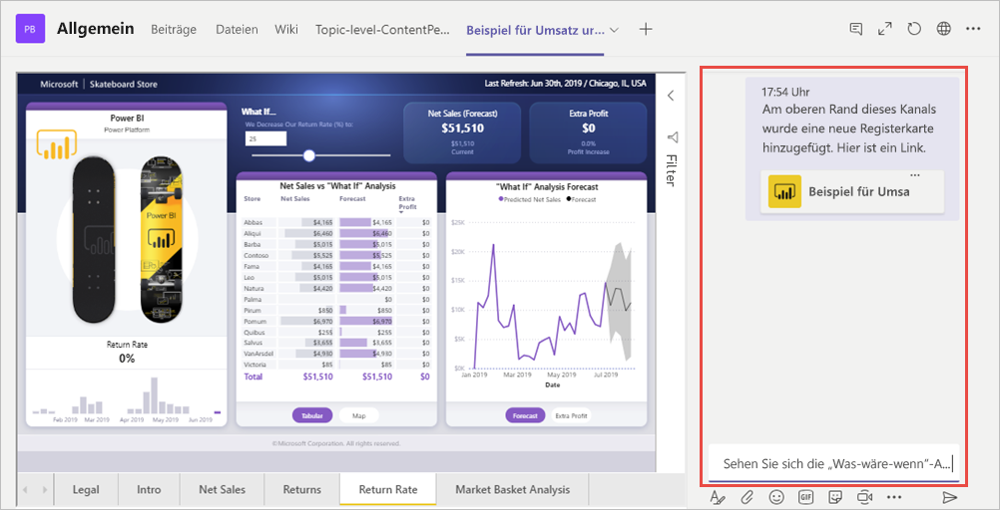

# Einbetten von Berichten in Microsoft Teams mit der Power BI-Registerkarte

Mit der aktualisierten Registerkarte „Power BI“ für Microsoft Teams können Sie interaktive Berichte problemlos in Kanäle und Chats in Microsoft Teams einbetten. Verwenden Sie die Registerkarte „Power BI“ für Microsoft Teams, um Ihre Kollegen bei der Suche nach den Daten zu unterstützen, die Ihr Team verwendet, und um sich in Ihren Teamkanälen über die Daten auszutauschen.  Wenn Sie einen Link zu Ihren Berichten, Dashboards und Apps in das Microsoft Teams-Nachrichtenfeld einfügen, zeigt die Linkvorschau Informationen zum Link an. Ihre Benutzer können so einfacher nachvollziehen, zu welchem Element der Link sie führt.

## Anforderungen

Damit die **Power BI-Registerkarte für Microsoft Teams** funktioniert, müssen Sie Folgendes sicherstellen:

- Ihre Benutzer verfügen über eine Power BI Pro-Lizenz oder der Bericht ist in einer [Power BI Premium-Kapazität (EM oder P-SKU)](service-premium-what-is.md) mit einer Power BI-Lizenz enthalten.
- Microsoft Teams enthält die Power BI-Registerkarte.
- Die Benutzer haben sich beim Power BI-Dienst angemeldet, um ihre Power BI-Lizenz zur Nutzung des Berichts zu aktivieren.
- Benutzer müssen über die Berechtigung zum Anzeigen des Berichts verfügen.

Stellen Sie zusätzlich Folgendes sicher, damit die **Linkvorschau** funktioniert:
- Benutzer erfüllen die Anforderungen zur Verwendung der Power BI-Registerkarte für Microsoft Teams.
- Benutzer haben sich beim Power BI-Botdienst angemeldet. 

## Einbetten des Berichts

Führen Sie diese Schritte aus, um Ihren Bericht in einen Microsoft Teams-Kanal oder -Chat einzubetten.

1. Öffnen Sie einen Kanal oder Chat in Microsoft Teams, und klicken Sie auf das Symbol **+** .

    

2. Klicken Sie auf die Registerkarte „Power BI“.

    

3. Verwenden Sie die verfügbaren Optionen, um einen Bericht aus einem Arbeitsbereich, dem Bereich „Für mich freigegeben“ oder einer Power BI-App auszuwählen.

    

4. Der Registerkartenname wird automatisch an den Berichtsnamen angepasst. Sie haben aber die Möglichkeit, diesen zu ändern. 

5. Klicken Sie auf **Speichern**.

## Unterstützte Berichte zum Einbetten auf der Power BI-Registerkarte
Sie können die folgenden Arten von Berichten auf der Power BI-Registerkarte einbetten:

- Interaktive und paginierte Berichte
- Berichte unter „Mein Arbeitsbereich“, der neuen Benutzeroberfläche für Arbeitsbereiche und den klassischen Arbeitsbereichen
- Berichte in Power BI-Apps

## Abrufen einer Linkvorschau

Führen Sie diese Schritte aus, um eine Linkvorschau des Inhalts im Power BI-Dienst abzurufen.

1. Kopieren Sie einen Link zu einem Bericht, Dashboard oder einer App im Power BI-Dienst. Kopieren Sie beispielsweise den Link aus der Adressleiste des Browsers.

2. Fügen Sie den Link in das Microsoft Teams-Nachrichtenfeld ein. Melden Sie sich beim Linkvorschaudienst an, wenn Sie dazu aufgefordert werden. Möglicherweise müssen Sie einige Sekunden warten, bevor die Linkvorschau geladen wird.

    

3. Die einfache Linkvorschau wird nach erfolgreicher Anmeldung angezeigt.

    

4. Klicken Sie auf das Erweiterungssymbol, um die umfassende Vorschaukarte anzuzeigen.

    

5. Die umfassende Linkvorschaukarte zeigt den Link und relevante Aktionsschaltflächen an.

    

6. Senden Sie die Nachricht.

## Gewähren des Zugriffs auf Berichte

Wenn Sie einen Bericht in Microsoft Teams einbetten oder einen Link zu einem Element senden, erhalten die Benutzer nicht automatisch die Berechtigung, den Bericht aufzurufen. Sie müssen den [Benutzern die Berechtigung erteilen, den Bericht in Power BI aufzurufen](service-share-dashboards.md). Sie können eine Office 365-Gruppe für Ihr Team verwenden, um diesen Prozess zu vereinfachen. 

> [!IMPORTANT]
> Überprüfen Sie im Power BI-Dienst, wer den Bericht sehen kann, und stellen Sie sicher, dass nicht aufgeführte, berechtigte Benutzer Zugriff erhalten.

Eine Möglichkeit, um sicherzustellen, dass jeder in Ihrem Team Zugriff auf die Berichte hat, besteht darin, sie in einen einzelnen Arbeitsbereich in Power BI zu platzieren und der Office 365-Gruppe Ihres Teams Zugriff auf den Arbeitsbereich zu gewähren.

## Linkvorschauen 

Linkvorschauen werden für die folgenden Elemente in Power BI bereitgestellt:
- Berichte
- Dashboards
- Apps

Der Linkvorschaudienst erfordert, dass Ihre Benutzer sich anmelden. Klicken Sie unten im Nachrichtenfeld auf das Power BI-Symbol, und wählen Sie dann „Abmelden“ aus, um sich abzumelden.

## Unterhaltung starten

Wenn Sie die Power BI-Berichtregisterkarte zu Teams hinzufügen, erstellt Teams automatisch eine Registerkartenkonversation für den Bericht. 

- Klicken Sie in der oberen rechten Ecke auf **Registerkartenunterhaltung anzeigen**.

    

    Der erste Kommentar ist ein Link zum Bericht. Jeder in diesem Teams-Channel kann den Bericht in der Konversation sehen und kommentieren.

    

## Bekannte Probleme und Einschränkungen

- Power BI unterstützt nicht die gleichen lokalisierten Sprachen wie Microsoft Teams. Daher wird im eingebetteten Bericht möglicherweise nicht die ordnungsgemäße Lokalisierung angezeigt.
- Power BI-Dashboards können nicht in die Power BI-Registerkarte für Microsoft Teams eingebettet werden.
- Benutzer ohne Power BI-Lizenz oder ohne Zugriffsberechtigung für den Bericht wird die Meldung „Inhalt ist nicht verfügbar“ angezeigt.
- Bei Verwendung von Internet Explorer 10 können Probleme auftreten. <!--You can look at the [browsers support for Power BI](consumer/end-user-browsers.md) and for [Office 365](https://products.office.com/office-system-requirements#Browsers-section). -->
- [URL-Filter](service-url-filters.md) werden auf der Power BI-Registerkarte für Microsoft Teams nicht unterstützt.
- In nationalen Clouds in die neue Power BI-Registerkarte nicht verfügbar. Möglicherweise ist eine ältere Version verfügbar, die die neue Benutzeroberfläche für Arbeitsbereiche oder Berichte in Power BI-Apps nicht unterstützt. 
- Nachdem Sie die Registerkarte gespeichert haben, können Sie den Namen der Registerkarte nicht mehr über die Registerkarteneinstellungen ändern. Verwenden Sie die Option „Umbenennen“, wenn Sie den Namen ändern möchten.
- Einmaliges Anmelden wird für den Linkvorschaudienst nicht unterstützt.
- Linkvorschauen funktionieren nicht in Meetingchats oder privaten Kanälen.

## Nächste Schritte
- [Freigeben eines Dashboards für Kollegen und andere](service-share-dashboards.md)  
- [Erstellen und Verteilen einer App in Power BI](service-create-distribute-apps.md)  
- [Was ist Power BI Premium?](service-premium-what-is.md)

Weitere Fragen? [Stellen Sie Ihre Frage in der Power BI-Community.](https://community.powerbi.com/)
