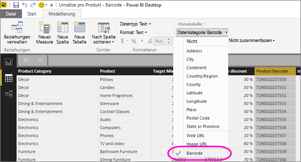

# Markieren eines Barcodes in Power BI Desktop für die mobile App

In Power BI Desktop können Sie in einer Spalte [Daten kategorisieren](desktop-data-categorization.md), damit Power BI Desktop weiß, wie Werte in Visualisierungen in einem Bericht behandelt werden sollen. Sie können auch eine Spalte als **Barcode** kategorisieren. Wenn Sie oder Ihre Kollegen [einen Barcode auf einem Produkt mit der Power BI-App scannen](../consumer/mobile/mobile-apps-scan-barcode-iphone.md), finden Sie auf dem iPhone jeden Bericht, der diesen Barcode enthält. Wenn Sie den Bericht in der mobilen App öffnen, filtert Power BI im Bericht automatisch nach Daten, die mit diesem Barcode verknüpft sind.

1. Wechseln Sie in Power BI Desktop zur Datenansicht.
2. Wählen Sie eine Spalte mit Barcodedaten aus. Weiter unten finden Sie die Liste der [unterstützten Barcodeformate](#supported-barcode-formats).
3. Wählen Sie auf der Registerkarte **Modellierung** **Datenkategorie** > **Barcode** aus.
   
    
4. Fügen Sie dieses Feld in der Berichtsansicht den Visualisierungen hinzu, die der Barcode filtern soll.
5. Speichern Sie den Bericht, und veröffentlichen Sie ihn im Power BI-Dienst.

Wenn Sie den Scanner nun in der [Power BI-App für das iPhone](../consumer/mobile/mobile-iphone-app-get-started.md) öffnen und einen Barcode scannen, wird Ihnen in der Liste der Berichte dieser Bericht angezeigt. Wenn Sie den Bericht öffnen, werden die Visualisierungen von dem Produktbarcode gefiltert, den Sie gescannt haben.

## Unterstützte Barcodeformate
Die folgenden Barcodes erkennt Power BI, wenn Sie sie in einem Power BI-Bericht markieren können: 

* UPCECode 
* Code39Code  
* A39Mod43Code 
* EAN13Code 
* EAN8Code  
* 93Code  
* 128Code 
* PDF417Code 
* Interleaved2of5Code 
* ITF14Code 

## Weitere Schritte
* [Scannen eines Barcodes mit der Power BI-App auf dem iPhone](../consumer/mobile/mobile-apps-scan-barcode-iphone.md)
* [Probleme beim Scannen eines Barcodes mit einem iPhone](../consumer/mobile/mobile-apps-scan-barcode-iphone.md#issues-with-scanning-a-barcode)
* [Datenkategorisierung in Power BI Desktop](desktop-data-categorization.md)  
* Fragen? [Stellen Sie Ihre Frage in der Power BI-Community.](https://community.powerbi.com/)
