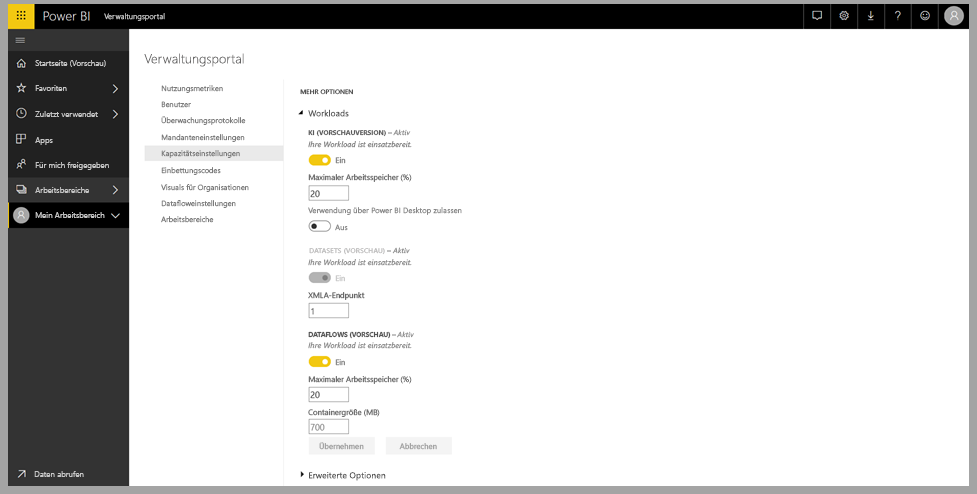
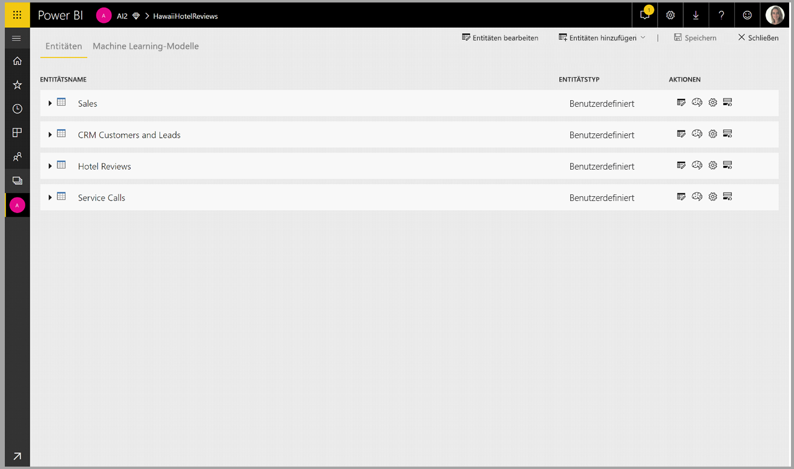
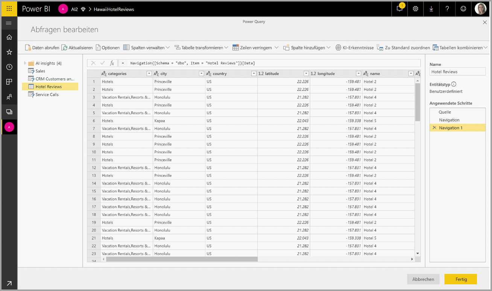
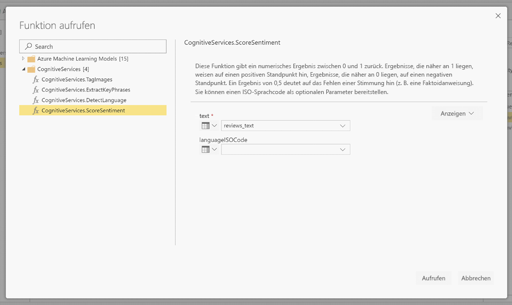
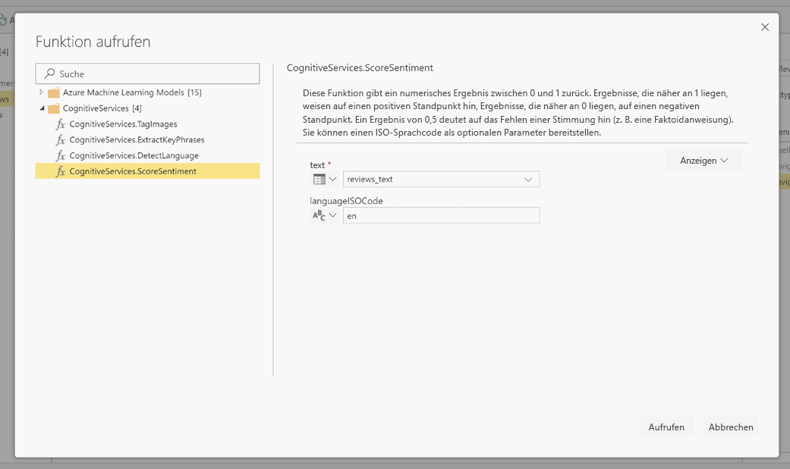
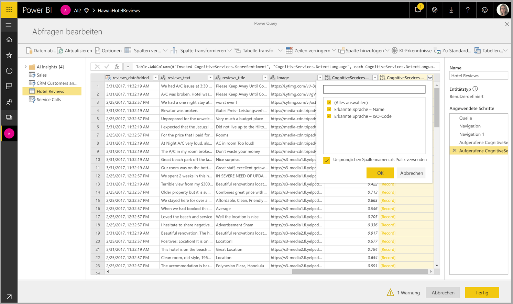

# Cognitive Services in Power BI 

Sie können mit Cognitive Services in Power BI verschiedene Algorithmen der [Azure Cognitive Services](https://azure.microsoft.com/services/cognitive-services/) anwenden, um Ihre Daten in der Self-Service-Datenvorbereitung für Datenflüsse zu erweitern.

Die derzeit unterstützten Dienste sind [Standpunktanalyse](https://docs.microsoft.com/azure/cognitive-services/text-analytics/how-tos/text-analytics-how-to-sentiment-analysis), [Schlüsselbegriffserkennung](https://docs.microsoft.com/azure/cognitive-services/text-analytics/how-tos/text-analytics-how-to-keyword-extraction), [Sprachenerkennung](https://docs.microsoft.com/azure/cognitive-services/text-analytics/how-tos/text-analytics-how-to-language-detection) und [Bildmarkierung](https://docs.microsoft.com/azure/cognitive-services/computer-vision/concept-tagging-images). Die Transformationen werden auf dem Power BI-Dienst ausgeführt und erfordern kein Azure Cognitive Services-Abonnement. Dieses Feature erfordert Power BI Premium.

## **Aktivieren von KI-Funktionen**

Cognitive Services werden für Premium-Kapazitätsknoten EM2, A2 oder P1 und höher unterstützt. Eine separate KI-Workload auf der Kapazität wird zum Ausführen von Cognitive Services verwendet. Während der Vorschauversion (vor Juni 2019) war diese Workload standardmäßig deaktiviert. Bevor Cognitive Services in Power BI verwendet werden können, muss die KI-Workload in den Einstellungen für die Kapazität des Verwaltungsportals aktiviert werden. Sie können die KI-Workload im Workloadsabschnitt aktivieren und die Höchstmenge an Arbeitsspeicher definieren, die diese Workload nutzen soll. Die empfohlene Arbeitsspeichergrenze beträgt 20%. Die Überschreitung dieser Grenze führt zur Verlangsamung der Abfrage.

## **Erste Schritte mit Cognitive Services in Power BI**

Cognitive Services-Transformationen sind Teil der [Self-Service-Datenvorbereitung für Datenflüsse](https://powerbi.microsoft.com/blog/introducing-power-bi-data-prep-wtih-dataflows/). Um die Daten mit Cognitive Services zu erweitern, beginnen Sie mit dem Bearbeiten eines Datenflusses.

Klicken Sie auf die Schaltfläche **KI Insights** im oberen Menüband des Power Query-Editors.

Wählen Sie im Popupfenster die Funktion aus, die Sie verwenden möchten, und die Daten, die Sie transformieren möchten. In diesem Beispiel bewerte ich den Standpunkt einer Spalte, die einen Rezensionstext enthält.

**CultureInfo** ist eine optionale Eingabe, um die Sprache des Texts anzugeben. Dieses Feld erwartet einen ISO-Code. Sie können eine Spalte oder ein statisches Feld als Eingabe für CultureInfo verwenden. In diesem Beispiel wird die Sprache Englisch (En) für die gesamte Spalte angegeben. Wenn Sie dieses Feld leer lassen, erkennt Power BI die Sprache automatisch vor dem Anwenden der Funktion. Wählen Sie als Nächstes **Invoke** aus.

Nach dem Aufrufen der Funktion wird das Ergebnis als neue Spalte der Tabelle hinzugefügt. Die Transformation wird auch als angewendeter Schritt in der Abfrage hinzugefügt.

Wenn die Funktion mehrere Ausgabefelder zurückgibt, fügt der Aufruf der Funktion eine neue Spalte mit einem Datensatz der mehreren Ausgabefelder hinzu.

Verwenden Sie die Erweiterungsoption, um einen oder beide Werte Ihren Daten als Spalten hinzuzufügen.

## **Verfügbare Funktionen**

Dieser Abschnitt beschreibt die verfügbaren Funktionen in Cognitive Services in Power BI.

### **Erkennen von Sprache**

Die Sprachenerkennungsfunktion wertet Texteingabe aus und gibt für jedes Feld den Sprachennamen und ISO-Bezeichner zurück. Diese Funktion ist nützlich für Datenspalten, die beliebigen Text sammeln, wobei die Sprache unbekannt ist. Die Funktion erwartet Daten im Textformat als Eingabe.

Die Textanalyse erkennt bis zu 120 Sprachen. Weitere Informationen finden Sie unter [Sprach- und Regionsunterstützung für die Textanalyse-API](https://docs.microsoft.com/azure/cognitive-services/text-analytics/text-analytics-supported-languages).

### **Erkennen von Schlüsselbegriffen**

Die Funktion **Schlüsselbegriffserkennung** wertet unstrukturierten Text aus und gibt für jedes Textfeld eine Liste von Schlüsselbegriffen zurück. Die Funktion erfordert ein Textfeld als Eingabe und akzeptiert eine optionale Eingabe für **Cultureinfo**. (Siehe Abschnitt **Erste Schritte** weiter oben in diesem Artikel).

Die Schlüsselbegriffserkennung funktioniert am besten, wenn Sie ihr größere Textblöcke zur Verarbeitung zuweisen. Dies ist anders als bei der Standpunktanalyse, die kleinere Textblöcke besser verarbeiten kann. Um die besten Ergebnisse beider Vorgänge zu erhalten, sollten Sie die Eingaben entsprechend umstrukturieren.

### **Score Sentiment**

Die **Score Sentiment**-Funktion wertet die Texteingabe aus und gibt eine Stimmungspunktzahl im Bereich von 0 (negativ) bis 1 (positiv) für jedes Dokument zurück. Diese Funktion ist nützlich zum Erkennen von positiven und negativen Standpunkten in sozialen Medien, Kundenrezensionen und Diskussionsforen.

Die Textanalyse verwendet einen Machine Learning-Klassifizierungsalgorithmus, um eine Stimmungspunktzahl zwischen 0 und 1 zu generieren. Bewertungen, die näher an 1 liegen, weisen auf einen positiven Standpunkt hin, Bewertungen, die näher an 0 liegen, auf einen negativen Standpunkt. Das Modell ist mit einem umfangreichen Textkörper mit Standpunktzuordnungen vortrainiert. Derzeit können Sie nicht Ihre eigenen Trainingsdaten verwenden. Das Modell verwendet zur Textanalyse eine Kombination aus Verfahren – einschließlich Textverarbeitung, Wortartanalyse, Wortplatzierung und Wortassoziationen. Weitere Informationen zum Algorithmus finden Sie unter [Introducing Text Analytics (Einführung in die Textanalyse)](https://blogs.technet.microsoft.com/machinelearning/2015/04/08/introducing-text-analytics-in-the-azure-ml-marketplace/).

Die Standpunktanalyse wird für das gesamte Eingabefeld durchgeführt, im Gegensatz zum Erkennen des Standpunkts für eine bestimmte Entität im Text. In der Praxis besteht die Tendenz, dass sich die Genauigkeit der Bewertung verbessert, wenn Dokumente einen oder zwei Sätze anstatt eines großen Textblocks enthalten. Während einer Objektivitätsbewertungsphase bestimmt das Modell, ob ein Eingabefeld als Ganzes objektiv ist oder einen Standpunkt enthält. Ein überwiegend objektives Eingabefeld wird nicht der Standpunkterkennung übergeben und erhält ohne weitere Verarbeitung eine Bewertung von 0,50. Für die folgenden Eingabefelder in der Pipeline generiert die nächste Erkennung je nach Grad des im Eingabefeld erkannten Standpunkts eine Bewertung über oder unter 0,50.

Derzeit unterstützt die Standpunktanalyse Englisch, Deutsch, Spanisch und Französisch. Andere Sprachen befinden sich in der Vorschauphase. Weitere Informationen finden Sie unter [Sprach- und Regionsunterstützung für die Textanalyse-API](https://docs.microsoft.com/azure/cognitive-services/text-analytics/text-analytics-supported-languages).

### **Tag Images**

Die **Tag Images**-Funktion gibt Tags basierend auf mehr als 2.000 erkennbaren Objekten, Lebewesen, Landschaften und Aktionen zurück. Wenn Tags nicht eindeutig oder nicht allgemein bekannt sind, bietet die Ausgabe „Hinweise“, um die Bedeutung des Tags im Kontext einer bekannten Einstellung zu verdeutlichen. Tags sind nicht taxonomisch angeordnet, und es gibt keine Vererbungshierarchien. Eine Sammlung von Inhaltstags bildet die Grundlage für die „Beschreibung“ eines Bilds in durch Menschen lesbarer, in vollständigen Sätzen formatierter Sprache.

Nach dem Hochladen eines Bilds oder der Angabe einer Bild-URL geben Algorithmen für maschinelles Sehen Tags basierend auf den im Bild identifizierten Objekten, Lebewesen und Aktionen aus. Das Taggen ist nicht auf das Hauptbildmotiv wie etwa eine Person im Vordergrund beschränkt, sondern beinhaltet auch die Einstellung (drinnen oder draußen) Möbel, Werkzeuge, Pflanzen, Tiere, Zubehör, Geräte usw.

Diese Funktion setzt eine Bild-URL oder ein Base-64-Feld als Eingabe voraus. Zurzeit unterstützt die Bildmarkierung Englisch, Spanisch, Japanisch, Portugiesisch und Chinesisch (vereinfacht). Weitere Informationen finden Sie unter [Sprach- und Regionsunterstützung für die Textanalyse-API](https://docs.microsoft.com/rest/api/cognitiveservices/computervision/tagimage/tagimage#uri-parameters).

## Nächste Schritte

Dieser Artikel enthält eine Übersicht über die Verwendung von Cognitive Services mit dem Power BI-Dienst. Die folgenden Artikel könnten für Sie ebenfalls interessant und nützlich sein. 

* [Tutorial: Aufrufen eines klassischen Machine Learning Studio-Modells in Power BI](../connect-data/service-tutorial-invoke-machine-learning-model.md)
* [Azure Machine Learning integration in Power BI (Azure Machine Learning-Integration in Power BI)](service-machine-learning-integration.md)
* [Tutorial: Verwenden von Cognitive Services in Power BI](../connect-data/service-tutorial-use-cognitive-services.md)

Weitere Informationen zu Datenflüssen finden Sie in den folgenden Artikeln:
* [Erstellen und Verwenden von Dataflows in Power BI](service-dataflows-create-use.md)
* [Using computed entities on Power BI Premium (Verwenden berechneter Entitäten in Power BI Premium)](service-dataflows-computed-entities-premium.md)
* [Using dataflows with on-premises data sources (Verwenden von Datenflüssen mit lokalen Datenquellen)](service-dataflows-on-premises-gateways.md)
* [Developer resources for Power BI dataflows (Entwicklerressourcen für Power BI-Datenflüsse)](service-dataflows-developer-resources.md)
* [Dataflows und Integration in Azure Data Lake (Vorschauversion)](service-dataflows-azure-data-lake-integration.md)