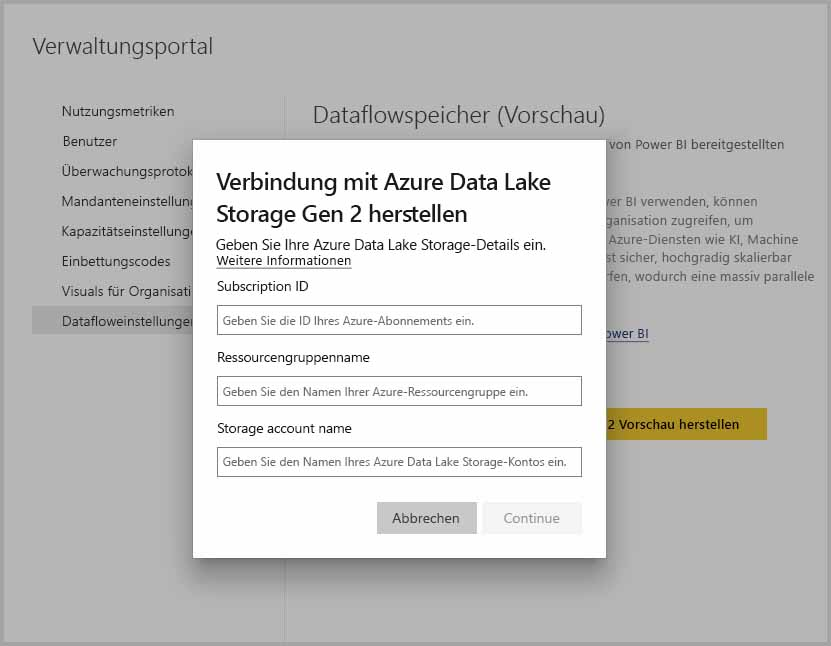
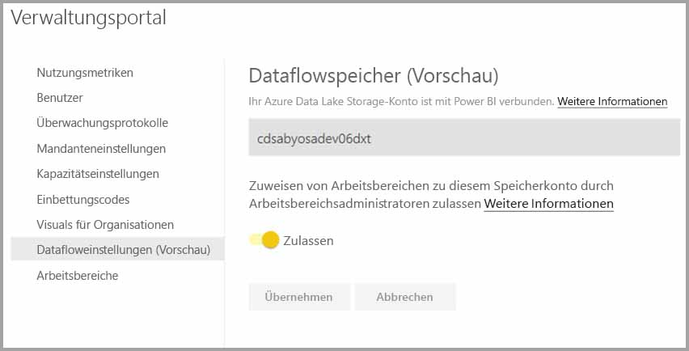

# Herstellen einer Verbindung mit Azure Data Lake Storage Gen2 für die Dataflowspeicherung

Sie können Power BI-Arbeitsbereiche konfigurieren, um Dataflows im Azure Data Lake Storage Gen2-Konto Ihrer Organisation zu speichern. Die hierzu notwendigen Schritte werden in diesem Artikel erläutert. Der Artikel enthält auch bewährte Methoden zu diesem Thema und kann Ihnen als Leitfaden dienen. Das Konfigurieren von Arbeitsbereichen zum Speichern von Dataflowdefinitionen und Datendateien in Ihrem Data Lake-Konto bietet einige Vorteile, beispielsweise:

* Azure Data Lake Storage Gen2 bietet einen enorm skalierbaren Datenspeicher.
* Dataflowdaten und Definitionsdateien können von Entwicklern Ihrer IT-Abteilung genutzt werden, um Azure Data und Dienste für künstliche Intelligenz (KI) zu nutzen, was durch die [GitHub-Beispiele von Azure Data Services](https://aka.ms/cdmadstutorial) veranschaulicht wird.
* Entwickler in Ihrer Organisation können so Dataflowdaten in interne Anwendungen integrieren. Außerdem werden branchenspezifische Lösungen durch die Verwendung von Entwicklerressourcen für Dataflows und Azure ermöglicht.

Um Azure Data Lake Storage Gen2 für Dataflows nutzen zu können, benötigen Sie Folgendes:

* **Power BI-Mandant:** Mindestens ein Konto in Ihrem Azure Active Directory-Mandanten muss für Power BI registriert sein.
* **Globales Administratorkonto:** Dieses Konto benötigen Sie zum Verbinden und Konfigurieren von Power BI, damit die Dataflowdefinitionen und -daten in Ihrem Azure Data Lake Storage Gen2-Konto gespeichert werden können.
* **Azure-Abonnement:** Sie benötigen ein Azure-Abonnement, um Azure Data Lake Storage Gen2 verwenden zu können.
* **Ressourcengruppe:** Verwenden Sie eine bereits vorhandene Ressourcengruppe, oder erstellen Sie eine neue.
* **Azure Storage-Konto mit aktiviertem Data Lake Storage Gen2-Feature** 

> [!TIP]
> Wenn Sie kein Azure-Abonnement haben, erstellen Sie ein [kostenloses Konto](https://azure.microsoft.com/free/), bevor Sie beginnen.

> [!WARNING]
> Sobald der Speicherort eines Dataflows einmal konfiguriert wurde, kann er nicht mehr geändert werden. Weitere wichtige Punkte, die zu berücksichtigen sind, finden Sie im Abschnitt [Überlegungen und Einschränkungen](#considerations-and-limitations) am Ende dieses Artikels.

## Einrichten Ihres Azure Data Lake Storage Gen2-Kontos für Power BI

Bevor Sie Power BI mit einem Azure Data Lake Storage Gen2-Konto konfigurieren können, müssen Sie ein Speicherkonto erstellen und konfigurieren. Werfen wir einen Blick auf die Anforderungen für Power BI:

1. Sie müssen der Besitzer des ADLS-Speicherkontos sein. Dieser muss auf Ressourcenebene zugewiesen sein und darf nicht von der Abonnementebene geerbt worden sein.
2. Das Speicherkonto muss in demselben Azure Active Directory-Mandanten erstellt werden, in dem sich auch Ihr Power BI-Mandant befindet.
3. Das Speicherkonto muss in derselben Region erstellt werden, in der sich auch Ihr Power BI-Mandant befindet. Im Artikel [Wo befindet sich mein Power BI-Mandant?](../admin/service-admin-where-is-my-tenant-located.md) erfahren Sie, wie Sie ermitteln, in welcher Region sich Ihr Power BI-Mandant befindet.
4. Im Speicherkonto muss die Funktion *Hierarchical Name Space* (Hierarchischer Namespace) aktiviert sein.

In den folgenden Abschnitten erfahren Sie detailliert, welche Schritte zum Konfigurieren Ihres Azure Data Lake Storage Gen2-Kontos notwendig sind.

### Erstellen des Speicherkontos

Führen Sie die in dem Artikel [Create an Azure Data Lake Storage Gen2 storage account (Erstellen eines für Azure Data Lake Storage Gen2 geeigneten Speicherkontos)](https://docs.microsoft.com/azure/storage/blobs/data-lake-storage-quickstart-create-account) genannten Schritte aus.

1. Stellen Sie sicher, dass Sie denselben Speicherort auswählen, in dem sich auch Ihr Power BI-Mandant befindet, und legen Sie Ihren Speicher als **StorageV2 (general purpose v2)** (SpeicherV2 (Allgemein v2)) fest.
2. Stellen Sie sicher, dass die Funktion „Hierarchischer Namespace“ aktiviert ist.
3. Es wird empfohlen die Replikationseinstellung auf **Read-access geo-redundant storage (RA-GRS)** (Georedundante Speicher mit Lesezugriff (RA-GRS)) festzulegen.

### Erteilen von Berechtigungen für Power BI-Dienste

Als Nächstes müssen Sie dem Power BI-Dienst die Rollen „Reader“ (Leser) und „Data Access“ (Datenzugriff) in Ihrem erstellten Speicherkonto gewähren. Da es sich dabei um integrierte Rollen handelt, ist dies sehr einfach. 

Führen Sie die Schritte in [Zuweisen einer auf einen Container oder eine Warteschlange begrenzten Rolle im Azure-Portal](https://docs.microsoft.com/azure/storage/common/storage-auth-aad-rbac#assign-a-built-in-rbac-role) aus.

Wählen Sie im Fenster **Rollenzuweisung hinzufügen** die Rolle **Lese- und Datenzugriff** aus. Verwenden Sie dann die Suche, um die Anwendung **Power BI-Dienst** zu finden.
Wiederholen Sie diese Schritte für die Rolle **Besitzer von Speicherblobdaten**, und weisen Sie den Anwendungen **Power BI-Dienst** und **Power BI Premium** jeweils die Rolle zu.

> [!NOTE]
> Warten Sie mindestens 30 Minuten, bis die Berechtigung vom Portal an Power BI weitergegeben wurde. Warten Sie bei jeder Berechtigungsänderung im Portal 30 Minuten, bis die jeweilige Berechtigung in Power BI übernommen wurde. 

## Verbinden Ihres Azure Data Lake Storage Gen2 mit Power BI

Sobald Sie Ihr Azure Data Lake Storage Gen2-Konto im Azure-Portal erstellt haben, verbinden Sie es mit Power BI im **Power BI-Verwaltungsportal**. Den Power BI-Dataflowspeicher verwalten Sie auch im Einstellungsabschnitt **Dataflowspeicher** des Power BI-Verwaltungsportals. Ausführliche Anleitungen zum Start und Informationen zur grundlegenden Verwendung finden Sie unter [Vorgehensweise: Anzeigen des Verwaltungsportals](../admin/service-admin-portal.md).

Mit den folgenden Schritten verbinden Sie Ihr **Azure Data Lake Storage Gen2**-Konto:

1. Navigieren Sie zur Registerkarte **Datafloweinstellungen** im **Power BI-Verwaltungsportal**

     

2. Klicken Sie auf die Schaltfläche **Verbindung mit Azure Data Lake Storage Gen2 herstellen**. Das folgende Fenster wird angezeigt.

     

3. Geben Sie die **Abonnement-ID** des Speicherkontos an.
4. Geben Sie den **Ressourcengruppennamen** an, unter dem das Speicherkonto erstellt wurde.
5. Geben Sie den **Namen des Speicherkontos** an.
6. Wählen Sie **Verbinden** aus.

Nachdem Sie diese Schritte ausgeführt haben, ist Ihr Azure Data Lake Storage Gen2-Konto mit Power BI verbunden. 

> [!NOTE]
> Um eine Verbindung mit Azure Data Lake Storage Gen2 im Power BI-Verwaltungsportal konfigurieren zu können, müssen Sie über globale Administratorrechte verfügen. Globale Administratoren können jedoch keine Verbindung mit externem Speicher im Verwaltungsportal herstellen.  

Als nächstes müssen Sie Personen in Ihrer Organisation das Konfigurieren ihrer Arbeitsbereiche ermöglichen. Erst dann können sie dieses Speicherkonto für Dataflowdefinitionen und Datenspeicherung verwenden. Dies werden wir im nächsten Abschnitt machen. 

## Zuweisen von Arbeitsbereichen durch Administratoren zulassen

Standardmäßig werden Dataflowdefinitionen und Datendateien in dem Speicher, der von Power BI bereitgestellt wird, gespeichert. Um auf Dataflowdateien in Ihrem eigenen Speicherkonto zuzugreifen, müssen Arbeitsbereichadministratoren zuerst den Arbeitsbereich konfigurieren, damit Dataflows in dem neuen Speicherkonto zugewiesen und gespeichert werden können. Bevor ein Arbeitsbereichsadministrator Dataflowspeichereinstellungen konfigurieren kann, müssen ihm Berechtigungen zum Zuweisen von Speicher im **Power BI-Verwaltungsportal** gewährt werden.

Um Berechtigungen zum Zuweisen von Speicher zu gewähren, wechseln Sie zur Registerkarte **Datafloweinstellungen** im **Power BI-Verwaltungsportal**. Stellen Sie dort das Optionsfeld *Allow workspace admins to assign workspaces to this storage account* (Zuweisen von Arbeitsbereichen für dieses Speicherkonto durch Arbeitsbereichadministratoren zulassen) auf **Allow** (Zulassen) ein. Wenn Sie den Regler des Optionsfelds eingestellt haben, klicken Sie anschließend auf die Schaltfläche **Übernehmen**, damit die Änderung erfolgt. 

 

Fertig! Die Power BI-Arbeitsbereichadministratoren können nun dem von Ihnen erstellten Dateisystem Workflows zuweisen.

## Überlegungen und Einschränkungen

Diese Funktion ist eine Previewfunktion, die bis zur Veröffentlichung noch verändert werden kann. Einige Überlegungen und Einschränkungen sind bei der Arbeit mit Ihrem Dataflowspeicher zu beachten:

* Sobald der Speicherort eines Dataflows einmal konfiguriert wurde, kann er nicht mehr geändert werden.
* Nur Besitzer eines Dataflows, der in Azure Data Lake Storage Gen2 gespeichert ist, haben standardmäßig Zugriff auf ihre Daten. Um weitere Personen für die in Azure gespeicherten Dataflows zu autorisieren, müssen diese dem CDM-Ordner des relevanten Dataflows hinzugefügt werden. 
* Dataflows mit verknüpften Entitäten können nur erstellt werden, wenn sie in demselben Speicherkonto gespeichert sind.
* Lokale Datenquellen, gemeinsam in Power BI genutzte Kapazitäten, werden für Dataflows, die im Data Lake Ihrer Organisation gespeichert sind, nicht unterstützt.
* Momentaufnahmen werden in ADLS Gen2 nicht automatisch gelöscht. Wenn Sie Speicherplatz freigeben möchten, können Sie eine Azure-Funktion erstellen, um alte Momentaufnahmen regelmäßig zu bereinigen.

Es gibt auch einige bekannte Probleme, was in diesem Abschnitt thematisiert wird.

Benutzer von **Power BI Desktop** können nur auf Dataflows zugreifen, die in einem Azure Data Lake Storage-Konto gespeichert sind, wenn sie der Besitzer des jeweiligen Dataflows sind, oder wenn sie für den CDM-Ordner im Data Lake autorisiert sind. Das Szenario sieht folgendermaßen aus:

1. Anna hat einen neuen Arbeitsbereich erstellt und diesen so konfiguriert, dass Dataflows im Data Lake Ihrer Organisation gespeichert werden. 
2. Ben ist ebenfalls Mitglied des Arbeitsbereichs, den Anna erstellt hat, und möchte Power BI Desktop und den Dataflowconnector verwenden, um Daten aus Annas Dataflow zu erhalten.
3. Da Ben im Data Lake-Konto nicht als Benutzer des CDM-Ordners des Dataflows autorisiert wurde, wird ihm ein ähnlicher Fehler angezeigt.

Häufig gestellte Fragen und Antworten zu diesem Thema:

**Frage:** Wie kann ich vorgehen, wenn ich bereits Dataflows in einem Arbeitsbereich erstellt habe und nun deren Speicherort ändern möchte?

**Antwort:** Für einen bereits erstellten Dataflow kann der Speicherort nicht mehr geändert werden. 

**Frage:** Wann kann ich den Speicherort eines Dataflows für einen Arbeitsbereich ändern?

**Antwort:** Der Speicherort eines Dataflows für einen bestimmten Arbeitsbereich darf nur geändert werden, wenn der Arbeitsbereich keine Dataflows enthält.

## Nächste Schritte

Dieser Artikel sollte Ihnen als Leitfaden für das Verbinden von Azure Data Lake Gen2 zur Dataflowspeicherung dienen. Weitere Informationen finden Sie in den folgenden Artikeln:

Weitere Informationen zu Dataflows, CDM und Azure Data Lake Storage Gen2 finden Sie in den folgenden Artikeln:

* [Dataflows und Integration in Azure Data Lake (Vorschauversion)](service-dataflows-azure-data-lake-integration.md)
* [Configure workspace dataflow settings (Preview) (Konfigurieren von Datafloweinstellungen im Arbeitsbereich (Vorschauversion))](service-dataflows-configure-workspace-storage-settings.md)
* [Add a CDM folder to Power BI as a dataflow (Preview) (Hinzufügen eines CDM-Ordners als Dataflow in Power BI (Vorschauversion))](service-dataflows-add-cdm-folder.md)

Allgemeine Informationen zu Dataflows finden Sie in den folgenden Artikeln:

* [Erstellen und Verwenden von Dataflows in Power BI](service-dataflows-create-use.md)
* [Using computed entities on Power BI Premium (Verwenden berechneter Entitäten in Power BI Premium)](service-dataflows-computed-entities-premium.md)
* [Using dataflows with on-premises data sources (Verwenden von Datenflüssen mit lokalen Datenquellen)](service-dataflows-on-premises-gateways.md)
* [Developer resources for Power BI dataflows (Entwicklerressourcen für Power BI-Datenflüsse)](service-dataflows-developer-resources.md)

Weitere Informationen zu Azure Storage finden Sie in den folgenden Artikeln:
* [Azure Storage security guide (Azure Storage Sicherheitsleitfaden)](https://docs.microsoft.com/azure/storage/common/storage-security-guide)

Weitere Informationen zum Common Data Model finden Sie im folgenden Übersichtsartikel:
* [Was ist das Common Data Model?](https://docs.microsoft.com/powerapps/common-data-model/overview)
* [CDM folders (CDM-Ordner)](https://go.microsoft.com/fwlink/?linkid=2045304)
* [The metadata file (model.json) for the Common Data Model (Die Metadatendatei (model.json) des CDM)](https://go.microsoft.com/fwlink/?linkid=2045521)

Natürlich können Sie auch jederzeit [Fragen in der Power BI-Community stellen](https://community.powerbi.com/).
