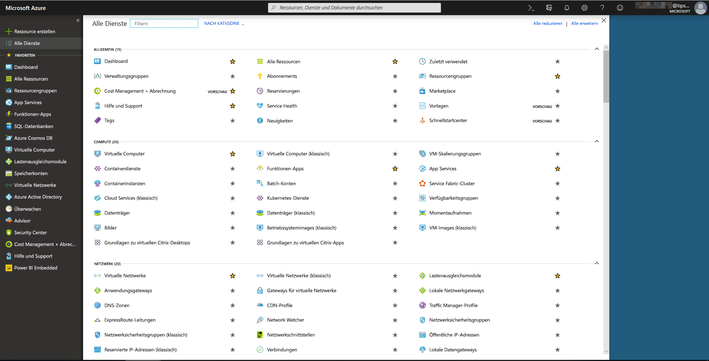
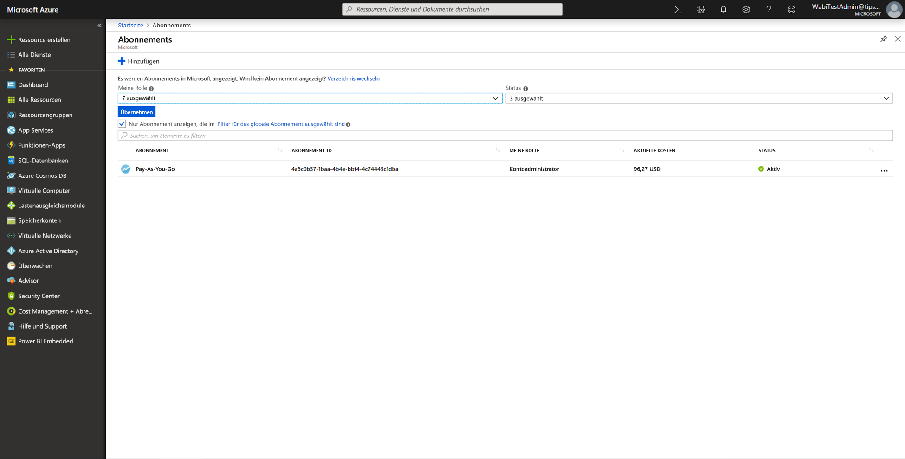
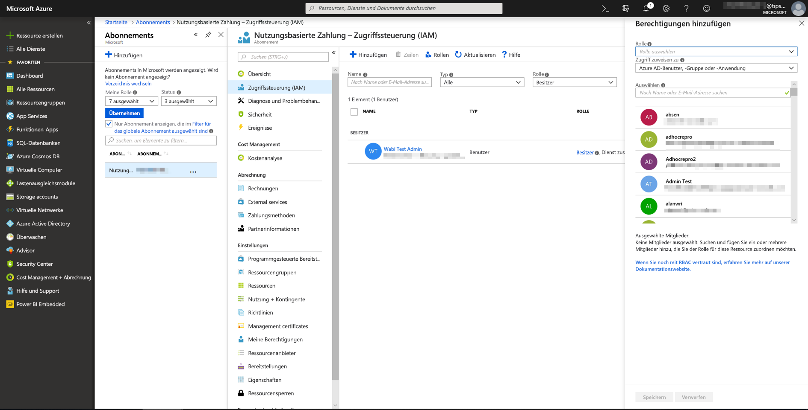
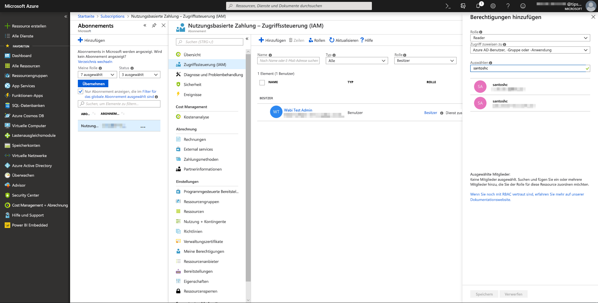
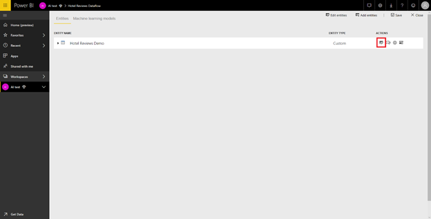
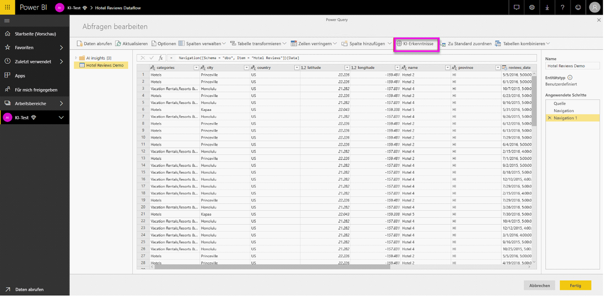
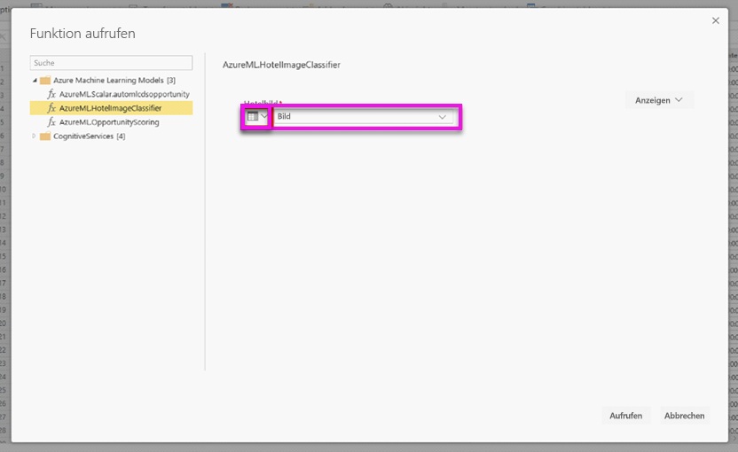
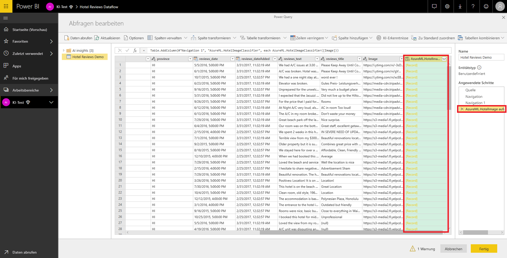
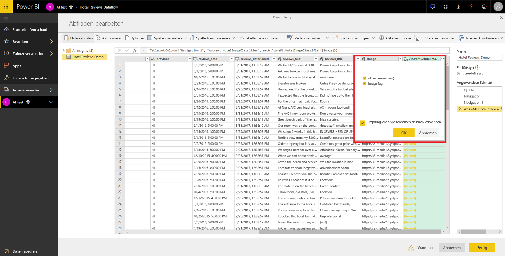

# Azure Machine Learning-Integration in Power BI

Viele Organisationen verwenden **Machine Learning**-Modelle, um bessere Erkenntnisse über ihr Geschäft zu erhalten und Vorhersagen zu erstellen. Die Möglichkeit, Erkenntnisse aus diesen Modellen aufzurufen und in Ihren Berichten und Dashboards sowie anderen Analysen zu visualisieren, erleichtert die Weitergabe dieser Erkenntnisse an die Geschäftsbenutzer, die sie am dringendsten benötigen.  Power BI vereinfacht jetzt die Integration der Erkenntnisse aus Modellen, die in Azure Machine Learning gehostet werden, über einfache Point-and-Click-Gesten.

Zur Verwendung dieser Funktion kann ein Data Scientist dem BI-Analysten einfach über das Azure-Portal Zugriff auf das Azure ML-Modell erteilen.  Dann ermittelt Power Query am Anfang jeder Sitzung alle Azure ML-Modelle, auf die der Benutzer Zugriff hat, und macht sie als dynamische Power Query-Funktionen verfügbar.  Der Benutzer kann dann über das Menüband im Power Query-Editor auf diese Funktionen zugreifen oder die M-Funktion direkt aufrufen. Power BI erstellt auch beim Aufrufen des Azure ML-Modells für eine Gruppe von Zeilen automatisch Batches der Zugriffsanforderungen, um eine bessere Leistung zu erzielen.

Diese Funktionalität wird derzeit nur für Power BI-Dataflows und im Power BI-Dienst für die Onlinenutzung von Power Query unterstützt.

Weitere Informationen zu Dataflows finden Sie unter [Self-Service-Datenaufbereitung in Power BI (Vorschau)](service-dataflows-overview.md).

Weitere Informationen zu Azure Machine Learning finden Sie unter:

- Übersicht:  [Was ist Azure Machine Learning?](https://docs.microsoft.com/azure/machine-learning/service/overview-what-is-azure-ml)
- Schnellstarts und Tutorials für Azure Machine Learning:  [Azure Machine Learning-Dokumentation](https://docs.microsoft.com/azure/machine-learning/)

## Gewähren von Zugriff auf das Azure ML-Modell für Power BI-Benutzer

Um von Power BI aus auf ein Azure ML-Modell zugreifen zu können, benötigen Benutzer den **Lesezugriff** auf das Azure-Abonnement.  Zusätzlich:

- Für klassische Machine Learning Studio-Modelle benötigen Benutzer **Lesezugriff** auf den klassischen Machine Learning Studio-Webdienst.
- Für Machine Learning-Modelle benötigen Benutzer **Lesezugriff** auf den Machine Learning-Arbeitsbereich.

Die Schritte in diesem Artikel beschreiben, wie Power BI-Benutzern Zugriff auf ein im Azure ML-Dienst gehostetes Modell gewährt wird, damit sie als Power Query-Funktion auf dieses Modell zugreifen können.  Weitere Informationen finden Sie unter [Verwalten des Zugriffs auf Azure-Ressourcen mit RBAC und dem Azure-Portal](https://docs.microsoft.com/azure/role-based-access-control/role-assignments-portal).

1. Melden Sie sich beim [Azure-Portal](https://portal.azure.com) an.

2. Wechseln Sie zur Seite **Abonnements**. Sie finden die Seite **Abonnements** in der Liste **Alle Dienste** im Navigationsmenü des Azure-Portals.

    

3. Wählen Sie Ihr Abonnement aus.

    

4. Wählen Sie **Zugriffssteuerung (IAM)** und dann die Schaltfläche **Hinzufügen** aus.

    

5. Wählen Sie **Leser** als Rolle aus. Wählen Sie den Power BI-Benutzer aus, dem Sie Zugriff auf das Azure ML-Modell gewähren möchten.

    

6. Wählen Sie **Speichern**.

7. Wiederholen Sie die Schritte drei bis sechs, um dem Benutzer **Lesezugriff** auf den spezifischen (klassischen) Machine Learning Studio-Webdienst *oder* auf den Machine Learning-Arbeitsbereich zu gewähren, in dem das Modell gehostet wird.

## Schemaermittlung für Machine Learning-Modelle

Data Scientists verwenden zum Entwickeln und sogar zum Bereitstellen ihrer Machine Learning-Modelle für Machine Learning in erster Linie Python.  Im Gegensatz zur klassischen Version von Machine Learning Studio, die die Automatisierung des Erstellens einer Schemadatei für das Modell erleichtert, muss der Data Scientist beim Machine Learning die Schemadatei explizit mit Python generieren.

Diese Schemadatei muss in den bereitgestellten Webdienst für Machine Learning-Modelle aufgenommen werden. Um das Schema für den Webdienst automatisch zu generieren, müssen Sie ein Beispiel der Eingabe/Ausgabe im Eingangsskript für das bereitgestellte Modell angeben. Informationen dazu finden Sie im Unterabschnitt der [(optionalen) Azure Machine Learning Service-Dienstdokumentation zur automatischen Swagger-Schemagenerierung in Bereitstellungsmodellen](https://docs.microsoft.com/azure/machine-learning/how-to-deploy-and-where#optional-define-model-web-service-schema). Der Link beinhaltet das Beispieleingangsskript mit den Anweisungen für die Schemagenerierung. 

Insbesondere verweisen die Funktionen *\@input_schema* und *\@output_schema* im Eingabeskript auf die Eingabe- und Ausgabebeispielformate in den Variablen *input_sample* und *output_sample* und verwenden diese Beispiele, um während der Bereitstellung eine OpenAPI-Spezifikation (Swagger) für den Webdienst zu generieren.

Diese Anweisungen zur Schemagenerierung durch Aktualisieren des Eingangsskripts müssen ebenfalls auf Modelle angewendet werden, die automatisierte Experimente in Machine Learning unter Nutzung des Azure Machine Learning-SDKs verwenden.

> [!NOTE]
> Modelle, die mithilfe der grafischen Benutzeroberfläche von Azure Machine Learning erstellt werden, unterstützen aktuell keine Schemagenerierung. Diese Funktion wird jedoch in kommenden Releases implementiert. 

## Aufrufen des Azure ML-Modells in Power BI

Sie können ein Azure ML-Modell, auf das Ihnen Zugriff gewährt wurde, direkt vom Power Query-Editor in Ihrem Dataflow aus aufrufen. Wählen Sie für den Zugriff auf die Azure ML-Modelle die Schaltfläche **Bearbeiten** für die Entität aus, die Sie mit Erkenntnissen aus Ihrem Azure ML-Modell erweitern möchten, wie in der folgenden Abbildung dargestellt.

Mit Auswahl der Schaltfläche **Bearbeiten** wird der Power Query-Editor für die Entitäten in Ihrem Dataflow geöffnet.

Wählen Sie die Schaltfläche **KI Insights** im Menüband und dann im Navigationsmenü den Ordner _Azure Machine Learning Models_ aus. Alle Azure ML-Modelle, auf die Sie Zugriff haben, finden Sie hier als Power Query-Funktionen aufgelistet. Darüber hinaus werden die Eingabeparameter für das Azure ML-Modell automatisch als Parameter der entsprechenden Power Query-Funktion zugeordnet.

Um ein Azure ML-Modell aufzurufen, können Sie beliebige Spalten der ausgewählten Entität als Eingabe aus der Dropdownliste angeben. Sie können auch durch das Umschalten des Spaltensymbols auf der linken Seite des Eingabedialogfelds einen konstanten Wert angeben, der als Eingabe verwendet wird.

Wählen Sie **Aufrufen** aus, um die Vorschau der Ausgabe des Azure ML-Modells als neue Spalte in der Entitätentabelle anzuzeigen. Sie sehen den Modellaufruf auch als angewendeten Schritt für die Abfrage.

Wenn das Modell mehrere Ausgabeparameter zurückgibt, werden sie als Datensatz in der Ausgabespalte gruppiert. Sie können die Spalte erweitern, um einzelne Ausgabeparameter in separaten Spalten zu erzeugen.

Nach dem Speichern Ihres Dataflows wird das Modell automatisch aufgerufen, wenn der Dataflow aktualisiert wird, um etwaige neue oder aktualisierte Zeilen in der Entitätentabelle zu berücksichtigen.

## Nächste Schritte

Dieser Artikel enthält eine Übersicht über die Integration von Machine Learning in den Power BI-Dienst. Die folgenden Artikel könnten für Sie ebenfalls interessant und nützlich sein. 

* [Tutorial: Aufrufen eines klassischen Machine Learning Studio-Modells in Power BI](../connect-data/service-tutorial-invoke-machine-learning-model.md)
* [Tutorial: Verwenden von Cognitive Services in Power BI](../connect-data/service-tutorial-use-cognitive-services.md)
* [Cognitive Services in Power BI](service-cognitive-services.md)

Weitere Informationen zu Dataflows finden Sie in den folgenden Artikeln:
* [Erstellen und Verwenden von Dataflows in Power BI](service-dataflows-create-use.md)
* [Using computed entities on Power BI Premium (Verwenden berechneter Entitäten in Power BI Premium)](service-dataflows-computed-entities-premium.md)
* [Using dataflows with on-premises data sources (Verwenden von Datenflüssen mit lokalen Datenquellen)](service-dataflows-on-premises-gateways.md)
* [Developer resources for Power BI dataflows (Entwicklerressourcen für Power BI-Datenflüsse)](service-dataflows-developer-resources.md)
* [Dataflows und Integration in Azure Data Lake (Vorschauversion)](service-dataflows-azure-data-lake-integration.md)
