# Erstellen von Matrixvisualisierungen in Power BI

[!INCLUDE [power-bi-visuals-desktop-banner](../includes/power-bi-visuals-desktop-banner.md)]

Das Matrixvisual ähnelt einer Tabelle.  Eine Tabelle unterstützt zwei Dimensionen und die Daten sind flach, d.h. doppelte Werte werden angezeigt und nicht aggregiert. Eine Matrix erleichtert die sinnvolle Darstellung von Daten über mehrere Dimensionen hinweg – sie unterstützt ein abgestuftes Layout. Die Matrix aggregiert die Daten automatisch und ermöglicht einen Drilldown. 

Sie können Matrixvisuals in **Power BI Desktop**-Berichten und die übergreifende Hervorhebung von Elementen innerhalb der Matrix mit anderen Visuals auf dieser Berichtsseite erstellen. Sie können z.B. Zeilen, Spalten und sogar einzelne Zellen für die übergreifende Hervorhebung auswählen. Die Auswahl einzelner und mehrerer Zellen kann auch kopiert und in andere Anwendungen eingefügt werden. 

Die Matrix bietet viele Features, die in den folgenden Abschnitten dieses Artikels erläutert werden.

## Erläuterung der Berechnung von Summen mit Power BI

Bevor Sie mit der Vorgehensweise für die Verwendung des Matrixvisuals fortfahren, ist es wichtig, zu lernen, wie Power BI die Werte für Summen und Teilergebnisse in Tabellen und Matrizen berechnet. Bei Zeilen mit Summen und Teilergebnissen wertet Power BI das Measure für alle Zeilen der zugrunde liegenden Daten aus. Dabei handelt es sich nicht um eine einfache Addition der Werte in den sichtbaren oder angezeigten Zeilen. Das bedeutet, dass andere Werte als erwartet in der Zeile für die Gesamtsumme vorhanden sein können.

Betrachten Sie die folgenden Matrixvisuals. 

In diesem Beispiel zeigt jede Zeile im Matrixvisual auf der rechten Seite den *Betrag* für jede Kombination von „salesperson“ (Verkäufer) und „date“ (Datum) an. Da ein Verkäufer jedoch für mehrere Datumswerte angezeigt wird, können die Zahlen mehr als einmal angezeigt werden. Daher stimmen die genaue Summe der zugrunde liegenden Daten und die Summe der Addition der sichtbaren Werte nicht überein. Dabei handelt es sich um ein allgemeines Muster, wenn der Wert, dessen Summe Sie bilden, sich auf der Seite „1“ einer 1:n-Beziehung befindet.

Wenn Sie sich die Summen und Teilergebnisse ansehen, denken Sie daran, dass diese Werte auf den zugrunde liegenden Daten basieren. Sie basieren nicht allein auf den sichtbaren Werten.

## Erweitern und reduzieren von Zeilenheadern
Sie haben zwei Möglichkeiten, Zeilenheader zu erweitern. Eine davon ist das Kontextmenü, erreichbar über die rechte Maustaste. Sie können den aktuell ausgewählten Zeilenheader, die gesamte Ebene oder die vollständige Hierarchie erweitern. Beim Reduzieren von Zeilenheadern haben Sie ähnliche Möglichkeiten.

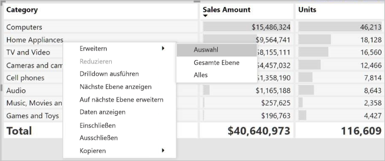

Sie können den Zeilenheadern auch +/-Schaltflächen hinzufügen. Diese Option finden Sie im Bereich „Formatierung“ unter der Karte **Zeilenheader**. Standardmäßig wird für die Symbole die Formatierung der Zeilenheader übernommen, Sie können Farbe und Größe jedoch auch separat anpassen.

Sobald die Symbole aktiviert sind, funktionieren sie ähnlich wie PivotTable-Symbole in Excel.

Der Erweiterungsstatus der Matrix wird zusammen mit dem Bericht gespeichert. Eine Matrix kann erweitert oder reduziert an ein Dashboard angeheftet werden. Auch wenn diese Dashboardkachel ausgewählt wird und der Bericht sich öffnet, kann der Erweiterungsstatus weiterhin im Bericht geändert werden. 

## Verwenden von Drilldown mit dem Matrixvisual
Mit dem Matrixvisual können Sie viele interessante Drilldownaktionen durchführen, die zuvor nicht verfügbar waren. Hierzu zählt die Möglichkeit des Drilldowns auf Zeilen, Spalten und sogar einzelne Abschnitte und Zellen. Im Folgenden befassen Sie sich mit der Funktionsweise.

### Drilldown auf Zeilenüberschriften

Wenn Sie im Bereich „Visualisierungen“ mehrere Felder zum Abschnitt **Rows** (Zeilen) des Bereichs **Fields** (Felder) hinzufügen, wird der Drilldown auf Zeilen in der Matrixvisualisierung aktiviert. Im Grunde erstellen Sie eine Hierarchie, durch deren Ebenen Sie sich dann per Drilldown (und Drillup) bewegen können, um die Daten der jeweiligen Ebene zu analysieren.

In der folgenden Abbildung enthält der Abschnitt **Rows** (Zeilen) *Sales stage* (Verkaufsphase) und *Opportunity size* (Größe der Verkaufschance), wodurch eine Gruppierung (oder Hierarchie) der Zeilen entsteht, bei denen ein Drillthrough möglich ist.

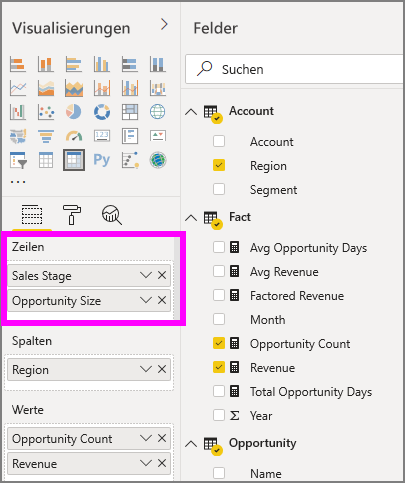

Wenn für die Visualisierung im Abschnitt **Zeilen** eine Gruppierung erstellt wurde, werden oben links in der Visualisierung selbst die Symbole für *Drill* und *Erweitern* angezeigt.

Mit diesen Schaltflächen können Sie in der Hierarchie einen Drilldown (oder Drillup) ausführen (das Verhalten gleicht dem in anderen Visualisierungen). In diesem Fall können Sie einen Drilldown von *Sales stage* (Verkaufsphase) zu *Opportunity size* (Größe der Verkaufschance) ausführen (siehe die folgende Abbildung, in der das Gabelpfeilsymbol für den Drilldown um eine Ebene ausgewählt wurde).

Statt die Symbole zu verwenden, können Sie auch eine beliebige Zeilenüberschrift auswählen und den Drilldown durch Auswahl im nun angezeigten Menü ausführen.

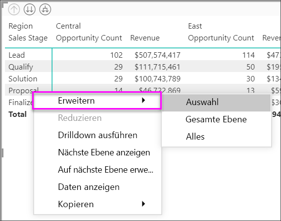

Das Menü enthält verschiedene Optionen, die zu unterschiedlichen Ergebnissen führen:

Mit **Drilldown** wird die Matrix für *diese* Zeilenebene erweitert, alle anderen Zeilenüberschriften, mit Ausnahme derjenigen, die ausgewählt wurde, sind *nicht betroffen*. In der folgenden Abbildung wurde **Proposal** (Angebot) > **Drilldown** ausgewählt. Wie Sie sehen, werden andere Zeilen, die der höchsten Ebene angehören, nicht mehr in der Matrix angezeigt. Dieses nützliche Feature zum Ausführen von Drilldowns wird im Abschnitt zu Kreuzhervorhebungen genauer erläutert.

Um zur Ansicht der obersten Ebene zurückzukehren, wählen Sie das Symbol für **Drillup** aus. Wenn Sie dann **Proposal** (Angebot) > **Nächste Ebene anzeigen** auswählen, wird eine aufsteigende Liste aller Elemente auf der nächsten Ebene (hier das Feld *Opportunity size* (Größe der Verkaufschance)) ohne die Kategorisierung der höheren Hierarchieebene angezeigt.

Wählen Sie das **Drillup**-Symbol in der oberen linken Ecke aus, damit die Matrix alle Kategorien der obersten Ebene anzeigt, und wählen Sie dann **Proposal** (Angebot) > **Auf nächste Ebene erweitern** aus, um alle Werte für beide Ebenen der Hierarchie anzuzeigen – *Sales stage* (Verkaufsphase) und *Opportunity size* (Größe der Verkaufschance).

Sie können die Anzeige auch mit dem Menüelement **Erweitern** noch weiter steuern.  Wählen Sie z.B. **Proposal** (Angebot) > **Erweitern** > **Auswahl** aus. Power BI zeigt eine ganze Zeile für jede *Sales stage* (Verkaufsphase) und alle *Größe der Verkaufschance*-Optionen für *Proposal* (Angebot) an.

### Drilldown auf Spaltenüberschriften
Wie auf Zeilen können Sie auch auf Spalten einen Drilldown ausführen. In der folgenden Abbildung umfasst der Feldbereich **Columns** (Spalten) zwei Felder, sodass Sie wie bei Zeilen eine Hierarchie erstellen können (siehe oben in diesem Artikel). Der Feldbereich **Columns** (Spalten) enthält *Region* und *Segment*. Sobald das zweite Feld zu **Columns** (Spalten) hinzugefügt wurde, wurde ein neues Dropdownmenü auf dem Visual angezeigt, derzeit zeigt es **Rows** (Zeilen) an.

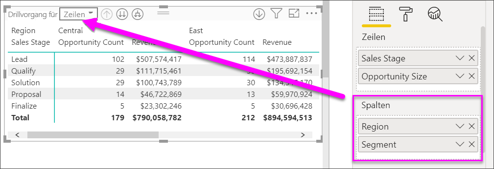

Um einen Drilldown für Spalten durchzuführen, wählen Sie **Columns** (Spalten) aus dem *Drillvorgang für*-Menü in der oberen linken Ecke der Matrix. Wählen Sie die Region *East* (Osten) und **Drilldown** aus.

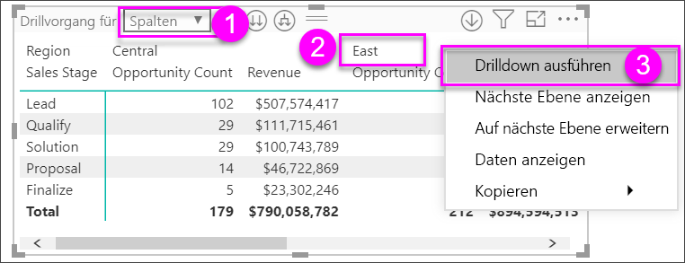

Wenn Sie **Drilldown** auswählen, wird die nächste Ebene der Spaltenhierarchie von *Region > East* (Osten) angezeigt, in diesem Fall *Opportunity count* (Anzahl der Verkaufschancen). Die andere Region ist ausgeblendet.

Alle weiteren Menüelemente für Spalten sind identisch mit denen für Zeilen (siehe den vorigen Abschnitt **Drilldown auf Zeilenüberschriften**). Wie bei Zeilen stehen bei Spalten die Optionen **Nächste Ebene anzeigen** und **Auf nächste Ebene erweitern** zur Verfügung.

> [!NOTE]
> Die Symbole für Drilldown und Drillup oben links im Matrixvisual gelten nur für Zeilen. Um einen Drilldown auf Spalten auszuführen, verwenden Sie das Kontextmenü.

## Abgestuftes Layout mit visuellen Matrixelementen

Beim Matrixvisual werden Unterkategorien in einer Hierarchie automatisch unter dem übergeordneten Element eingerückt, was als abgestuftes Layout bezeichnet wird.

In der ursprünglichen Version der Matrixvisualisierung wurden Unterkategorien in einer eigenen Spalte angezeigt. Dadurch beanspruchten sie deutlich mehr Platz in der Visualisierung. Im folgenden Bild wird die Tabelle im ursprünglichen Matrixvisual dargestellt. Beachten Sie die Unterkategorien in einer separaten Spalte.

In der Abbildung unten sehen Sie ein Matrixvisual mit aktiviertem abgestuften Layout. Bei der Kategorie *Computer* sind die Unterkategorien (Computerzubehör, Desktops, Laptops, Monitore usw.) leicht eingerückt und die Visualisierung ist klarer und prägnanter strukturiert.

Sie können die Einstellungen für das abgestufte Layout einfach anpassen. Erweitern Sie bei ausgewähltem Matrixvisual im Abschnitt **Format** (das Farbroller-Symbol) des Bereichs **Visualisierungen** den Abschnitt „Zeilenüberschriften“. Sie haben zwei Optionen: den Umschalter „Abgestuftes Layout“ (zum Ein-/Ausschalten des Layouts) und das Eingabefeld „Abgestufter Layouteinzug“ (zum Festlegen des Einzugs in Pixel).

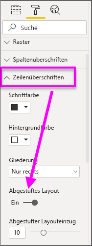

Wenn Sie das abgestufte Layout deaktivieren, zeigt Power BI die Unterkategorien nicht mehr unter der übergeordneten Kategorie eingerückt, sondern in einer eigenen Spalte an.

## Teilsummen und Gesamtsumme mit Matrixvisuals

Sie können in Matrixvisuals Teilergebnisse sowohl für Zeilen als auch für Spalten aktivieren und deaktivieren. In der folgenden Abbildung sind die Teilsummen für Zeilen auf **Ein** und darauf festgelegt, dass sie unten angezeigt werden.

Wenn Sie die Option **Teilsummen** und eine Bezeichnung hinzufügen, fügt Power BI auch eine Zeile und dieselbe Bezeichnung für den Wert „Gesamtsumme“ hinzu. Zum Formatieren der Gesamtsumme wählen Sie die Option **Gesamtsumme** aus. 

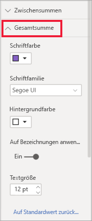

Wenn Sie die Optionen „Teilsummen“ und „Gesamtsumme“ deaktivieren möchten, erweitern Sie im Abschnitt „Format“ des Bereichs „Visualisierungen“ die Karte **Teilsummen**. Setzen Sie dann den Schieberegler für Teilsummen von Zeilen auf **Aus**. Wenn Sie dies tun, werden die Teilergebnisse nicht angezeigt.

Dasselbe Verfahren wird für die Spaltenteilergebnisse angewendet.

## Bedingte Symbole hinzufügen
Fügen Sie der Tabelle oder Matrix mithilfe von *bedingten Symbolen* visuelle Hinweise hinzu. 

Erweitern Sie im Abschnitt „Format“ des Bereichs „Visualisierungen“ die Karte **Bedingte Formatierung**. Setzen Sie den Schieberegler **Symbole** auf **Ein**, und klicken Sie auf **Erweiterte Steuerelemente**.

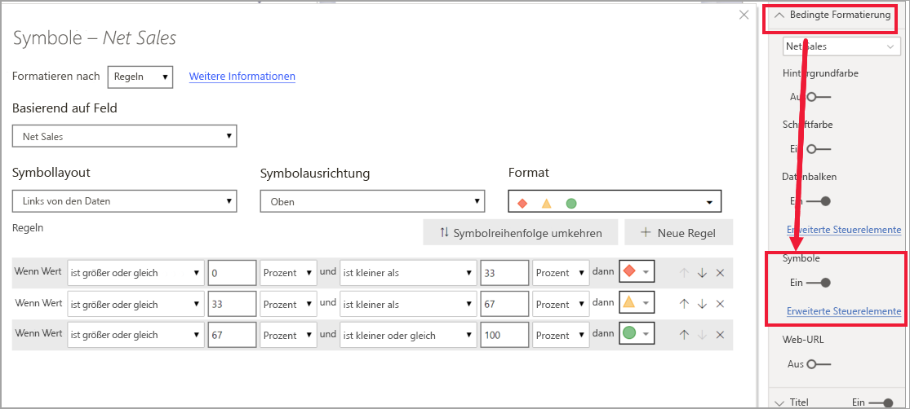

Passen Sie die Bedingungen, Symbole und Farben für Ihre Matrix an, und klicken Sie auf **OK**. In diesem Beispiel wurde ein rotes Fähnchen für niedrige Werte, ein lila Kreis für hohe Werte und ein gelbes Dreieck für alle Werte dazwischen verwendet. 

## Kreuzhervorhebung mit visuellen Matrixelementen

Jedes Element im Matrixvisual kann als Basis für Kreuzhervorhebungen dienen. Wenn Sie in einer Matrix eine Spalte auswählen, wird sie von Power BI hervorgehoben (wie bei anderen Visuals auf der Berichtsseite). Diese Art von Kreuzhervorhebung ist ein Standardfeature in anderen Visuals und bei der Auswahl eines Datenpunkts, das jetzt auch im Matrixvisual unterstützt wird.

Auch wird STRG+Klicken jetzt für die Kreuzhervorhebung unterstützt. In der folgenden Abbildung sehen Sie eine Reihe von Unterkategorien, die im Matrixvisual ausgewählt wurden. Nicht ausgewählte Elemente sind abgeblendet (grau). Andere Visuals auf der Seite reflektieren die im Matrixvisual getroffene Auswahl.

## Kopieren von Werten aus Power BI zum Verwenden in anderen Anwendungen

Vielleicht möchten Sie den Inhalt von Matrix oder Tabelle in anderen Anwendungen verwenden: Dynamics CRM, Excel und anderen Power BI-Berichten. Sie können in Power BI mit der rechten Maustaste auf eine einzelne Zelle oder eine Zellenauswahl klicken, um sie in die Zwischenablage zu kopieren. Fügen Sie sie dann in die andere Anwendung ein.

* Um den Wert einer einzelnen Zelle zu kopieren, wählen Sie die Zelle aus, klicken Sie mit der rechten Maustaste, und wählen Sie **Wert kopieren** aus. Der unformatierte Zellenwert befindet sich in der Zwischenablage und lässt sich nun in eine andere Anwendung einfügen.

    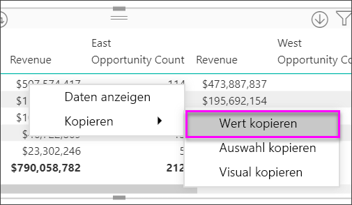

* Um mehrere Zellen zu kopieren, markieren Sie einen Zellbereich, oder verwenden Sie die STRG-TASTE, um eine oder mehrere Zellen auszuwählen. 

    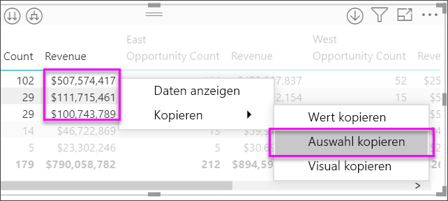

* Die Kopie enthält die Spalten- und Zeilenüberschriften.

    

* Um eine Kopie des Visuals selbst zu erstellen, die nur die ausgewählten Zellen enthält, wählen Sie mithilfe der STRG-Taste eine oder mehrere Zellen aus. Klicken Sie mit der rechten Maustaste, und wählen Sie **Visual kopieren**.

    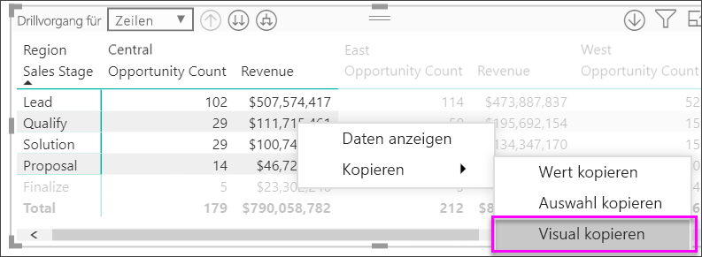

* Bei der Kopie handelt es sich um eine weitere Matrixvisualisierung, die jedoch nur Ihre kopierten Daten enthält.

    

## Festlegen eines Matrixwerts als benutzerdefinierte URL

Wenn Sie über eine Spalte oder ein Measure verfügen, das Website-URLs enthält, können Sie diese URLs mithilfe der bedingten Formatierung als aktive Links auf Felder anwenden. Sie finden diese Option im Bereich „Formatierung“ unter der Karte **Bedingte Formatierung**.

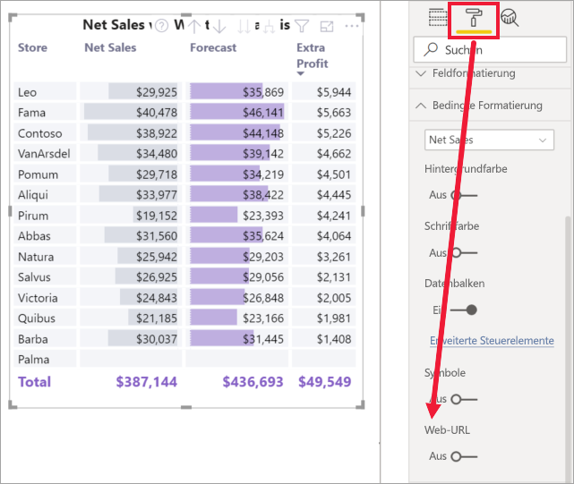

Aktivieren Sie die Option **Web-URL**, und wählen Sie das Feld aus, das als URL für die Spalte verwendet werden soll. Die Werte in dem Feld bzw. der Spalte, für die Sie die bedingte Formatierung konfiguriert haben, werden nun zu aktiven Links. Wenn Sie den Mauszeiger auf einen der Links bewegen, können Sie ihn anklicken und gelangen so zur verlinkten Seite. 

Weitere Informationen finden Sie unter [Verwenden bedingter Formatierungen in Tabellen](../desktop-conditional-table-formatting.md).

## Schattierung und Schriftfarben für Matrixvisuals
Mit dem Matrixvisual können Sie bedingte Formatierung (Farben, Schattierung und Datenbalken) auf den Hintergrund von Zellen in der Matrix und bedingte Formatierung auf den Text und die Werte selbst anwenden.

Um bedingte Formatierung anzuwenden, wählen Sie das Matrixvisual aus und öffnen den **Format**-Bereich. Erweitern Sie die Karte **Bedingte Formatierung**, und ziehen Sie den Schieberegler für **Hintergrundfarbe**, **Schriftfarbe** oder **Datenbalken** auf **Ein**. Durch Aktivieren einer dieser Optionen wird ein Link für *Erweiterte Steuerelemente* angezeigt, sodass Sie die Farben und Werte für die Farbformatierung anpassen können.
  
  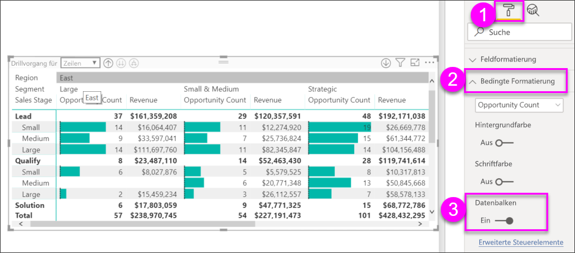

Wählen Sie *Erweiterte Steuerelemente* aus, um ein Dialogfeld anzuzeigen, in dem Sie Anpassungen vornehmen können. Dieses Beispiel zeigt das Dialogfeld für **Datenbalken**.

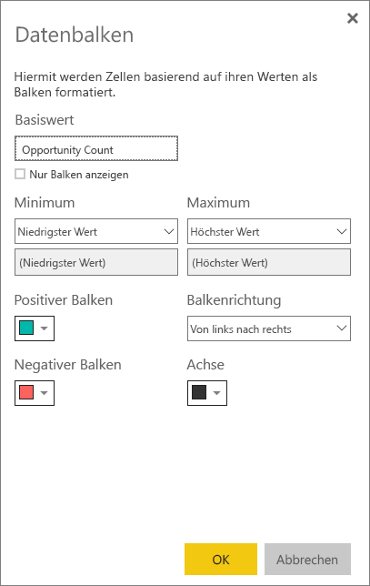

## Zu beachtende Aspekte und Problembehandlung

* Wenn die Textdaten in den Zellen oder Headern Ihrer Matrix Neue-Zeile-Zeichen enthalten, werden diese Zeichen ignoriert, es sei denn, Sie aktivieren die Option „Zeilenumbruch“ in der Formatierungsbereichskarte des Elements. 

## Nächste Schritte

[Power Apps-Visual für Power BI](power-bi-visualization-powerapp.md)

[Visualisierungstypen in Power BI](power-bi-visualization-types-for-reports-and-q-and-a.md)
